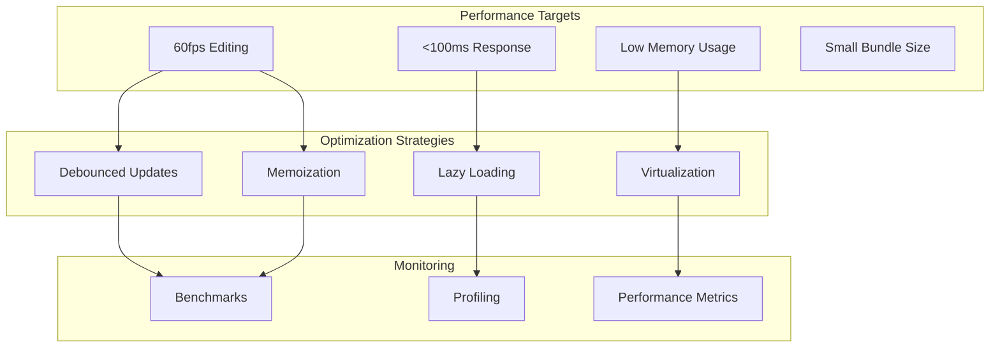

# 20: Performance

> Optimization and benchmarks for large documents

**Duration:** 1 day  
**Dependencies:** All previous documents

## Overview

Performance is critical for a great editing experience. This document covers optimization strategies for handling large documents (10k+ words), efficient rendering, debounced operations, virtualization considerations, and benchmarking utilities. The goal is 60fps during editing and <100ms response time for operations.



## Implementation

### 1. Performance Utilities

```typescript
// packages/editor/src/utils/performance.ts

/**
 * Debounce a function
 */
export function debounce<T extends (...args: any[]) => any>(
  fn: T,
  delay: number
): (...args: Parameters<T>) => void {
  let timeoutId: ReturnType<typeof setTimeout> | null = null

  return (...args: Parameters<T>) => {
    if (timeoutId) {
      clearTimeout(timeoutId)
    }

    timeoutId = setTimeout(() => {
      fn(...args)
      timeoutId = null
    }, delay)
  }
}

/**
 * Throttle a function
 */
export function throttle<T extends (...args: any[]) => any>(
  fn: T,
  limit: number
): (...args: Parameters<T>) => void {
  let inThrottle = false
  let lastArgs: Parameters<T> | null = null

  return (...args: Parameters<T>) => {
    if (!inThrottle) {
      fn(...args)
      inThrottle = true

      setTimeout(() => {
        inThrottle = false
        if (lastArgs) {
          fn(...lastArgs)
          lastArgs = null
        }
      }, limit)
    } else {
      lastArgs = args
    }
  }
}

/**
 * Request idle callback with fallback
 */
export function requestIdleCallback(
  callback: IdleRequestCallback,
  options?: IdleRequestOptions
): number {
  if (typeof window !== 'undefined' && 'requestIdleCallback' in window) {
    return window.requestIdleCallback(callback, options)
  }

  // Fallback for Safari
  return window.setTimeout(() => {
    callback({
      didTimeout: false,
      timeRemaining: () => 50
    })
  }, 1) as unknown as number
}

/**
 * Cancel idle callback
 */
export function cancelIdleCallback(id: number): void {
  if (typeof window !== 'undefined' && 'cancelIdleCallback' in window) {
    window.cancelIdleCallback(id)
  } else {
    window.clearTimeout(id)
  }
}

/**
 * Measure execution time
 */
export function measure<T>(name: string, fn: () => T): T {
  const start = performance.now()
  const result = fn()
  const end = performance.now()

  if (process.env.NODE_ENV === 'development') {
    console.log(`[Performance] ${name}: ${(end - start).toFixed(2)}ms`)
  }

  return result
}

/**
 * Async measure with Promise support
 */
export async function measureAsync<T>(name: string, fn: () => Promise<T>): Promise<T> {
  const start = performance.now()
  const result = await fn()
  const end = performance.now()

  if (process.env.NODE_ENV === 'development') {
    console.log(`[Performance] ${name}: ${(end - start).toFixed(2)}ms`)
  }

  return result
}
```

### 2. Performance Monitoring Hook

```typescript
// packages/editor/src/hooks/usePerformanceMonitor.ts

import { useEffect, useRef, useCallback } from 'react'
import type { Editor } from '@tiptap/core'

export interface PerformanceMetrics {
  /** Average frame time in ms */
  avgFrameTime: number
  /** Frames per second */
  fps: number
  /** Number of transactions processed */
  transactionCount: number
  /** Average transaction time in ms */
  avgTransactionTime: number
  /** Document size in characters */
  documentSize: number
  /** Number of nodes in document */
  nodeCount: number
}

export interface UsePerformanceMonitorOptions {
  editor: Editor | null
  enabled?: boolean
  sampleSize?: number
  onMetrics?: (metrics: PerformanceMetrics) => void
}

export function usePerformanceMonitor({
  editor,
  enabled = process.env.NODE_ENV === 'development',
  sampleSize = 60,
  onMetrics
}: UsePerformanceMonitorOptions) {
  const frameTimesRef = useRef<number[]>([])
  const transactionTimesRef = useRef<number[]>([])
  const lastFrameTimeRef = useRef(performance.now())
  const rafIdRef = useRef<number | null>(null)

  const calculateMetrics = useCallback((): PerformanceMetrics => {
    const frameTimes = frameTimesRef.current
    const transactionTimes = transactionTimesRef.current

    const avgFrameTime =
      frameTimes.length > 0 ? frameTimes.reduce((a, b) => a + b, 0) / frameTimes.length : 0

    const avgTransactionTime =
      transactionTimes.length > 0
        ? transactionTimes.reduce((a, b) => a + b, 0) / transactionTimes.length
        : 0

    return {
      avgFrameTime,
      fps: avgFrameTime > 0 ? 1000 / avgFrameTime : 0,
      transactionCount: transactionTimes.length,
      avgTransactionTime,
      documentSize: editor?.state.doc.textContent.length ?? 0,
      nodeCount: editor?.state.doc.nodeSize ?? 0
    }
  }, [editor])

  // Monitor frame rate
  useEffect(() => {
    if (!enabled) return

    const measureFrame = () => {
      const now = performance.now()
      const frameTime = now - lastFrameTimeRef.current
      lastFrameTimeRef.current = now

      frameTimesRef.current.push(frameTime)
      if (frameTimesRef.current.length > sampleSize) {
        frameTimesRef.current.shift()
      }

      rafIdRef.current = requestAnimationFrame(measureFrame)
    }

    rafIdRef.current = requestAnimationFrame(measureFrame)

    return () => {
      if (rafIdRef.current) {
        cancelAnimationFrame(rafIdRef.current)
      }
    }
  }, [enabled, sampleSize])

  // Monitor transactions
  useEffect(() => {
    if (!enabled || !editor) return

    const handleTransaction = ({ transaction }: { transaction: any }) => {
      // Measure transaction processing time
      const start = performance.now()

      // Wait for next frame to measure actual processing
      requestAnimationFrame(() => {
        const time = performance.now() - start
        transactionTimesRef.current.push(time)

        if (transactionTimesRef.current.length > sampleSize) {
          transactionTimesRef.current.shift()
        }

        onMetrics?.(calculateMetrics())
      })
    }

    editor.on('transaction', handleTransaction)

    return () => {
      editor.off('transaction', handleTransaction)
    }
  }, [editor, enabled, sampleSize, onMetrics, calculateMetrics])

  return {
    getMetrics: calculateMetrics,
    reset: () => {
      frameTimesRef.current = []
      transactionTimesRef.current = []
    }
  }
}
```

### 3. Debounced Editor Updates

```typescript
// packages/editor/src/hooks/useDebouncedEditorUpdate.ts

import { useEffect, useRef, useCallback } from 'react'
import type { Editor } from '@tiptap/core'
import { debounce } from '../utils/performance'

export interface UseDebouncedEditorUpdateOptions {
  editor: Editor | null
  /** Delay in ms before triggering update callback */
  delay?: number
  /** Callback when content changes (debounced) */
  onUpdate?: (content: string) => void
  /** Callback for immediate updates (not debounced) */
  onImmediateUpdate?: () => void
}

export function useDebouncedEditorUpdate({
  editor,
  delay = 300,
  onUpdate,
  onImmediateUpdate
}: UseDebouncedEditorUpdateOptions) {
  const onUpdateRef = useRef(onUpdate)
  onUpdateRef.current = onUpdate

  const debouncedUpdate = useCallback(
    debounce((content: string) => {
      onUpdateRef.current?.(content)
    }, delay),
    [delay]
  )

  useEffect(() => {
    if (!editor) return

    const handleUpdate = () => {
      onImmediateUpdate?.()

      // Get HTML content (could also be JSON or markdown)
      const content = editor.getHTML()
      debouncedUpdate(content)
    }

    editor.on('update', handleUpdate)

    return () => {
      editor.off('update', handleUpdate)
    }
  }, [editor, debouncedUpdate, onImmediateUpdate])
}
```

### 4. Lazy Extension Loading

```typescript
// packages/editor/src/extensions/lazy.ts

import { Extension } from '@tiptap/core'

/**
 * Lazily load an extension
 */
export function lazyExtension<T extends Extension>(
  loader: () => Promise<{ default: T } | T>
): () => Promise<T> {
  let cached: T | null = null

  return async () => {
    if (cached) return cached

    const module = await loader()
    cached = 'default' in module ? module.default : module

    return cached
  }
}

/**
 * Example usage for code highlighting (heavy dependency)
 */
export const lazyCodeBlockHighlight = lazyExtension(
  () => import('@tiptap/extension-code-block-lowlight')
)

/**
 * Lazy load multiple extensions
 */
export async function loadExtensions(
  loaders: Array<() => Promise<Extension>>
): Promise<Extension[]> {
  return Promise.all(loaders.map((loader) => loader()))
}
```

### 5. Memoized Components

```tsx
// packages/editor/src/components/MemoizedEditor.tsx

import * as React from 'react'
import { EditorContent } from '@tiptap/react'
import type { Editor } from '@tiptap/core'

export interface MemoizedEditorContentProps {
  editor: Editor | null
  className?: string
}

/**
 * Memoized editor content that only re-renders when editor instance changes
 */
export const MemoizedEditorContent = React.memo(
  function MemoizedEditorContent({ editor, className }: MemoizedEditorContentProps) {
    return <EditorContent editor={editor} className={className} />
  },
  (prevProps, nextProps) => {
    // Only re-render if editor instance changes
    return prevProps.editor === nextProps.editor && prevProps.className === nextProps.className
  }
)

/**
 * Memoized toolbar that only re-renders on active state changes
 */
export interface MemoizedToolbarProps {
  editor: Editor | null
  activeStates: Record<string, boolean>
  children: React.ReactNode
}

export const MemoizedToolbar = React.memo(
  function MemoizedToolbar({ editor, activeStates, children }: MemoizedToolbarProps) {
    return <div className="xnet-toolbar">{children}</div>
  },
  (prevProps, nextProps) => {
    // Deep compare active states
    const prevKeys = Object.keys(prevProps.activeStates)
    const nextKeys = Object.keys(nextProps.activeStates)

    if (prevKeys.length !== nextKeys.length) return false

    return prevKeys.every((key) => prevProps.activeStates[key] === nextProps.activeStates[key])
  }
)
```

### 6. Active States Hook with Batching

```typescript
// packages/editor/src/hooks/useActiveStates.ts

import { useState, useEffect, useCallback, useRef } from 'react'
import type { Editor } from '@tiptap/core'
import { throttle } from '../utils/performance'

export interface ActiveStates {
  bold: boolean
  italic: boolean
  underline: boolean
  strike: boolean
  code: boolean
  link: boolean
  heading1: boolean
  heading2: boolean
  heading3: boolean
  bulletList: boolean
  orderedList: boolean
  taskList: boolean
  blockquote: boolean
  codeBlock: boolean
}

const DEFAULT_STATES: ActiveStates = {
  bold: false,
  italic: false,
  underline: false,
  strike: false,
  code: false,
  link: false,
  heading1: false,
  heading2: false,
  heading3: false,
  bulletList: false,
  orderedList: false,
  taskList: false,
  blockquote: false,
  codeBlock: false
}

export function useActiveStates(editor: Editor | null): ActiveStates {
  const [states, setStates] = useState<ActiveStates>(DEFAULT_STATES)
  const pendingUpdateRef = useRef(false)

  const updateStates = useCallback(() => {
    if (!editor) return

    // Batch state reads
    const newStates: ActiveStates = {
      bold: editor.isActive('bold'),
      italic: editor.isActive('italic'),
      underline: editor.isActive('underline'),
      strike: editor.isActive('strike'),
      code: editor.isActive('code'),
      link: editor.isActive('link'),
      heading1: editor.isActive('heading', { level: 1 }),
      heading2: editor.isActive('heading', { level: 2 }),
      heading3: editor.isActive('heading', { level: 3 }),
      bulletList: editor.isActive('bulletList'),
      orderedList: editor.isActive('orderedList'),
      taskList: editor.isActive('taskList'),
      blockquote: editor.isActive('blockquote'),
      codeBlock: editor.isActive('codeBlock')
    }

    setStates(newStates)
    pendingUpdateRef.current = false
  }, [editor])

  // Throttle updates to 60fps max
  const throttledUpdate = useCallback(
    throttle(() => {
      if (!pendingUpdateRef.current) {
        pendingUpdateRef.current = true
        requestAnimationFrame(updateStates)
      }
    }, 16),
    [updateStates]
  )

  useEffect(() => {
    if (!editor) return

    // Initial state
    updateStates()

    // Subscribe to changes
    editor.on('selectionUpdate', throttledUpdate)
    editor.on('transaction', throttledUpdate)

    return () => {
      editor.off('selectionUpdate', throttledUpdate)
      editor.off('transaction', throttledUpdate)
    }
  }, [editor, updateStates, throttledUpdate])

  return states
}
```

### 7. Benchmark Utilities

```typescript
// packages/editor/src/testing/benchmarks.ts

import type { Editor } from '@tiptap/core'

export interface BenchmarkResult {
  name: string
  iterations: number
  totalTime: number
  avgTime: number
  minTime: number
  maxTime: number
  opsPerSecond: number
}

/**
 * Run a benchmark
 */
export async function benchmark(
  name: string,
  fn: () => void | Promise<void>,
  iterations: number = 100
): Promise<BenchmarkResult> {
  const times: number[] = []

  // Warm up
  for (let i = 0; i < 5; i++) {
    await fn()
  }

  // Measure
  for (let i = 0; i < iterations; i++) {
    const start = performance.now()
    await fn()
    const end = performance.now()
    times.push(end - start)
  }

  const totalTime = times.reduce((a, b) => a + b, 0)
  const avgTime = totalTime / iterations
  const minTime = Math.min(...times)
  const maxTime = Math.max(...times)

  return {
    name,
    iterations,
    totalTime,
    avgTime,
    minTime,
    maxTime,
    opsPerSecond: 1000 / avgTime
  }
}

/**
 * Run editor-specific benchmarks
 */
export async function runEditorBenchmarks(editor: Editor): Promise<BenchmarkResult[]> {
  const results: BenchmarkResult[] = []

  // Benchmark: Insert character
  results.push(
    await benchmark(
      'Insert character',
      () => {
        editor.chain().focus().insertContent('a').run()
      },
      100
    )
  )

  // Benchmark: Toggle bold
  results.push(
    await benchmark(
      'Toggle bold',
      () => {
        editor.chain().focus().toggleBold().run()
      },
      100
    )
  )

  // Benchmark: Create heading
  results.push(
    await benchmark(
      'Create heading',
      () => {
        editor.chain().focus().setHeading({ level: 1 }).run()
      },
      50
    )
  )

  // Benchmark: Undo
  results.push(
    await benchmark(
      'Undo',
      () => {
        editor.chain().focus().undo().run()
      },
      50
    )
  )

  return results
}

/**
 * Generate large document for stress testing
 */
export function generateLargeDocument(wordCount: number): string {
  const words = [
    'The',
    'quick',
    'brown',
    'fox',
    'jumps',
    'over',
    'the',
    'lazy',
    'dog',
    'Lorem',
    'ipsum',
    'dolor',
    'sit',
    'amet',
    'consectetur',
    'adipiscing',
    'elit',
    'sed',
    'do',
    'eiusmod',
    'tempor',
    'incididunt',
    'ut',
    'labore'
  ]

  const paragraphs: string[] = []
  let currentWordCount = 0
  let currentParagraph: string[] = []

  while (currentWordCount < wordCount) {
    const word = words[Math.floor(Math.random() * words.length)]
    currentParagraph.push(word)
    currentWordCount++

    // Create paragraph every ~50 words
    if (currentParagraph.length >= 50 || currentWordCount >= wordCount) {
      paragraphs.push(`<p>${currentParagraph.join(' ')}.</p>`)
      currentParagraph = []
    }
  }

  return paragraphs.join('\n')
}

/**
 * Format benchmark results for display
 */
export function formatBenchmarkResults(results: BenchmarkResult[]): string {
  const lines = ['Benchmark Results:', '==================', '']

  for (const result of results) {
    lines.push(`${result.name}:`)
    lines.push(`  Iterations: ${result.iterations}`)
    lines.push(`  Avg: ${result.avgTime.toFixed(3)}ms`)
    lines.push(`  Min: ${result.minTime.toFixed(3)}ms`)
    lines.push(`  Max: ${result.maxTime.toFixed(3)}ms`)
    lines.push(`  Ops/sec: ${result.opsPerSecond.toFixed(1)}`)
    lines.push('')
  }

  return lines.join('\n')
}
```

### 8. Performance Configuration

```typescript
// packages/editor/src/config/performance.ts

export interface PerformanceConfig {
  /** Debounce delay for content updates (ms) */
  updateDebounce: number
  /** Throttle rate for active state updates (ms) */
  activeStateThrottle: number
  /** Maximum document size before warning (characters) */
  maxDocumentSizeWarning: number
  /** Enable performance monitoring in development */
  enableMonitoring: boolean
  /** Sample size for performance metrics */
  metricsSampleSize: number
}

export const DEFAULT_PERFORMANCE_CONFIG: PerformanceConfig = {
  updateDebounce: 300,
  activeStateThrottle: 16, // ~60fps
  maxDocumentSizeWarning: 100000, // 100k characters
  enableMonitoring: process.env.NODE_ENV === 'development',
  metricsSampleSize: 60
}

/**
 * Create performance configuration
 */
export function createPerformanceConfig(
  overrides: Partial<PerformanceConfig> = {}
): PerformanceConfig {
  return {
    ...DEFAULT_PERFORMANCE_CONFIG,
    ...overrides
  }
}
```

## Tests

```typescript
// packages/editor/src/utils/performance.test.ts

import { describe, it, expect, vi, beforeEach, afterEach } from 'vitest'
import { debounce, throttle, measure } from './performance'

describe('Performance utilities', () => {
  beforeEach(() => {
    vi.useFakeTimers()
  })

  afterEach(() => {
    vi.useRealTimers()
  })

  describe('debounce', () => {
    it('should delay function execution', () => {
      const fn = vi.fn()
      const debounced = debounce(fn, 100)

      debounced()
      expect(fn).not.toHaveBeenCalled()

      vi.advanceTimersByTime(100)
      expect(fn).toHaveBeenCalledTimes(1)
    })

    it('should reset timer on subsequent calls', () => {
      const fn = vi.fn()
      const debounced = debounce(fn, 100)

      debounced()
      vi.advanceTimersByTime(50)
      debounced()
      vi.advanceTimersByTime(50)

      expect(fn).not.toHaveBeenCalled()

      vi.advanceTimersByTime(50)
      expect(fn).toHaveBeenCalledTimes(1)
    })

    it('should pass arguments to function', () => {
      const fn = vi.fn()
      const debounced = debounce(fn, 100)

      debounced('arg1', 'arg2')
      vi.advanceTimersByTime(100)

      expect(fn).toHaveBeenCalledWith('arg1', 'arg2')
    })
  })

  describe('throttle', () => {
    it('should execute immediately on first call', () => {
      const fn = vi.fn()
      const throttled = throttle(fn, 100)

      throttled()
      expect(fn).toHaveBeenCalledTimes(1)
    })

    it('should throttle subsequent calls', () => {
      const fn = vi.fn()
      const throttled = throttle(fn, 100)

      throttled()
      throttled()
      throttled()

      expect(fn).toHaveBeenCalledTimes(1)

      vi.advanceTimersByTime(100)
      expect(fn).toHaveBeenCalledTimes(2)
    })

    it('should use latest arguments for trailing call', () => {
      const fn = vi.fn()
      const throttled = throttle(fn, 100)

      throttled('first')
      throttled('second')
      throttled('third')

      vi.advanceTimersByTime(100)

      expect(fn).toHaveBeenLastCalledWith('third')
    })
  })

  describe('measure', () => {
    it('should return function result', () => {
      const result = measure('test', () => 42)
      expect(result).toBe(42)
    })

    it('should log timing in development', () => {
      const consoleSpy = vi.spyOn(console, 'log').mockImplementation(() => {})

      measure('test operation', () => {})

      expect(consoleSpy).toHaveBeenCalled()
      expect(consoleSpy.mock.calls[0][0]).toContain('[Performance] test operation')

      consoleSpy.mockRestore()
    })
  })
})
```

```typescript
// packages/editor/src/testing/benchmarks.test.ts

import { describe, it, expect } from 'vitest'
import {
  benchmark,
  generateLargeDocument,
  formatBenchmarkResults,
  type BenchmarkResult
} from './benchmarks'

describe('Benchmark utilities', () => {
  describe('benchmark', () => {
    it('should run specified iterations', async () => {
      let count = 0
      const result = await benchmark(
        'test',
        () => {
          count++
        },
        10
      )

      // 5 warmup + 10 iterations
      expect(count).toBe(15)
      expect(result.iterations).toBe(10)
    })

    it('should calculate statistics', async () => {
      const result = await benchmark(
        'test',
        () => {
          // Simulate some work
          let x = 0
          for (let i = 0; i < 1000; i++) x += i
        },
        10
      )

      expect(result.avgTime).toBeGreaterThan(0)
      expect(result.minTime).toBeLessThanOrEqual(result.avgTime)
      expect(result.maxTime).toBeGreaterThanOrEqual(result.avgTime)
      expect(result.opsPerSecond).toBeGreaterThan(0)
    })
  })

  describe('generateLargeDocument', () => {
    it('should generate document with specified word count', () => {
      const doc = generateLargeDocument(100)
      const wordCount = doc.split(/\s+/).length

      // Approximate word count (may vary due to HTML tags)
      expect(wordCount).toBeGreaterThan(90)
    })

    it('should create multiple paragraphs', () => {
      const doc = generateLargeDocument(200)
      const paragraphs = doc.match(/<p>/g)

      expect(paragraphs?.length).toBeGreaterThan(1)
    })
  })

  describe('formatBenchmarkResults', () => {
    it('should format results as string', () => {
      const results: BenchmarkResult[] = [
        {
          name: 'Test operation',
          iterations: 100,
          totalTime: 1000,
          avgTime: 10,
          minTime: 8,
          maxTime: 15,
          opsPerSecond: 100
        }
      ]

      const formatted = formatBenchmarkResults(results)

      expect(formatted).toContain('Test operation')
      expect(formatted).toContain('Avg: 10.000ms')
      expect(formatted).toContain('Ops/sec: 100.0')
    })
  })
})
```

```typescript
// packages/editor/src/hooks/useActiveStates.test.ts

import { describe, it, expect, vi, beforeEach, afterEach } from 'vitest'
import { renderHook, act } from '@testing-library/react'
import { useActiveStates } from './useActiveStates'

describe('useActiveStates', () => {
  beforeEach(() => {
    vi.useFakeTimers()
  })

  afterEach(() => {
    vi.useRealTimers()
  })

  it('should return default states when no editor', () => {
    const { result } = renderHook(() => useActiveStates(null))

    expect(result.current.bold).toBe(false)
    expect(result.current.italic).toBe(false)
  })

  it('should update states from editor', () => {
    const mockEditor = {
      isActive: vi.fn((type: string) => type === 'bold'),
      on: vi.fn(),
      off: vi.fn()
    }

    const { result } = renderHook(() => useActiveStates(mockEditor as any))

    // Allow effects to run
    act(() => {
      vi.runAllTimers()
    })

    expect(result.current.bold).toBe(true)
    expect(result.current.italic).toBe(false)
  })

  it('should subscribe to editor events', () => {
    const mockEditor = {
      isActive: vi.fn(() => false),
      on: vi.fn(),
      off: vi.fn()
    }

    renderHook(() => useActiveStates(mockEditor as any))

    expect(mockEditor.on).toHaveBeenCalledWith('selectionUpdate', expect.any(Function))
    expect(mockEditor.on).toHaveBeenCalledWith('transaction', expect.any(Function))
  })

  it('should unsubscribe on unmount', () => {
    const mockEditor = {
      isActive: vi.fn(() => false),
      on: vi.fn(),
      off: vi.fn()
    }

    const { unmount } = renderHook(() => useActiveStates(mockEditor as any))
    unmount()

    expect(mockEditor.off).toHaveBeenCalledWith('selectionUpdate', expect.any(Function))
    expect(mockEditor.off).toHaveBeenCalledWith('transaction', expect.any(Function))
  })
})
```

## Checklist

- [ ] Create debounce utility
- [ ] Create throttle utility
- [ ] Create measure utility
- [ ] Implement usePerformanceMonitor hook
- [ ] Implement useDebouncedEditorUpdate hook
- [ ] Create lazy extension loading
- [ ] Memoize editor components
- [ ] Implement useActiveStates with batching
- [ ] Create benchmark utilities
- [ ] Create performance configuration
- [ ] Generate large document utility
- [ ] Target 60fps editing
- [ ] Target <100ms response time
- [ ] Write tests
- [ ] Tests pass

---

[Back to README](./README.md) | [Previous: Accessibility](./19-accessibility.md)
