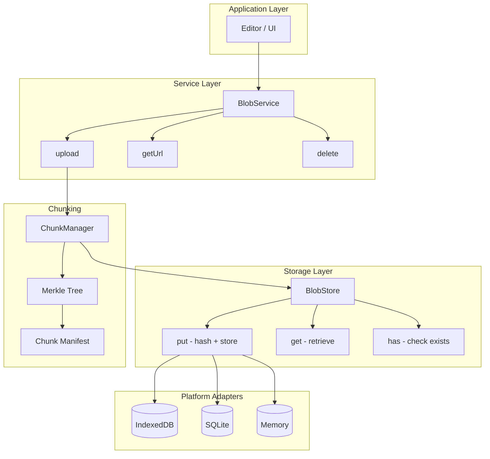
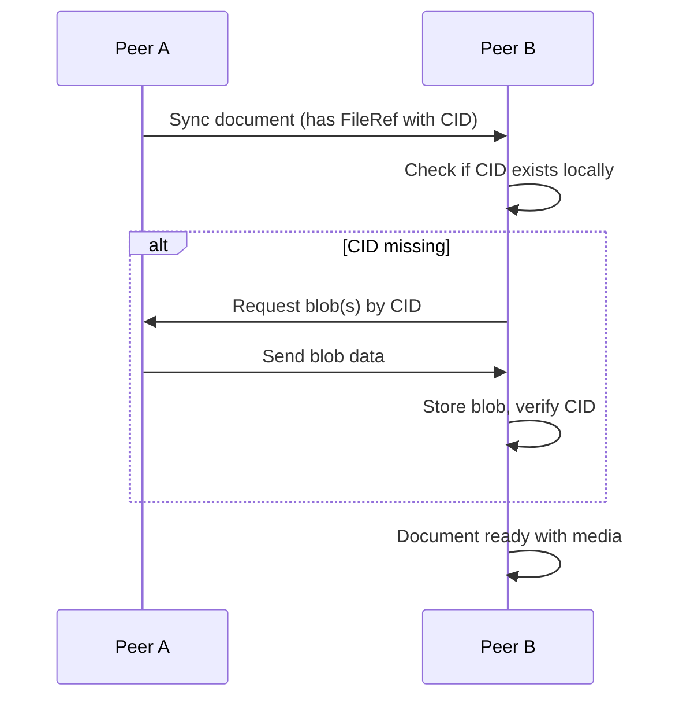

# 21: Blob Infrastructure

> Content-addressed binary storage with chunking and eager sync

**Duration:** 2-3 days  
**Dependencies:** `@xnet/storage` (StorageAdapter), `@xnet/core` (hashing)

## Overview

Blobs are binary data (images, files, videos) stored separately from document content. xNet uses content-addressing (CID = hash of content) for deduplication and integrity verification. Large files are chunked using Merkle trees for efficient sync and storage.

This document defines the blob infrastructure that all media features depend on.



## Architecture

### Layer 1: StorageAdapter (Existing)

Already implemented in `@xnet/storage`. Provides low-level blob storage:

```typescript
// packages/storage/src/types.ts (existing)
interface StorageAdapter {
  // ... other methods
  getBlob(cid: ContentId): Promise<Uint8Array | null>
  setBlob(cid: ContentId, data: Uint8Array): Promise<void>
  hasBlob(cid: ContentId): Promise<boolean>
}
```

### Layer 2: BlobStore (New)

Implements `ContentResolver` interface, adds CID computation:

```typescript
// packages/storage/src/blob-store.ts

import type { ContentId, ContentResolver } from '@xnet/core'
import { hashContent, createContentId, verifyContent } from '@xnet/core'
import type { StorageAdapter } from './types'

/**
 * BlobStore - Content-addressed blob storage with integrity verification.
 *
 * Wraps StorageAdapter blob methods with automatic CID computation.
 */
export class BlobStore implements ContentResolver {
  constructor(private adapter: StorageAdapter) {}

  /**
   * Store data and return its content ID.
   * If data with same CID already exists, this is a no-op (deduplication).
   */
  async put(data: Uint8Array): Promise<ContentId> {
    const hash = hashContent(data)
    const cid = createContentId(hash)

    // Check if already stored (deduplication)
    if (await this.adapter.hasBlob(cid)) {
      return cid
    }

    await this.adapter.setBlob(cid, data)
    return cid
  }

  /**
   * Retrieve data by content ID.
   * Returns null if not found.
   */
  async get(cid: ContentId): Promise<Uint8Array | null> {
    return this.adapter.getBlob(cid)
  }

  /**
   * Check if data exists for a content ID.
   */
  async has(cid: ContentId): Promise<boolean> {
    return this.adapter.hasBlob(cid)
  }

  /**
   * Verify that data matches its content ID.
   */
  verify(cid: ContentId, data: Uint8Array): boolean {
    return verifyContent(cid, data)
  }

  /**
   * Delete data by content ID.
   * Note: Should only delete if no references remain (garbage collection).
   */
  async delete(cid: ContentId): Promise<void> {
    await this.adapter.deleteBlob?.(cid)
  }
}
```

### Layer 3: ChunkManager (New)

Handles chunking for large files using Merkle trees:

```typescript
// packages/storage/src/chunk-manager.ts

import type { ContentId, ContentChunk, ContentTree, MerkleNode } from '@xnet/core'
import { createChunk, buildMerkleTree, hashContent, createContentId } from '@xnet/core'
import type { BlobStore } from './blob-store'

/** Chunk size: 256KB - good balance for sync efficiency */
const CHUNK_SIZE = 256 * 1024

/** Files smaller than this are stored as single blob */
const CHUNK_THRESHOLD = 1024 * 1024 // 1MB

/**
 * Manifest stored for chunked files.
 * The manifest CID is what gets stored in FileRef.
 */
export interface ChunkManifest {
  /** Version for future compatibility */
  version: 1
  /** Original file size */
  totalSize: number
  /** MIME type */
  mimeType: string
  /** Original filename */
  filename: string
  /** Root hash of Merkle tree */
  rootHash: string
  /** Ordered list of chunk CIDs */
  chunks: ContentId[]
  /** Chunk size used */
  chunkSize: number
}

/**
 * ChunkManager - Handles chunked storage for large files.
 */
export class ChunkManager {
  constructor(private blobStore: BlobStore) {}

  /**
   * Store a file, chunking if necessary.
   * Returns the CID of either:
   * - The raw data (if < CHUNK_THRESHOLD)
   * - The manifest (if >= CHUNK_THRESHOLD)
   */
  async store(
    data: Uint8Array,
    metadata: { filename: string; mimeType: string }
  ): Promise<{ cid: ContentId; isChunked: boolean }> {
    // Small files: store directly
    if (data.byteLength < CHUNK_THRESHOLD) {
      const cid = await this.blobStore.put(data)
      return { cid, isChunked: false }
    }

    // Large files: chunk and create manifest
    const chunks = this.createChunks(data)
    const chunkCids: ContentId[] = []

    // Store each chunk
    for (const chunk of chunks) {
      const cid = await this.blobStore.put(chunk)
      chunkCids.push(cid)
    }

    // Build Merkle tree for integrity
    const contentChunks: ContentChunk[] = chunks.map((data, i) => ({
      data,
      hash: chunkCids[i].replace('cid:blake3:', ''),
      size: data.byteLength
    }))
    const tree = buildMerkleTree(contentChunks)

    // Create and store manifest
    const manifest: ChunkManifest = {
      version: 1,
      totalSize: data.byteLength,
      mimeType: metadata.mimeType,
      filename: metadata.filename,
      rootHash: tree.rootHash,
      chunks: chunkCids,
      chunkSize: CHUNK_SIZE
    }

    const manifestData = new TextEncoder().encode(JSON.stringify(manifest))
    const manifestCid = await this.blobStore.put(manifestData)

    return { cid: manifestCid, isChunked: true }
  }

  /**
   * Retrieve a file, reassembling chunks if necessary.
   */
  async retrieve(cid: ContentId): Promise<Uint8Array | null> {
    const data = await this.blobStore.get(cid)
    if (!data) return null

    // Try to parse as manifest
    try {
      const text = new TextDecoder().decode(data)
      const manifest = JSON.parse(text) as ChunkManifest

      if (manifest.version === 1 && Array.isArray(manifest.chunks)) {
        return this.reassembleChunks(manifest)
      }
    } catch {
      // Not a manifest, return raw data
    }

    return data
  }

  /**
   * Check if a file (or all its chunks) exists.
   */
  async has(cid: ContentId): Promise<boolean> {
    if (!(await this.blobStore.has(cid))) {
      return false
    }

    // Check if it's a manifest with missing chunks
    const data = await this.blobStore.get(cid)
    if (!data) return false

    try {
      const text = new TextDecoder().decode(data)
      const manifest = JSON.parse(text) as ChunkManifest

      if (manifest.version === 1 && Array.isArray(manifest.chunks)) {
        // Check all chunks exist
        for (const chunkCid of manifest.chunks) {
          if (!(await this.blobStore.has(chunkCid))) {
            return false
          }
        }
      }
    } catch {
      // Not a manifest
    }

    return true
  }

  /**
   * Get list of missing chunk CIDs for a manifest.
   * Useful for requesting missing chunks during sync.
   */
  async getMissingChunks(cid: ContentId): Promise<ContentId[]> {
    const data = await this.blobStore.get(cid)
    if (!data) return [cid] // Manifest itself is missing

    try {
      const text = new TextDecoder().decode(data)
      const manifest = JSON.parse(text) as ChunkManifest

      if (manifest.version === 1 && Array.isArray(manifest.chunks)) {
        const missing: ContentId[] = []
        for (const chunkCid of manifest.chunks) {
          if (!(await this.blobStore.has(chunkCid))) {
            missing.push(chunkCid)
          }
        }
        return missing
      }
    } catch {
      // Not a manifest
    }

    return []
  }

  /**
   * Split data into chunks.
   */
  private createChunks(data: Uint8Array): Uint8Array[] {
    const chunks: Uint8Array[] = []
    let offset = 0

    while (offset < data.byteLength) {
      const end = Math.min(offset + CHUNK_SIZE, data.byteLength)
      chunks.push(data.slice(offset, end))
      offset = end
    }

    return chunks
  }

  /**
   * Reassemble chunks from a manifest.
   */
  private async reassembleChunks(manifest: ChunkManifest): Promise<Uint8Array> {
    const result = new Uint8Array(manifest.totalSize)
    let offset = 0

    for (const chunkCid of manifest.chunks) {
      const chunk = await this.blobStore.get(chunkCid)
      if (!chunk) {
        throw new Error(`Missing chunk: ${chunkCid}`)
      }
      result.set(chunk, offset)
      offset += chunk.byteLength
    }

    return result
  }
}
```

### Layer 4: BlobService (New)

High-level API for applications:

```typescript
// packages/data/src/blob/blob-service.ts

import type { ContentId } from '@xnet/core'
import type { ChunkManager } from '@xnet/storage'
import type { FileRef } from '../schema/properties/file'

export interface BlobServiceOptions {
  /** Maximum file size (default: 100MB) */
  maxSize?: number
  /** Chunk threshold (default: 1MB) */
  chunkThreshold?: number
}

/**
 * BlobService - High-level file upload and retrieval.
 *
 * Provides a simple API for storing and retrieving files,
 * handling chunking, URL generation, and cleanup.
 */
export class BlobService {
  private urlCache = new Map<string, string>()

  constructor(
    private chunkManager: ChunkManager,
    private options: BlobServiceOptions = {}
  ) {}

  /**
   * Upload a file and return a FileRef for storage in node properties.
   */
  async upload(file: File): Promise<FileRef> {
    const maxSize = this.options.maxSize ?? 100 * 1024 * 1024

    if (file.size > maxSize) {
      throw new Error(`File too large: ${file.size} bytes (max: ${maxSize})`)
    }

    // Read file as ArrayBuffer
    const arrayBuffer = await file.arrayBuffer()
    const data = new Uint8Array(arrayBuffer)

    // Store with chunking if needed
    const { cid } = await this.chunkManager.store(data, {
      filename: file.name,
      mimeType: file.type || 'application/octet-stream'
    })

    return {
      cid,
      name: file.name,
      mimeType: file.type || 'application/octet-stream',
      size: file.size
    }
  }

  /**
   * Upload from Uint8Array (for programmatic use).
   */
  async uploadData(
    data: Uint8Array,
    metadata: { filename: string; mimeType: string }
  ): Promise<FileRef> {
    const { cid } = await this.chunkManager.store(data, metadata)

    return {
      cid,
      name: metadata.filename,
      mimeType: metadata.mimeType,
      size: data.byteLength
    }
  }

  /**
   * Get a URL for displaying/downloading a file.
   * Creates a blob URL that should be revoked when no longer needed.
   */
  async getUrl(ref: FileRef): Promise<string> {
    // Check cache first
    const cached = this.urlCache.get(ref.cid)
    if (cached) return cached

    // Retrieve data
    const data = await this.chunkManager.retrieve(ref.cid as ContentId)
    if (!data) {
      throw new Error(`Blob not found: ${ref.cid}`)
    }

    // Create blob URL
    const blob = new Blob([data], { type: ref.mimeType })
    const url = URL.createObjectURL(blob)

    // Cache it
    this.urlCache.set(ref.cid, url)

    return url
  }

  /**
   * Get raw data for a file.
   */
  async getData(ref: FileRef): Promise<Uint8Array | null> {
    return this.chunkManager.retrieve(ref.cid as ContentId)
  }

  /**
   * Check if a file exists locally.
   */
  async has(ref: FileRef): Promise<boolean> {
    return this.chunkManager.has(ref.cid as ContentId)
  }

  /**
   * Get list of missing chunk CIDs (for sync).
   */
  async getMissingChunks(ref: FileRef): Promise<ContentId[]> {
    return this.chunkManager.getMissingChunks(ref.cid as ContentId)
  }

  /**
   * Revoke a blob URL to free memory.
   */
  revokeUrl(ref: FileRef): void {
    const url = this.urlCache.get(ref.cid)
    if (url) {
      URL.revokeObjectURL(url)
      this.urlCache.delete(ref.cid)
    }
  }

  /**
   * Revoke all cached blob URLs.
   */
  revokeAllUrls(): void {
    for (const url of this.urlCache.values()) {
      URL.revokeObjectURL(url)
    }
    this.urlCache.clear()
  }
}
```

## Sync Strategy: Eager Sync

Blobs are synced eagerly along with documents. When a peer receives a document with FileRefs:



### Blob Sync Protocol

```typescript
// packages/sync/src/blob-sync.ts

import type { ContentId } from '@xnet/core'
import type { BlobStore } from '@xnet/storage'

/**
 * Message types for blob sync
 */
export type BlobSyncMessage =
  | { type: 'blob-have'; cids: ContentId[] }
  | { type: 'blob-want'; cids: ContentId[] }
  | { type: 'blob-data'; cid: ContentId; data: Uint8Array }
  | { type: 'blob-not-found'; cid: ContentId }

/**
 * BlobSyncProvider - Handles blob synchronization between peers.
 */
export class BlobSyncProvider {
  private pendingRequests = new Map<
    ContentId,
    {
      resolve: (data: Uint8Array) => void
      reject: (error: Error) => void
    }
  >()

  constructor(
    private blobStore: BlobStore,
    private send: (message: BlobSyncMessage) => void
  ) {}

  /**
   * Announce blobs we have to peers.
   */
  announceHave(cids: ContentId[]): void {
    this.send({ type: 'blob-have', cids })
  }

  /**
   * Request blobs from peers.
   */
  async requestBlobs(cids: ContentId[]): Promise<void> {
    const missing: ContentId[] = []

    for (const cid of cids) {
      if (!(await this.blobStore.has(cid))) {
        missing.push(cid)
      }
    }

    if (missing.length > 0) {
      this.send({ type: 'blob-want', cids: missing })
    }
  }

  /**
   * Handle incoming blob sync message.
   */
  async handleMessage(message: BlobSyncMessage): Promise<void> {
    switch (message.type) {
      case 'blob-want': {
        // Peer wants blobs, send them if we have them
        for (const cid of message.cids) {
          const data = await this.blobStore.get(cid)
          if (data) {
            this.send({ type: 'blob-data', cid, data })
          } else {
            this.send({ type: 'blob-not-found', cid })
          }
        }
        break
      }

      case 'blob-data': {
        // Received blob data, store it
        const { cid, data } = message
        const storedCid = await this.blobStore.put(data)

        // Verify CID matches
        if (storedCid !== cid) {
          console.warn(`CID mismatch: expected ${cid}, got ${storedCid}`)
        }

        // Resolve pending request
        this.pendingRequests.get(cid)?.resolve(data)
        this.pendingRequests.delete(cid)
        break
      }

      case 'blob-not-found': {
        // Peer doesn't have the blob
        this.pendingRequests.get(message.cid)?.reject(new Error(`Blob not found: ${message.cid}`))
        this.pendingRequests.delete(message.cid)
        break
      }

      case 'blob-have': {
        // Peer announces they have blobs - no action needed for eager sync
        // Could be used for availability tracking
        break
      }
    }
  }
}
```

## Integration with Editor

The editor uses BlobService through a React context:

```typescript
// packages/editor/src/context/BlobContext.tsx

import * as React from 'react'
import type { BlobService } from '@xnet/data'
import type { FileRef } from '@xnet/data'

interface BlobContextValue {
  blobService: BlobService
  uploadFile: (file: File) => Promise<FileRef>
  getFileUrl: (ref: FileRef) => Promise<string>
}

const BlobContext = React.createContext<BlobContextValue | null>(null)

export function BlobProvider({
  blobService,
  children
}: {
  blobService: BlobService
  children: React.ReactNode
}) {
  const value = React.useMemo<BlobContextValue>(
    () => ({
      blobService,
      uploadFile: (file) => blobService.upload(file),
      getFileUrl: (ref) => blobService.getUrl(ref)
    }),
    [blobService]
  )

  // Clean up blob URLs on unmount
  React.useEffect(() => {
    return () => {
      blobService.revokeAllUrls()
    }
  }, [blobService])

  return <BlobContext.Provider value={value}>{children}</BlobContext.Provider>
}

export function useBlobService(): BlobContextValue {
  const context = React.useContext(BlobContext)
  if (!context) {
    throw new Error('useBlobService must be used within a BlobProvider')
  }
  return context
}
```

## Tests

```typescript
// packages/storage/src/blob-store.test.ts

import { describe, it, expect, beforeEach } from 'vitest'
import { BlobStore } from './blob-store'
import { MemoryStorageAdapter } from './adapters/memory'

describe('BlobStore', () => {
  let blobStore: BlobStore

  beforeEach(() => {
    const adapter = new MemoryStorageAdapter()
    blobStore = new BlobStore(adapter)
  })

  describe('put', () => {
    it('should store data and return CID', async () => {
      const data = new TextEncoder().encode('hello world')
      const cid = await blobStore.put(data)

      expect(cid).toMatch(/^cid:blake3:/)
    })

    it('should deduplicate identical data', async () => {
      const data = new TextEncoder().encode('hello world')
      const cid1 = await blobStore.put(data)
      const cid2 = await blobStore.put(data)

      expect(cid1).toBe(cid2)
    })
  })

  describe('get', () => {
    it('should retrieve stored data', async () => {
      const data = new TextEncoder().encode('hello world')
      const cid = await blobStore.put(data)

      const retrieved = await blobStore.get(cid)

      expect(retrieved).toEqual(data)
    })

    it('should return null for missing CID', async () => {
      const result = await blobStore.get('cid:blake3:nonexistent' as any)

      expect(result).toBeNull()
    })
  })

  describe('verify', () => {
    it('should verify correct data', async () => {
      const data = new TextEncoder().encode('hello world')
      const cid = await blobStore.put(data)

      expect(blobStore.verify(cid, data)).toBe(true)
    })

    it('should reject tampered data', async () => {
      const data = new TextEncoder().encode('hello world')
      const cid = await blobStore.put(data)

      const tampered = new TextEncoder().encode('hello world!')

      expect(blobStore.verify(cid, tampered)).toBe(false)
    })
  })
})
```

```typescript
// packages/storage/src/chunk-manager.test.ts

import { describe, it, expect, beforeEach } from 'vitest'
import { ChunkManager } from './chunk-manager'
import { BlobStore } from './blob-store'
import { MemoryStorageAdapter } from './adapters/memory'

describe('ChunkManager', () => {
  let chunkManager: ChunkManager

  beforeEach(() => {
    const adapter = new MemoryStorageAdapter()
    const blobStore = new BlobStore(adapter)
    chunkManager = new ChunkManager(blobStore)
  })

  describe('store', () => {
    it('should store small files without chunking', async () => {
      const data = new Uint8Array(1000) // 1KB
      const { cid, isChunked } = await chunkManager.store(data, {
        filename: 'small.bin',
        mimeType: 'application/octet-stream'
      })

      expect(isChunked).toBe(false)
      expect(cid).toMatch(/^cid:blake3:/)
    })

    it('should chunk large files', async () => {
      const data = new Uint8Array(2 * 1024 * 1024) // 2MB
      const { cid, isChunked } = await chunkManager.store(data, {
        filename: 'large.bin',
        mimeType: 'application/octet-stream'
      })

      expect(isChunked).toBe(true)
      expect(cid).toMatch(/^cid:blake3:/)
    })
  })

  describe('retrieve', () => {
    it('should retrieve small files', async () => {
      const data = new TextEncoder().encode('hello world')
      const { cid } = await chunkManager.store(data, {
        filename: 'test.txt',
        mimeType: 'text/plain'
      })

      const retrieved = await chunkManager.retrieve(cid)

      expect(retrieved).toEqual(data)
    })

    it('should reassemble chunked files', async () => {
      // Create data larger than chunk threshold
      const data = new Uint8Array(2 * 1024 * 1024)
      for (let i = 0; i < data.length; i++) {
        data[i] = i % 256
      }

      const { cid } = await chunkManager.store(data, {
        filename: 'large.bin',
        mimeType: 'application/octet-stream'
      })

      const retrieved = await chunkManager.retrieve(cid)

      expect(retrieved).toEqual(data)
    })
  })

  describe('getMissingChunks', () => {
    it('should return empty array when all chunks exist', async () => {
      const data = new Uint8Array(2 * 1024 * 1024)
      const { cid } = await chunkManager.store(data, {
        filename: 'test.bin',
        mimeType: 'application/octet-stream'
      })

      const missing = await chunkManager.getMissingChunks(cid)

      expect(missing).toEqual([])
    })
  })
})
```

```typescript
// packages/data/src/blob/blob-service.test.ts

import { describe, it, expect, beforeEach, afterEach, vi } from 'vitest'
import { BlobService } from './blob-service'
import { ChunkManager, BlobStore, MemoryStorageAdapter } from '@xnet/storage'

describe('BlobService', () => {
  let blobService: BlobService

  beforeEach(() => {
    const adapter = new MemoryStorageAdapter()
    const blobStore = new BlobStore(adapter)
    const chunkManager = new ChunkManager(blobStore)
    blobService = new BlobService(chunkManager)
  })

  afterEach(() => {
    blobService.revokeAllUrls()
  })

  describe('upload', () => {
    it('should upload a file and return FileRef', async () => {
      const file = new File(['hello world'], 'test.txt', { type: 'text/plain' })

      const ref = await blobService.upload(file)

      expect(ref.cid).toMatch(/^cid:blake3:/)
      expect(ref.name).toBe('test.txt')
      expect(ref.mimeType).toBe('text/plain')
      expect(ref.size).toBe(11)
    })

    it('should reject files that are too large', async () => {
      const service = new BlobService({} as any, { maxSize: 100 })
      const file = new File([new ArrayBuffer(1000)], 'large.bin')

      await expect(service.upload(file)).rejects.toThrow('File too large')
    })
  })

  describe('getUrl', () => {
    it('should return blob URL for file', async () => {
      const file = new File(['hello world'], 'test.txt', { type: 'text/plain' })
      const ref = await blobService.upload(file)

      const url = await blobService.getUrl(ref)

      expect(url).toMatch(/^blob:/)
    })

    it('should cache URLs', async () => {
      const file = new File(['hello world'], 'test.txt', { type: 'text/plain' })
      const ref = await blobService.upload(file)

      const url1 = await blobService.getUrl(ref)
      const url2 = await blobService.getUrl(ref)

      expect(url1).toBe(url2)
    })
  })
})
```

## Checklist

- [ ] Implement BlobStore in `@xnet/storage`
- [ ] Implement ChunkManager with Merkle trees
- [ ] Implement BlobService in `@xnet/data`
- [ ] Add deleteBlob to StorageAdapter interface
- [ ] Implement BlobSyncProvider
- [ ] Create BlobContext for React integration
- [ ] Write tests for BlobStore
- [ ] Write tests for ChunkManager
- [ ] Write tests for BlobService
- [ ] Tests pass

---

[Back to README](./README.md) | [Previous: Performance](./20-performance.md) | [Next: Image Upload](./22-image-upload.md)
