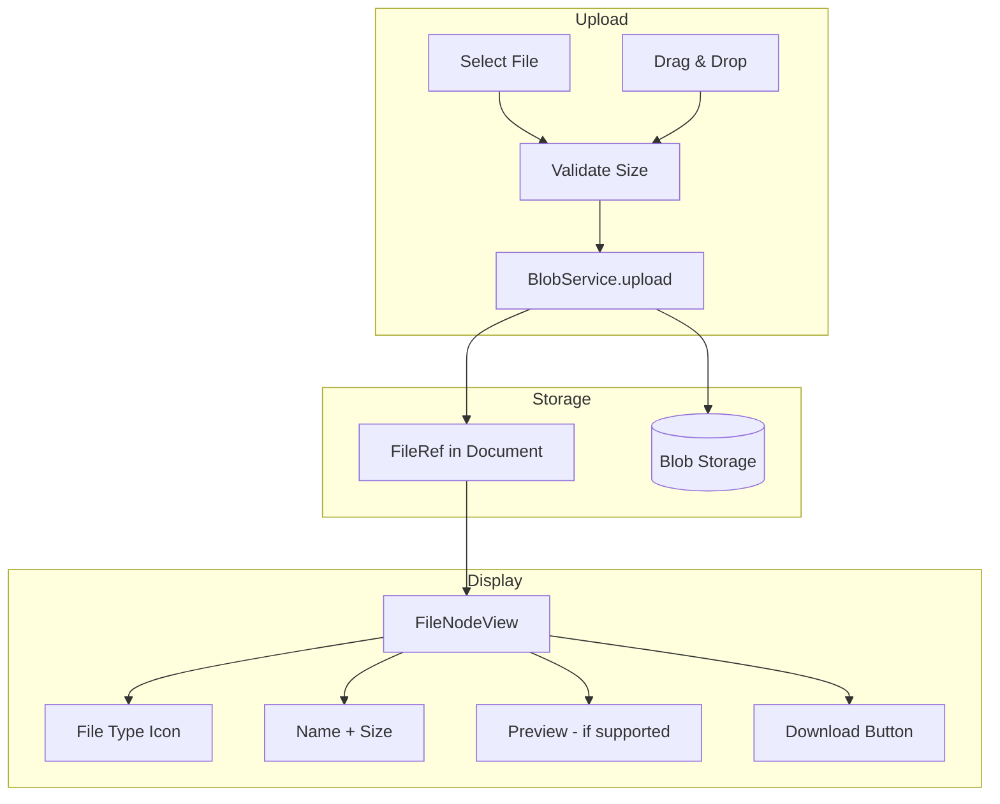

# 23: File Attachments

> Generic file uploads with preview and download support

**Duration:** 1 day  
**Dependencies:** [21-blob-infrastructure.md](./21-blob-infrastructure.md)

## Overview

File attachments allow users to embed any file type in documents. Files are stored using the BlobService and displayed as downloadable blocks with file type icons, names, and sizes. Common file types (PDF, Office docs) show inline previews when supported.



## Implementation

### 1. File Extension

```typescript
// packages/editor/src/extensions/file/FileExtension.ts

import { Node, mergeAttributes } from '@tiptap/core'
import { ReactNodeViewRenderer } from '@tiptap/react'
import { FileNodeView } from './FileNodeView'
import type { FileRef } from '@xnet/data'

export interface FileExtensionOptions {
  /** Maximum file size in bytes (default: 100MB) */
  maxSize: number
  /** File types to block (MIME patterns) */
  blockedTypes: string[]
  /** Upload handler */
  onUpload?: (file: File) => Promise<FileRef>
  /** Download handler */
  onDownload?: (ref: FileRef) => Promise<void>
}

declare module '@tiptap/core' {
  interface Commands<ReturnType> {
    file: {
      /** Insert a file attachment */
      setFile: (ref: FileRef) => ReturnType
    }
  }
}

export const FileExtension = Node.create<FileExtensionOptions>({
  name: 'file',

  addOptions() {
    return {
      maxSize: 100 * 1024 * 1024, // 100MB
      blockedTypes: ['application/x-executable', 'application/x-msdownload'],
      onUpload: undefined,
      onDownload: undefined
    }
  },

  group: 'block',

  draggable: true,

  addAttributes() {
    return {
      // FileRef fields
      cid: { default: null },
      name: { default: null },
      mimeType: { default: null },
      size: { default: null },
      // Upload state
      uploadProgress: { default: null }
    }
  },

  parseHTML() {
    return [
      {
        tag: 'div[data-file-cid]'
      }
    ]
  },

  renderHTML({ HTMLAttributes }) {
    return [
      'div',
      mergeAttributes(HTMLAttributes, {
        'data-file-cid': HTMLAttributes.cid,
        'data-type': 'file-attachment'
      })
    ]
  },

  addNodeView() {
    return ReactNodeViewRenderer(FileNodeView)
  },

  addCommands() {
    return {
      setFile:
        (ref: FileRef) =>
        ({ commands }) => {
          return commands.insertContent({
            type: this.name,
            attrs: {
              cid: ref.cid,
              name: ref.name,
              mimeType: ref.mimeType,
              size: ref.size
            }
          })
        }
    }
  }
})
```

### 2. File NodeView

```tsx
// packages/editor/src/extensions/file/FileNodeView.tsx

import * as React from 'react'
import { NodeViewWrapper, type NodeViewProps } from '@tiptap/react'
import { cn } from '@xnet/ui/lib/utils'
import {
  FileText,
  FileImage,
  FileVideo,
  FileAudio,
  FileArchive,
  FileCode,
  FileSpreadsheet,
  File as FileIcon,
  Download,
  ExternalLink
} from 'lucide-react'
import { useBlobService } from '../../context/BlobContext'

/**
 * Get icon component for file type
 */
function getFileIcon(mimeType: string): React.ComponentType<{ className?: string }> {
  if (mimeType.startsWith('image/')) return FileImage
  if (mimeType.startsWith('video/')) return FileVideo
  if (mimeType.startsWith('audio/')) return FileAudio
  if (mimeType.includes('pdf')) return FileText
  if (mimeType.includes('zip') || mimeType.includes('tar') || mimeType.includes('rar')) {
    return FileArchive
  }
  if (mimeType.includes('spreadsheet') || mimeType.includes('excel') || mimeType.includes('csv')) {
    return FileSpreadsheet
  }
  if (
    mimeType.includes('javascript') ||
    mimeType.includes('typescript') ||
    mimeType.includes('json') ||
    mimeType.includes('html') ||
    mimeType.includes('css')
  ) {
    return FileCode
  }
  if (mimeType.includes('word') || mimeType.includes('document')) return FileText
  return FileIcon
}

/**
 * Format file size for display
 */
function formatFileSize(bytes: number): string {
  if (bytes < 1024) return `${bytes} B`
  if (bytes < 1024 * 1024) return `${(bytes / 1024).toFixed(1)} KB`
  if (bytes < 1024 * 1024 * 1024) return `${(bytes / (1024 * 1024)).toFixed(1)} MB`
  return `${(bytes / (1024 * 1024 * 1024)).toFixed(1)} GB`
}

/**
 * Check if file type supports preview
 */
function supportsPreview(mimeType: string): boolean {
  return (
    mimeType === 'application/pdf' ||
    mimeType.startsWith('image/') ||
    mimeType.startsWith('video/') ||
    mimeType.startsWith('audio/')
  )
}

export function FileNodeView({ node, selected, extension }: NodeViewProps) {
  const { cid, name, mimeType, size, uploadProgress } = node.attrs
  const { getFileUrl } = useBlobService()
  const [previewUrl, setPreviewUrl] = React.useState<string | null>(null)
  const [showPreview, setShowPreview] = React.useState(false)

  const Icon = getFileIcon(mimeType || 'application/octet-stream')

  // Load preview URL when needed
  React.useEffect(() => {
    if (showPreview && cid && !previewUrl) {
      getFileUrl({ cid, name, mimeType, size }).then(setPreviewUrl).catch(console.error)
    }
  }, [showPreview, cid, name, mimeType, size, previewUrl, getFileUrl])

  const handleDownload = async () => {
    try {
      const url = await getFileUrl({ cid, name, mimeType, size })

      // Create download link
      const a = document.createElement('a')
      a.href = url
      a.download = name
      document.body.appendChild(a)
      a.click()
      document.body.removeChild(a)
    } catch (error) {
      console.error('Download failed:', error)
    }
  }

  // Uploading state
  if (uploadProgress !== null && uploadProgress < 100) {
    return (
      <NodeViewWrapper>
        <div
          className={cn(
            'flex items-center gap-3 p-3 rounded-lg',
            'bg-gray-50 dark:bg-gray-800',
            'border border-gray-200 dark:border-gray-700'
          )}
        >
          <div className="flex-shrink-0">
            <Icon className="w-8 h-8 text-gray-400" />
          </div>
          <div className="flex-1 min-w-0">
            <p className="text-sm font-medium text-gray-700 dark:text-gray-300 truncate">{name}</p>
            <div className="mt-1 h-1.5 bg-gray-200 dark:bg-gray-700 rounded-full overflow-hidden">
              <div
                className="h-full bg-blue-500 transition-all duration-300"
                style={{ width: `${uploadProgress}%` }}
              />
            </div>
          </div>
        </div>
      </NodeViewWrapper>
    )
  }

  return (
    <NodeViewWrapper>
      <div
        className={cn(
          'flex items-center gap-3 p-3 rounded-lg',
          'bg-gray-50 dark:bg-gray-800',
          'border border-gray-200 dark:border-gray-700',
          'transition-colors duration-150',
          'hover:bg-gray-100 dark:hover:bg-gray-750',
          selected && 'ring-2 ring-blue-500 ring-offset-2'
        )}
        data-drag-handle
      >
        {/* File icon */}
        <div className="flex-shrink-0">
          <Icon className="w-8 h-8 text-gray-500 dark:text-gray-400" />
        </div>

        {/* File info */}
        <div className="flex-1 min-w-0">
          <p className="text-sm font-medium text-gray-900 dark:text-gray-100 truncate">{name}</p>
          <p className="text-xs text-gray-500 dark:text-gray-400">
            {formatFileSize(size || 0)}
            {mimeType && ` • ${mimeType.split('/')[1]?.toUpperCase()}`}
          </p>
        </div>

        {/* Actions */}
        <div className="flex-shrink-0 flex items-center gap-1">
          {supportsPreview(mimeType) && (
            <button
              type="button"
              onClick={() => setShowPreview(true)}
              className={cn(
                'p-1.5 rounded',
                'text-gray-500 hover:text-gray-700',
                'dark:text-gray-400 dark:hover:text-gray-300',
                'hover:bg-gray-200 dark:hover:bg-gray-700'
              )}
              title="Preview"
            >
              <ExternalLink className="w-4 h-4" />
            </button>
          )}
          <button
            type="button"
            onClick={handleDownload}
            className={cn(
              'p-1.5 rounded',
              'text-gray-500 hover:text-gray-700',
              'dark:text-gray-400 dark:hover:text-gray-300',
              'hover:bg-gray-200 dark:hover:bg-gray-700'
            )}
            title="Download"
          >
            <Download className="w-4 h-4" />
          </button>
        </div>
      </div>

      {/* Preview modal */}
      {showPreview && previewUrl && (
        <FilePreviewModal
          url={previewUrl}
          name={name}
          mimeType={mimeType}
          onClose={() => setShowPreview(false)}
        />
      )}
    </NodeViewWrapper>
  )
}

interface FilePreviewModalProps {
  url: string
  name: string
  mimeType: string
  onClose: () => void
}

function FilePreviewModal({ url, name, mimeType, onClose }: FilePreviewModalProps) {
  return (
    <div
      className="fixed inset-0 z-50 flex items-center justify-center bg-black/50"
      onClick={onClose}
    >
      <div
        className={cn(
          'relative max-w-4xl max-h-[90vh] w-full m-4',
          'bg-white dark:bg-gray-800 rounded-lg shadow-xl',
          'overflow-hidden'
        )}
        onClick={(e) => e.stopPropagation()}
      >
        {/* Header */}
        <div className="flex items-center justify-between p-3 border-b border-gray-200 dark:border-gray-700">
          <h3 className="text-sm font-medium truncate">{name}</h3>
          <button
            onClick={onClose}
            className="p-1 rounded hover:bg-gray-100 dark:hover:bg-gray-700"
          >
            <svg className="w-5 h-5" fill="none" stroke="currentColor" viewBox="0 0 24 24">
              <path
                strokeLinecap="round"
                strokeLinejoin="round"
                strokeWidth={2}
                d="M6 18L18 6M6 6l12 12"
              />
            </svg>
          </button>
        </div>

        {/* Preview content */}
        <div className="overflow-auto max-h-[calc(90vh-4rem)]">
          {mimeType === 'application/pdf' && (
            <iframe src={url} className="w-full h-[80vh]" title={name} />
          )}
          {mimeType.startsWith('image/') && (
            
          )}
          {mimeType.startsWith('video/') && (
            <video src={url} controls className="max-w-full h-auto mx-auto">
              Your browser does not support video playback.
            </video>
          )}
          {mimeType.startsWith('audio/') && (
            <audio src={url} controls className="w-full p-4">
              Your browser does not support audio playback.
            </audio>
          )}
        </div>
      </div>
    </div>
  )
}
```

### 3. File Upload Handler

```typescript
// packages/editor/src/extensions/file/FileUploadPlugin.ts

import { Plugin, PluginKey } from '@tiptap/pm/state'
import { EditorView } from '@tiptap/pm/view'
import type { FileRef } from '@xnet/data'

export const FileUploadPluginKey = new PluginKey('fileUpload')

export interface FileUploadPluginOptions {
  maxSize: number
  blockedTypes: string[]
  onUpload: (file: File) => Promise<FileRef>
}

export function createFileUploadPlugin(options: FileUploadPluginOptions) {
  return new Plugin({
    key: FileUploadPluginKey,

    props: {
      handleDrop(view: EditorView, event: DragEvent, slice, moved) {
        if (moved) return false

        const files = event.dataTransfer?.files
        if (!files?.length) return false

        // Filter out images (handled by image extension) and blocked types
        const attachments = Array.from(files).filter((file) => {
          if (file.type.startsWith('image/')) return false
          if (options.blockedTypes.some((t) => file.type.match(t))) return false
          if (file.size > options.maxSize) return false
          return true
        })

        if (attachments.length === 0) return false

        event.preventDefault()

        const pos = view.posAtCoords({
          left: event.clientX,
          top: event.clientY
        })

        for (const file of attachments) {
          handleFileUpload(view, file, options.onUpload, pos?.pos)
        }

        return true
      }
    }
  })
}

async function handleFileUpload(
  view: EditorView,
  file: File,
  onUpload: (file: File) => Promise<FileRef>,
  pos?: number
) {
  const { state, dispatch } = view
  const insertPos = pos ?? state.selection.from

  // Insert placeholder
  const placeholderNode = state.schema.nodes.file.create({
    name: file.name,
    mimeType: file.type,
    size: file.size,
    uploadProgress: 0
  })

  dispatch(state.tr.insert(insertPos, placeholderNode))

  try {
    // Upload with progress simulation
    const progressInterval = setInterval(() => {
      view.state.doc.descendants((node, nodePos) => {
        if (
          node.type.name === 'file' &&
          node.attrs.uploadProgress !== null &&
          node.attrs.name === file.name
        ) {
          const newProgress = Math.min((node.attrs.uploadProgress || 0) + 10, 90)
          dispatch(
            view.state.tr.setNodeMarkup(nodePos, undefined, {
              ...node.attrs,
              uploadProgress: newProgress
            })
          )
          return false
        }
      })
    }, 100)

    const ref = await onUpload(file)
    clearInterval(progressInterval)

    // Update with final result
    view.state.doc.descendants((node, nodePos) => {
      if (
        node.type.name === 'file' &&
        node.attrs.uploadProgress !== null &&
        node.attrs.name === file.name
      ) {
        dispatch(
          view.state.tr.setNodeMarkup(nodePos, undefined, {
            cid: ref.cid,
            name: ref.name,
            mimeType: ref.mimeType,
            size: ref.size,
            uploadProgress: null
          })
        )
        return false
      }
    })
  } catch (error) {
    console.error('File upload failed:', error)

    // Remove placeholder
    view.state.doc.descendants((node, nodePos) => {
      if (
        node.type.name === 'file' &&
        node.attrs.uploadProgress !== null &&
        node.attrs.name === file.name
      ) {
        dispatch(view.state.tr.delete(nodePos, nodePos + node.nodeSize))
        return false
      }
    })
  }
}
```

### 4. Slash Command

```typescript
// Add to COMMAND_GROUPS in slash-command/items.ts:

{
  id: 'file',
  title: 'File',
  description: 'Attach a file',
  icon: '📎',
  searchTerms: ['attachment', 'upload', 'document'],
  command: ({ editor, range }) => {
    editor.chain().focus().deleteRange(range).run()

    const input = document.createElement('input')
    input.type = 'file'
    input.onchange = async (e) => {
      const file = (e.target as HTMLInputElement).files?.[0]
      if (file) {
        const { onUpload } = editor.extensionManager.extensions.find(
          (ext) => ext.name === 'file'
        )?.options || {}

        if (onUpload) {
          const ref = await onUpload(file)
          editor.commands.setFile(ref)
        }
      }
    }
    input.click()
  }
}
```

## Tests

```typescript
// packages/editor/src/extensions/file/FileExtension.test.ts

import { describe, it, expect, beforeEach, afterEach } from 'vitest'
import { Editor } from '@tiptap/core'
import StarterKit from '@tiptap/starter-kit'
import { FileExtension } from './FileExtension'

describe('FileExtension', () => {
  let editor: Editor

  beforeEach(() => {
    editor = new Editor({
      extensions: [StarterKit, FileExtension],
      content: '<p>Hello world</p>'
    })
  })

  afterEach(() => {
    editor.destroy()
  })

  describe('setFile command', () => {
    it('should insert a file attachment', () => {
      editor.commands.setFile({
        cid: 'cid:blake3:abc123',
        name: 'document.pdf',
        mimeType: 'application/pdf',
        size: 1024
      })

      const html = editor.getHTML()
      expect(html).toContain('data-file-cid="cid:blake3:abc123"')
    })
  })
})
```

```tsx
// packages/editor/src/extensions/file/FileNodeView.test.tsx

import * as React from 'react'
import { describe, it, expect, vi } from 'vitest'
import { render, screen } from '@testing-library/react'
import { FileNodeView } from './FileNodeView'

// Mock BlobContext
vi.mock('../../context/BlobContext', () => ({
  useBlobService: () => ({
    getFileUrl: vi.fn().mockResolvedValue('blob:test')
  })
}))

describe('FileNodeView', () => {
  const defaultNode = {
    attrs: {
      cid: 'cid:blake3:abc123',
      name: 'document.pdf',
      mimeType: 'application/pdf',
      size: 1024 * 1024,
      uploadProgress: null
    }
  }

  it('should display file name', () => {
    render(
      <FileNodeView
        node={defaultNode as any}
        selected={false}
        extension={{} as any}
        getPos={() => 0}
        updateAttributes={() => {}}
        deleteNode={() => {}}
        editor={null as any}
        decorations={[]}
      />
    )

    expect(screen.getByText('document.pdf')).toBeInTheDocument()
  })

  it('should display formatted file size', () => {
    render(
      <FileNodeView
        node={defaultNode as any}
        selected={false}
        extension={{} as any}
        getPos={() => 0}
        updateAttributes={() => {}}
        deleteNode={() => {}}
        editor={null as any}
        decorations={[]}
      />
    )

    expect(screen.getByText(/1\.0 MB/)).toBeInTheDocument()
  })

  it('should show upload progress when uploading', () => {
    const uploadingNode = {
      attrs: {
        ...defaultNode.attrs,
        uploadProgress: 50
      }
    }

    render(
      <FileNodeView
        node={uploadingNode as any}
        selected={false}
        extension={{} as any}
        getPos={() => 0}
        updateAttributes={() => {}}
        deleteNode={() => {}}
        editor={null as any}
        decorations={[]}
      />
    )

    // Check for progress bar
    const progressBar = document.querySelector('[style*="width: 50%"]')
    expect(progressBar).toBeInTheDocument()
  })
})
```

## Checklist

- [ ] Create FileExtension TipTap node
- [ ] Build FileNodeView with file type icons
- [ ] Implement file size formatting
- [ ] Add download functionality
- [ ] Add preview modal for supported types
- [ ] Implement drag-and-drop upload
- [ ] Add file to slash commands
- [ ] Filter out blocked file types
- [ ] Show upload progress
- [ ] Write tests
- [ ] Tests pass

---

[Back to README](./README.md) | [Previous: Image Upload](./22-image-upload.md) | [Next: Media Embeds](./24-media-embeds.md)
