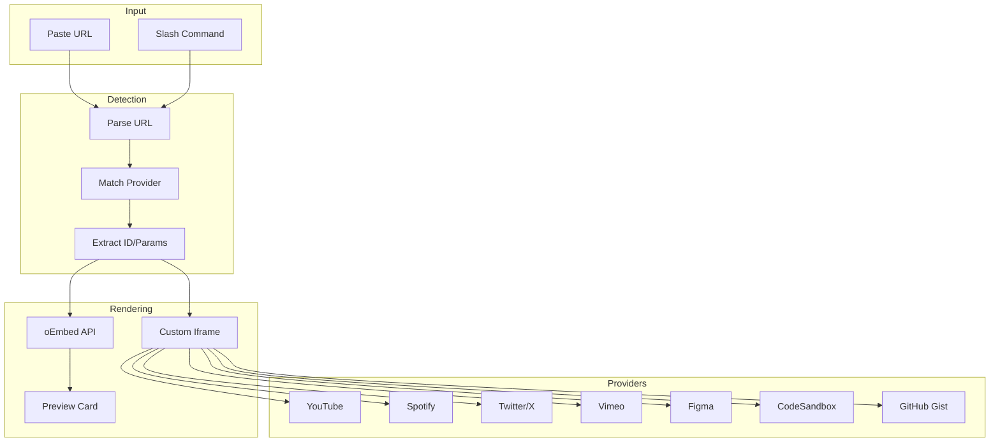

# 24: Media Embeds

> Embed YouTube, Spotify, Twitter, and other external media

**Duration:** 1.5 days  
**Dependencies:** [11-slash-extension.md](./11-slash-extension.md)

## Overview

Media embeds allow users to include external content from services like YouTube, Spotify, Twitter, and more. Unlike file attachments, embeds store only a URL reference and render the content via oEmbed or service-specific iframes. This keeps documents lightweight while enabling rich media experiences.



## Implementation

### 1. Embed Provider Registry

```typescript
// packages/editor/src/extensions/embed/providers.ts

export interface EmbedProvider {
  /** Provider name */
  name: string
  /** Display name */
  displayName: string
  /** Icon (emoji or component) */
  icon: string
  /** URL patterns to match */
  patterns: RegExp[]
  /** Extract embed ID from URL */
  extractId: (url: string) => string | null
  /** Generate iframe src */
  getEmbedUrl: (id: string, params?: Record<string, string>) => string
  /** Default aspect ratio (width/height) */
  aspectRatio?: number
  /** oEmbed endpoint (if supported) */
  oembedUrl?: string
}

export const EMBED_PROVIDERS: EmbedProvider[] = [
  // ========================================
  // YouTube
  // ========================================
  {
    name: 'youtube',
    displayName: 'YouTube',
    icon: '▶️',
    patterns: [
      /(?:youtube\.com\/watch\?v=|youtu\.be\/|youtube\.com\/embed\/)([a-zA-Z0-9_-]+)/,
      /youtube\.com\/shorts\/([a-zA-Z0-9_-]+)/
    ],
    extractId: (url) => {
      for (const pattern of EMBED_PROVIDERS[0].patterns) {
        const match = url.match(pattern)
        if (match) return match[1]
      }
      return null
    },
    getEmbedUrl: (id) => `https://www.youtube.com/embed/${id}`,
    aspectRatio: 16 / 9,
    oembedUrl: 'https://www.youtube.com/oembed'
  },

  // ========================================
  // Vimeo
  // ========================================
  {
    name: 'vimeo',
    displayName: 'Vimeo',
    icon: '🎬',
    patterns: [/vimeo\.com\/(\d+)/, /player\.vimeo\.com\/video\/(\d+)/],
    extractId: (url) => {
      for (const pattern of EMBED_PROVIDERS[1].patterns) {
        const match = url.match(pattern)
        if (match) return match[1]
      }
      return null
    },
    getEmbedUrl: (id) => `https://player.vimeo.com/video/${id}`,
    aspectRatio: 16 / 9,
    oembedUrl: 'https://vimeo.com/api/oembed.json'
  },

  // ========================================
  // Spotify
  // ========================================
  {
    name: 'spotify',
    displayName: 'Spotify',
    icon: '🎵',
    patterns: [
      /open\.spotify\.com\/(track|album|playlist|episode|show)\/([a-zA-Z0-9]+)/,
      /spotify\.link\/([a-zA-Z0-9]+)/
    ],
    extractId: (url) => {
      const match = url.match(
        /open\.spotify\.com\/(track|album|playlist|episode|show)\/([a-zA-Z0-9]+)/
      )
      if (match) return `${match[1]}/${match[2]}`
      return null
    },
    getEmbedUrl: (id) => `https://open.spotify.com/embed/${id}`,
    aspectRatio: 80 / 380 // Compact player
  },

  // ========================================
  // Twitter/X
  // ========================================
  {
    name: 'twitter',
    displayName: 'Twitter',
    icon: '🐦',
    patterns: [/(?:twitter\.com|x\.com)\/(?:\w+)\/status\/(\d+)/],
    extractId: (url) => {
      const match = url.match(/(?:twitter\.com|x\.com)\/(?:\w+)\/status\/(\d+)/)
      return match ? match[1] : null
    },
    getEmbedUrl: (id) => `https://platform.twitter.com/embed/Tweet.html?id=${id}`,
    oembedUrl: 'https://publish.twitter.com/oembed'
  },

  // ========================================
  // Figma
  // ========================================
  {
    name: 'figma',
    displayName: 'Figma',
    icon: '🎨',
    patterns: [/figma\.com\/(file|proto)\/([a-zA-Z0-9]+)/],
    extractId: (url) => {
      const match = url.match(/figma\.com\/(file|proto)\/([a-zA-Z0-9]+)/)
      return match ? `${match[1]}/${match[2]}` : null
    },
    getEmbedUrl: (id, params) => {
      const [type, fileId] = id.split('/')
      const baseUrl = `https://www.figma.com/embed?embed_host=xnet&url=https://www.figma.com/${type}/${fileId}`
      return baseUrl
    },
    aspectRatio: 16 / 9
  },

  // ========================================
  // CodeSandbox
  // ========================================
  {
    name: 'codesandbox',
    displayName: 'CodeSandbox',
    icon: '📦',
    patterns: [/codesandbox\.io\/s\/([a-zA-Z0-9-]+)/, /codesandbox\.io\/embed\/([a-zA-Z0-9-]+)/],
    extractId: (url) => {
      const match = url.match(/codesandbox\.io\/(?:s|embed)\/([a-zA-Z0-9-]+)/)
      return match ? match[1] : null
    },
    getEmbedUrl: (id) =>
      `https://codesandbox.io/embed/${id}?fontsize=14&hidenavigation=1&theme=dark`,
    aspectRatio: 16 / 9
  },

  // ========================================
  // GitHub Gist
  // ========================================
  {
    name: 'gist',
    displayName: 'GitHub Gist',
    icon: '📝',
    patterns: [/gist\.github\.com\/([a-zA-Z0-9-]+)\/([a-f0-9]+)/],
    extractId: (url) => {
      const match = url.match(/gist\.github\.com\/([a-zA-Z0-9-]+)\/([a-f0-9]+)/)
      return match ? `${match[1]}/${match[2]}` : null
    },
    getEmbedUrl: (id) => `https://gist.github.com/${id}.js`
    // Gists need special handling (script injection)
  },

  // ========================================
  // Loom
  // ========================================
  {
    name: 'loom',
    displayName: 'Loom',
    icon: '🎥',
    patterns: [/loom\.com\/share\/([a-f0-9]+)/, /loom\.com\/embed\/([a-f0-9]+)/],
    extractId: (url) => {
      const match = url.match(/loom\.com\/(?:share|embed)\/([a-f0-9]+)/)
      return match ? match[1] : null
    },
    getEmbedUrl: (id) => `https://www.loom.com/embed/${id}`,
    aspectRatio: 16 / 9
  }
]

/**
 * Detect provider from URL
 */
export function detectProvider(url: string): EmbedProvider | null {
  for (const provider of EMBED_PROVIDERS) {
    for (const pattern of provider.patterns) {
      if (pattern.test(url)) {
        return provider
      }
    }
  }
  return null
}

/**
 * Parse URL and extract embed info
 */
export function parseEmbedUrl(url: string): {
  provider: EmbedProvider
  id: string
  embedUrl: string
} | null {
  const provider = detectProvider(url)
  if (!provider) return null

  const id = provider.extractId(url)
  if (!id) return null

  return {
    provider,
    id,
    embedUrl: provider.getEmbedUrl(id)
  }
}
```

### 2. Embed Extension

```typescript
// packages/editor/src/extensions/embed/EmbedExtension.ts

import { Node, mergeAttributes } from '@tiptap/core'
import { ReactNodeViewRenderer } from '@tiptap/react'
import { EmbedNodeView } from './EmbedNodeView'
import { parseEmbedUrl, detectProvider } from './providers'

export interface EmbedOptions {
  /** Enable auto-detection of URLs */
  autoEmbed: boolean
  /** Allowed providers (empty = all) */
  allowedProviders: string[]
}

declare module '@tiptap/core' {
  interface Commands<ReturnType> {
    embed: {
      /** Insert an embed from URL */
      setEmbed: (url: string) => ReturnType
      /** Update embed size */
      updateEmbedSize: (options: { width?: number; height?: number }) => ReturnType
    }
  }
}

export const EmbedExtension = Node.create<EmbedOptions>({
  name: 'embed',

  addOptions() {
    return {
      autoEmbed: true,
      allowedProviders: []
    }
  },

  group: 'block',

  draggable: true,

  addAttributes() {
    return {
      url: { default: null },
      provider: { default: null },
      embedId: { default: null },
      embedUrl: { default: null },
      title: { default: null },
      thumbnailUrl: { default: null },
      width: { default: null },
      height: { default: null }
    }
  },

  parseHTML() {
    return [
      {
        tag: 'div[data-embed-url]'
      }
    ]
  },

  renderHTML({ HTMLAttributes }) {
    return [
      'div',
      mergeAttributes(HTMLAttributes, {
        'data-embed-url': HTMLAttributes.url,
        'data-embed-provider': HTMLAttributes.provider
      })
    ]
  },

  addNodeView() {
    return ReactNodeViewRenderer(EmbedNodeView)
  },

  addCommands() {
    return {
      setEmbed:
        (url: string) =>
        ({ commands }) => {
          const parsed = parseEmbedUrl(url)
          if (!parsed) {
            console.warn('Unknown embed URL:', url)
            return false
          }

          // Check if provider is allowed
          if (
            this.options.allowedProviders.length > 0 &&
            !this.options.allowedProviders.includes(parsed.provider.name)
          ) {
            console.warn('Provider not allowed:', parsed.provider.name)
            return false
          }

          return commands.insertContent({
            type: this.name,
            attrs: {
              url,
              provider: parsed.provider.name,
              embedId: parsed.id,
              embedUrl: parsed.embedUrl
            }
          })
        },

      updateEmbedSize:
        (options) =>
        ({ commands }) => {
          return commands.updateAttributes(this.name, options)
        }
    }
  },

  // Auto-embed pasted URLs
  addPasteRules() {
    if (!this.options.autoEmbed) return []

    return [
      {
        find: /(https?:\/\/[^\s]+)/g,
        handler: ({ state, range, match }) => {
          const url = match[0]
          const parsed = parseEmbedUrl(url)

          if (!parsed) return null

          // Check if provider is allowed
          if (
            this.options.allowedProviders.length > 0 &&
            !this.options.allowedProviders.includes(parsed.provider.name)
          ) {
            return null
          }

          const { tr } = state
          const node = this.type.create({
            url,
            provider: parsed.provider.name,
            embedId: parsed.id,
            embedUrl: parsed.embedUrl
          })

          tr.replaceWith(range.from, range.to, node)

          return tr
        }
      }
    ]
  }
})
```

### 3. Embed NodeView

```tsx
// packages/editor/src/extensions/embed/EmbedNodeView.tsx

import * as React from 'react'
import { NodeViewWrapper, type NodeViewProps } from '@tiptap/react'
import { cn } from '@xnet/ui/lib/utils'
import { EMBED_PROVIDERS } from './providers'
import { ExternalLink, Maximize2, Minimize2 } from 'lucide-react'

export function EmbedNodeView({ node, selected, updateAttributes }: NodeViewProps) {
  const { url, provider, embedUrl, title, width, height } = node.attrs
  const [isExpanded, setIsExpanded] = React.useState(false)
  const [isLoaded, setIsLoaded] = React.useState(false)
  const iframeRef = React.useRef<HTMLIFrameElement>(null)

  const providerConfig = EMBED_PROVIDERS.find((p) => p.name === provider)
  const aspectRatio = providerConfig?.aspectRatio ?? 16 / 9

  // Calculate dimensions
  const containerWidth = width || 640
  const containerHeight = height || Math.round(containerWidth / aspectRatio)

  return (
    <NodeViewWrapper>
      <div
        className={cn(
          'relative rounded-lg overflow-hidden',
          'bg-gray-100 dark:bg-gray-800',
          'border border-gray-200 dark:border-gray-700',
          selected && 'ring-2 ring-blue-500 ring-offset-2',
          isExpanded && 'fixed inset-4 z-50 m-0'
        )}
        style={isExpanded ? undefined : { width: containerWidth, maxWidth: '100%' }}
        data-drag-handle
      >
        {/* Provider badge */}
        <div
          className={cn(
            'absolute top-2 left-2 z-10',
            'flex items-center gap-1.5 px-2 py-1',
            'bg-black/50 text-white text-xs rounded-full',
            'backdrop-blur-sm'
          )}
        >
          <span>{providerConfig?.icon}</span>
          <span>{providerConfig?.displayName || provider}</span>
        </div>

        {/* Actions */}
        <div className="absolute top-2 right-2 z-10 flex items-center gap-1">
          <button
            type="button"
            onClick={() => setIsExpanded(!isExpanded)}
            className={cn(
              'p-1.5 rounded',
              'bg-black/50 text-white',
              'hover:bg-black/70',
              'backdrop-blur-sm'
            )}
            title={isExpanded ? 'Minimize' : 'Maximize'}
          >
            {isExpanded ? <Minimize2 className="w-4 h-4" /> : <Maximize2 className="w-4 h-4" />}
          </button>
          <a
            href={url}
            target="_blank"
            rel="noopener noreferrer"
            className={cn(
              'p-1.5 rounded',
              'bg-black/50 text-white',
              'hover:bg-black/70',
              'backdrop-blur-sm'
            )}
            title="Open in new tab"
          >
            <ExternalLink className="w-4 h-4" />
          </a>
        </div>

        {/* Loading placeholder */}
        {!isLoaded && (
          <div
            className="flex items-center justify-center bg-gray-200 dark:bg-gray-700"
            style={{ height: isExpanded ? '100%' : containerHeight }}
          >
            <div className="animate-pulse text-gray-400">Loading...</div>
          </div>
        )}

        {/* Iframe */}
        <iframe
          ref={iframeRef}
          src={embedUrl}
          title={title || `${providerConfig?.displayName} embed`}
          className={cn('w-full border-0', !isLoaded && 'hidden')}
          style={{ height: isExpanded ? '100%' : containerHeight }}
          allowFullScreen
          allow="accelerometer; autoplay; clipboard-write; encrypted-media; gyroscope; picture-in-picture"
          onLoad={() => setIsLoaded(true)}
        />
      </div>

      {/* Expanded overlay background */}
      {isExpanded && (
        <div className="fixed inset-0 bg-black/50 z-40" onClick={() => setIsExpanded(false)} />
      )}
    </NodeViewWrapper>
  )
}
```

### 4. Slash Commands for Embeds

```typescript
// Add to COMMAND_GROUPS in slash-command/items.ts:

{
  name: 'Embeds',
  items: [
    {
      id: 'youtube',
      title: 'YouTube',
      description: 'Embed a YouTube video',
      icon: '▶️',
      searchTerms: ['video', 'youtube', 'embed'],
      command: ({ editor, range }) => {
        editor.chain().focus().deleteRange(range).run()
        const url = window.prompt('YouTube URL:')
        if (url) {
          editor.commands.setEmbed(url)
        }
      }
    },
    {
      id: 'spotify',
      title: 'Spotify',
      description: 'Embed a Spotify track or playlist',
      icon: '🎵',
      searchTerms: ['music', 'spotify', 'audio', 'playlist'],
      command: ({ editor, range }) => {
        editor.chain().focus().deleteRange(range).run()
        const url = window.prompt('Spotify URL:')
        if (url) {
          editor.commands.setEmbed(url)
        }
      }
    },
    {
      id: 'twitter',
      title: 'Tweet',
      description: 'Embed a tweet',
      icon: '🐦',
      searchTerms: ['twitter', 'tweet', 'x'],
      command: ({ editor, range }) => {
        editor.chain().focus().deleteRange(range).run()
        const url = window.prompt('Tweet URL:')
        if (url) {
          editor.commands.setEmbed(url)
        }
      }
    },
    {
      id: 'figma',
      title: 'Figma',
      description: 'Embed a Figma design',
      icon: '🎨',
      searchTerms: ['figma', 'design', 'prototype'],
      command: ({ editor, range }) => {
        editor.chain().focus().deleteRange(range).run()
        const url = window.prompt('Figma URL:')
        if (url) {
          editor.commands.setEmbed(url)
        }
      }
    },
    {
      id: 'embed',
      title: 'Embed',
      description: 'Embed content from a URL',
      icon: '🔗',
      searchTerms: ['embed', 'iframe', 'link', 'url'],
      command: ({ editor, range }) => {
        editor.chain().focus().deleteRange(range).run()
        const url = window.prompt('URL to embed:')
        if (url) {
          editor.commands.setEmbed(url)
        }
      }
    }
  ]
}
```

### 5. Twitter Widget Integration

Twitter requires special handling with their widget script:

```tsx
// packages/editor/src/extensions/embed/TwitterEmbed.tsx

import * as React from 'react'
import { cn } from '@xnet/ui/lib/utils'

interface TwitterEmbedProps {
  tweetId: string
  className?: string
}

export function TwitterEmbed({ tweetId, className }: TwitterEmbedProps) {
  const containerRef = React.useRef<HTMLDivElement>(null)
  const [isLoaded, setIsLoaded] = React.useState(false)

  React.useEffect(() => {
    // Load Twitter widget script if not already loaded
    if (!(window as any).twttr) {
      const script = document.createElement('script')
      script.src = 'https://platform.twitter.com/widgets.js'
      script.async = true
      document.body.appendChild(script)
    }

    // Render tweet when script is ready
    const renderTweet = () => {
      if ((window as any).twttr?.widgets && containerRef.current) {
        containerRef.current.innerHTML = ''
        ;(window as any).twttr.widgets
          .createTweet(tweetId, containerRef.current, {
            theme: document.documentElement.classList.contains('dark') ? 'dark' : 'light'
          })
          .then(() => setIsLoaded(true))
      }
    }

    if ((window as any).twttr?.widgets) {
      renderTweet()
    } else {
      // Wait for script to load
      const checkInterval = setInterval(() => {
        if ((window as any).twttr?.widgets) {
          clearInterval(checkInterval)
          renderTweet()
        }
      }, 100)

      return () => clearInterval(checkInterval)
    }
  }, [tweetId])

  return (
    <div className={cn('min-h-[200px]', className)}>
      {!isLoaded && (
        <div className="flex items-center justify-center h-[200px] bg-gray-100 dark:bg-gray-800 rounded-lg">
          <div className="animate-pulse text-gray-400">Loading tweet...</div>
        </div>
      )}
      <div ref={containerRef} />
    </div>
  )
}
```

## Tests

```typescript
// packages/editor/src/extensions/embed/providers.test.ts

import { describe, it, expect } from 'vitest'
import { detectProvider, parseEmbedUrl, EMBED_PROVIDERS } from './providers'

describe('Embed Providers', () => {
  describe('detectProvider', () => {
    it('should detect YouTube URLs', () => {
      const urls = [
        'https://www.youtube.com/watch?v=dQw4w9WgXcQ',
        'https://youtu.be/dQw4w9WgXcQ',
        'https://www.youtube.com/embed/dQw4w9WgXcQ',
        'https://youtube.com/shorts/abc123'
      ]

      for (const url of urls) {
        const provider = detectProvider(url)
        expect(provider?.name).toBe('youtube')
      }
    })

    it('should detect Spotify URLs', () => {
      const urls = [
        'https://open.spotify.com/track/4iV5W9uYEdYUVa79Axb7Rh',
        'https://open.spotify.com/album/1DFixLWuPkv3KT3TnV35m3',
        'https://open.spotify.com/playlist/37i9dQZF1DXcBWIGoYBM5M'
      ]

      for (const url of urls) {
        const provider = detectProvider(url)
        expect(provider?.name).toBe('spotify')
      }
    })

    it('should detect Twitter/X URLs', () => {
      const urls = [
        'https://twitter.com/user/status/123456789',
        'https://x.com/user/status/123456789'
      ]

      for (const url of urls) {
        const provider = detectProvider(url)
        expect(provider?.name).toBe('twitter')
      }
    })

    it('should return null for unknown URLs', () => {
      const provider = detectProvider('https://example.com/some/page')
      expect(provider).toBeNull()
    })
  })

  describe('parseEmbedUrl', () => {
    it('should extract YouTube video ID', () => {
      const result = parseEmbedUrl('https://www.youtube.com/watch?v=dQw4w9WgXcQ')

      expect(result?.provider.name).toBe('youtube')
      expect(result?.id).toBe('dQw4w9WgXcQ')
      expect(result?.embedUrl).toBe('https://www.youtube.com/embed/dQw4w9WgXcQ')
    })

    it('should extract Spotify track ID', () => {
      const result = parseEmbedUrl('https://open.spotify.com/track/4iV5W9uYEdYUVa79Axb7Rh')

      expect(result?.provider.name).toBe('spotify')
      expect(result?.id).toBe('track/4iV5W9uYEdYUVa79Axb7Rh')
      expect(result?.embedUrl).toBe('https://open.spotify.com/embed/track/4iV5W9uYEdYUVa79Axb7Rh')
    })

    it('should return null for invalid URLs', () => {
      const result = parseEmbedUrl('not a url')
      expect(result).toBeNull()
    })
  })
})
```

## Checklist

- [ ] Create embed provider registry
- [ ] Implement URL detection and parsing
- [ ] Create EmbedExtension TipTap node
- [ ] Build EmbedNodeView with iframe
- [ ] Add provider badge and actions
- [ ] Implement expand/collapse
- [ ] Add auto-embed on paste
- [ ] Add embed slash commands
- [ ] Handle Twitter widget separately
- [ ] Support dark mode for embeds
- [ ] Write tests
- [ ] Tests pass

---

[Back to README](./README.md) | [Previous: File Attachments](./23-file-attachments.md) | [Next: Database Embed](./25-database-embed.md)
