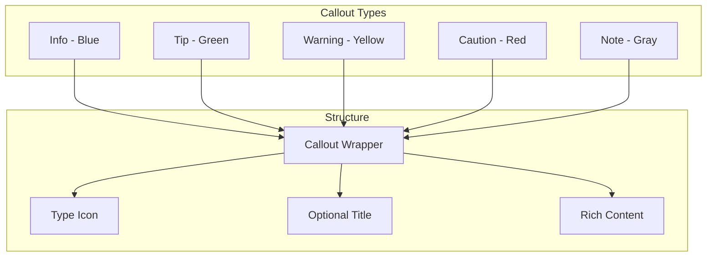

# 26: Callouts

> Info, warning, tip, and other highlighted boxes

**Duration:** 0.5 days  
**Dependencies:** [09-blockquote-nodeview.md](./09-blockquote-nodeview.md)

## Overview

Callouts are styled blocks for highlighting important information. They support different types (info, warning, tip, note, caution) with distinctive colors and icons. Like Obsidian and Notion, callouts can contain rich content including nested blocks.



## Implementation

### 1. Callout Types and Styles

```typescript
// packages/editor/src/extensions/callout/types.ts

export type CalloutType = 'info' | 'tip' | 'warning' | 'caution' | 'note' | 'quote'

export interface CalloutConfig {
  icon: string
  label: string
  bgClass: string
  borderClass: string
  iconClass: string
  titleClass: string
}

export const CALLOUT_CONFIGS: Record<CalloutType, CalloutConfig> = {
  info: {
    icon: 'ℹ️',
    label: 'Info',
    bgClass: 'bg-blue-50 dark:bg-blue-900/20',
    borderClass: 'border-blue-200 dark:border-blue-800',
    iconClass: 'text-blue-500',
    titleClass: 'text-blue-700 dark:text-blue-300'
  },
  tip: {
    icon: '💡',
    label: 'Tip',
    bgClass: 'bg-green-50 dark:bg-green-900/20',
    borderClass: 'border-green-200 dark:border-green-800',
    iconClass: 'text-green-500',
    titleClass: 'text-green-700 dark:text-green-300'
  },
  warning: {
    icon: '⚠️',
    label: 'Warning',
    bgClass: 'bg-yellow-50 dark:bg-yellow-900/20',
    borderClass: 'border-yellow-200 dark:border-yellow-800',
    iconClass: 'text-yellow-500',
    titleClass: 'text-yellow-700 dark:text-yellow-300'
  },
  caution: {
    icon: '🚨',
    label: 'Caution',
    bgClass: 'bg-red-50 dark:bg-red-900/20',
    borderClass: 'border-red-200 dark:border-red-800',
    iconClass: 'text-red-500',
    titleClass: 'text-red-700 dark:text-red-300'
  },
  note: {
    icon: '📝',
    label: 'Note',
    bgClass: 'bg-gray-50 dark:bg-gray-800',
    borderClass: 'border-gray-200 dark:border-gray-700',
    iconClass: 'text-gray-500',
    titleClass: 'text-gray-700 dark:text-gray-300'
  },
  quote: {
    icon: '💬',
    label: 'Quote',
    bgClass: 'bg-purple-50 dark:bg-purple-900/20',
    borderClass: 'border-purple-200 dark:border-purple-800',
    iconClass: 'text-purple-500',
    titleClass: 'text-purple-700 dark:text-purple-300'
  }
}
```

### 2. Callout Extension

```typescript
// packages/editor/src/extensions/callout/CalloutExtension.ts

import { Node, mergeAttributes } from '@tiptap/core'
import { ReactNodeViewRenderer } from '@tiptap/react'
import { CalloutNodeView } from './CalloutNodeView'
import type { CalloutType } from './types'

export interface CalloutOptions {
  /** Default callout type */
  defaultType: CalloutType
}

declare module '@tiptap/core' {
  interface Commands<ReturnType> {
    callout: {
      /** Insert a callout */
      setCallout: (type?: CalloutType) => ReturnType
      /** Toggle callout */
      toggleCallout: (type?: CalloutType) => ReturnType
      /** Change callout type */
      setCalloutType: (type: CalloutType) => ReturnType
      /** Update callout title */
      setCalloutTitle: (title: string) => ReturnType
    }
  }
}

export const CalloutExtension = Node.create<CalloutOptions>({
  name: 'callout',

  addOptions() {
    return {
      defaultType: 'info'
    }
  },

  group: 'block',

  content: 'block+',

  draggable: true,

  addAttributes() {
    return {
      type: {
        default: this.options.defaultType
      },
      title: {
        default: null
      },
      collapsed: {
        default: false
      }
    }
  },

  parseHTML() {
    return [
      {
        tag: 'div[data-callout]'
      }
    ]
  },

  renderHTML({ HTMLAttributes }) {
    return [
      'div',
      mergeAttributes(HTMLAttributes, {
        'data-callout': HTMLAttributes.type,
        class: 'callout'
      }),
      0
    ]
  },

  addNodeView() {
    return ReactNodeViewRenderer(CalloutNodeView)
  },

  addCommands() {
    return {
      setCallout:
        (type) =>
        ({ commands }) => {
          return commands.wrapIn(this.name, { type: type ?? this.options.defaultType })
        },

      toggleCallout:
        (type) =>
        ({ commands, state }) => {
          const { from, to } = state.selection
          const nodeAtSelection = state.doc.nodeAt(from)

          if (nodeAtSelection?.type.name === this.name) {
            return commands.lift(this.name)
          }

          return commands.wrapIn(this.name, { type: type ?? this.options.defaultType })
        },

      setCalloutType:
        (type) =>
        ({ commands }) => {
          return commands.updateAttributes(this.name, { type })
        },

      setCalloutTitle:
        (title) =>
        ({ commands }) => {
          return commands.updateAttributes(this.name, { title })
        }
    }
  },

  addKeyboardShortcuts() {
    return {
      // Backspace at start of callout should lift content out
      Backspace: ({ editor }) => {
        const { selection } = editor.state
        const { $anchor } = selection
        const isAtStart = $anchor.parentOffset === 0

        if (!isAtStart) return false

        const callout = editor.state.doc.nodeAt($anchor.before($anchor.depth))
        if (callout?.type.name !== this.name) return false

        return editor.commands.lift(this.name)
      }
    }
  }
})
```

### 3. Callout NodeView

```tsx
// packages/editor/src/extensions/callout/CalloutNodeView.tsx

import * as React from 'react'
import { NodeViewWrapper, NodeViewContent, type NodeViewProps } from '@tiptap/react'
import { cn } from '@xnet/ui/lib/utils'
import { CALLOUT_CONFIGS, type CalloutType } from './types'
import { ChevronDown, ChevronRight } from 'lucide-react'

export function CalloutNodeView({ node, updateAttributes, selected }: NodeViewProps) {
  const { type, title, collapsed } = node.attrs as {
    type: CalloutType
    title: string | null
    collapsed: boolean
  }

  const config = CALLOUT_CONFIGS[type] || CALLOUT_CONFIGS.info
  const [isEditing, setIsEditing] = React.useState(false)
  const titleInputRef = React.useRef<HTMLInputElement>(null)

  const handleToggleCollapse = () => {
    updateAttributes({ collapsed: !collapsed })
  }

  const handleTitleDoubleClick = () => {
    setIsEditing(true)
    setTimeout(() => titleInputRef.current?.focus(), 0)
  }

  const handleTitleBlur = () => {
    setIsEditing(false)
  }

  const handleTitleKeyDown = (e: React.KeyboardEvent) => {
    if (e.key === 'Enter' || e.key === 'Escape') {
      setIsEditing(false)
    }
  }

  return (
    <NodeViewWrapper>
      <div
        className={cn(
          'rounded-lg border-l-4 my-4',
          config.bgClass,
          config.borderClass,
          selected && 'ring-2 ring-blue-500 ring-offset-2'
        )}
        data-drag-handle
      >
        {/* Header */}
        <div
          className={cn(
            'flex items-center gap-2 px-4 py-2',
            'cursor-pointer select-none',
            collapsed && 'border-b-0'
          )}
          onClick={handleToggleCollapse}
        >
          {/* Collapse indicator */}
          <button
            type="button"
            className={cn('p-0.5 rounded', 'hover:bg-black/5 dark:hover:bg-white/5')}
          >
            {collapsed ? <ChevronRight className="w-4 h-4" /> : <ChevronDown className="w-4 h-4" />}
          </button>

          {/* Icon */}
          <span className={cn('text-lg', config.iconClass)}>{config.icon}</span>

          {/* Title */}
          {isEditing ? (
            <input
              ref={titleInputRef}
              type="text"
              value={title || ''}
              onChange={(e) => updateAttributes({ title: e.target.value })}
              onBlur={handleTitleBlur}
              onKeyDown={handleTitleKeyDown}
              onClick={(e) => e.stopPropagation()}
              className={cn(
                'flex-1 px-1 py-0.5 rounded',
                'bg-transparent border-none outline-none',
                'text-sm font-medium',
                config.titleClass
              )}
              placeholder={config.label}
            />
          ) : (
            <span
              className={cn('text-sm font-medium', config.titleClass)}
              onDoubleClick={handleTitleDoubleClick}
              onClick={(e) => e.stopPropagation()}
            >
              {title || config.label}
            </span>
          )}

          {/* Type selector */}
          <CalloutTypePicker
            currentType={type}
            onChange={(newType) => updateAttributes({ type: newType })}
          />
        </div>

        {/* Content */}
        {!collapsed && (
          <div className="px-4 pb-3 pl-11">
            <NodeViewContent className="prose prose-sm dark:prose-invert" />
          </div>
        )}
      </div>
    </NodeViewWrapper>
  )
}

function CalloutTypePicker({
  currentType,
  onChange
}: {
  currentType: CalloutType
  onChange: (type: CalloutType) => void
}) {
  const [open, setOpen] = React.useState(false)

  return (
    <div className="relative ml-auto">
      <button
        type="button"
        onClick={(e) => {
          e.stopPropagation()
          setOpen(!open)
        }}
        className={cn(
          'px-2 py-0.5 rounded text-xs',
          'hover:bg-black/5 dark:hover:bg-white/5',
          'text-gray-500'
        )}
      >
        {currentType}
      </button>

      {open && (
        <>
          <div className="fixed inset-0 z-10" onClick={() => setOpen(false)} />
          <div
            className={cn(
              'absolute right-0 top-full mt-1 z-20',
              'bg-white dark:bg-gray-800 rounded-lg shadow-lg',
              'border border-gray-200 dark:border-gray-700',
              'py-1 min-w-[100px]'
            )}
          >
            {(Object.keys(CALLOUT_CONFIGS) as CalloutType[]).map((type) => {
              const cfg = CALLOUT_CONFIGS[type]
              return (
                <button
                  key={type}
                  type="button"
                  onClick={(e) => {
                    e.stopPropagation()
                    onChange(type)
                    setOpen(false)
                  }}
                  className={cn(
                    'w-full flex items-center gap-2 px-3 py-1.5',
                    'text-sm text-left',
                    'hover:bg-gray-100 dark:hover:bg-gray-700',
                    currentType === type && 'bg-gray-100 dark:bg-gray-700'
                  )}
                >
                  <span>{cfg.icon}</span>
                  <span>{cfg.label}</span>
                </button>
              )
            })}
          </div>
        </>
      )}
    </div>
  )
}
```

### 4. Slash Commands

```typescript
// Add to COMMAND_GROUPS in slash-command/items.ts:

{
  name: 'Callouts',
  items: [
    {
      id: 'callout-info',
      title: 'Info',
      description: 'Blue info callout',
      icon: 'ℹ️',
      searchTerms: ['callout', 'info', 'note', 'block'],
      command: ({ editor, range }) => {
        editor.chain().focus().deleteRange(range).setCallout('info').run()
      }
    },
    {
      id: 'callout-tip',
      title: 'Tip',
      description: 'Green tip callout',
      icon: '💡',
      searchTerms: ['callout', 'tip', 'hint', 'suggestion'],
      command: ({ editor, range }) => {
        editor.chain().focus().deleteRange(range).setCallout('tip').run()
      }
    },
    {
      id: 'callout-warning',
      title: 'Warning',
      description: 'Yellow warning callout',
      icon: '⚠️',
      searchTerms: ['callout', 'warning', 'alert', 'attention'],
      command: ({ editor, range }) => {
        editor.chain().focus().deleteRange(range).setCallout('warning').run()
      }
    },
    {
      id: 'callout-caution',
      title: 'Caution',
      description: 'Red caution callout',
      icon: '🚨',
      searchTerms: ['callout', 'caution', 'danger', 'error'],
      command: ({ editor, range }) => {
        editor.chain().focus().deleteRange(range).setCallout('caution').run()
      }
    },
    {
      id: 'callout-note',
      title: 'Note',
      description: 'Gray note callout',
      icon: '📝',
      searchTerms: ['callout', 'note', 'aside'],
      command: ({ editor, range }) => {
        editor.chain().focus().deleteRange(range).setCallout('note').run()
      }
    }
  ]
}
```

### 5. Markdown Syntax Support

```typescript
// packages/editor/src/extensions/callout/CalloutInputRule.ts

import { InputRule } from '@tiptap/core'
import type { CalloutType } from './types'

/**
 * Input rule for creating callouts with Obsidian-style syntax:
 * > [!info] Title
 * > Content
 */
export function calloutInputRule(type: string) {
  return new InputRule({
    find: /^>\s?\[!(\w+)\]\s?(.*)$/,
    handler: ({ state, range, match }) => {
      const calloutType = match[1] as CalloutType
      const title = match[2] || null

      const { tr } = state
      const node = state.schema.nodes.callout.create(
        { type: calloutType, title },
        state.schema.nodes.paragraph.create()
      )

      tr.replaceWith(range.from, range.to, node)

      return tr
    }
  })
}
```

## Tests

```typescript
// packages/editor/src/extensions/callout/CalloutExtension.test.ts

import { describe, it, expect, beforeEach, afterEach } from 'vitest'
import { Editor } from '@tiptap/core'
import StarterKit from '@tiptap/starter-kit'
import { CalloutExtension } from './CalloutExtension'

describe('CalloutExtension', () => {
  let editor: Editor

  beforeEach(() => {
    editor = new Editor({
      extensions: [StarterKit, CalloutExtension],
      content: '<p>Hello world</p>'
    })
  })

  afterEach(() => {
    editor.destroy()
  })

  describe('setCallout command', () => {
    it('should wrap selection in callout', () => {
      editor.commands.selectAll()
      editor.commands.setCallout('info')

      const json = editor.getJSON()
      const callout = json.content?.find((n) => n.type === 'callout')
      expect(callout).toBeDefined()
      expect(callout?.attrs?.type).toBe('info')
    })

    it('should use default type when not specified', () => {
      editor.commands.selectAll()
      editor.commands.setCallout()

      const json = editor.getJSON()
      const callout = json.content?.find((n) => n.type === 'callout')
      expect(callout?.attrs?.type).toBe('info')
    })
  })

  describe('setCalloutType command', () => {
    it('should change callout type', () => {
      editor.commands.selectAll()
      editor.commands.setCallout('info')
      editor.commands.setCalloutType('warning')

      const json = editor.getJSON()
      const callout = json.content?.find((n) => n.type === 'callout')
      expect(callout?.attrs?.type).toBe('warning')
    })
  })

  describe('toggleCallout command', () => {
    it('should wrap and unwrap callout', () => {
      editor.commands.selectAll()
      editor.commands.toggleCallout('tip')

      let json = editor.getJSON()
      expect(json.content?.some((n) => n.type === 'callout')).toBe(true)

      editor.commands.toggleCallout('tip')

      json = editor.getJSON()
      expect(json.content?.some((n) => n.type === 'callout')).toBe(false)
    })
  })
})
```

## Checklist

- [ ] Define callout types and styles
- [ ] Create CalloutExtension
- [ ] Build CalloutNodeView
- [ ] Add collapsible support
- [ ] Add title editing
- [ ] Add type picker
- [ ] Add callouts to slash commands
- [ ] Support Obsidian-style syntax
- [ ] Handle backspace to exit
- [ ] Write tests
- [ ] Tests pass

---

[Back to README](./README.md) | [Previous: Database Embed](./25-database-embed.md) | [Next: Toggles](./27-toggles.md)
