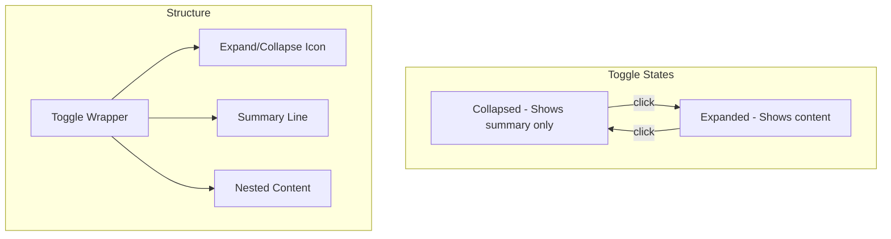

# 27: Toggles

> Collapsible sections for organizing content

**Duration:** 0.5 days  
**Dependencies:** [26-callouts.md](./26-callouts.md)

## Overview

Toggles (also called collapsible sections or details/summary) allow users to hide content that can be expanded on demand. They're useful for FAQs, long explanations, or organizing content without cluttering the document. Like callouts, toggles can contain rich nested content.



## Implementation

### 1. Toggle Extension

```typescript
// packages/editor/src/extensions/toggle/ToggleExtension.ts

import { Node, mergeAttributes } from '@tiptap/core'
import { ReactNodeViewRenderer } from '@tiptap/react'
import { ToggleNodeView } from './ToggleNodeView'

export interface ToggleOptions {
  /** Default expanded state */
  defaultOpen: boolean
}

declare module '@tiptap/core' {
  interface Commands<ReturnType> {
    toggle: {
      /** Insert a toggle */
      setToggle: () => ReturnType
      /** Toggle expanded state */
      toggleExpanded: () => ReturnType
      /** Set summary text */
      setToggleSummary: (summary: string) => ReturnType
    }
  }
}

export const ToggleExtension = Node.create<ToggleOptions>({
  name: 'toggle',

  addOptions() {
    return {
      defaultOpen: true
    }
  },

  group: 'block',

  content: 'block+',

  draggable: true,

  addAttributes() {
    return {
      summary: {
        default: 'Toggle'
      },
      open: {
        default: this.options.defaultOpen
      }
    }
  },

  parseHTML() {
    return [
      {
        tag: 'details'
      }
    ]
  },

  renderHTML({ HTMLAttributes }) {
    return [
      'details',
      mergeAttributes(HTMLAttributes, {
        open: HTMLAttributes.open ? 'open' : null
      }),
      ['summary', HTMLAttributes.summary || 'Toggle'],
      ['div', 0]
    ]
  },

  addNodeView() {
    return ReactNodeViewRenderer(ToggleNodeView)
  },

  addCommands() {
    return {
      setToggle:
        () =>
        ({ commands, state }) => {
          const { from, to } = state.selection
          const content = state.doc.slice(from, to)

          return commands.insertContent({
            type: this.name,
            attrs: { summary: 'Toggle', open: true },
            content: content.content.toJSON() || [{ type: 'paragraph' }]
          })
        },

      toggleExpanded:
        () =>
        ({ commands, state }) => {
          const { $anchor } = state.selection
          let depth = $anchor.depth

          while (depth > 0) {
            const node = $anchor.node(depth)
            if (node.type.name === this.name) {
              return commands.updateAttributes(this.name, { open: !node.attrs.open })
            }
            depth--
          }

          return false
        },

      setToggleSummary:
        (summary) =>
        ({ commands }) => {
          return commands.updateAttributes(this.name, { summary })
        }
    }
  },

  addKeyboardShortcuts() {
    return {
      // Enter on summary line should toggle and move into content
      Enter: ({ editor }) => {
        // Let default behavior handle most cases
        return false
      },
      // Backspace at start of toggle content should not delete the toggle
      Backspace: ({ editor }) => {
        const { selection } = editor.state
        const { $anchor } = selection
        const isAtStart = $anchor.parentOffset === 0

        if (!isAtStart) return false

        // Check if we're at the start of toggle content
        let depth = $anchor.depth
        while (depth > 0) {
          const node = $anchor.node(depth)
          if (node.type.name === this.name) {
            // Don't delete the toggle, just let normal backspace behavior
            return false
          }
          depth--
        }

        return false
      }
    }
  }
})
```

### 2. Toggle NodeView

```tsx
// packages/editor/src/extensions/toggle/ToggleNodeView.tsx

import * as React from 'react'
import { NodeViewWrapper, NodeViewContent, type NodeViewProps } from '@tiptap/react'
import { cn } from '@xnet/ui/lib/utils'
import { ChevronRight, ChevronDown } from 'lucide-react'

export function ToggleNodeView({ node, updateAttributes, selected }: NodeViewProps) {
  const { summary, open } = node.attrs
  const [isEditingSummary, setIsEditingSummary] = React.useState(false)
  const summaryInputRef = React.useRef<HTMLInputElement>(null)

  const handleToggle = () => {
    updateAttributes({ open: !open })
  }

  const handleSummaryDoubleClick = (e: React.MouseEvent) => {
    e.stopPropagation()
    setIsEditingSummary(true)
    setTimeout(() => summaryInputRef.current?.focus(), 0)
  }

  const handleSummaryBlur = () => {
    setIsEditingSummary(false)
  }

  const handleSummaryKeyDown = (e: React.KeyboardEvent) => {
    if (e.key === 'Enter') {
      e.preventDefault()
      setIsEditingSummary(false)
    }
    if (e.key === 'Escape') {
      setIsEditingSummary(false)
    }
  }

  return (
    <NodeViewWrapper>
      <div
        className={cn(
          'my-2 rounded-lg',
          'border border-gray-200 dark:border-gray-700',
          'bg-white dark:bg-gray-900',
          selected && 'ring-2 ring-blue-500 ring-offset-2'
        )}
        data-drag-handle
      >
        {/* Summary (header) */}
        <div
          className={cn(
            'flex items-center gap-2 px-3 py-2',
            'cursor-pointer select-none',
            'hover:bg-gray-50 dark:hover:bg-gray-800',
            'rounded-t-lg',
            !open && 'rounded-b-lg'
          )}
          onClick={handleToggle}
        >
          {/* Expand/collapse icon */}
          <span
            className={cn(
              'flex-shrink-0 text-gray-400',
              'transition-transform duration-200',
              open && 'rotate-0'
            )}
          >
            {open ? <ChevronDown className="w-4 h-4" /> : <ChevronRight className="w-4 h-4" />}
          </span>

          {/* Summary text */}
          {isEditingSummary ? (
            <input
              ref={summaryInputRef}
              type="text"
              value={summary}
              onChange={(e) => updateAttributes({ summary: e.target.value })}
              onBlur={handleSummaryBlur}
              onKeyDown={handleSummaryKeyDown}
              onClick={(e) => e.stopPropagation()}
              className={cn(
                'flex-1 px-1 py-0.5 rounded',
                'bg-gray-100 dark:bg-gray-700',
                'border-none outline-none',
                'text-sm font-medium'
              )}
              placeholder="Toggle title"
            />
          ) : (
            <span
              className="flex-1 text-sm font-medium text-gray-700 dark:text-gray-300"
              onDoubleClick={handleSummaryDoubleClick}
            >
              {summary || 'Toggle'}
            </span>
          )}
        </div>

        {/* Content (collapsible) */}
        <div
          className={cn(
            'overflow-hidden transition-all duration-200',
            open ? 'max-h-[2000px] opacity-100' : 'max-h-0 opacity-0'
          )}
        >
          <div className={cn('px-3 pb-3 pl-9', 'border-t border-gray-100 dark:border-gray-800')}>
            <NodeViewContent className="prose prose-sm dark:prose-invert pt-2" />
          </div>
        </div>
      </div>
    </NodeViewWrapper>
  )
}
```

### 3. Toggle List Extension

For multiple toggles in sequence (like an FAQ):

```typescript
// packages/editor/src/extensions/toggle/ToggleListExtension.ts

import { Node } from '@tiptap/core'

/**
 * ToggleList - A container for multiple toggles, rendered without gaps
 */
export const ToggleListExtension = Node.create({
  name: 'toggleList',

  group: 'block',

  content: 'toggle+',

  parseHTML() {
    return [
      {
        tag: 'div[data-toggle-list]'
      }
    ]
  },

  renderHTML({ HTMLAttributes }) {
    return ['div', { ...HTMLAttributes, 'data-toggle-list': '' }, 0]
  }
})
```

### 4. Slash Commands

```typescript
// Add to COMMAND_GROUPS in slash-command/items.ts:

{
  id: 'toggle',
  title: 'Toggle',
  description: 'Collapsible section',
  icon: '▶️',
  searchTerms: ['toggle', 'collapse', 'expand', 'details', 'summary', 'accordion'],
  command: ({ editor, range }) => {
    editor.chain().focus().deleteRange(range).setToggle().run()
  }
},
{
  id: 'toggle-list',
  title: 'Toggle List',
  description: 'Multiple collapsible sections (FAQ style)',
  icon: '📋',
  searchTerms: ['toggle', 'faq', 'accordion', 'questions'],
  command: ({ editor, range }) => {
    editor.chain().focus().deleteRange(range).insertContent({
      type: 'toggleList',
      content: [
        {
          type: 'toggle',
          attrs: { summary: 'First item', open: false },
          content: [{ type: 'paragraph' }]
        },
        {
          type: 'toggle',
          attrs: { summary: 'Second item', open: false },
          content: [{ type: 'paragraph' }]
        }
      ]
    }).run()
  }
}
```

### 5. Markdown Syntax Support

```typescript
// packages/editor/src/extensions/toggle/ToggleInputRule.ts

import { InputRule } from '@tiptap/core'

/**
 * Input rule for creating toggles:
 * > [toggle] Summary text
 *
 * Or HTML-style:
 * <details>
 */
export function toggleInputRule(type: string) {
  return new InputRule({
    find: /^>\s?\[toggle\]\s?(.*)$/,
    handler: ({ state, range, match }) => {
      const summary = match[1] || 'Toggle'

      const { tr } = state
      const node = state.schema.nodes.toggle.create(
        { summary, open: true },
        state.schema.nodes.paragraph.create()
      )

      tr.replaceWith(range.from, range.to, node)

      return tr
    }
  })
}
```

### 6. Styles

```css
/* packages/editor/src/styles/toggle.css */

/* Smooth expand/collapse animation */
.toggle-content {
  display: grid;
  grid-template-rows: 0fr;
  transition: grid-template-rows 200ms ease-out;
}

.toggle-content[data-open='true'] {
  grid-template-rows: 1fr;
}

.toggle-content > div {
  overflow: hidden;
}

/* Nested toggles */
.toggle .toggle {
  margin-left: 0;
  border-left: 2px solid var(--xnet-border);
}
```

## Tests

```typescript
// packages/editor/src/extensions/toggle/ToggleExtension.test.ts

import { describe, it, expect, beforeEach, afterEach } from 'vitest'
import { Editor } from '@tiptap/core'
import StarterKit from '@tiptap/starter-kit'
import { ToggleExtension } from './ToggleExtension'

describe('ToggleExtension', () => {
  let editor: Editor

  beforeEach(() => {
    editor = new Editor({
      extensions: [StarterKit, ToggleExtension],
      content: '<p>Hello world</p>'
    })
  })

  afterEach(() => {
    editor.destroy()
  })

  describe('setToggle command', () => {
    it('should insert a toggle', () => {
      editor.commands.setToggle()

      const json = editor.getJSON()
      const toggle = json.content?.find((n) => n.type === 'toggle')
      expect(toggle).toBeDefined()
    })

    it('should default to open state', () => {
      editor.commands.setToggle()

      const json = editor.getJSON()
      const toggle = json.content?.find((n) => n.type === 'toggle')
      expect(toggle?.attrs?.open).toBe(true)
    })

    it('should have default summary', () => {
      editor.commands.setToggle()

      const json = editor.getJSON()
      const toggle = json.content?.find((n) => n.type === 'toggle')
      expect(toggle?.attrs?.summary).toBe('Toggle')
    })
  })

  describe('toggleExpanded command', () => {
    it('should toggle open state', () => {
      editor.commands.setToggle()

      let json = editor.getJSON()
      let toggle = json.content?.find((n) => n.type === 'toggle')
      expect(toggle?.attrs?.open).toBe(true)

      // Move cursor into toggle and toggle it
      editor.commands.focus()
      editor.commands.toggleExpanded()

      json = editor.getJSON()
      toggle = json.content?.find((n) => n.type === 'toggle')
      expect(toggle?.attrs?.open).toBe(false)
    })
  })

  describe('setToggleSummary command', () => {
    it('should update summary', () => {
      editor.commands.setToggle()
      editor.commands.setToggleSummary('New Summary')

      const json = editor.getJSON()
      const toggle = json.content?.find((n) => n.type === 'toggle')
      expect(toggle?.attrs?.summary).toBe('New Summary')
    })
  })

  describe('parseHTML', () => {
    it('should parse details element', () => {
      const editor = new Editor({
        extensions: [StarterKit, ToggleExtension],
        content: '<details><summary>Test</summary><p>Content</p></details>'
      })

      const json = editor.getJSON()
      expect(json.content?.some((n) => n.type === 'toggle')).toBe(true)

      editor.destroy()
    })
  })
})
```

```tsx
// packages/editor/src/extensions/toggle/ToggleNodeView.test.tsx

import * as React from 'react'
import { describe, it, expect, vi } from 'vitest'
import { render, screen, fireEvent } from '@testing-library/react'
import { ToggleNodeView } from './ToggleNodeView'

describe('ToggleNodeView', () => {
  const defaultProps = {
    node: {
      attrs: {
        summary: 'Test Toggle',
        open: true
      }
    },
    updateAttributes: vi.fn(),
    selected: false
  }

  it('should display summary text', () => {
    render(<ToggleNodeView {...(defaultProps as any)} />)

    expect(screen.getByText('Test Toggle')).toBeInTheDocument()
  })

  it('should toggle on click', () => {
    const updateAttributes = vi.fn()
    render(<ToggleNodeView {...(defaultProps as any)} updateAttributes={updateAttributes} />)

    fireEvent.click(screen.getByText('Test Toggle'))

    expect(updateAttributes).toHaveBeenCalledWith({ open: false })
  })

  it('should show chevron down when open', () => {
    render(<ToggleNodeView {...(defaultProps as any)} />)

    // ChevronDown should be visible
    const svg = document.querySelector('svg')
    expect(svg).toBeInTheDocument()
  })

  it('should show chevron right when closed', () => {
    render(
      <ToggleNodeView
        {...(defaultProps as any)}
        node={{ attrs: { summary: 'Test', open: false } }}
      />
    )

    // ChevronRight should be visible
    const svg = document.querySelector('svg')
    expect(svg).toBeInTheDocument()
  })
})
```

## Checklist

- [ ] Create ToggleExtension
- [ ] Build ToggleNodeView
- [ ] Add expand/collapse animation
- [ ] Support summary editing
- [ ] Create ToggleList for FAQ-style
- [ ] Add toggle to slash commands
- [ ] Support markdown/HTML syntax
- [ ] Handle keyboard navigation
- [ ] Support nested toggles
- [ ] Write tests
- [ ] Tests pass

---

[Back to README](./README.md) | [Previous: Callouts](./26-callouts.md)
