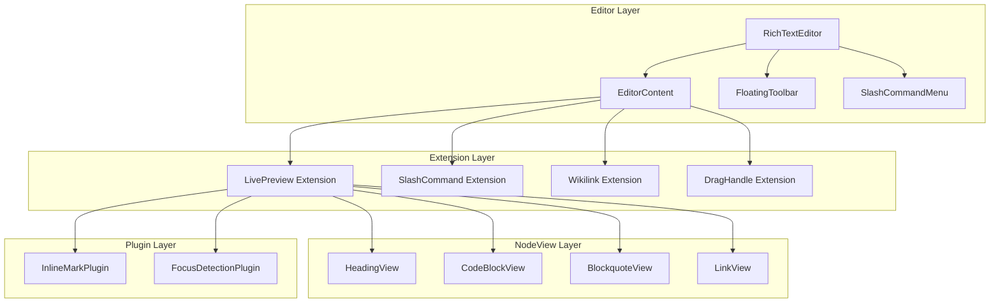

# xNet Implementation Plan - Step 03.3: Obsidian-Style Rich Text Editor

> A polished, local-first editor with live markdown preview and Notion-style UI

## Executive Summary

This plan transforms xNet's TipTap editor into a world-class writing experience inspired by Obsidian's live preview and Notion's interaction design. The key insight: **show markdown syntax only when editing, with smooth transitions and careful attention to micro-interactions**.

**The Goal:**

- When cursor is on a heading line: `## My Heading` (syntax visible but faded)
- When cursor is elsewhere: `My Heading` (just the styled heading)
- Same for inline: `**bold**` visible when editing, rendered bold otherwise

## Design Principles

| Principle              | Implementation                                           |
| ---------------------- | -------------------------------------------------------- |
| **Show, don't hide**   | Syntax visible on focus, not mysteriously appearing      |
| **No layout shift**    | Text position stays stable when showing/hiding syntax    |
| **Smooth transitions** | CSS opacity/transforms, never jarring                    |
| **Keyboard-first**     | Full editing without touching the mouse                  |
| **Tailwind-native**    | All styling via Tailwind classes, no external CSS        |
| **Mobile-aware**       | Touch-friendly toolbar, proper virtual keyboard handling |

## Architecture Overview



## Current State

| Feature                   | Current                       | Target                             |
| ------------------------- | ----------------------------- | ---------------------------------- |
| Basic formatting          | Working (StarterKit)          | Enhanced with syntax preview       |
| Inline marks (`**bold**`) | Shows `**` when cursor inside | Faded syntax, smooth transitions   |
| Headings                  | Rendered, no syntax           | `##` visible when editing line     |
| Code blocks               | Rendered, no fences           | ``` visible when focused           |
| Links                     | Rendered only                 | `[text](url)` visible when editing |
| Slash commands            | None                          | Full command palette               |
| Bubble menu               | Basic                         | Polished with animations           |
| Drag handles              | None                          | Block reordering                   |
| Mobile toolbar            | Basic fixed bar               | Enhanced with more actions         |
| Images                    | None                          | Upload, paste, resize, alignment   |
| File attachments          | None                          | Upload, preview, download          |
| Embeds                    | None                          | YouTube, Spotify, Twitter, Figma   |
| Database views            | None                          | Inline table/board from xNet DB    |
| Callouts                  | None                          | Info/warning/tip boxes             |
| Toggles                   | None                          | Collapsible sections               |

## Implementation Phases

### Phase 1: Tailwind Foundation & Polish (Week 1)

| Task | Document                                       | Status |
| ---- | ---------------------------------------------- | ------ |
| 1.1  | [01-tailwind-setup.md](./01-tailwind-setup.md) | [x]    |
| 1.2  | [02-editor-styles.md](./02-editor-styles.md)   | [x]    |
| 1.3  | [03-toolbar-polish.md](./03-toolbar-polish.md) | [ ]    |

**Validation Gate:**

- [x] Editor uses Tailwind classes throughout
- [x] Prose typography applied correctly
- [ ] Bubble menu has smooth appear/disappear animation
- [x] Dark mode works correctly
- [x] Tests pass

### Phase 2: Inline Live Preview (Week 1-2)

| Task | Document                                                 | Status |
| ---- | -------------------------------------------------------- | ------ |
| 2.1  | [04-inline-marks-plugin.md](./04-inline-marks-plugin.md) | [x]    |
| 2.2  | [05-syntax-styling.md](./05-syntax-styling.md)           | [x]    |
| 2.3  | [06-link-preview.md](./06-link-preview.md)               | [x]    |

**Validation Gate:**

- [x] `**`, `*`, `` ` ``, `~~` show when cursor in/adjacent to mark
- [x] Syntax characters are visually faded
- [x] Smooth opacity transition (150ms)
- [x] No layout shift when syntax appears/disappears
- [x] Link syntax visible when editing

### Phase 3: Block-Level NodeViews (Week 2-3)

| Task | Document                                                 | Status |
| ---- | -------------------------------------------------------- | ------ |
| 3.1  | [07-heading-nodeview.md](./07-heading-nodeview.md)       | [x]    |
| 3.2  | [08-codeblock-nodeview.md](./08-codeblock-nodeview.md)   | [x]    |
| 3.3  | [09-blockquote-nodeview.md](./09-blockquote-nodeview.md) | [x]    |
| 3.4  | [10-focus-detection.md](./10-focus-detection.md)         | [x]    |

**Validation Gate:**

- [x] Heading shows `#` characters when cursor on line
- [x] Code block shows ``` and language when focused
- [x] Blockquote shows `>` when editing
- [x] Focus detection works for all block types
- [x] Keyboard navigation maintains focus state

### Phase 4: Slash Commands (Week 3)

| Task | Document                                         | Status |
| ---- | ------------------------------------------------ | ------ |
| 4.1  | [11-slash-extension.md](./11-slash-extension.md) | [x]    |
| 4.2  | [12-command-menu.md](./12-command-menu.md)       | [x]    |
| 4.3  | [13-command-items.md](./13-command-items.md)     | [x]    |

**Validation Gate:**

- [x] `/` triggers command menu
- [x] Typing filters commands
- [x] Arrow keys navigate, Enter selects
- [x] Escape closes menu
- [x] Menu positioned correctly (bottom-start of cursor)
- [x] Smooth appear animation

### Phase 5: Drag & Drop (Week 4)

| Task | Document                                       | Status |
| ---- | ---------------------------------------------- | ------ |
| 5.1  | [14-drag-handle.md](./14-drag-handle.md)       | [x]    |
| 5.2  | [15-block-dnd.md](./15-block-dnd.md)           | [x]    |
| 5.3  | [16-drop-indicator.md](./16-drop-indicator.md) | [x]    |

**Validation Gate:**

- [x] Drag handle appears on hover
- [x] Blocks can be dragged and reordered
- [x] Drop indicator shows target position
- [x] Works with all block types
- [x] Touch-friendly on mobile

### Phase 6: Integration & Polish (Week 4-5)

| Task | Document                                               | Status |
| ---- | ------------------------------------------------------ | ------ |
| 6.1  | [17-keyboard-shortcuts.md](./17-keyboard-shortcuts.md) | [x]    |
| 6.2  | [18-mobile-toolbar.md](./18-mobile-toolbar.md)         | [x]    |
| 6.3  | [19-accessibility.md](./19-accessibility.md)           | [x]    |
| 6.4  | [20-performance.md](./20-performance.md)               | [x]    |

**Validation Gate:**

- [x] All keyboard shortcuts work
- [x] Mobile toolbar has all needed actions
- [x] Screen readers can navigate content
- [x] Editor handles 10k+ words without lag
- [x] Full test coverage

### Phase 7: Media & Rich Blocks (Week 5-6)

| Task | Document                                                 | Status |
| ---- | -------------------------------------------------------- | ------ |
| 7.1  | [21-blob-infrastructure.md](./21-blob-infrastructure.md) | [x]    |
| 7.2  | [22-image-upload.md](./22-image-upload.md)               | [x]    |
| 7.3  | [23-file-attachments.md](./23-file-attachments.md)       | [ ]    |
| 7.4  | [24-media-embeds.md](./24-media-embeds.md)               | [ ]    |
| 7.5  | [25-database-embed.md](./25-database-embed.md)           | [ ]    |
| 7.6  | [26-callouts.md](./26-callouts.md)                       | [x]    |
| 7.7  | [27-toggles.md](./27-toggles.md)                         | [x]    |

**Validation Gate:**

- [x] BlobService handles upload, retrieval, and chunking
- [x] Images can be pasted, dropped, and resized
- [ ] File attachments show preview and download
- [ ] YouTube, Spotify, Twitter embeds work
- [ ] Database views render inline with live data
- [x] Callouts support info/warning/tip types
- [x] Toggles expand/collapse smoothly
- [ ] All media syncs via eager blob sync

## Package Structure

```
packages/editor/
├── src/
│   ├── extensions/
│   │   ├── live-preview/        # LivePreview extension + plugins
│   │   ├── slash-command/       # SlashCommand extension
│   │   ├── drag-handle/         # DragHandle extension
│   │   ├── image/               # Image upload, resize, alignment
│   │   ├── file/                # File attachments
│   │   ├── embed/               # External media embeds
│   │   ├── database-embed/      # Inline xNet database views
│   │   ├── callout/             # Info/warning/tip boxes
│   │   ├── toggle/              # Collapsible sections
│   │   └── wikilink.ts          # Existing
│   ├── nodeviews/
│   │   ├── HeadingView.tsx      # Heading with ## syntax
│   │   ├── CodeBlockView.tsx    # Code block with fences
│   │   ├── BlockquoteView.tsx   # Blockquote with >
│   │   └── hooks/               # useNodeFocus, etc.
│   ├── components/
│   │   ├── RichTextEditor.tsx   # Main component
│   │   ├── FloatingToolbar.tsx  # Enhanced
│   │   ├── BubbleMenu/          # Bubble menu components
│   │   ├── SlashMenu/           # Command palette
│   │   ├── DragHandle/          # Drag handle + drop indicator
│   │   └── MobileToolbar/       # Mobile toolbar
│   ├── context/
│   │   └── BlobContext.tsx      # Blob service provider
│   ├── styles/
│   │   └── editor.css           # Minimal CSS (mostly Tailwind)
│   └── utils/
├── tailwind.config.js
└── package.json

packages/storage/
├── src/
│   ├── blob-store.ts            # BlobStore (ContentResolver impl)
│   ├── chunk-manager.ts         # Large file chunking with Merkle trees
│   └── ...

packages/data/
├── src/
│   ├── blob/
│   │   └── blob-service.ts      # High-level file upload/download
│   └── ...
```

## Dependencies

| Package                   | Version | Purpose             |
| ------------------------- | ------- | ------------------- |
| `@tiptap/core`            | ^3.15   | Editor core         |
| `@tiptap/react`           | ^3.15   | React bindings      |
| `@tiptap/suggestion`      | ^3.15   | Slash commands      |
| `tippy.js`                | ^6.3    | Tooltip positioning |
| `@tailwindcss/typography` | ^0.5    | Prose classes       |
| `tailwind-merge`          | ^2.0    | Class merging       |

## Success Criteria

1. **Live preview works** - Syntax visible when editing, hidden otherwise
2. **No layout shift** - Text stays stable when showing/hiding syntax
3. **Smooth transitions** - All show/hide uses CSS transitions
4. **Slash commands** - Full command palette with filtering
5. **Polished bubble menu** - Animated, well-designed
6. **Mobile friendly** - Touch toolbar works well
7. **Tailwind throughout** - No external CSS dependencies
8. **Tests pass** - >80% coverage on new code
9. **Performance** - 60fps during editing, <100ms for large docs
10. **Media support** - Images, files, and embeds work seamlessly
11. **Database embeds** - Live xNet database views in documents
12. **Rich blocks** - Callouts and toggles for content organization

## Reference Documents

- [EDITOR_REDESIGN_RESEARCH.md](../EDITOR_REDESIGN_RESEARCH.md) - Initial research
- [Novel.sh](https://github.com/steven-tey/novel) - Notion-style TipTap implementation
- [TipTap Documentation](https://tiptap.dev/docs) - Official docs

---

[Back to Main Plan](../plan/README.md) | [Start Implementation](./01-tailwind-setup.md)
