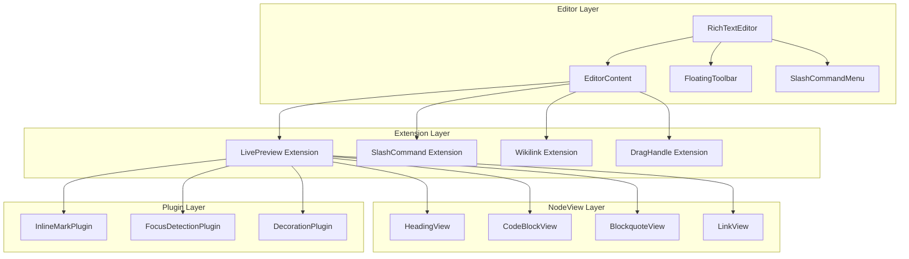

# xNet Implementation Plan - Step 03.3: Obsidian-Style Rich Text Editor

> A polished, local-first editor with live markdown preview and Notion-style UI

## Executive Summary

This plan transforms xNet's TipTap editor into a world-class writing experience inspired by Obsidian's live preview and Notion's interaction design. The key insight: **show markdown syntax only when editing, with smooth transitions and careful attention to micro-interactions**.

```typescript
// The goal: Obsidian-style live preview
// When cursor is on a heading line:
## My Heading    // "##" visible but faded

// When cursor is elsewhere:
My Heading       // Just the styled heading, no syntax

// Same for inline formatting:
Some **bold** text   // Stars visible when cursor adjacent
Some bold text       // Rendered bold when cursor elsewhere
```

## Design Principles

| Principle              | Implementation                                           |
| ---------------------- | -------------------------------------------------------- |
| **Show, don't hide**   | Syntax visible on focus, not mysteriously appearing      |
| **No layout shift**    | Text position stays stable when showing/hiding syntax    |
| **Smooth transitions** | CSS opacity/transforms, never jarring                    |
| **Keyboard-first**     | Full editing without touching the mouse                  |
| **Tailwind-native**    | All styling via Tailwind classes, no external CSS        |
| **Mobile-aware**       | Touch-friendly toolbar, proper virtual keyboard handling |

## Architecture Overview



## Current State

The `@xnet/editor` package has basic functionality:

| Feature                   | Current State                 | Target State                       |
| ------------------------- | ----------------------------- | ---------------------------------- |
| Basic formatting          | Working (StarterKit)          | Enhanced with syntax preview       |
| Inline marks (`**bold**`) | Shows `**` when cursor inside | Faded syntax, smooth transitions   |
| Headings                  | Rendered, no syntax shown     | `##` visible when editing line     |
| Code blocks               | Rendered, no fences           | ``` visible when focused           |
| Links                     | Rendered only                 | `[text](url)` visible when editing |
| Slash commands            | None                          | Full command palette               |
| Bubble menu               | Basic                         | Polished with animations           |
| Drag handles              | None                          | Block reordering                   |
| Mobile toolbar            | Basic fixed bar               | Enhanced with more actions         |

## Implementation Phases

### Phase 1: Tailwind Foundation & Polish (Week 1)

| Task | Document                                       | Description                            |
| ---- | ---------------------------------------------- | -------------------------------------- |
| 1.1  | [01-tailwind-setup.md](./01-tailwind-setup.md) | Configure Tailwind for editor package  |
| 1.2  | [02-editor-styles.md](./02-editor-styles.md)   | Base editor styling with prose classes |
| 1.3  | [03-toolbar-polish.md](./03-toolbar-polish.md) | Enhanced bubble menu with animations   |

**Validation Gate:**

- [ ] Editor uses Tailwind classes throughout
- [ ] Prose typography applied correctly
- [ ] Bubble menu has smooth appear/disappear animation
- [ ] Dark mode works correctly
- [ ] Tests pass

### Phase 2: Inline Live Preview (Week 1-2)

| Task | Document                                                 | Description                              |
| ---- | -------------------------------------------------------- | ---------------------------------------- |
| 2.1  | [04-inline-marks-plugin.md](./04-inline-marks-plugin.md) | Decoration plugin for bold, italic, code |
| 2.2  | [05-syntax-styling.md](./05-syntax-styling.md)           | Faded syntax with Tailwind               |
| 2.3  | [06-link-preview.md](./06-link-preview.md)               | Show `[text](url)` when editing links    |

**Validation Gate:**

- [ ] `**`, `*`, `` ` ``, `~~` show when cursor in/adjacent to mark
- [ ] Syntax characters are visually faded
- [ ] Smooth opacity transition (150ms)
- [ ] No layout shift when syntax appears/disappears
- [ ] Link syntax visible when editing

### Phase 3: Block-Level NodeViews (Week 2-3)

| Task | Document                                                 | Description                       |
| ---- | -------------------------------------------------------- | --------------------------------- |
| 3.1  | [07-heading-nodeview.md](./07-heading-nodeview.md)       | `##` visible when heading focused |
| 3.2  | [08-codeblock-nodeview.md](./08-codeblock-nodeview.md)   | ``` fences visible when focused   |
| 3.3  | [09-blockquote-nodeview.md](./09-blockquote-nodeview.md) | `>` visible when editing          |
| 3.4  | [10-focus-detection.md](./10-focus-detection.md)         | Reliable block focus tracking     |

**Validation Gate:**

- [ ] Heading shows `#` characters when cursor on line
- [ ] Code block shows ``` and language when focused
- [ ] Blockquote shows `>` when editing
- [ ] Focus detection works for all block types
- [ ] Keyboard navigation maintains focus state

### Phase 4: Slash Commands (Week 3)

| Task | Document                                         | Description                      |
| ---- | ------------------------------------------------ | -------------------------------- |
| 4.1  | [11-slash-extension.md](./11-slash-extension.md) | Suggestion-based command trigger |
| 4.2  | [12-command-menu.md](./12-command-menu.md)       | Command palette UI component     |
| 4.3  | [13-command-items.md](./13-command-items.md)     | Full command list with icons     |

**Validation Gate:**

- [ ] `/` triggers command menu
- [ ] Typing filters commands
- [ ] Arrow keys navigate, Enter selects
- [ ] Escape closes menu
- [ ] Menu positioned correctly (bottom-start of cursor)
- [ ] Smooth appear animation

### Phase 5: Drag & Drop (Week 4)

| Task | Document                                       | Description                   |
| ---- | ---------------------------------------------- | ----------------------------- |
| 5.1  | [14-drag-handle.md](./14-drag-handle.md)       | Handle appears on block hover |
| 5.2  | [15-block-dnd.md](./15-block-dnd.md)           | Drag blocks to reorder        |
| 5.3  | [16-drop-indicator.md](./16-drop-indicator.md) | Visual feedback during drag   |

**Validation Gate:**

- [ ] Drag handle appears on hover
- [ ] Blocks can be dragged and reordered
- [ ] Drop indicator shows target position
- [ ] Works with all block types
- [ ] Touch-friendly on mobile

### Phase 6: Integration & Polish (Week 4-5)

| Task | Document                                               | Description                        |
| ---- | ------------------------------------------------------ | ---------------------------------- |
| 6.1  | [17-keyboard-shortcuts.md](./17-keyboard-shortcuts.md) | Comprehensive keyboard support     |
| 6.2  | [18-mobile-toolbar.md](./18-mobile-toolbar.md)         | Enhanced mobile experience         |
| 6.3  | [19-accessibility.md](./19-accessibility.md)           | ARIA labels, screen reader support |
| 6.4  | [20-performance.md](./20-performance.md)               | Optimization and benchmarks        |

**Validation Gate:**

- [ ] All keyboard shortcuts work
- [ ] Mobile toolbar has all needed actions
- [ ] Screen readers can navigate content
- [ ] Editor handles 10k+ words without lag
- [ ] Full test coverage

## Package Structure

```
packages/editor/
├── src/
│   ├── index.ts
│   ├── react.ts                    # React exports
│   ├── extensions.ts               # Extension exports
│   │
│   ├── extensions/
│   │   ├── index.ts
│   │   ├── live-preview/
│   │   │   ├── index.ts            # LivePreview extension
│   │   │   ├── inline-marks.ts     # Decoration plugin for marks
│   │   │   ├── focus-tracker.ts    # Track focused block
│   │   │   └── syntax.ts           # Mark-to-syntax mapping
│   │   ├── slash-command/
│   │   │   ├── index.ts            # SlashCommand extension
│   │   │   ├── suggestion.ts       # Suggestion plugin config
│   │   │   └── items.ts            # Command definitions
│   │   ├── drag-handle/
│   │   │   ├── index.ts            # DragHandle extension
│   │   │   └── handle.ts           # Handle positioning
│   │   └── wikilink.ts             # Existing wikilink
│   │
│   ├── nodeviews/
│   │   ├── index.ts
│   │   ├── HeadingView.tsx         # Heading with ## syntax
│   │   ├── CodeBlockView.tsx       # Code block with fences
│   │   ├── BlockquoteView.tsx      # Blockquote with >
│   │   ├── LinkView.tsx            # Link with [](url) syntax
│   │   └── hooks/
│   │       ├── useNodeFocus.ts     # Focus state for nodeview
│   │       └── useNodeAttributes.ts
│   │
│   ├── components/
│   │   ├── RichTextEditor.tsx      # Main component
│   │   ├── FloatingToolbar.tsx     # Existing, enhanced
│   │   ├── BubbleMenu/
│   │   │   ├── index.tsx           # Container
│   │   │   ├── TextButtons.tsx     # Bold, italic, etc.
│   │   │   ├── NodeSelector.tsx    # Heading, list, etc.
│   │   │   └── LinkEditor.tsx      # Link editing popover
│   │   ├── SlashMenu/
│   │   │   ├── index.tsx           # Command palette
│   │   │   ├── CommandItem.tsx     # Single command
│   │   │   └── CommandGroup.tsx    # Command category
│   │   ├── DragHandle/
│   │   │   ├── index.tsx           # Handle component
│   │   │   └── DropIndicator.tsx   # Drop target line
│   │   └── MobileToolbar/
│   │       ├── index.tsx           # Fixed bottom bar
│   │       └── ActionButton.tsx    # Toolbar button
│   │
│   ├── styles/
│   │   └── editor.css              # Minimal CSS (mostly Tailwind)
│   │
│   └── utils/
│       ├── cn.ts                   # clsx + tailwind-merge
│       ├── focus.ts                # Focus utilities
│       └── position.ts             # Positioning helpers
│
├── package.json
├── tailwind.config.js
└── tsconfig.json
```

## Key Types

````typescript
// ============================================
// Live Preview Configuration
// ============================================

interface LivePreviewOptions {
  /** Which marks to show syntax for */
  marks?: ('bold' | 'italic' | 'strike' | 'code')[]

  /** Whether to show block-level syntax (##, ```, >) */
  blocks?: boolean

  /** Transition duration in ms */
  transitionDuration?: number

  /** Syntax opacity when visible (0-1) */
  syntaxOpacity?: number
}

/** Mapping of marks to their syntax characters */
interface MarkSyntax {
  open: string
  close: string
}

const MARK_SYNTAX: Record<string, MarkSyntax> = {
  bold: { open: '**', close: '**' },
  italic: { open: '*', close: '*' },
  strike: { open: '~~', close: '~~' },
  code: { open: '`', close: '`' }
}

// ============================================
// Slash Command Types
// ============================================

interface SlashCommandItem {
  title: string
  description: string
  icon: React.ComponentType<{ className?: string }>
  searchTerms?: string[]
  command: (props: { editor: Editor; range: Range }) => void
}

interface SlashCommandGroup {
  name: string
  items: SlashCommandItem[]
}

// ============================================
// NodeView Props
// ============================================

interface HeadingViewProps {
  node: ProseMirrorNode
  editor: Editor
  getPos: () => number
  updateAttributes: (attrs: Record<string, unknown>) => void
}

interface CodeBlockViewProps extends HeadingViewProps {
  // Additional: language selection
}
````

## Core Implementation Details

### 1. Inline Marks Plugin

The heart of live preview for inline formatting:

```typescript
// packages/editor/src/extensions/live-preview/inline-marks.ts

import { Plugin, PluginKey } from '@tiptap/pm/state'
import { Decoration, DecorationSet } from '@tiptap/pm/view'
import { MARK_SYNTAX } from './syntax'

export const inlineMarksPluginKey = new PluginKey('inlineMarks')

export function createInlineMarksPlugin(options: LivePreviewOptions) {
  return new Plugin({
    key: inlineMarksPluginKey,

    props: {
      decorations(state) {
        const { doc, selection } = state
        const { $from } = selection

        // Only show syntax when cursor is in text (not range selection)
        if (!selection.empty) return DecorationSet.empty

        const decorations: Decoration[] = []
        const cursorPos = $from.pos

        // Get marks at cursor
        const marks = $from.marks()
        if (marks.length === 0) return DecorationSet.empty

        // Process each mark type once
        const processed = new Set<string>()

        for (const mark of marks) {
          const markType = mark.type.name
          const syntax = MARK_SYNTAX[markType]

          if (!syntax || processed.has(markType)) continue
          if (!options.marks?.includes(markType as any)) continue

          processed.add(markType)

          // Find the extent of this mark around the cursor
          const range = findMarkRange(doc, cursorPos, mark)
          if (!range) continue

          // Add opening syntax widget
          decorations.push(
            Decoration.widget(
              range.from,
              () => {
                const span = document.createElement('span')
                span.className = 'md-syntax md-syntax-open'
                span.textContent = syntax.open
                span.setAttribute('data-mark', markType)
                return span
              },
              { side: -1 }
            )
          )

          // Add closing syntax widget
          decorations.push(
            Decoration.widget(
              range.to,
              () => {
                const span = document.createElement('span')
                span.className = 'md-syntax md-syntax-close'
                span.textContent = syntax.close
                span.setAttribute('data-mark', markType)
                return span
              },
              { side: 1 }
            )
          )
        }

        return DecorationSet.create(doc, decorations)
      }
    }
  })
}

function findMarkRange(
  doc: ProseMirrorNode,
  pos: number,
  mark: Mark
): { from: number; to: number } | null {
  const $pos = doc.resolve(pos)
  const start = $pos.start()
  const end = $pos.end()

  let from = -1
  let to = -1

  doc.nodesBetween(start, end, (node, nodePos) => {
    if (!node.isText) return

    const hasMark = node.marks.some((m) => m.eq(mark))
    if (hasMark) {
      if (from === -1) from = nodePos
      to = nodePos + node.nodeSize
    }
  })

  return from !== -1 ? { from, to } : null
}
```

### 2. Heading NodeView with Tailwind

```typescript
// packages/editor/src/nodeviews/HeadingView.tsx

import { NodeViewWrapper, NodeViewContent, type NodeViewProps } from '@tiptap/react'
import { cn } from '../utils'
import { useNodeFocus } from './hooks/useNodeFocus'

export function HeadingView({ node, editor, getPos }: NodeViewProps) {
  const level = node.attrs.level as 1 | 2 | 3 | 4 | 5 | 6
  const isFocused = useNodeFocus(editor, getPos)

  const prefix = '#'.repeat(level) + ' '

  // Dynamic tag based on level
  const Tag = `h${level}` as const

  return (
    <NodeViewWrapper
      as={Tag}
      className={cn(
        'heading-line group relative',
        // Standard heading styles
        level === 1 && 'text-3xl font-bold mt-8 mb-4',
        level === 2 && 'text-2xl font-semibold mt-6 mb-3',
        level === 3 && 'text-xl font-medium mt-4 mb-2',
        level >= 4 && 'text-lg font-medium mt-3 mb-2'
      )}
    >
      {/* Syntax prefix - shown when focused */}
      <span
        className={cn(
          'heading-syntax select-none pointer-events-none',
          'font-mono font-normal text-muted-foreground/50',
          'transition-all duration-150 ease-out',
          isFocused
            ? 'opacity-100 w-auto mr-1'
            : 'opacity-0 w-0 mr-0 overflow-hidden'
        )}
        contentEditable={false}
        aria-hidden="true"
      >
        {prefix}
      </span>

      {/* Actual heading content */}
      <NodeViewContent as="span" className="outline-none" />
    </NodeViewWrapper>
  )
}
```

### 3. Code Block NodeView

````typescript
// packages/editor/src/nodeviews/CodeBlockView.tsx

import { NodeViewWrapper, NodeViewContent, type NodeViewProps } from '@tiptap/react'
import { cn } from '../utils'
import { useNodeFocus } from './hooks/useNodeFocus'

const LANGUAGES = [
  { id: 'typescript', name: 'TypeScript' },
  { id: 'javascript', name: 'JavaScript' },
  { id: 'python', name: 'Python' },
  { id: 'rust', name: 'Rust' },
  { id: 'go', name: 'Go' },
  { id: 'html', name: 'HTML' },
  { id: 'css', name: 'CSS' },
  { id: 'json', name: 'JSON' },
  { id: 'bash', name: 'Bash' },
  { id: 'sql', name: 'SQL' },
] as const

export function CodeBlockView({ node, editor, getPos, updateAttributes }: NodeViewProps) {
  const isFocused = useNodeFocus(editor, getPos)
  const language = node.attrs.language || 'plaintext'

  return (
    <NodeViewWrapper
      className={cn(
        'code-block-wrapper my-4 rounded-lg',
        'bg-muted/50 border border-border',
        'transition-colors duration-150',
        isFocused && 'ring-2 ring-primary/20'
      )}
    >
      {/* Opening fence - shown when focused */}
      <div
        className={cn(
          'code-fence flex items-center gap-2 px-4 py-2',
          'border-b border-border/50',
          'font-mono text-sm text-muted-foreground/60',
          'transition-all duration-150 ease-out',
          isFocused
            ? 'opacity-100 h-auto'
            : 'opacity-0 h-0 overflow-hidden py-0 border-b-0'
        )}
        contentEditable={false}
      >
        <span>```</span>

        {/* Language selector */}
        <select
          value={language}
          onChange={(e) => updateAttributes({ language: e.target.value })}
          className={cn(
            'bg-transparent text-muted-foreground',
            'border-none outline-none cursor-pointer',
            'hover:text-foreground'
          )}
        >
          <option value="plaintext">Plain text</option>
          {LANGUAGES.map(lang => (
            <option key={lang.id} value={lang.id}>{lang.name}</option>
          ))}
        </select>
      </div>

      {/* Code content */}
      <NodeViewContent
        as="pre"
        className={cn(
          'p-4 overflow-x-auto',
          'font-mono text-sm leading-relaxed',
          '[&>code]:block'
        )}
      />

      {/* Closing fence - shown when focused */}
      <div
        className={cn(
          'code-fence px-4 py-2',
          'border-t border-border/50',
          'font-mono text-sm text-muted-foreground/60',
          'transition-all duration-150 ease-out',
          isFocused
            ? 'opacity-100 h-auto'
            : 'opacity-0 h-0 overflow-hidden py-0 border-t-0'
        )}
        contentEditable={false}
      >
        ```
      </div>
    </NodeViewWrapper>
  )
}
````

### 4. useNodeFocus Hook

```typescript
// packages/editor/src/nodeviews/hooks/useNodeFocus.ts

import { useState, useEffect } from 'react'
import type { Editor } from '@tiptap/react'

/**
 * Hook to track if the cursor is within this node.
 * Updates on every selection change.
 */
export function useNodeFocus(editor: Editor, getPos: () => number): boolean {
  const [isFocused, setIsFocused] = useState(false)

  useEffect(() => {
    const updateFocus = () => {
      const pos = getPos()
      if (typeof pos !== 'number') {
        setIsFocused(false)
        return
      }

      const { from, to } = editor.state.selection
      const nodeSize = editor.state.doc.nodeAt(pos)?.nodeSize ?? 0
      const nodeEnd = pos + nodeSize

      // Check if selection is within this node
      const focused = from >= pos && to <= nodeEnd
      setIsFocused(focused)
    }

    // Update on selection changes
    editor.on('selectionUpdate', updateFocus)

    // Initial check
    updateFocus()

    return () => {
      editor.off('selectionUpdate', updateFocus)
    }
  }, [editor, getPos])

  return isFocused
}
```

### 5. Slash Command Extension

```typescript
// packages/editor/src/extensions/slash-command/index.ts

import { Extension } from '@tiptap/core'
import Suggestion, { type SuggestionOptions } from '@tiptap/suggestion'
import { PluginKey } from '@tiptap/pm/state'
import { ReactRenderer } from '@tiptap/react'
import tippy, { type Instance } from 'tippy.js'
import { SlashMenu } from '../../components/SlashMenu'
import { COMMAND_GROUPS } from './items'

export const slashCommandKey = new PluginKey('slashCommand')

export interface SlashCommandOptions {
  suggestion: Omit<SuggestionOptions, 'editor'>
}

export const SlashCommand = Extension.create<SlashCommandOptions>({
  name: 'slashCommand',

  addOptions() {
    return {
      suggestion: {
        char: '/',
        pluginKey: slashCommandKey,
        allowSpaces: false,

        items: ({ query }) => {
          return COMMAND_GROUPS.flatMap((group) =>
            group.items.filter((item) => {
              const search = query.toLowerCase()
              return (
                item.title.toLowerCase().includes(search) ||
                item.searchTerms?.some((t) => t.includes(search))
              )
            })
          ).slice(0, 10)
        },

        command: ({ editor, range, props }) => {
          props.command({ editor, range })
        },

        render: () => {
          let component: ReactRenderer
          let popup: Instance[]

          return {
            onStart: (props) => {
              component = new ReactRenderer(SlashMenu, {
                props,
                editor: props.editor
              })

              popup = tippy('body', {
                getReferenceClientRect: props.clientRect as () => DOMRect,
                appendTo: () => document.body,
                content: component.element,
                showOnCreate: true,
                interactive: true,
                trigger: 'manual',
                placement: 'bottom-start',
                animation: 'shift-away',
                theme: 'slash-menu'
              })
            },

            onUpdate(props) {
              component.updateProps(props)

              popup[0].setProps({
                getReferenceClientRect: props.clientRect as () => DOMRect
              })
            },

            onKeyDown(props) {
              if (props.event.key === 'Escape') {
                popup[0].hide()
                return true
              }

              return component.ref?.onKeyDown(props) ?? false
            },

            onExit() {
              popup[0].destroy()
              component.destroy()
            }
          }
        }
      }
    }
  },

  addProseMirrorPlugins() {
    return [
      Suggestion({
        editor: this.editor,
        ...this.options.suggestion
      })
    ]
  }
})
```

### 6. Slash Command Items

```typescript
// packages/editor/src/extensions/slash-command/items.ts

import type { Editor } from '@tiptap/core'
import type { Range } from '@tiptap/pm/model'

export interface SlashCommandItem {
  title: string
  description: string
  icon: string // Emoji or icon component
  searchTerms?: string[]
  command: (props: { editor: Editor; range: Range }) => void
}

export interface SlashCommandGroup {
  name: string
  items: SlashCommandItem[]
}

export const COMMAND_GROUPS: SlashCommandGroup[] = [
  {
    name: 'Basic Blocks',
    items: [
      {
        title: 'Text',
        description: 'Plain text paragraph',
        icon: 'Aa',
        searchTerms: ['paragraph', 'p'],
        command: ({ editor, range }) => {
          editor.chain().focus().deleteRange(range).setParagraph().run()
        }
      },
      {
        title: 'Heading 1',
        description: 'Large section heading',
        icon: 'H1',
        searchTerms: ['h1', 'title', 'large'],
        command: ({ editor, range }) => {
          editor.chain().focus().deleteRange(range).setHeading({ level: 1 }).run()
        }
      },
      {
        title: 'Heading 2',
        description: 'Medium section heading',
        icon: 'H2',
        searchTerms: ['h2', 'subtitle'],
        command: ({ editor, range }) => {
          editor.chain().focus().deleteRange(range).setHeading({ level: 2 }).run()
        }
      },
      {
        title: 'Heading 3',
        description: 'Small section heading',
        icon: 'H3',
        searchTerms: ['h3', 'subheading'],
        command: ({ editor, range }) => {
          editor.chain().focus().deleteRange(range).setHeading({ level: 3 }).run()
        }
      }
    ]
  },
  {
    name: 'Lists',
    items: [
      {
        title: 'Bullet List',
        description: 'Unordered list with bullets',
        icon: '•',
        searchTerms: ['ul', 'unordered', 'bullets'],
        command: ({ editor, range }) => {
          editor.chain().focus().deleteRange(range).toggleBulletList().run()
        }
      },
      {
        title: 'Numbered List',
        description: 'Ordered list with numbers',
        icon: '1.',
        searchTerms: ['ol', 'ordered', 'numbers'],
        command: ({ editor, range }) => {
          editor.chain().focus().deleteRange(range).toggleOrderedList().run()
        }
      },
      {
        title: 'Task List',
        description: 'Checklist with checkboxes',
        icon: '[]',
        searchTerms: ['todo', 'checkbox', 'tasks'],
        command: ({ editor, range }) => {
          editor.chain().focus().deleteRange(range).toggleTaskList().run()
        }
      }
    ]
  },
  {
    name: 'Blocks',
    items: [
      {
        title: 'Quote',
        description: 'Blockquote for citations',
        icon: '"',
        searchTerms: ['blockquote', 'citation'],
        command: ({ editor, range }) => {
          editor.chain().focus().deleteRange(range).toggleBlockquote().run()
        }
      },
      {
        title: 'Code Block',
        description: 'Code with syntax highlighting',
        icon: '</>',
        searchTerms: ['code', 'pre', 'snippet'],
        command: ({ editor, range }) => {
          editor.chain().focus().deleteRange(range).toggleCodeBlock().run()
        }
      },
      {
        title: 'Divider',
        description: 'Horizontal line separator',
        icon: '—',
        searchTerms: ['hr', 'horizontal', 'rule', 'line'],
        command: ({ editor, range }) => {
          editor.chain().focus().deleteRange(range).setHorizontalRule().run()
        }
      }
    ]
  }
]
```

### 7. SlashMenu Component

```typescript
// packages/editor/src/components/SlashMenu/index.tsx

import { forwardRef, useEffect, useImperativeHandle, useState } from 'react'
import type { SlashCommandItem } from '../../extensions/slash-command/items'
import { cn } from '../../utils'

interface SlashMenuProps {
  items: SlashCommandItem[]
  command: (item: SlashCommandItem) => void
}

export const SlashMenu = forwardRef<{ onKeyDown: (e: KeyboardEvent) => boolean }, SlashMenuProps>(
  ({ items, command }, ref) => {
    const [selectedIndex, setSelectedIndex] = useState(0)

    // Reset selection when items change
    useEffect(() => {
      setSelectedIndex(0)
    }, [items])

    // Keyboard navigation
    useImperativeHandle(ref, () => ({
      onKeyDown: ({ event }: { event: KeyboardEvent }) => {
        if (event.key === 'ArrowUp') {
          setSelectedIndex((prev) => (prev - 1 + items.length) % items.length)
          return true
        }

        if (event.key === 'ArrowDown') {
          setSelectedIndex((prev) => (prev + 1) % items.length)
          return true
        }

        if (event.key === 'Enter') {
          const item = items[selectedIndex]
          if (item) {
            command(item)
          }
          return true
        }

        return false
      },
    }))

    if (items.length === 0) {
      return (
        <div className={cn(
          'slash-menu z-50 w-72',
          'rounded-lg border border-border bg-background',
          'shadow-lg shadow-black/10',
          'p-2'
        )}>
          <p className="text-sm text-muted-foreground px-2">
            No results found
          </p>
        </div>
      )
    }

    return (
      <div className={cn(
        'slash-menu z-50 w-72 max-h-80 overflow-y-auto',
        'rounded-lg border border-border bg-background',
        'shadow-lg shadow-black/10',
        'p-1'
      )}>
        {items.map((item, index) => (
          <button
            key={item.title}
            onClick={() => command(item)}
            className={cn(
              'flex items-center gap-3 w-full px-2 py-2 rounded-md',
              'text-left text-sm',
              'transition-colors duration-75',
              index === selectedIndex
                ? 'bg-accent text-accent-foreground'
                : 'hover:bg-accent/50'
            )}
          >
            {/* Icon */}
            <span className={cn(
              'flex items-center justify-center',
              'w-10 h-10 rounded-md',
              'bg-muted text-muted-foreground',
              'font-mono text-sm'
            )}>
              {item.icon}
            </span>

            {/* Text */}
            <div className="flex-1 min-w-0">
              <p className="font-medium truncate">{item.title}</p>
              <p className="text-xs text-muted-foreground truncate">
                {item.description}
              </p>
            </div>
          </button>
        ))}
      </div>
    )
  }
)

SlashMenu.displayName = 'SlashMenu'
```

### 8. Enhanced Bubble Menu

```typescript
// packages/editor/src/components/BubbleMenu/index.tsx

import { BubbleMenu as TiptapBubbleMenu } from '@tiptap/react'
import type { Editor } from '@tiptap/react'
import { cn } from '../../utils'
import { TextButtons } from './TextButtons'
import { NodeSelector } from './NodeSelector'
import { LinkEditor } from './LinkEditor'

interface BubbleMenuProps {
  editor: Editor
}

export function BubbleMenu({ editor }: BubbleMenuProps) {
  return (
    <TiptapBubbleMenu
      editor={editor}
      tippyOptions={{
        duration: [200, 150],
        animation: 'shift-away',
        moveTransition: 'transform 0.15s ease-out',
      }}
      shouldShow={({ editor, state }) => {
        // Don't show in code blocks
        if (editor.isActive('codeBlock')) return false

        // Only show with text selection
        const { from, to } = state.selection
        return from !== to
      }}
      className={cn(
        'bubble-menu flex items-center gap-0.5',
        'px-1.5 py-1',
        'rounded-lg border border-border bg-background',
        'shadow-xl shadow-black/10',
        // Animation
        'animate-in fade-in-0 zoom-in-95',
        'data-[state=closed]:animate-out',
        'data-[state=closed]:fade-out-0',
        'data-[state=closed]:zoom-out-95'
      )}
    >
      <NodeSelector editor={editor} />

      <Separator />

      <TextButtons editor={editor} />

      <Separator />

      <LinkEditor editor={editor} />
    </TiptapBubbleMenu>
  )
}

function Separator() {
  return <div className="w-px h-6 bg-border mx-1" />
}
```

### 9. Text Format Buttons

```typescript
// packages/editor/src/components/BubbleMenu/TextButtons.tsx

import type { Editor } from '@tiptap/react'
import { cn } from '../../utils'

interface TextButtonsProps {
  editor: Editor
}

const BUTTONS = [
  {
    name: 'bold',
    label: 'B',
    className: 'font-bold',
    isActive: (e: Editor) => e.isActive('bold'),
    command: (e: Editor) => e.chain().focus().toggleBold().run(),
    shortcut: 'Cmd+B',
  },
  {
    name: 'italic',
    label: 'I',
    className: 'italic',
    isActive: (e: Editor) => e.isActive('italic'),
    command: (e: Editor) => e.chain().focus().toggleItalic().run(),
    shortcut: 'Cmd+I',
  },
  {
    name: 'strike',
    label: 'S',
    className: 'line-through',
    isActive: (e: Editor) => e.isActive('strike'),
    command: (e: Editor) => e.chain().focus().toggleStrike().run(),
    shortcut: 'Cmd+Shift+S',
  },
  {
    name: 'code',
    label: '</>',
    className: 'font-mono text-xs',
    isActive: (e: Editor) => e.isActive('code'),
    command: (e: Editor) => e.chain().focus().toggleCode().run(),
    shortcut: 'Cmd+E',
  },
]

export function TextButtons({ editor }: TextButtonsProps) {
  return (
    <div className="flex items-center">
      {BUTTONS.map((button) => {
        const isActive = button.isActive(editor)

        return (
          <button
            key={button.name}
            onClick={() => button.command(editor)}
            onMouseDown={(e) => e.preventDefault()} // Prevent focus loss
            title={`${button.name} (${button.shortcut})`}
            className={cn(
              'flex items-center justify-center',
              'w-8 h-8 rounded',
              'text-sm transition-colors',
              button.className,
              isActive
                ? 'bg-primary/15 text-primary'
                : 'text-muted-foreground hover:text-foreground hover:bg-accent'
            )}
          >
            {button.label}
          </button>
        )
      })}
    </div>
  )
}
```

## Tailwind Configuration

```typescript
// packages/editor/tailwind.config.js

/** @type {import('tailwindcss').Config} */
export default {
  content: ['./src/**/*.{ts,tsx}'],

  theme: {
    extend: {
      // Use CSS variables for theming
      colors: {
        background: 'hsl(var(--background))',
        foreground: 'hsl(var(--foreground))',
        muted: {
          DEFAULT: 'hsl(var(--muted))',
          foreground: 'hsl(var(--muted-foreground))'
        },
        accent: {
          DEFAULT: 'hsl(var(--accent))',
          foreground: 'hsl(var(--accent-foreground))'
        },
        primary: {
          DEFAULT: 'hsl(var(--primary))',
          foreground: 'hsl(var(--primary-foreground))'
        },
        border: 'hsl(var(--border))'
      },

      // Animations for menus
      keyframes: {
        'fade-in': {
          from: { opacity: '0' },
          to: { opacity: '1' }
        },
        'fade-out': {
          from: { opacity: '1' },
          to: { opacity: '0' }
        },
        'zoom-in-95': {
          from: { transform: 'scale(0.95)' },
          to: { transform: 'scale(1)' }
        },
        'zoom-out-95': {
          from: { transform: 'scale(1)' },
          to: { transform: 'scale(0.95)' }
        },
        'shift-away': {
          from: { opacity: '0', transform: 'translateY(-4px)' },
          to: { opacity: '1', transform: 'translateY(0)' }
        }
      },

      animation: {
        'fade-in': 'fade-in 0.15s ease-out',
        'fade-out': 'fade-out 0.15s ease-out',
        'zoom-in-95': 'zoom-in-95 0.15s ease-out',
        'zoom-out-95': 'zoom-out-95 0.15s ease-out',
        'shift-away': 'shift-away 0.15s ease-out'
      }
    }
  },

  plugins: [require('@tailwindcss/typography')]
}
```

## CSS Variables (for apps to define)

```css
/* apps/web/src/styles/editor-theme.css */

:root {
  --background: 0 0% 100%;
  --foreground: 240 10% 3.9%;
  --muted: 240 4.8% 95.9%;
  --muted-foreground: 240 3.8% 46.1%;
  --accent: 240 4.8% 95.9%;
  --accent-foreground: 240 5.9% 10%;
  --primary: 240 5.9% 10%;
  --primary-foreground: 0 0% 98%;
  --border: 240 5.9% 90%;
}

.dark {
  --background: 240 10% 3.9%;
  --foreground: 0 0% 98%;
  --muted: 240 3.7% 15.9%;
  --muted-foreground: 240 5% 64.9%;
  --accent: 240 3.7% 15.9%;
  --accent-foreground: 0 0% 98%;
  --primary: 0 0% 98%;
  --primary-foreground: 240 5.9% 10%;
  --border: 240 3.7% 15.9%;
}
```

## Performance Considerations

| Concern                  | Solution                                                        |
| ------------------------ | --------------------------------------------------------------- |
| Decoration recalculation | Only recalculate when selection changes, not on every keystroke |
| NodeView re-renders      | Use `memo()` and stable callbacks                               |
| Large documents          | Virtual scrolling for code blocks (future)                      |
| Debouncing               | Debounce focus detection (50ms)                                 |
| CSS transitions          | Use `transform` and `opacity` only (GPU accelerated)            |

```typescript
// Performance optimization example
const updateFocus = useMemo(
  () =>
    debounce(() => {
      const pos = getPos()
      // ... focus calculation
    }, 50),
  [getPos]
)
```

## Success Criteria

After completing this plan:

1. **Live preview works** - Syntax visible when editing, hidden otherwise
2. **No layout shift** - Text stays stable when showing/hiding syntax
3. **Smooth transitions** - All show/hide uses CSS transitions
4. **Slash commands** - Full command palette with filtering
5. **Polished bubble menu** - Animated, well-designed
6. **Mobile friendly** - Touch toolbar works well
7. **Tailwind throughout** - No external CSS dependencies
8. **Tests pass** - >80% coverage on new code
9. **Performance** - 60fps during editing, <100ms for large docs

## Dependencies

| Package                   | Version | Purpose                     |
| ------------------------- | ------- | --------------------------- |
| `@tiptap/core`            | ^3.15   | Editor core                 |
| `@tiptap/react`           | ^3.15   | React bindings              |
| `@tiptap/pm`              | ^3.15   | ProseMirror types           |
| `@tiptap/suggestion`      | ^3.15   | Slash commands              |
| `tippy.js`                | ^6.3    | Tooltip/popover positioning |
| `@tailwindcss/typography` | ^0.5    | Prose classes               |
| `tailwind-merge`          | ^2.0    | Class merging               |
| `clsx`                    | ^2.0    | Conditional classes         |

## Quick Start

1. **Start with Phase 1** - Get Tailwind configured properly
2. **Phase 2 inline marks** - Most impactful for user experience
3. **Test incrementally** - Each phase should be testable independently
4. **Mobile testing** - Test on real devices, not just responsive mode

---

## Reference Documents

- [EDITOR_REDESIGN_RESEARCH.md](../EDITOR_REDESIGN_RESEARCH.md) - Initial research
- [Novel.sh](https://github.com/steven-tey/novel) - Notion-style TipTap implementation
- [TipTap Documentation](https://tiptap.dev/docs) - Official docs
- [ProseMirror Guide](https://prosemirror.net/docs/guide/) - Underlying editor

---

[Back to Main Plan](../plan/README.md) | [Start Implementation](./01-tailwind-setup.md)
