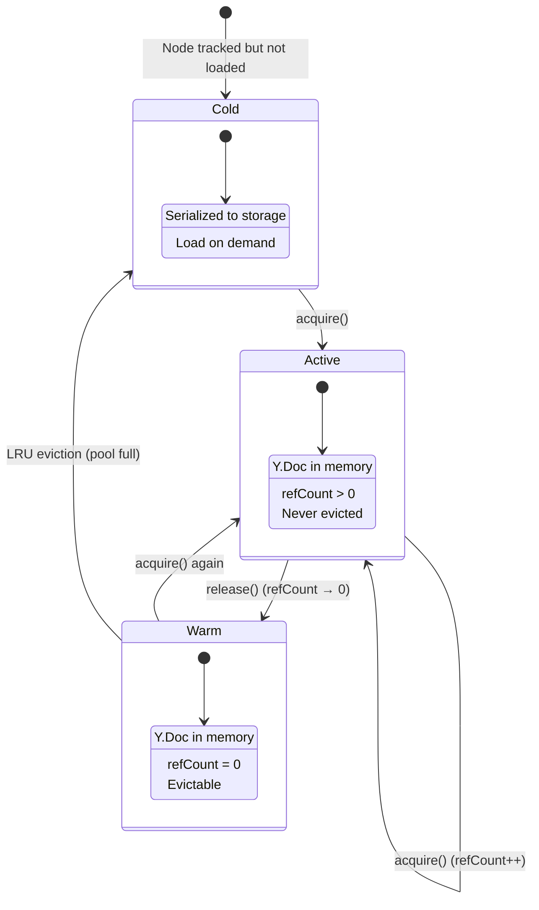

# 02: Node Pool

> LRU cache of Y.Doc instances with acquire/release semantics

**Dependencies:** `01-meta-bridge.md`
**Modifies:** new `packages/react/src/sync/node-pool.ts`

## Overview

The Node Pool manages Y.Doc instances independently of React component lifecycle. Components **acquire** a Y.Doc when they need it and **release** it when they unmount. Released Y.Docs stay in the pool (warm state) and continue receiving sync updates.



## Implementation

```typescript
// packages/react/src/sync/node-pool.ts

import * as Y from 'yjs'
import type { NodeStorageAdapter } from '@xnet/data'
import type { MetaBridge } from './meta-bridge'

export type PoolEntryState = 'active' | 'warm' | 'cold'

interface PoolEntry {
  doc: Y.Doc
  state: PoolEntryState
  refCount: number
  lastAccess: number
  dirty: boolean
  unobserveMeta: (() => void) | null
}

export interface NodePoolConfig {
  /** Storage adapter for persisting Y.Doc state */
  storage: NodeStorageAdapter
  /** Meta bridge for syncing properties to NodeStore */
  metaBridge: MetaBridge
  /** Max warm entries before LRU eviction (default: 50) */
  maxWarm?: number
  /** Debounce delay for persisting dirty docs (default: 2000ms) */
  persistDelay?: number
}

export interface NodePool {
  /** Acquire a Y.Doc for a Node (load from storage or create new) */
  acquire(nodeId: string): Promise<Y.Doc>
  /** Release a Y.Doc (component unmounted, doc stays warm) */
  release(nodeId: string): void
  /** Check if a Node is in the pool */
  has(nodeId: string): boolean
  /** Get pool entry state */
  getState(nodeId: string): PoolEntryState | null
  /** Number of entries currently in memory */
  readonly size: number
  /** Force-persist all dirty docs */
  flushAll(): Promise<void>
  /** Destroy pool, persist all docs, cleanup */
  destroy(): Promise<void>
}

export function createNodePool(config: NodePoolConfig): NodePool {
  const entries = new Map<string, PoolEntry>()
  const persistTimers = new Map<string, ReturnType<typeof setTimeout>>()
  const maxWarm = config.maxWarm ?? 50
  const persistDelay = config.persistDelay ?? 2000

  async function loadDoc(nodeId: string): Promise<Y.Doc> {
    const doc = new Y.Doc({ guid: nodeId })

    // Load stored content
    const content = await config.storage.getDocumentContent(nodeId)
    if (content && content.length > 0) {
      Y.applyUpdate(doc, content)
    }

    return doc
  }

  function schedulePersist(nodeId: string): void {
    const existing = persistTimers.get(nodeId)
    if (existing) clearTimeout(existing)

    persistTimers.set(
      nodeId,
      setTimeout(async () => {
        persistTimers.delete(nodeId)
        const entry = entries.get(nodeId)
        if (entry && entry.dirty) {
          const content = Y.encodeStateAsUpdate(entry.doc)
          await config.storage.setDocumentContent(nodeId, content)
          entry.dirty = false
        }
      }, persistDelay)
    )
  }

  function evictIfNeeded(): void {
    // Count warm entries
    let warmCount = 0
    const warmEntries: [string, PoolEntry][] = []

    for (const [id, entry] of entries) {
      if (entry.state === 'warm') {
        warmCount++
        warmEntries.push([id, entry])
      }
    }

    if (warmCount <= maxWarm) return

    // Sort by lastAccess (oldest first) and evict
    warmEntries.sort((a, b) => a[1].lastAccess - b[1].lastAccess)
    const toEvict = warmEntries.slice(0, warmCount - maxWarm)

    for (const [id, entry] of toEvict) {
      // Persist before evicting
      const content = Y.encodeStateAsUpdate(entry.doc)
      config.storage.setDocumentContent(id, content).catch(() => {})

      // Cleanup meta observer
      if (entry.unobserveMeta) {
        entry.unobserveMeta()
      }

      // Destroy Y.Doc
      entry.doc.destroy()
      entries.delete(id)
    }
  }

  return {
    async acquire(nodeId: string): Promise<Y.Doc> {
      let entry = entries.get(nodeId)

      if (entry) {
        // Already in pool — promote to active
        entry.refCount++
        entry.state = 'active'
        entry.lastAccess = Date.now()
        return entry.doc
      }

      // Load from storage
      const doc = await loadDoc(nodeId)

      // Listen for updates to schedule persistence
      doc.on('update', () => {
        const e = entries.get(nodeId)
        if (e) {
          e.dirty = true
          schedulePersist(nodeId)
        }
      })

      // Set up meta bridge observer
      const unobserveMeta = config.metaBridge.observe(nodeId, doc)

      entry = {
        doc,
        state: 'active',
        refCount: 1,
        lastAccess: Date.now(),
        dirty: false,
        unobserveMeta
      }

      entries.set(nodeId, entry)
      return doc
    },

    release(nodeId: string): void {
      const entry = entries.get(nodeId)
      if (!entry) return

      entry.refCount = Math.max(0, entry.refCount - 1)

      if (entry.refCount === 0) {
        entry.state = 'warm'
        entry.lastAccess = Date.now()
        evictIfNeeded()
      }
    },

    has(nodeId: string): boolean {
      return entries.has(nodeId)
    },

    getState(nodeId: string): PoolEntryState | null {
      return entries.get(nodeId)?.state ?? null
    },

    get size(): number {
      return entries.size
    },

    async flushAll(): Promise<void> {
      // Clear all pending timers
      for (const timer of persistTimers.values()) {
        clearTimeout(timer)
      }
      persistTimers.clear()

      // Persist all dirty docs
      const promises: Promise<void>[] = []
      for (const [id, entry] of entries) {
        if (entry.dirty) {
          const content = Y.encodeStateAsUpdate(entry.doc)
          promises.push(
            config.storage.setDocumentContent(id, content).then(() => {
              entry.dirty = false
            })
          )
        }
      }
      await Promise.all(promises)
    },

    async destroy(): Promise<void> {
      await this.flushAll()

      for (const [, entry] of entries) {
        if (entry.unobserveMeta) entry.unobserveMeta()
        entry.doc.destroy()
      }
      entries.clear()
    }
  }
}
```

## Tests

```typescript
describe('NodePool', () => {
  it('should acquire and release Y.Docs')
  it('should reuse warm docs on re-acquire')
  it('should evict oldest warm entries when pool is full')
  it('should persist dirty docs on eviction')
  it('should set up meta bridge observer on acquire')
  it('should not evict active entries')
  it('should flushAll dirty docs')
  it('should destroy all docs on destroy()')
})
```

## Checklist

- [ ] Create `packages/react/src/sync/node-pool.ts`
- [ ] Implement LRU eviction for warm entries
- [ ] Integrate MetaBridge observer on acquire
- [ ] Add persistence scheduling (debounced)
- [ ] Write unit tests
- [ ] Export from package

---

[← Previous: Meta Bridge](./01-meta-bridge.md) | [Next: Registry →](./03-registry.md)
