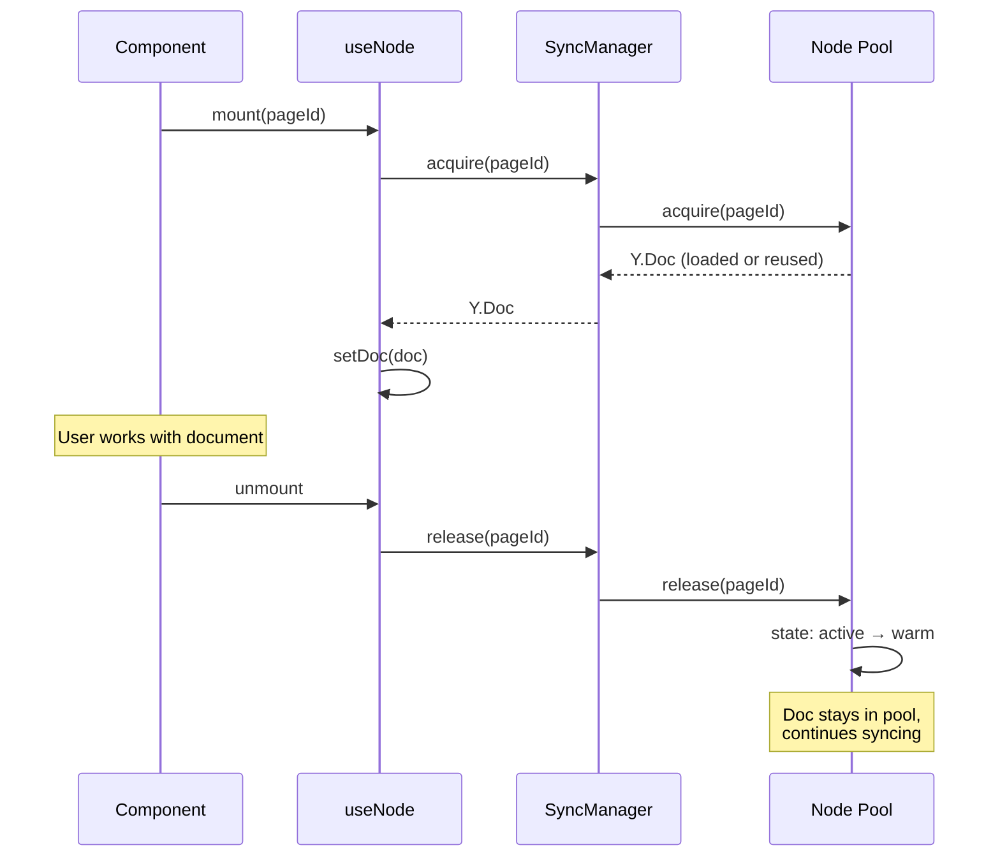

# 06: useNode Integration

> Modify `useNode` to borrow Y.Docs from the Sync Manager

**Dependencies:** `05-sync-manager.md`
**Modifies:** `packages/react/src/hooks/useDocument.ts`, `packages/react/src/context.ts`

## Overview

This step changes `useNode` from creating/destroying its own Y.Doc and WebSocketSyncProvider to borrowing from the Sync Manager. The hook acquires a Y.Doc on mount and releases it on unmount — but the doc stays alive in the pool.



## Implementation

### 1. Add SyncManager to XNetProvider Context

```typescript
// packages/react/src/context.ts (additions)

import { createSyncManager, type SyncManager } from './sync/sync-manager'

export interface XNetContextValue {
  // ... existing fields ...
  syncManager: SyncManager | null
}

// In XNetProvider component:
const syncManager = useMemo(() => {
  if (!nodeStore || !nodeStoreReady) return null
  return createSyncManager({
    nodeStore,
    storage: config.nodeStorage,
    signalingUrl: config.signalingServers?.[0] ?? 'ws://localhost:4444',
    authorDID: config.authorDID
  })
}, [nodeStore, nodeStoreReady])

// Start/stop lifecycle
useEffect(() => {
  if (!syncManager) return
  syncManager.start()
  return () => {
    syncManager.stop()
  }
}, [syncManager])
```

### 2. Add `useSyncManager` Hook

```typescript
// packages/react/src/hooks/useSyncManager.ts

import { useContext } from 'react'
import { XNetContext } from '../context'
import type { SyncManager } from '../sync/sync-manager'

export function useSyncManager(): SyncManager | null {
  const context = useContext(XNetContext)
  return context?.syncManager ?? null
}
```

### 3. Modify useNode

Replace the Y.Doc creation and WebSocketSyncProvider setup with SyncManager acquire/release:

```typescript
// packages/react/src/hooks/useDocument.ts (key changes)

export function useNode<P extends Record<string, PropertyBuilder>>(
  schema: DefinedSchema<P>,
  id: string | null,
  options: UseNodeOptions<P> = {}
): UseNodeResult<P> {
  const syncManager = useSyncManager()

  // ...existing state...

  // Load node and document
  const load = useCallback(
    async () => {
      // ...existing node loading logic (create, get from store)...

      // NEW: Acquire Y.Doc from SyncManager instead of creating our own
      if (hasDocument && syncManager && id) {
        const ydoc = await syncManager.acquire(id)
        docRef.current = ydoc
        setDoc(ydoc)

        // Track this Node for background sync
        syncManager.track(id, schemaId)
      } else if (hasDocument && id) {
        // FALLBACK: No SyncManager available (backwards compat)
        // Create Y.Doc directly (current behavior)
        const ydoc = new Y.Doc({ guid: id })
        // ...existing Y.Doc setup...
      }
    },
    [
      /* deps */
    ]
  )

  // Cleanup: release instead of destroy
  useEffect(() => {
    return () => {
      if (id && syncManager) {
        syncManager.release(id)
      } else if (docRef.current) {
        // Fallback: destroy directly
        docRef.current.destroy()
      }
    }
  }, [id, syncManager])

  // REMOVED: WebSocketSyncProvider creation
  // REMOVED: Per-component awareness setup
  // The SyncManager handles all of this now

  // Awareness comes from SyncManager
  useEffect(() => {
    if (!syncManager || !id) return
    const awareness = syncManager.getAwareness(id)
    setAwareness(awareness)
  }, [syncManager, id])
}
```

### 4. Backwards Compatibility

When no SyncManager is available (e.g., tests, or apps that don't use XNetProvider), `useNode` falls back to the current behavior: creating its own Y.Doc and WebSocketSyncProvider. This ensures zero breaking changes.

## Migration Impact

| Component               | Before                                        | After                                     |
| ----------------------- | --------------------------------------------- | ----------------------------------------- |
| `useNode`               | Creates Y.Doc + provider, destroys on unmount | Borrows from pool, releases on unmount    |
| `XNetProvider`          | No sync lifecycle                             | Starts/stops SyncManager                  |
| `WebSocketSyncProvider` | One per `useNode` instance                    | Replaced by Connection Manager (internal) |
| Sidebar                 | Only updates for open doc                     | Updates for all tracked Nodes             |

## Checklist

- [ ] Add `syncManager` to `XNetContextValue`
- [ ] Create `useSyncManager` hook
- [ ] Modify `useNode` to use acquire/release pattern
- [ ] Keep fallback for missing SyncManager (backwards compat)
- [ ] Remove per-component WebSocketSyncProvider creation
- [ ] Wire awareness from SyncManager
- [ ] Integration test: sidebar updates when doc is closed but tracked

---

[← Previous: Sync Manager](./05-sync-manager.md) | [Next: Offline Queue →](./07-offline-queue.md)
