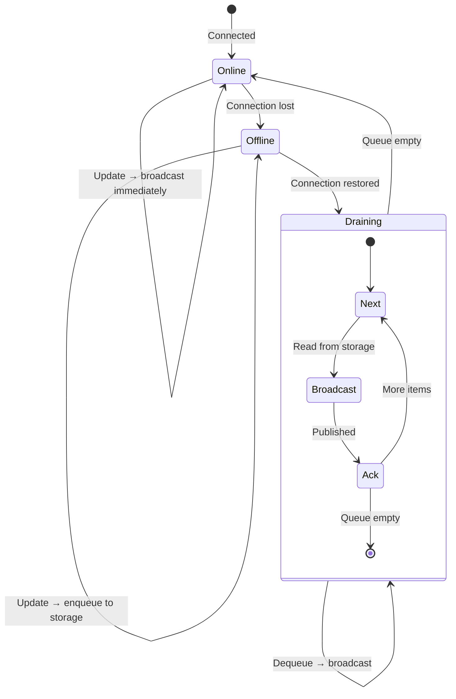

# 07: Offline Queue

> Persistent queue for changes made while disconnected

**Dependencies:** `05-sync-manager.md`
**Modifies:** new `packages/react/src/sync/offline-queue.ts`, modifies `sync-manager.ts`

## Overview

When the network is unavailable, local Y.Doc updates are queued in persistent storage. On reconnect, the queue is drained (replayed in order). This ensures no local changes are lost, even across app restarts.



## Implementation

```typescript
// packages/react/src/sync/offline-queue.ts

import type { NodeStorageAdapter } from '@xnet/data'

export interface QueueEntry {
  /** Node ID this update belongs to */
  nodeId: string
  /** Serialized Y.Doc update (Uint8Array as base64) */
  update: string
  /** Timestamp when queued */
  queuedAt: number
}

export interface OfflineQueueConfig {
  /** Storage adapter for persistence */
  storage: NodeStorageAdapter
  /** Storage key for the queue */
  storageKey?: string
  /** Max queue size before dropping oldest entries (default: 1000) */
  maxSize?: number
}

export interface OfflineQueue {
  /** Enqueue an update for later broadcast */
  enqueue(nodeId: string, update: Uint8Array): Promise<void>
  /** Drain the queue, calling handler for each entry */
  drain(handler: (entry: QueueEntry) => Promise<void>): Promise<number>
  /** Number of entries in the queue */
  readonly size: number
  /** Load queue from storage */
  load(): Promise<void>
  /** Persist queue to storage */
  save(): Promise<void>
  /** Clear all entries */
  clear(): Promise<void>
}

export function createOfflineQueue(config: OfflineQueueConfig): OfflineQueue {
  const storageKey = config.storageKey ?? '_xnet_offline_queue'
  const maxSize = config.maxSize ?? 1000
  let entries: QueueEntry[] = []

  function toBase64(data: Uint8Array): string {
    let binary = ''
    for (let i = 0; i < data.length; i++) {
      binary += String.fromCharCode(data[i])
    }
    return btoa(binary)
  }

  return {
    async enqueue(nodeId, update) {
      entries.push({
        nodeId,
        update: toBase64(update),
        queuedAt: Date.now()
      })

      // Trim if over max size (drop oldest)
      if (entries.length > maxSize) {
        entries = entries.slice(entries.length - maxSize)
      }

      // Persist immediately (critical for crash resilience)
      await this.save()
    },

    async drain(handler) {
      let drained = 0
      while (entries.length > 0) {
        const entry = entries.shift()!
        try {
          await handler(entry)
          drained++
        } catch {
          // Put it back and stop draining
          entries.unshift(entry)
          break
        }
      }
      await this.save()
      return drained
    },

    get size() {
      return entries.length
    },

    async load() {
      try {
        const node = await config.storage.getNode(storageKey)
        if (node?.properties?.queue) {
          entries = node.properties.queue as QueueEntry[]
        }
      } catch {
        // No stored queue
      }
    },

    async save() {
      try {
        await config.storage.setNode({
          id: storageKey,
          schemaId: 'xnet://xnet.dev/_internal/OfflineQueue' as any,
          properties: { queue: entries },
          timestamps: {},
          deleted: false,
          createdAt: Date.now(),
          createdBy: 'did:key:system' as any,
          updatedAt: Date.now(),
          updatedBy: 'did:key:system' as any
        })
      } catch (err) {
        console.warn('[OfflineQueue] Failed to persist:', err)
      }
    },

    async clear() {
      entries = []
      await this.save()
    }
  }
}
```

### Integration with Sync Manager

```typescript
// In sync-manager.ts, modify the doc update handler:

function setupDocBroadcast(nodeId: string, doc: Y.Doc): void {
  const room = `xnet-doc-${nodeId}`

  doc.on('update', async (update: Uint8Array, origin: unknown) => {
    if (origin === 'remote') return

    if (connection.status === 'connected') {
      // Online: broadcast immediately
      connection.publish(room, {
        type: 'sync-update',
        from: peerId,
        update: toBase64(update)
      })
    } else {
      // Offline: queue for later
      await offlineQueue.enqueue(nodeId, update)
    }
  })
}

// On reconnect:
connection.onStatus((status) => {
  if (status === 'connected') {
    offlineQueue.drain(async (entry) => {
      const room = `xnet-doc-${entry.nodeId}`
      connection.publish(room, {
        type: 'sync-update',
        from: peerId,
        update: entry.update
      })
    })
  }
})
```

## Checklist

- [ ] Create `packages/react/src/sync/offline-queue.ts`
- [ ] Implement persistent enqueue/drain
- [ ] Integrate with Sync Manager (queue when offline, drain on reconnect)
- [ ] Handle max queue size (drop oldest)
- [ ] Write unit tests
- [ ] Export from package

---

[← Previous: useNode Integration](./06-usenode-integration.md) | [Next: Desktop Main Process →](./08-desktop-main-process.md)
