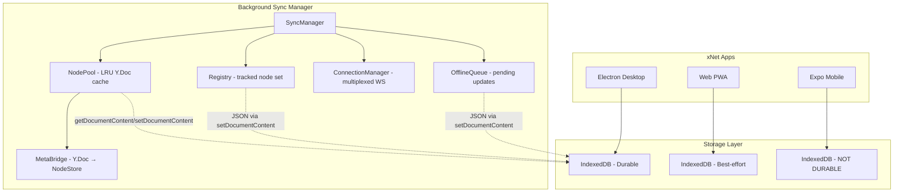
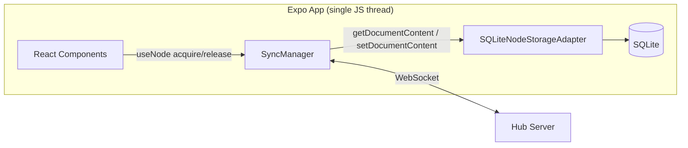

# Plan Step 03.4: Expo/Mobile Storage Durability

## Problem Statement

IndexedDB and other web storage APIs are **not durable on mobile platforms**:

### iOS (WKWebView)

- **7-day eviction**: Safari's Intelligent Tracking Prevention (ITP) deletes all script-writable storage (IndexedDB, LocalStorage, SessionStorage, Cache API) after 7 days of Safari use without user interaction on the site
- **Storage pressure**: System can evict data when device storage is low
- **No guaranteed persistence**: Even `navigator.storage.persist()` doesn't guarantee data retention on iOS

### Android (WebView)

- **System cleanup**: Android can clear WebView storage under memory pressure
- **Less aggressive than iOS**: But still not guaranteed durable
- **App data clearing**: Users can clear app data which removes WebView storage

### Why This Matters for xNet

xNet is a local-first application where user data sovereignty is paramount. Users expect their documents, databases, and settings to persist reliably. Data loss is unacceptable for a productivity tool.

While P2P sync can recover data from peers, this requires:

1. The user to have synced with another device/peer
2. That peer to be online and reachable
3. Network connectivity

We cannot rely on sync as a backup strategy for local storage durability.

## Current Architecture



- **Electron**: IndexedDB is durable (no browser eviction policies apply). BSM runs in main process.
- **Web**: IndexedDB is best-effort (acceptable for PWA with sync). BSM runs in renderer.
- **Expo/Mobile**: IndexedDB is NOT durable (unacceptable for local-first app). **BSM needs native storage.**

## Background Sync Manager (BSM) — Context

The BSM (`packages/react/src/sync/`) is a fully implemented background sync system with these components:

| Component             | File                    | Storage Needs                                                    |
| --------------------- | ----------------------- | ---------------------------------------------------------------- |
| **SyncManager**       | `sync-manager.ts`       | Orchestrator — delegates to components below                     |
| **NodePool**          | `node-pool.ts`          | Y.Doc binary state (`getDocumentContent` / `setDocumentContent`) |
| **Registry**          | `registry.ts`           | Tracked-node set as JSON blob (via `setDocumentContent`)         |
| **ConnectionManager** | `connection-manager.ts` | No storage (in-memory WebSocket state)                           |
| **OfflineQueue**      | `offline-queue.ts`      | Pending updates as JSON array (via `setDocumentContent`)         |
| **MetaBridge**        | `meta-bridge.ts`        | No storage (bridges Y.Doc → NodeStore in-memory)                 |

All persistent components use `NodeStorageAdapter` from `@xnet/data`. The actual interface (current):

```typescript
// packages/data/src/store/types.ts
export interface NodeStorageAdapter {
  // Lifecycle
  open?(): Promise<void>
  close?(): Promise<void>

  // Change log
  appendChange(change: NodeChange): Promise<void>
  getChanges(nodeId: NodeId): Promise<NodeChange[]>
  getAllChanges(): Promise<NodeChange[]>
  getChangeByHash(hash: ContentId): Promise<NodeChange | null>
  getLastChange(nodeId: NodeId): Promise<NodeChange | null>

  // Materialized state
  getNode(id: NodeId): Promise<NodeState | null>
  setNode(node: NodeState): Promise<void>
  deleteNode(id: NodeId): Promise<void>
  listNodes(options?: ListNodesOptions): Promise<NodeState[]>
  countNodes(options?: CountNodesOptions): Promise<number>

  // Sync state
  getLastLamportTime(): Promise<number>
  setLastLamportTime(time: number): Promise<void>

  // Document content (Y.Doc binary state, also used for BSM metadata)
  getDocumentContent(nodeId: NodeId): Promise<Uint8Array | null>
  setDocumentContent(nodeId: NodeId, content: Uint8Array): Promise<void>
}
```

The key insight: **implementing `SQLiteNodeStorageAdapter` gives us durable storage for both the NodeStore AND the entire BSM for free** — the BSM already abstracts persistence through this interface.

## Recommendation

**expo-sqlite** implementing the full `NodeStorageAdapter` interface:

| Platform | Storage Backend | BSM Location           | Package                 |
| -------- | --------------- | ---------------------- | ----------------------- |
| Electron | IndexedDB       | Main process (IPC)     | `@xnet/data` (existing) |
| Web      | IndexedDB       | Renderer (in-process)  | `@xnet/data` (existing) |
| iOS      | SQLite          | React Native JS thread | `expo-sqlite`           |
| Android  | SQLite          | React Native JS thread | `expo-sqlite`           |

This approach:

1. Keeps working code for Electron/Web unchanged
2. Uses Expo-maintained package for mobile (better long-term support)
3. SQLite is battle-tested and appropriate for structured + binary data
4. Single adapter gives BSM durable storage on mobile automatically
5. OfflineQueue survives app kill / iOS background termination

## SQLite Schema

```sql
-- Node change log (event-sourced)
CREATE TABLE IF NOT EXISTS changes (
  hash TEXT PRIMARY KEY,
  node_id TEXT NOT NULL,
  lamport INTEGER NOT NULL,
  author TEXT NOT NULL,
  timestamp INTEGER NOT NULL,
  payload TEXT NOT NULL,  -- JSON-encoded NodeChange
  UNIQUE(node_id, lamport, author)
);
CREATE INDEX IF NOT EXISTS idx_changes_node ON changes(node_id, lamport);

-- Materialized node state
CREATE TABLE IF NOT EXISTS nodes (
  id TEXT PRIMARY KEY,
  schema_id TEXT NOT NULL,
  properties TEXT NOT NULL,  -- JSON
  created_at INTEGER NOT NULL,
  updated_at INTEGER NOT NULL,
  deleted INTEGER DEFAULT 0
);
CREATE INDEX IF NOT EXISTS idx_nodes_schema ON nodes(schema_id);
CREATE INDEX IF NOT EXISTS idx_nodes_updated ON nodes(updated_at);

-- Document content (Y.Doc binary state + BSM metadata blobs)
CREATE TABLE IF NOT EXISTS documents (
  node_id TEXT PRIMARY KEY,
  content BLOB NOT NULL,
  updated_at INTEGER NOT NULL
);

-- Sync state
CREATE TABLE IF NOT EXISTS sync_state (
  key TEXT PRIMARY KEY,
  value TEXT NOT NULL
);
```

The `documents` table stores:

- Y.Doc binary snapshots (keyed by node ID)
- BSM Registry (`_xnet_tracked_nodes` → JSON blob)
- BSM OfflineQueue (`_xnet_offline_queue` → JSON blob)

## Implementation Plan

### Step 1: `SQLiteNodeStorageAdapter`

Create `packages/data/src/store/sqlite-adapter.ts` (conditionally imported on mobile):

```typescript
import * as SQLite from 'expo-sqlite'
import type { NodeStorageAdapter, NodeChange, NodeState } from './types'

export function createSQLiteAdapter(dbName = 'xnet.db'): NodeStorageAdapter {
  const db = SQLite.openDatabaseSync(dbName)

  return {
    async open() {
      db.execSync(SCHEMA_SQL)
    },

    async getDocumentContent(nodeId) {
      const row = db.getFirstSync<{ content: ArrayBuffer }>(
        'SELECT content FROM documents WHERE node_id = ?',
        [nodeId]
      )
      return row ? new Uint8Array(row.content) : null
    },

    async setDocumentContent(nodeId, content) {
      db.runSync(
        `INSERT OR REPLACE INTO documents (node_id, content, updated_at)
         VALUES (?, ?, ?)`,
        [nodeId, content, Date.now()]
      )
    }

    // ... remaining NodeStorageAdapter methods
  }
}
```

### Step 2: BSM on Mobile — No IPC Needed

On Electron, the BSM runs in the main process and communicates via IPC (`apps/electron/src/main/bsm.ts`). On mobile, this complexity is unnecessary:



The renderer-side `createSyncManager()` works as-is — just pass the SQLite adapter instead of IndexedDB. No IPC bridge, no preload script, no MessagePort.

### Step 3: Mobile-Specific Lifecycle

Mobile apps have unique lifecycle events the BSM must handle:

```typescript
// apps/expo/src/sync-lifecycle.ts
import { AppState, type AppStateStatus } from 'react-native'

export function setupMobileSyncLifecycle(syncManager: SyncManager) {
  let prevState: AppStateStatus = 'active'

  AppState.addEventListener('change', async (nextState) => {
    if (prevState === 'active' && nextState.match(/inactive|background/)) {
      // App backgrounded: flush dirty docs, save registry + queue
      await syncManager.stop()
    }
    if (prevState.match(/inactive|background/) && nextState === 'active') {
      // App foregrounded: reconnect, drain offline queue
      await syncManager.start()
    }
    prevState = nextState
  })
}
```

### Step 4: Expo App Integration

```typescript
// apps/expo/src/storage.ts
import { createSQLiteAdapter } from '@xnet/data/sqlite'
import { createNodeStore } from '@xnet/data'
import { createSyncManager } from '@xnet/react/sync'

const storage = createSQLiteAdapter('xnet.db')
const nodeStore = createNodeStore({ storage })
const syncManager = createSyncManager({
  nodeStore,
  storage,
  signalingUrl: 'wss://hub.xnet.dev'
})
```

### Step 5: Expo Background Fetch (Optional Enhancement)

For periodic background sync when the app is not in foreground:

```typescript
import * as BackgroundFetch from 'expo-background-fetch'
import * as TaskManager from 'expo-task-manager'

TaskManager.defineTask('XNET_BACKGROUND_SYNC', async () => {
  const storage = createSQLiteAdapter('xnet.db')
  const syncManager = createSyncManager({ storage, ... })
  await syncManager.start()
  // Sync tracked nodes, drain offline queue
  await syncManager.stop()
  return BackgroundFetch.BackgroundFetchResult.NewData
})
```

## Mobile-Specific Considerations

### Storage Budget

| Data Type            | Typical Size    | Storage Approach              |
| -------------------- | --------------- | ----------------------------- |
| Node metadata (JSON) | 1-10 KB each    | `nodes` table                 |
| Y.Doc state (binary) | 10 KB - 10 MB   | `documents` table (BLOB)      |
| Change log           | ~200 bytes each | `changes` table               |
| BSM Registry         | <10 KB          | `documents` table (JSON blob) |
| BSM Offline Queue    | 0 - 5 MB        | `documents` table (JSON blob) |

SQLite handles all of these well. For very large Y.Docs (>10 MB), consider file-based storage as a future optimization.

### Concurrency

`expo-sqlite` uses WAL mode by default, which allows concurrent reads with a single writer. This is fine for xNet's access patterns:

- Multiple React components reading node data concurrently
- Single SyncManager writing updates sequentially
- NodePool debounces persistence (2s delay reduces write frequency)

### iOS Background Execution

iOS gives ~30 seconds of background execution time. The BSM's `stop()` method flushes all dirty docs, saves registry, and saves the offline queue — this should complete within seconds for typical usage.

## Answered Questions

1. **Should we use the same SQLite for both NodeStore and Y.Doc state?**
   → **Yes, single DB.** The `documents` table stores Y.Doc BLOBs. WAL mode prevents locking issues. The BSM also stores its Registry and OfflineQueue here.

2. **Do we need migrations for SQLite schema changes?**
   → **Simple version check.** Store a `schema_version` in `sync_state`. On `open()`, check version and run ALTER TABLE statements if needed. Our schema is stable (Nodes + Changes + Documents).

3. **How do we handle Expo Go vs production builds?**
   → **`expo-sqlite` works in Expo Go.** No custom dev client needed.

4. **What about offline-first sync queue?**
   → **Solved by BSM's OfflineQueue.** It already persists pending Y.Doc updates via `setDocumentContent`. With the SQLite adapter, this queue survives app kills, iOS background termination, and device restarts.

## Priority

**Medium** - Not blocking current development but required before mobile production release.

Dependency chain:

1. ~~P2P sync working in Electron (planStep03_2)~~ ✅
2. ~~Background Sync Manager (planStep03_3_1BgSync)~~ ✅ (all 8 steps done)
3. **This step** — wire BSM to durable mobile storage
4. Mobile sharing flow (future)

## References

- [MDN: Storage quotas and eviction criteria](https://developer.mozilla.org/en-US/docs/Web/API/Storage_API/Storage_quotas_and_eviction_criteria)
- [WebKit: Full Third-Party Cookie Blocking](https://webkit.org/blog/10218/full-third-party-cookie-blocking-and-more/)
- [WebKit: 7-Day Cap on Script-Writable Storage](https://webkit.org/blog/8613/intelligent-tracking-prevention-2-1/)
- [expo-sqlite docs](https://docs.expo.dev/versions/latest/sdk/sqlite/)
- [BSM Implementation](../planStep03_3_1BgSync/README.md)
- [BSM Exploration](../explorations/0024_BACKGROUND_SYNC_MANAGER.md)
