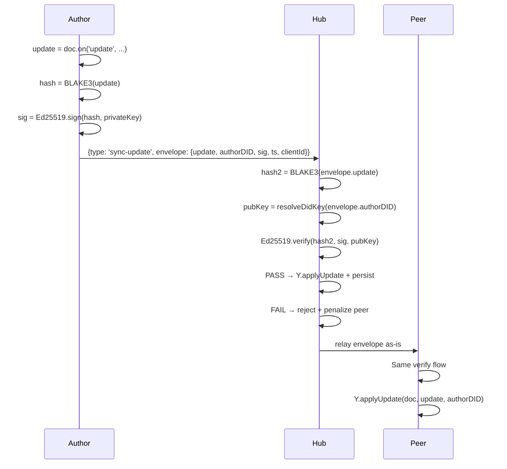

# 01: Signed Yjs Envelopes

> Per-update signing and verification for Yjs sync messages

**Duration:** 2-3 days  
**Dependencies:** `@xnet/crypto` (BLAKE3, Ed25519), `@xnet/identity` (DID resolution)

## Overview

Every outgoing Yjs update is wrapped in a signed envelope containing the author's DID and an Ed25519 signature over the BLAKE3 hash of the update bytes. Both the hub and receiving peers verify this signature before calling `Y.applyUpdate()`.



## Data Structures

### SignedYjsEnvelope

```typescript
// packages/sync/src/yjs-envelope.ts

import type { DID } from '@xnet/core'

export interface SignedYjsEnvelope {
  /** Raw Yjs update bytes */
  update: Uint8Array

  /** Author's DID (did:key:...) */
  authorDID: DID

  /** Ed25519 signature over BLAKE3(update) */
  signature: Uint8Array

  /** Wall clock timestamp (for ordering/debugging) */
  timestamp: number

  /** Yjs clientID this author uses in this session */
  clientId: number
}

export interface EnvelopeVerifyResult {
  valid: boolean
  reason?: 'invalid_signature' | 'did_resolution_failed' | 'update_too_large'
}
```

### Wire Format

```typescript
// WebSocket message types (extended)

// Current (insecure):
interface LegacySyncUpdate {
  type: 'sync-update'
  room: string
  data: Uint8Array // raw Yjs update
}

// New:
interface SignedSyncUpdate {
  type: 'sync-update'
  room: string
  envelope: SignedYjsEnvelope
}

// During migration, hub accepts both:
type SyncUpdateMessage = LegacySyncUpdate | SignedSyncUpdate
```

## Implementation

### Signing Utility

```typescript
// packages/sync/src/yjs-envelope.ts

import { blake3 } from '@xnet/crypto'
import { ed25519Sign, ed25519Verify, resolveDidKey } from '@xnet/identity'
import type { DID } from '@xnet/core'

export async function signYjsUpdate(
  update: Uint8Array,
  authorDID: DID,
  privateKey: Uint8Array,
  clientId: number
): Promise<SignedYjsEnvelope> {
  const hash = blake3(update)
  const signature = await ed25519Sign(hash, privateKey)

  return {
    update,
    authorDID,
    signature,
    timestamp: Date.now(),
    clientId
  }
}

export async function verifyYjsEnvelope(
  envelope: SignedYjsEnvelope
): Promise<EnvelopeVerifyResult> {
  try {
    const hash = blake3(envelope.update)
    const publicKey = resolveDidKey(envelope.authorDID)
    const valid = await ed25519Verify(hash, envelope.signature, publicKey)

    if (!valid) {
      return { valid: false, reason: 'invalid_signature' }
    }
    return { valid: true }
  } catch {
    return { valid: false, reason: 'did_resolution_failed' }
  }
}
```

### Client-Side Integration (WebSocketSyncProvider)

```typescript
// packages/react/src/sync/WebSocketSyncProvider.ts — changes

interface SyncProviderOptions {
  // ... existing options
  /** Identity for signing outgoing Yjs updates */
  identity?: { did: DID; privateKey: Uint8Array }
  /** Verify incoming signed envelopes (default: true) */
  verifyIncoming?: boolean
}

// In the update handler (doc.on('update', ...)):
private async _handleLocalUpdate(update: Uint8Array) {
  if (!this.ws || this.ws.readyState !== WebSocket.OPEN) return

  if (this.identity) {
    const envelope = await signYjsUpdate(
      update,
      this.identity.did,
      this.identity.privateKey,
      this.doc.clientID
    )
    this.ws.send(encodeMessage({
      type: 'sync-update',
      room: this.room,
      envelope
    }))
  } else {
    // Legacy unsigned (dev/anonymous mode)
    this.ws.send(encodeMessage({
      type: 'sync-update',
      room: this.room,
      data: update
    }))
  }
}

// In the incoming message handler:
private async _handleRemoteUpdate(msg: SyncUpdateMessage) {
  if ('envelope' in msg && msg.envelope) {
    if (this.verifyIncoming !== false) {
      const result = await verifyYjsEnvelope(msg.envelope)
      if (!result.valid) {
        console.warn(`Rejected Yjs update: ${result.reason} from ${msg.envelope.authorDID}`)
        return
      }
    }
    Y.applyUpdate(this.doc, msg.envelope.update, msg.envelope.authorDID)
  } else if ('data' in msg) {
    // Legacy unsigned update
    Y.applyUpdate(this.doc, msg.data, 'remote')
  }
}
```

### Hub-Side Verification

```typescript
// packages/hub/src/services/yjs-security.ts

export interface YjsSecurityConfig {
  /** Reject unsigned updates (false during migration) */
  requireSignedUpdates: boolean
  /** Max update size in bytes (default: 1MB) */
  maxUpdateSize: number
}

export class YjsSecurityService {
  constructor(private config: YjsSecurityConfig) {}

  async verifyIncoming(msg: SyncUpdateMessage): Promise<{
    ok: boolean
    update?: Uint8Array
    authorDID?: DID
    rejectReason?: string
  }> {
    if ('envelope' in msg && msg.envelope) {
      // Size check first (fast path)
      if (msg.envelope.update.length > this.config.maxUpdateSize) {
        return { ok: false, rejectReason: 'update_too_large' }
      }

      const result = await verifyYjsEnvelope(msg.envelope)
      if (!result.valid) {
        return { ok: false, rejectReason: result.reason }
      }

      return { ok: true, update: msg.envelope.update, authorDID: msg.envelope.authorDID }
    }

    // Unsigned update
    if (this.config.requireSignedUpdates) {
      return { ok: false, rejectReason: 'unsigned_update_rejected' }
    }

    // Accept unsigned (migration/anonymous mode)
    return { ok: true, update: (msg as LegacySyncUpdate).data }
  }
}
```

### Integration in RelayService

```typescript
// packages/hub/src/services/relay.ts — handleSyncUpdate modification

async handleSyncUpdate(ws: WebSocket, msg: SyncUpdateMessage) {
  const { room } = msg

  // Verify envelope
  const verification = await this.yjsSecurity.verifyIncoming(msg)
  if (!verification.ok) {
    this.peerScorer.penalize(ws, verification.rejectReason!)
    // Optionally send error back to client
    ws.send(encodeMessage({
      type: 'sync-error',
      room,
      error: verification.rejectReason
    }))
    return
  }

  // Apply verified update
  const doc = await this.pool.getOrLoad(room)
  Y.applyUpdate(doc, verification.update!, verification.authorDID ?? 'relay')
  this.pool.markDirty(room)

  // Relay to other subscribers (envelope intact for their verification)
  this.broadcast(room, ws, msg)
}
```

## Serialization

The envelope travels over WebSocket as msgpack or CBOR. The `update` and `signature` fields are `Uint8Array` and must be serialized as binary, not base64 strings on the wire (base64 is only for JSON debug contexts).

```typescript
// Encoding: use existing msgpack encoder
import { encode, decode } from '@msgpack/msgpack'

// Sending:
ws.send(encode({ type: 'sync-update', room, envelope }))

// Receiving:
const msg = decode(event.data) as SyncUpdateMessage
```

## Testing

```typescript
describe('signYjsUpdate', () => {
  it('produces valid envelope with correct fields', async () => {
    const { did, privateKey } = await generateKeypair()
    const update = new Uint8Array([1, 2, 3, 4])
    const envelope = await signYjsUpdate(update, did, privateKey, 12345)

    expect(envelope.authorDID).toBe(did)
    expect(envelope.update).toEqual(update)
    expect(envelope.clientId).toBe(12345)
    expect(envelope.timestamp).toBeCloseTo(Date.now(), -2)
    expect(envelope.signature).toBeInstanceOf(Uint8Array)
    expect(envelope.signature.length).toBe(64) // Ed25519
  })
})

describe('verifyYjsEnvelope', () => {
  it('accepts correctly signed envelope', async () => {
    const { did, privateKey } = await generateKeypair()
    const update = new Uint8Array([1, 2, 3])
    const envelope = await signYjsUpdate(update, did, privateKey, 1)

    const result = await verifyYjsEnvelope(envelope)
    expect(result.valid).toBe(true)
  })

  it('rejects envelope with tampered update', async () => {
    const { did, privateKey } = await generateKeypair()
    const envelope = await signYjsUpdate(new Uint8Array([1, 2, 3]), did, privateKey, 1)
    envelope.update = new Uint8Array([9, 9, 9]) // tamper

    const result = await verifyYjsEnvelope(envelope)
    expect(result.valid).toBe(false)
    expect(result.reason).toBe('invalid_signature')
  })

  it('rejects envelope with wrong signature', async () => {
    const { did: did1, privateKey: key1 } = await generateKeypair()
    const { did: did2 } = await generateKeypair()
    const envelope = await signYjsUpdate(new Uint8Array([1]), did2, key1, 1)

    const result = await verifyYjsEnvelope(envelope)
    expect(result.valid).toBe(false)
  })

  it('rejects envelope with invalid DID', async () => {
    const envelope: SignedYjsEnvelope = {
      update: new Uint8Array([1]),
      authorDID: 'did:key:invalid' as DID,
      signature: new Uint8Array(64),
      timestamp: Date.now(),
      clientId: 1
    }

    const result = await verifyYjsEnvelope(envelope)
    expect(result.valid).toBe(false)
    expect(result.reason).toBe('did_resolution_failed')
  })
})

describe('YjsSecurityService', () => {
  it('accepts valid signed update', async () => { ... })
  it('rejects oversized update', async () => { ... })
  it('rejects unsigned when requireSignedUpdates=true', async () => { ... })
  it('accepts unsigned when requireSignedUpdates=false', async () => { ... })
})

describe('WebSocketSyncProvider signing', () => {
  it('signs updates when identity is provided', async () => { ... })
  it('sends unsigned when no identity', async () => { ... })
  it('rejects incoming with invalid signature', async () => { ... })
  it('accepts incoming with valid signature', async () => { ... })
})
```

## Validation Gate

- [ ] `signYjsUpdate()` produces envelope with Ed25519 signature over BLAKE3(update)
- [ ] `verifyYjsEnvelope()` accepts valid, rejects tampered/invalid
- [ ] `WebSocketSyncProvider` signs outgoing when identity provided
- [ ] `WebSocketSyncProvider` verifies incoming signed updates
- [ ] Hub `YjsSecurityService` rejects invalid before `Y.applyUpdate()`
- [ ] Hub relays valid envelopes to other peers (envelope intact)
- [ ] Rejected updates trigger `sync-error` message back to sender
- [ ] Legacy unsigned updates accepted when `requireSignedUpdates: false`
