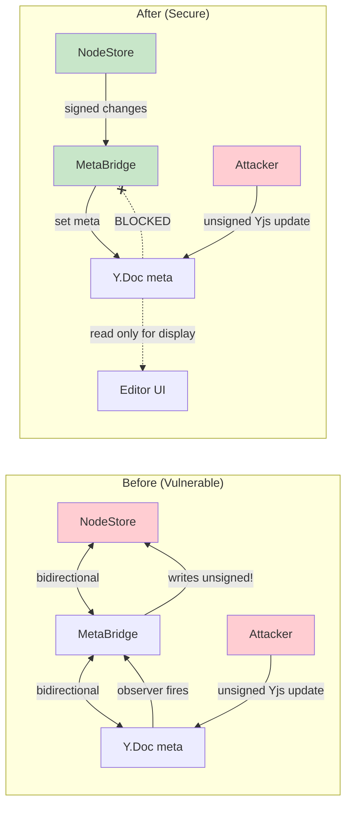

# 04: MetaBridge Isolation

> Make MetaBridge unidirectional to prevent Yjs corruption from poisoning the signed NodeStore

**Duration:** 1 day  
**Dependencies:** Understanding of `packages/react/src/sync/meta-bridge.ts`

## Overview

The `MetaBridge` currently observes both directions: NodeStore changes update the Y.Doc meta map, and Y.Doc meta map changes write back to NodeStore. This bidirectional flow means a malicious Yjs update targeting the meta map can bypass the entire signed NodeChange pipeline and poison the NodeStore.

The fix: make MetaBridge **write-only** from NodeStore's perspective. The Y.Doc meta map becomes a read-only cache for the editor UI — it receives updates from NodeStore but never writes back.



## The Vulnerability

Current MetaBridge flow:

1. NodeStore emits a change (e.g., title updated)
2. MetaBridge writes it to Y.Doc `meta` map → syncs to peers
3. Remote peer's Y.Doc receives the meta map change
4. MetaBridge's Y.Doc observer fires
5. MetaBridge writes the value to the local NodeStore

The problem at step 4-5: if the Y.Doc update came from a malicious peer (not from a real NodeChange), the MetaBridge still writes to NodeStore — **no signature verification**.

## Implementation

### Remove Yjs→NodeStore Observer

```typescript
// packages/react/src/sync/meta-bridge.ts

export class MetaBridge {
  private metaMap: Y.Map<any>
  private nodeStore: NodeStore
  private nodeId: NodeId
  private unsubscribeStore: (() => void) | null = null

  constructor(doc: Y.Doc, nodeStore: NodeStore, nodeId: NodeId) {
    this.metaMap = doc.getMap('meta')
    this.nodeStore = nodeStore
    this.nodeId = nodeId
  }

  /**
   * Start bridging. Only direction: NodeStore → Y.Doc meta.
   * Y.Doc meta is a READ-ONLY cache for the editor UI.
   */
  start() {
    // Direction: NodeStore → Y.Doc meta map
    this.unsubscribeStore = this.nodeStore.onChange(this.nodeId, (change) => {
      if (!change.payload.properties) return

      // Write NodeStore properties into Y.Doc meta for editor display
      this.metaMap.doc!.transact(() => {
        for (const [key, value] of Object.entries(change.payload.properties!)) {
          this.metaMap.set(key, value)
        }
      }, 'metabridge') // origin = 'metabridge' to avoid loops
    })

    // REMOVED: Y.Doc meta → NodeStore observer
    // This was the vulnerability. Property changes MUST go through
    // signed NodeChanges (via mutate()), never through Yjs.
  }

  /**
   * Read a property from the meta map (for editor UI display).
   * This is safe — it's read-only.
   */
  getProperty(key: string): any {
    return this.metaMap.get(key)
  }

  /**
   * Seed the meta map with current NodeStore state.
   * Called on document open to populate editor UI.
   */
  async seed() {
    const node = await this.nodeStore.get(this.nodeId)
    if (!node) return

    this.metaMap.doc!.transact(() => {
      for (const [key, value] of Object.entries(node.properties)) {
        this.metaMap.set(key, value)
      }
    }, 'metabridge-seed')
  }

  stop() {
    this.unsubscribeStore?.()
    this.unsubscribeStore = null
  }
}
```

### Source-Tagged Updates for Debugging

To distinguish legitimate meta map updates (from MetaBridge) from potentially malicious ones (from Yjs sync), add origin tagging:

```typescript
// When MetaBridge writes to Y.Doc:
this.metaMap.doc!.transact(() => {
  this.metaMap.set(key, value)
}, 'metabridge') // ← transaction origin

// In any observer that reads meta map (for debugging/monitoring):
this.metaMap.observe((event, transaction) => {
  if (transaction.origin !== 'metabridge' && transaction.origin !== 'metabridge-seed') {
    // This meta change came from Yjs sync (potentially malicious)
    console.warn('Meta map change from non-MetaBridge source:', {
      keys: Array.from(event.changes.keys.keys()),
      origin: transaction.origin
    })
    // Don't act on it — just log for monitoring
  }
})
```

### Property Updates Go Through NodeStore

With MetaBridge no longer writing back to NodeStore, property updates from the UI must go through the signed `mutate()` path:

```typescript
// In the editor UI (e.g., title change):

// BEFORE (went through Yjs → MetaBridge → NodeStore, unsigned):
doc.getMap('meta').set('title', newTitle)

// AFTER (goes through signed NodeChange pipeline):
const { mutate } = useMutate()
mutate(nodeId, { title: newTitle })
// This creates a signed NodeChange, which MetaBridge then
// propagates to Y.Doc meta for display
```

### Editor Integration

The editor reads properties from the meta map (populated by MetaBridge) but writes through `mutate()`:

```typescript
// packages/editor/src/extensions/meta-sync.ts

export function createMetaSyncExtension(nodeId: NodeId, mutate: MutateFn) {
  return {
    // Read: get title from Y.Doc meta map (populated by MetaBridge)
    getTitle(): string {
      return this.doc.getMap('meta').get('title') ?? ''
    },

    // Write: update title through signed NodeChange
    setTitle(title: string) {
      mutate(nodeId, { title })
      // MetaBridge will propagate back to meta map for display
    },

    // Read: icon from meta map
    getIcon(): string | null {
      return this.doc.getMap('meta').get('icon') ?? null
    },

    // Write: update icon through signed NodeChange
    setIcon(icon: string) {
      mutate(nodeId, { icon })
    }
  }
}
```

## Migration Notes

Any code that currently writes to the Y.Doc meta map expecting it to reach NodeStore must be updated:

```typescript
// Search for these patterns and replace:

// BAD (no longer works):
doc.getMap('meta').set('status', 'done')

// GOOD (signed path):
mutate(nodeId, { status: 'done' })
```

Grep for: `getMap('meta').set(` and `getMap("meta").set(` to find all instances.

## Testing

```typescript
describe('MetaBridge (unidirectional)', () => {
  it('propagates NodeStore changes to Y.Doc meta map', async () => {
    const { doc, store, bridge } = setupMetaBridge()
    bridge.start()

    await store.mutate(nodeId, { title: 'Hello' })

    expect(doc.getMap('meta').get('title')).toBe('Hello')
  })

  it('does NOT propagate Y.Doc meta changes to NodeStore', async () => {
    const { doc, store, bridge } = setupMetaBridge()
    bridge.start()

    // Simulate malicious Yjs update targeting meta map
    doc.transact(() => {
      doc.getMap('meta').set('title', 'HACKED')
    }, 'remote-peer')

    // NodeStore should be unchanged
    const node = await store.get(nodeId)
    expect(node!.properties.title).not.toBe('HACKED')
  })

  it('seeds meta map with current NodeStore state', async () => {
    const { doc, store, bridge } = setupMetaBridge()
    await store.mutate(nodeId, { title: 'Initial', status: 'draft' })

    await bridge.seed()

    expect(doc.getMap('meta').get('title')).toBe('Initial')
    expect(doc.getMap('meta').get('status')).toBe('draft')
  })

  it('logs warning for non-MetaBridge meta changes', async () => {
    const { doc, bridge } = setupMetaBridge()
    bridge.start()

    const warnSpy = vi.spyOn(console, 'warn')
    doc.transact(() => {
      doc.getMap('meta').set('title', 'sneaky')
    }, 'attacker')

    expect(warnSpy).toHaveBeenCalledWith(
      expect.stringContaining('non-MetaBridge source'),
      expect.any(Object)
    )
  })

  it('uses metabridge transaction origin', async () => {
    const { doc, store, bridge } = setupMetaBridge()
    bridge.start()

    const origins: any[] = []
    doc.getMap('meta').observe((_, tx) => origins.push(tx.origin))

    await store.mutate(nodeId, { title: 'Test' })

    expect(origins).toContain('metabridge')
  })
})
```

## Validation Gate

- [ ] MetaBridge only writes NodeStore→Y.Doc (not reverse)
- [ ] Malicious Y.Doc meta changes do NOT reach NodeStore
- [ ] Editor UI reads properties from meta map (display-only)
- [ ] Property writes go through `mutate()` (signed NodeChange path)
- [ ] `seed()` populates meta map with current NodeStore state
- [ ] Non-MetaBridge meta changes logged as warnings
- [ ] All existing editor property reads still work
- [ ] No `getMap('meta').set()` calls remain that bypass `mutate()`
