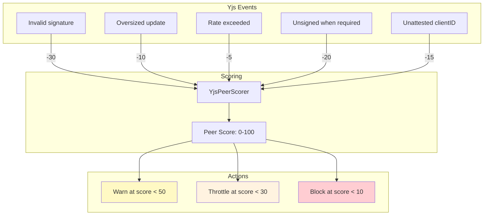

# 06: Yjs Peer Scoring

> Track Yjs-specific misbehavior and auto-block repeat offenders

**Duration:** 2 days  
**Dependencies:** Step 01 (signatures), Step 03 (rate limits), `@xnet/network/security/peer-scorer.ts`

## Overview

Extends the existing `PeerScorer` and `AutoBlocker` infrastructure with Yjs-specific metrics. Peers that repeatedly send invalid signatures, oversized updates, or exceed rate limits accumulate negative scores and are eventually auto-blocked.



## Data Structures

```typescript
// packages/hub/src/services/yjs-peer-scoring.ts

export interface YjsPeerMetrics {
  /** Invalid Ed25519 signatures on Yjs envelopes */
  invalidSignatures: number
  /** Updates exceeding size limit */
  oversizedUpdates: number
  /** Updates exceeding rate limit */
  rateExceeded: number
  /** Unsigned updates when signing required */
  unsignedUpdates: number
  /** Updates from unattested clientIDs (Tier 3) */
  unattestedClientIds: number
  /** Total valid updates (for ratio calculations) */
  validUpdates: number
  /** First seen timestamp */
  firstSeen: number
  /** Last violation timestamp */
  lastViolation: number
}

export interface YjsScoringConfig {
  /** Points deducted per violation type */
  penalties: {
    invalidSignature: number // default: 30
    oversizedUpdate: number // default: 10
    rateExceeded: number // default: 5
    unsignedUpdate: number // default: 20
    unattestedClientId: number // default: 15
  }
  /** Score thresholds */
  thresholds: {
    warn: number // default: 50
    throttle: number // default: 30
    block: number // default: 10
  }
  /** Score recovery rate (points per minute of good behavior) */
  recoveryRate: number // default: 1
  /** Immediate block after N invalid signatures */
  instantBlockAfter: number // default: 3
}
```

## Implementation

### YjsPeerScorer

```typescript
// packages/hub/src/services/yjs-peer-scoring.ts

export class YjsPeerScorer {
  private metrics = new Map<string, YjsPeerMetrics>()
  private scores = new Map<string, number>() // 0-100, starts at 100
  private config: YjsScoringConfig

  constructor(config?: Partial<YjsScoringConfig>) {
    this.config = {
      penalties: {
        invalidSignature: 30,
        oversizedUpdate: 10,
        rateExceeded: 5,
        unsignedUpdate: 20,
        unattestedClientId: 15,
        ...config?.penalties
      },
      thresholds: {
        warn: 50,
        throttle: 30,
        block: 10,
        ...config?.thresholds
      },
      recoveryRate: config?.recoveryRate ?? 1,
      instantBlockAfter: config?.instantBlockAfter ?? 3
    }
  }

  /**
   * Record a violation for a peer.
   * Returns the action to take.
   */
  penalize(peerId: string, reason: keyof YjsScoringConfig['penalties']): PeerAction {
    const metrics = this.getOrCreateMetrics(peerId)
    const penalty = this.config.penalties[reason]

    // Update metrics
    switch (reason) {
      case 'invalidSignature':
        metrics.invalidSignatures++
        // Instant block after N invalid signatures
        if (metrics.invalidSignatures >= this.config.instantBlockAfter) {
          this.scores.set(peerId, 0)
          return 'block'
        }
        break
      case 'oversizedUpdate':
        metrics.oversizedUpdates++
        break
      case 'rateExceeded':
        metrics.rateExceeded++
        break
      case 'unsignedUpdate':
        metrics.unsignedUpdates++
        break
      case 'unattestedClientId':
        metrics.unattestedClientIds++
        break
    }

    metrics.lastViolation = Date.now()

    // Apply penalty
    const currentScore = this.scores.get(peerId) ?? 100
    const newScore = Math.max(0, currentScore - penalty)
    this.scores.set(peerId, newScore)

    return this.getAction(newScore)
  }

  /**
   * Record a valid update (for ratio tracking + score recovery).
   */
  recordValid(peerId: string): void {
    const metrics = this.getOrCreateMetrics(peerId)
    metrics.validUpdates++
  }

  /**
   * Get current score for a peer.
   */
  getScore(peerId: string): number {
    return this.scores.get(peerId) ?? 100
  }

  /**
   * Get current action for a peer based on score.
   */
  getAction(score: number): PeerAction {
    if (score <= this.config.thresholds.block) return 'block'
    if (score <= this.config.thresholds.throttle) return 'throttle'
    if (score <= this.config.thresholds.warn) return 'warn'
    return 'allow'
  }

  /**
   * Recover scores over time (called periodically).
   */
  tick(): void {
    const now = Date.now()
    for (const [peerId, score] of this.scores) {
      if (score >= 100) continue

      const metrics = this.metrics.get(peerId)
      if (!metrics) continue

      // Only recover if no recent violations (last 60s)
      if (now - metrics.lastViolation > 60_000) {
        const newScore = Math.min(100, score + this.config.recoveryRate)
        this.scores.set(peerId, newScore)
      }
    }
  }

  /**
   * Get metrics for debugging/monitoring.
   */
  getMetrics(peerId: string): YjsPeerMetrics | undefined {
    return this.metrics.get(peerId)
  }

  /**
   * Remove all state for a disconnected peer.
   */
  remove(peerId: string): void {
    this.metrics.delete(peerId)
    this.scores.delete(peerId)
  }

  private getOrCreateMetrics(peerId: string): YjsPeerMetrics {
    let m = this.metrics.get(peerId)
    if (!m) {
      m = {
        invalidSignatures: 0,
        oversizedUpdates: 0,
        rateExceeded: 0,
        unsignedUpdates: 0,
        unattestedClientIds: 0,
        validUpdates: 0,
        firstSeen: Date.now(),
        lastViolation: 0
      }
      this.metrics.set(peerId, m)
    }
    return m
  }
}

export type PeerAction = 'allow' | 'warn' | 'throttle' | 'block'
```

### Integration in RelayService

```typescript
// packages/hub/src/services/relay.ts

private yjsScorer = new YjsPeerScorer()
private blocked = new Set<string>()

async handleSyncUpdate(ws: WebSocket, msg: SyncUpdateMessage, auth: AuthenticatedConnection) {
  const peerId = auth.did

  // Check if already blocked
  if (this.blocked.has(peerId)) {
    ws.close(4403, 'Blocked due to repeated violations')
    return
  }

  // Verify (from steps 01+03)
  const result = await this.yjsSecurity.verifyIncoming(msg, peerId)

  if (!result.ok) {
    const action = this.yjsScorer.penalize(peerId, result.rejectReason as any)
    this.handleAction(ws, peerId, action)
    return
  }

  // Valid update
  this.yjsScorer.recordValid(peerId)

  // Apply...
}

private handleAction(ws: WebSocket, peerId: string, action: PeerAction) {
  switch (action) {
    case 'block':
      this.blocked.add(peerId)
      ws.close(4403, 'Blocked due to repeated violations')
      break
    case 'throttle':
      // Increase rate limit strictness for this peer
      this.rateLimiter.setStrictMode(peerId, true)
      break
    case 'warn':
      ws.send(encodeMessage({ type: 'warning', message: 'Unusual activity detected' }))
      break
    case 'allow':
      break
  }
}
```

### Score Recovery Timer

```typescript
// packages/hub/src/services/relay.ts — in startup

// Tick every 60 seconds for score recovery
setInterval(() => {
  this.yjsScorer.tick()

  // Unblock peers whose score has recovered above block threshold
  for (const peerId of this.blocked) {
    if (this.yjsScorer.getScore(peerId) > this.yjsScorer.config.thresholds.block) {
      this.blocked.delete(peerId)
    }
  }
}, 60_000)
```

### Metrics Endpoint

```typescript
// packages/hub/src/routes/metrics.ts

app.get('/metrics/yjs-peers', (c) => {
  const peers: Record<string, any> = {}
  for (const [peerId, metrics] of yjsScorer.getAllMetrics()) {
    peers[peerId] = {
      ...metrics,
      score: yjsScorer.getScore(peerId),
      action: yjsScorer.getAction(yjsScorer.getScore(peerId))
    }
  }
  return c.json(peers)
})
```

## Testing

```typescript
describe('YjsPeerScorer', () => {
  it('starts peers at score 100', () => {
    const scorer = new YjsPeerScorer()
    expect(scorer.getScore('peer-1')).toBe(100)
  })

  it('deducts points on violation', () => {
    const scorer = new YjsPeerScorer()
    scorer.penalize('peer-1', 'invalidSignature')
    expect(scorer.getScore('peer-1')).toBe(70) // 100 - 30
  })

  it('returns block action at low score', () => {
    const scorer = new YjsPeerScorer()
    scorer.penalize('peer-1', 'invalidSignature') // 70
    scorer.penalize('peer-1', 'invalidSignature') // 40
    scorer.penalize('peer-1', 'invalidSignature') // 10 → instant block

    expect(scorer.getScore('peer-1')).toBe(0) // instant block at 3
  })

  it('instant-blocks after 3 invalid signatures', () => {
    const scorer = new YjsPeerScorer()
    scorer.penalize('peer-1', 'invalidSignature')
    scorer.penalize('peer-1', 'invalidSignature')
    const action = scorer.penalize('peer-1', 'invalidSignature')
    expect(action).toBe('block')
  })

  it('returns throttle action at medium score', () => {
    const scorer = new YjsPeerScorer()
    scorer.penalize('peer-1', 'invalidSignature') // 70
    scorer.penalize('peer-1', 'oversizedUpdate') // 60
    scorer.penalize('peer-1', 'oversizedUpdate') // 50
    scorer.penalize('peer-1', 'oversizedUpdate') // 40
    expect(scorer.getAction(scorer.getScore('peer-1'))).toBe('throttle')
  })

  it('recovers score over time with no violations', () => {
    const scorer = new YjsPeerScorer({ recoveryRate: 5 })
    scorer.penalize('peer-1', 'rateExceeded') // 95

    // Simulate 2 minutes of good behavior
    const metrics = scorer.getMetrics('peer-1')!
    metrics.lastViolation = Date.now() - 120_000

    scorer.tick()
    expect(scorer.getScore('peer-1')).toBe(100) // recovered to cap
  })

  it('does not recover during active violations', () => {
    const scorer = new YjsPeerScorer({ recoveryRate: 5 })
    scorer.penalize('peer-1', 'rateExceeded') // 95
    // lastViolation is recent
    scorer.tick()
    expect(scorer.getScore('peer-1')).toBe(95) // no recovery
  })

  it('tracks valid update count', () => {
    const scorer = new YjsPeerScorer()
    scorer.recordValid('peer-1')
    scorer.recordValid('peer-1')
    expect(scorer.getMetrics('peer-1')!.validUpdates).toBe(2)
  })

  it('removes peer state on disconnect', () => {
    const scorer = new YjsPeerScorer()
    scorer.penalize('peer-1', 'rateExceeded')
    scorer.remove('peer-1')
    expect(scorer.getScore('peer-1')).toBe(100) // reset to default
    expect(scorer.getMetrics('peer-1')).toBeUndefined()
  })
})
```

## Validation Gate

- [x] Peers start at score 100
- [x] Each violation type deducts configured penalty points
- [x] Peer blocked after 3 invalid signatures (instant)
- [x] Peer blocked when score drops below 10
- [x] Peer throttled when score drops below 30
- [x] Score recovers at 1 point/minute with no violations (tick method)
- [x] Valid updates tracked for ratio monitoring (getViolationRatio)
- [ ] Blocked peers have WebSocket closed with 4403 (hub integration)
- [x] Metrics endpoint exposes per-peer scores (getAllMetrics)
- [x] Peer state cleaned up on disconnect (remove method)
