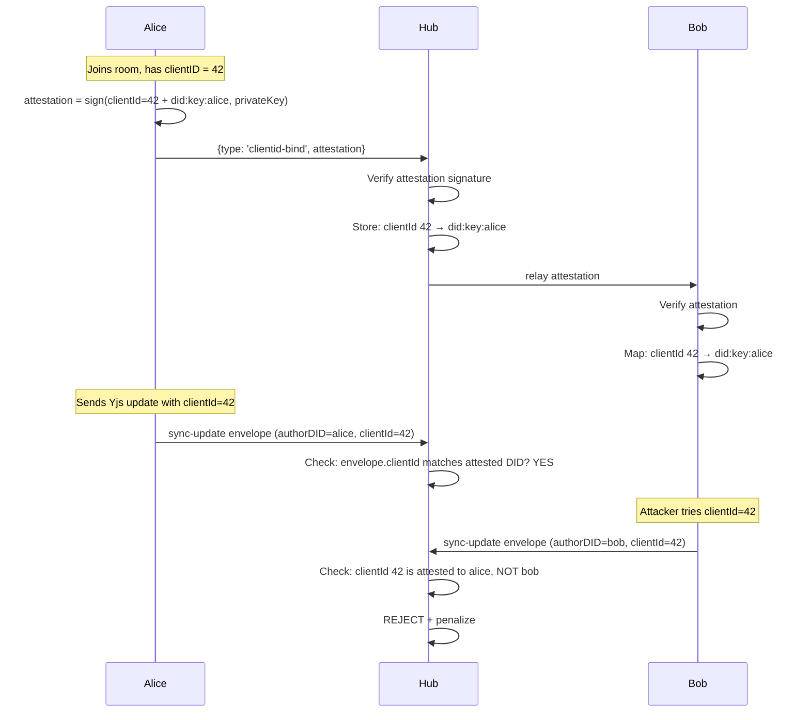

# 07: ClientID-to-DID Binding

> Cryptographically bind Yjs clientIDs to DIDs for verifiable author attribution

**Duration:** 2 days  
**Dependencies:** Step 01 (envelope signing), Step 02 (UCAN auth)

## Overview

Yjs assigns each `Y.Doc` instance a random integer `clientID`. This ID has no cryptographic binding to the author's identity — anyone can set `doc.clientID = victimId` and edits will appear to come from the victim. Awareness cursors, paragraph attribution, and version history all rely on clientID for "who typed this."

This step adds a signed attestation broadcast on room join that binds a clientID to a DID. Peers maintain a verified map and reject updates from unattested clientIDs.



## Data Structures

```typescript
// packages/sync/src/clientid-attestation.ts

import type { DID } from '@xnet/core'

export interface ClientIdAttestation {
  /** The Yjs clientID being attested */
  clientId: number

  /** The DID claiming this clientID */
  did: DID

  /** Ed25519 signature over BLAKE3(clientId + did) */
  signature: Uint8Array

  /** Session expiry (Unix timestamp seconds) */
  expiresAt: number

  /** Room this attestation applies to */
  room: string
}

export interface ClientIdMap {
  /** Look up DID by clientId */
  getOwner(clientId: number): DID | undefined

  /** Look up clientId by DID */
  getClientId(did: DID): number | undefined

  /** Register a verified attestation */
  register(attestation: ClientIdAttestation): void

  /** Remove expired/disconnected bindings */
  cleanup(): void
}
```

### Wire Message

```typescript
interface ClientIdBindMessage {
  type: 'clientid-bind'
  room: string
  attestation: ClientIdAttestation
}
```

## Implementation

### Signing an Attestation

```typescript
// packages/sync/src/clientid-attestation.ts

import { blake3, ed25519Sign, ed25519Verify } from '@xnet/crypto'
import { resolveDidKey } from '@xnet/identity'

/** Create payload bytes for signing */
function attestationPayload(
  clientId: number,
  did: DID,
  room: string,
  expiresAt: number
): Uint8Array {
  const text = `clientid-bind:${clientId}:${did}:${room}:${expiresAt}`
  return new TextEncoder().encode(text)
}

export async function createClientIdAttestation(
  clientId: number,
  did: DID,
  privateKey: Uint8Array,
  room: string,
  ttlSeconds: number = 3600 // 1 hour default
): Promise<ClientIdAttestation> {
  const expiresAt = Math.floor(Date.now() / 1000) + ttlSeconds
  const payload = attestationPayload(clientId, did, room, expiresAt)
  const hash = blake3(payload)
  const signature = await ed25519Sign(hash, privateKey)

  return { clientId, did, signature, expiresAt, room }
}

export async function verifyClientIdAttestation(
  attestation: ClientIdAttestation
): Promise<{ valid: boolean; reason?: string }> {
  // Check expiry
  if (attestation.expiresAt < Math.floor(Date.now() / 1000)) {
    return { valid: false, reason: 'expired' }
  }

  // Verify signature
  const payload = attestationPayload(
    attestation.clientId,
    attestation.did,
    attestation.room,
    attestation.expiresAt
  )
  const hash = blake3(payload)
  const publicKey = resolveDidKey(attestation.did)
  const valid = await ed25519Verify(hash, attestation.signature, publicKey)

  if (!valid) {
    return { valid: false, reason: 'invalid_signature' }
  }

  return { valid: true }
}
```

### ClientIdMap (Per-Room)

```typescript
// packages/hub/src/services/clientid-map.ts

export class ClientIdMapImpl implements ClientIdMap {
  private byClientId = new Map<number, { did: DID; expiresAt: number }>()
  private byDid = new Map<DID, { clientId: number; expiresAt: number }>()

  getOwner(clientId: number): DID | undefined {
    const entry = this.byClientId.get(clientId)
    if (!entry) return undefined
    if (entry.expiresAt < Math.floor(Date.now() / 1000)) {
      this.byClientId.delete(clientId)
      return undefined
    }
    return entry.did
  }

  getClientId(did: DID): number | undefined {
    const entry = this.byDid.get(did)
    if (!entry) return undefined
    if (entry.expiresAt < Math.floor(Date.now() / 1000)) {
      this.byDid.delete(did)
      return undefined
    }
    return entry.clientId
  }

  register(attestation: ClientIdAttestation): void {
    // Remove any previous binding for this DID (re-join with new clientId)
    const prev = this.byDid.get(attestation.did)
    if (prev) {
      this.byClientId.delete(prev.clientId)
    }

    this.byClientId.set(attestation.clientId, {
      did: attestation.did,
      expiresAt: attestation.expiresAt
    })
    this.byDid.set(attestation.did, {
      clientId: attestation.clientId,
      expiresAt: attestation.expiresAt
    })
  }

  cleanup(): void {
    const now = Math.floor(Date.now() / 1000)
    for (const [clientId, entry] of this.byClientId) {
      if (entry.expiresAt < now) {
        this.byClientId.delete(clientId)
        this.byDid.delete(entry.did)
      }
    }
  }

  /** Get all active bindings (for snapshot on new join) */
  getAll(): ClientIdAttestation[] {
    // Return as attestation-like objects for the snapshot
    return Array.from(this.byClientId.entries())
      .filter(([_, entry]) => entry.expiresAt > Math.floor(Date.now() / 1000))
      .map(([clientId, entry]) => ({
        clientId,
        did: entry.did,
        expiresAt: entry.expiresAt,
        room: '', // filled by caller
        signature: new Uint8Array() // original sig not stored, re-attest on request
      }))
  }
}
```

### Hub-Side Handling

```typescript
// packages/hub/src/services/relay.ts — additions

private clientIdMaps = new Map<string, ClientIdMapImpl>() // room → map

async handleClientIdBind(ws: WebSocket, msg: ClientIdBindMessage, auth: AuthenticatedConnection) {
  const { room, attestation } = msg

  // Verify the attestation signature
  const result = await verifyClientIdAttestation(attestation)
  if (!result.valid) {
    ws.send(encodeMessage({ type: 'error', error: `clientid-bind: ${result.reason}` }))
    this.yjsScorer.penalize(auth.did, 'invalidSignature')
    return
  }

  // Verify the DID matches the authenticated connection
  if (attestation.did !== auth.did) {
    ws.send(encodeMessage({ type: 'error', error: 'clientid-bind: DID mismatch' }))
    this.yjsScorer.penalize(auth.did, 'invalidSignature')
    return
  }

  // Register binding
  const map = this.getOrCreateClientIdMap(room)
  map.register(attestation)

  // Broadcast to other room subscribers
  this.broadcast(room, ws, msg)
}

// In handleSyncUpdate — additional check:
async handleSyncUpdate(ws: WebSocket, msg: SyncUpdateMessage, auth: AuthenticatedConnection) {
  // ... existing verification ...

  // ClientID binding check (if map exists for this room)
  if (msg.envelope) {
    const map = this.clientIdMaps.get(msg.room)
    if (map) {
      const owner = map.getOwner(msg.envelope.clientId)
      if (owner && owner !== msg.envelope.authorDID) {
        // clientId belongs to someone else!
        this.yjsScorer.penalize(auth.did, 'unattestedClientId')
        return
      }
    }
  }

  // ... apply update ...
}
```

### Client-Side: Send Attestation on Join

```typescript
// packages/react/src/sync/WebSocketSyncProvider.ts — additions

private async _onConnected() {
  // After subscribing to room, send clientID attestation
  if (this.identity) {
    const attestation = await createClientIdAttestation(
      this.doc.clientID,
      this.identity.did,
      this.identity.privateKey,
      this.room
    )
    this.ws!.send(encodeMessage({
      type: 'clientid-bind',
      room: this.room,
      attestation,
    }))
  }
}

// Handle incoming attestations from other peers:
private _handleClientIdBind(msg: ClientIdBindMessage) {
  // Verify and store in local map (for UI attribution)
  verifyClientIdAttestation(msg.attestation).then(result => {
    if (result.valid) {
      this.clientIdMap.register(msg.attestation)
      this._emit('clientid-bind', {
        clientId: msg.attestation.clientId,
        did: msg.attestation.did,
      })
    }
  })
}
```

### Awareness Integration

With verified clientID→DID bindings, awareness/presence can show verified identities:

```typescript
// In usePresence hook:
const clientIdMap = useSyncProviderClientIdMap()

// Instead of showing "Anonymous User 42":
const authorDID = clientIdMap.getOwner(awarenessState.clientId)
// Now shows "did:key:z6Mk..." or resolved display name
```

## Testing

```typescript
describe('createClientIdAttestation', () => {
  it('creates attestation with valid signature', async () => {
    const { did, privateKey } = await generateKeypair()
    const att = await createClientIdAttestation(42, did, privateKey, 'room-1')

    expect(att.clientId).toBe(42)
    expect(att.did).toBe(did)
    expect(att.room).toBe('room-1')
    expect(att.expiresAt).toBeGreaterThan(Math.floor(Date.now() / 1000))
  })
})

describe('verifyClientIdAttestation', () => {
  it('accepts valid attestation', async () => {
    const { did, privateKey } = await generateKeypair()
    const att = await createClientIdAttestation(42, did, privateKey, 'room-1')

    const result = await verifyClientIdAttestation(att)
    expect(result.valid).toBe(true)
  })

  it('rejects expired attestation', async () => {
    const { did, privateKey } = await generateKeypair()
    const att = await createClientIdAttestation(42, did, privateKey, 'room-1', -1)

    const result = await verifyClientIdAttestation(att)
    expect(result.valid).toBe(false)
    expect(result.reason).toBe('expired')
  })

  it('rejects tampered attestation', async () => {
    const { did, privateKey } = await generateKeypair()
    const att = await createClientIdAttestation(42, did, privateKey, 'room-1')
    att.clientId = 99 // tamper

    const result = await verifyClientIdAttestation(att)
    expect(result.valid).toBe(false)
  })

  it('rejects attestation signed by wrong key', async () => {
    const { did: did1 } = await generateKeypair()
    const { privateKey: key2 } = await generateKeypair()
    const att = await createClientIdAttestation(42, did1, key2, 'room-1')

    const result = await verifyClientIdAttestation(att)
    expect(result.valid).toBe(false)
  })
})

describe('ClientIdMapImpl', () => {
  it('registers and retrieves binding', () => {
    const map = new ClientIdMapImpl()
    map.register({
      clientId: 42,
      did: 'did:key:alice' as DID,
      expiresAt: future(),
      room: 'r',
      signature: new Uint8Array()
    })

    expect(map.getOwner(42)).toBe('did:key:alice')
    expect(map.getClientId('did:key:alice' as DID)).toBe(42)
  })

  it('returns undefined for unknown clientId', () => {
    const map = new ClientIdMapImpl()
    expect(map.getOwner(99)).toBeUndefined()
  })

  it('replaces previous binding for same DID', () => {
    const map = new ClientIdMapImpl()
    map.register({
      clientId: 42,
      did: 'did:key:alice' as DID,
      expiresAt: future(),
      room: 'r',
      signature: new Uint8Array()
    })
    map.register({
      clientId: 99,
      did: 'did:key:alice' as DID,
      expiresAt: future(),
      room: 'r',
      signature: new Uint8Array()
    })

    expect(map.getClientId('did:key:alice' as DID)).toBe(99)
    expect(map.getOwner(42)).toBeUndefined() // old binding removed
  })

  it('cleans up expired entries', () => {
    const map = new ClientIdMapImpl()
    map.register({
      clientId: 42,
      did: 'did:key:alice' as DID,
      expiresAt: past(),
      room: 'r',
      signature: new Uint8Array()
    })

    map.cleanup()
    expect(map.getOwner(42)).toBeUndefined()
  })
})

describe('Hub clientId verification', () => {
  it('rejects update with clientId owned by another DID', async () => {
    // Alice attests clientId 42
    // Bob sends envelope with clientId 42
    // Hub rejects with unattestedClientId
  })

  it('allows update with correctly attested clientId', async () => {
    // Alice attests clientId 42
    // Alice sends envelope with clientId 42
    // Hub accepts
  })

  it('allows update when no binding exists (graceful)', async () => {
    // No attestations yet
    // Peer sends update with any clientId
    // Hub accepts (binding not enforced until attestation exists)
  })
})
```

## Validation Gate

- [x] `createClientIdAttestation()` produces signed binding of clientId→DID
- [x] `verifyClientIdAttestation()` validates signature and expiry
- [ ] Client sends attestation on room join (when identity present)
- [ ] Hub verifies attestation and stores in per-room map
- [ ] Hub rejects updates with clientId attested to a different DID
- [ ] Hub broadcasts attestation to other room subscribers
- [x] Expired attestations cleaned up automatically
- [x] DID change (re-join) replaces old clientId binding
- [ ] Awareness/presence can display verified DID for clientIDs
