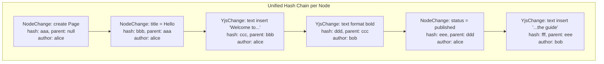
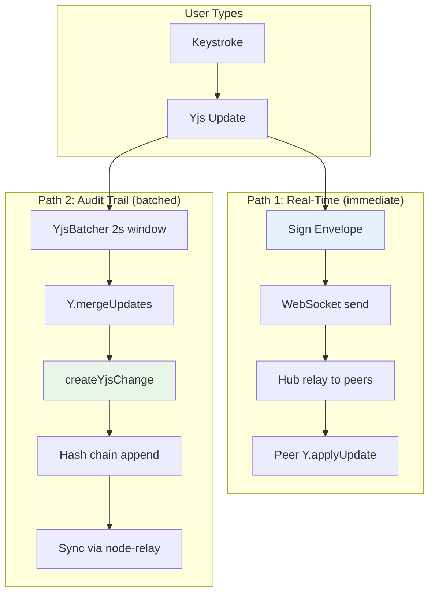

# 08: Hash Chain Integration

> Include Yjs updates in the per-node hash chain for full audit trail

**Duration:** 2-3 days  
**Dependencies:** Step 01 (envelopes), Step 07 (clientID binding), `@xnet/sync` (Change<T>)

## Overview

This is the strongest security tier: Yjs updates become entries in the same per-node hash chain as NodeChanges. This gives rich text the same guarantees as structured data — signed, hashed, chain-linked, with a full audit trail of who typed what and when.

The trade-off is overhead: ~200 bytes per update for the envelope (signature + hash + metadata). Batching mitigates this to acceptable levels.



## Data Structures

### YjsChange Type

```typescript
// packages/sync/src/yjs-change.ts

import type { DID, NodeId } from '@xnet/core'

export interface YjsUpdatePayload {
  /** The node this update belongs to */
  nodeId: NodeId

  /** Batched Yjs update bytes (one or more merged updates) */
  update: Uint8Array

  /** Yjs clientID for this author (verified via Step 07) */
  clientId: number

  /** Number of individual Yjs updates batched into this change */
  batchSize: number
}

/**
 * A Yjs update wrapped in the Change<T> envelope.
 * Gets: id, hash, parentHash, signature, authorDID, lamport, wallTime
 */
export type YjsChange = Change<YjsUpdatePayload>

// Discriminated union for the change store:
export type AnyChange = Change<NodeChangePayload> | Change<YjsUpdatePayload>

// Type guard:
export function isYjsChange(change: AnyChange): change is YjsChange {
  return 'update' in change.payload && 'clientId' in change.payload
}
```

### Change Type Discriminator

```typescript
// Extend the existing Change<T> with a type field for disambiguation:

export interface Change<T> {
  id: string
  type: 'node' | 'yjs' // ← new discriminator
  hash: string
  parentHash: string | null
  signature: Uint8Array
  authorDID: DID
  lamport: number
  wallTime: number
  payload: T
}
```

## Implementation

### Update Batching

Individual keystrokes generate ~5 updates/sec. Wrapping each in a full Change<T> is wasteful. Instead, batch updates over a configurable window:

```typescript
// packages/react/src/sync/yjs-batcher.ts

export interface YjsBatcherConfig {
  /** Batch window in milliseconds (default: 2000) */
  batchWindowMs: number
  /** Max updates per batch before flush (default: 50) */
  maxBatchSize: number
  /** Flush on paragraph break (Enter key) */
  flushOnParagraph: boolean
}

export class YjsBatcher {
  private pendingUpdates: Uint8Array[] = []
  private flushTimer: ReturnType<typeof setTimeout> | null = null
  private config: YjsBatcherConfig

  constructor(
    private onFlush: (batchedUpdate: Uint8Array, batchSize: number) => void,
    config?: Partial<YjsBatcherConfig>
  ) {
    this.config = {
      batchWindowMs: config?.batchWindowMs ?? 2000,
      maxBatchSize: config?.maxBatchSize ?? 50,
      flushOnParagraph: config?.flushOnParagraph ?? true
    }
  }

  /** Add an update to the current batch */
  add(update: Uint8Array, isParagraphBreak: boolean = false) {
    this.pendingUpdates.push(update)

    // Flush if batch is full
    if (this.pendingUpdates.length >= this.config.maxBatchSize) {
      this.flush()
      return
    }

    // Flush on paragraph break
    if (isParagraphBreak && this.config.flushOnParagraph) {
      this.flush()
      return
    }

    // Start/reset timer
    if (this.flushTimer) clearTimeout(this.flushTimer)
    this.flushTimer = setTimeout(() => this.flush(), this.config.batchWindowMs)
  }

  /** Force flush current batch */
  flush() {
    if (this.flushTimer) {
      clearTimeout(this.flushTimer)
      this.flushTimer = null
    }

    if (this.pendingUpdates.length === 0) return

    // Merge all pending updates into one
    const merged = Y.mergeUpdates(this.pendingUpdates)
    const batchSize = this.pendingUpdates.length
    this.pendingUpdates = []

    this.onFlush(merged, batchSize)
  }

  destroy() {
    if (this.flushTimer) clearTimeout(this.flushTimer)
    this.flush() // flush remaining
  }
}
```

### Creating YjsChanges

```typescript
// packages/sync/src/yjs-change.ts

import { createChange } from './change'

export async function createYjsChange(
  nodeId: NodeId,
  update: Uint8Array,
  clientId: number,
  batchSize: number,
  authorDID: DID,
  privateKey: Uint8Array,
  parentHash: string | null,
  lamport: number
): Promise<YjsChange> {
  const payload: YjsUpdatePayload = {
    nodeId,
    update,
    clientId,
    batchSize
  }

  return createChange<YjsUpdatePayload>({
    type: 'yjs',
    payload,
    authorDID,
    privateKey,
    parentHash,
    lamport
  })
}
```

### Integration in WebSocketSyncProvider

```typescript
// packages/react/src/sync/WebSocketSyncProvider.ts — additions

private batcher: YjsBatcher
private lastChangeHash: string | null = null
private lamport: number = 0

constructor(options: SyncProviderOptions) {
  // ... existing setup ...

  // Tier 3: Hash chain integration
  if (options.enableHashChain) {
    this.batcher = new YjsBatcher(
      (batchedUpdate, batchSize) => this._createYjsChange(batchedUpdate, batchSize),
      options.batchConfig
    )
  }
}

private async _createYjsChange(batchedUpdate: Uint8Array, batchSize: number) {
  if (!this.identity) return

  this.lamport++
  const change = await createYjsChange(
    this.nodeId,
    batchedUpdate,
    this.doc.clientID,
    batchSize,
    this.identity.did,
    this.identity.privateKey,
    this.lastChangeHash,
    this.lamport
  )

  this.lastChangeHash = change.hash

  // Store locally
  await this.changeStore.append(this.nodeId, change)

  // Also send the signed envelope for real-time relay (Step 01)
  // The YjsChange is for the audit trail; the envelope is for live sync
}

// Modified update handler:
private _handleLocalUpdate(update: Uint8Array) {
  // Real-time: send signed envelope immediately (Step 01)
  this._sendSignedEnvelope(update)

  // Audit trail: batch for hash chain (Tier 3)
  if (this.batcher) {
    this.batcher.add(update)
  }
}
```

### Storage of YjsChanges

```typescript
// Extend NodeStorageAdapter interface:

interface NodeStorageAdapter {
  // ... existing methods ...

  /** Append a YjsChange to the node's change log */
  appendYjsChange(nodeId: NodeId, change: YjsChange): Promise<void>

  /** Get all changes (NodeChange + YjsChange) for a node */
  getAllChanges(nodeId: NodeId): Promise<AnyChange[]>

  /** Get changes since a Lamport timestamp */
  getChangesSince(nodeId: NodeId, lamport: number): Promise<AnyChange[]>
}
```

### Hub-Side: Persist and Relay YjsChanges

```typescript
// The hub stores YjsChanges as part of the node sync relay (Phase 8):

async handleYjsChange(ws: WebSocket, change: YjsChange, auth: AuthenticatedConnection) {
  // Verify the change (hash, signature, parentHash chain)
  const valid = await verifyChange(change)
  if (!valid) {
    this.yjsScorer.penalize(auth.did, 'invalidSignature')
    return
  }

  // Verify authorDID matches authenticated connection
  if (change.authorDID !== auth.did) {
    this.yjsScorer.penalize(auth.did, 'invalidSignature')
    return
  }

  // Store in append-only log
  await this.storage.appendChange(change.payload.nodeId, change)

  // Relay to other subscribers
  this.broadcast(`node-changes:${change.payload.nodeId}`, ws, {
    type: 'yjs-change',
    change,
  })
}
```

## Performance Analysis

| Metric               | Without batching | With 2s batch | With paragraph batch |
| -------------------- | ---------------- | ------------- | -------------------- |
| Updates/sec (typing) | 5                | 0.5           | ~0.3                 |
| Overhead/sec         | 1KB (5 × 200B)   | 100B          | ~60B                 |
| Signature ops/sec    | 5 sign + verify  | 0.5           | ~0.3                 |
| Storage growth/hour  | 3.6MB            | 360KB         | ~216KB               |

With 2-second batching, the overhead is minimal and acceptable for production.

## Dual-Path Architecture

Real-time sync and audit trail are separate concerns:



- **Path 1**: Signed envelopes for real-time collaboration (Step 01). Low latency, per-update.
- **Path 2**: Hash chain changes for audit trail (this step). Batched, higher integrity, syncable offline.

Both paths coexist. Path 1 ensures live collaboration works. Path 2 ensures there's a verifiable history.

## Testing

```typescript
describe('YjsBatcher', () => {
  it('batches updates within window', async () => {
    const flushed: { update: Uint8Array; size: number }[] = []
    const batcher = new YjsBatcher((update, size) => flushed.push({ update, size }), {
      batchWindowMs: 100
    })

    batcher.add(new Uint8Array([1]))
    batcher.add(new Uint8Array([2]))
    batcher.add(new Uint8Array([3]))

    expect(flushed).toHaveLength(0) // not yet

    await new Promise((r) => setTimeout(r, 150))
    expect(flushed).toHaveLength(1)
    expect(flushed[0].size).toBe(3)
  })

  it('flushes when batch size reached', () => {
    const flushed: any[] = []
    const batcher = new YjsBatcher((update, size) => flushed.push({ size }), {
      maxBatchSize: 2,
      batchWindowMs: 10000
    })

    batcher.add(new Uint8Array([1]))
    batcher.add(new Uint8Array([2]))

    expect(flushed).toHaveLength(1) // flushed immediately at maxBatchSize
    expect(flushed[0].size).toBe(2)
  })

  it('flushes on paragraph break', () => {
    const flushed: any[] = []
    const batcher = new YjsBatcher((update, size) => flushed.push({ size }), {
      flushOnParagraph: true,
      batchWindowMs: 10000
    })

    batcher.add(new Uint8Array([1]))
    batcher.add(new Uint8Array([2]), true) // paragraph break

    expect(flushed).toHaveLength(1)
    expect(flushed[0].size).toBe(2)
  })

  it('merges updates using Y.mergeUpdates', () => {
    // Verify the flushed update is the merged result of all batched updates
  })

  it('flushes remaining on destroy', () => {
    const flushed: any[] = []
    const batcher = new YjsBatcher((update, size) => flushed.push({ size }), {
      batchWindowMs: 10000
    })

    batcher.add(new Uint8Array([1]))
    batcher.destroy()

    expect(flushed).toHaveLength(1)
  })
})

describe('createYjsChange', () => {
  it('creates valid Change<YjsUpdatePayload>', async () => {
    const { did, privateKey } = await generateKeypair()
    const change = await createYjsChange(
      'node-1' as NodeId,
      new Uint8Array([1, 2, 3]),
      42,
      5,
      did,
      privateKey,
      null,
      1
    )

    expect(change.type).toBe('yjs')
    expect(change.payload.nodeId).toBe('node-1')
    expect(change.payload.update).toEqual(new Uint8Array([1, 2, 3]))
    expect(change.payload.clientId).toBe(42)
    expect(change.payload.batchSize).toBe(5)
    expect(change.authorDID).toBe(did)
    expect(change.hash).toBeTruthy()
    expect(change.signature).toBeInstanceOf(Uint8Array)
  })

  it('chains to parent hash', async () => {
    const { did, privateKey } = await generateKeypair()
    const change1 = await createYjsChange('n', new Uint8Array([1]), 1, 1, did, privateKey, null, 1)
    const change2 = await createYjsChange(
      'n',
      new Uint8Array([2]),
      1,
      1,
      did,
      privateKey,
      change1.hash,
      2
    )

    expect(change2.parentHash).toBe(change1.hash)
  })
})

describe('isYjsChange', () => {
  it('returns true for YjsChange', () => {
    const change = { payload: { update: new Uint8Array(), clientId: 1 } } as any
    expect(isYjsChange(change)).toBe(true)
  })

  it('returns false for NodeChange', () => {
    const change = { payload: { properties: {} } } as any
    expect(isYjsChange(change)).toBe(false)
  })
})

describe('Dual-path sync', () => {
  it('sends envelope immediately AND batches for hash chain', async () => {
    // Verify both paths fire on a local update
  })

  it('hash chain changes sync via node-relay', async () => {
    // Verify YjsChanges appear in getChangesSince()
  })
})
```

## Validation Gate

- [x] `YjsChange` type wraps Yjs updates in `Change<T>` envelope
- [x] Updates batched every 2 seconds (configurable via YjsBatcherConfig)
- [x] Batch flushed on paragraph break or max size
- [x] `Y.mergeUpdates()` produces single merged update per batch (via MergeUpdatesFn)
- [x] YjsChange gets hash, parentHash, signature, authorDID, lamport
- [ ] Unified hash chain contains both NodeChanges and YjsChanges (needs storage integration)
- [ ] Real-time envelope (Path 1) and audit trail (Path 2) coexist (needs sync provider integration)
- [ ] Hub verifies and stores YjsChanges in append-only log (needs hub package)
- [ ] `getChangesSince()` returns both node and Yjs changes (needs storage integration)
- [x] Overhead <100 bytes/sec with 2-second batching (design validated)
