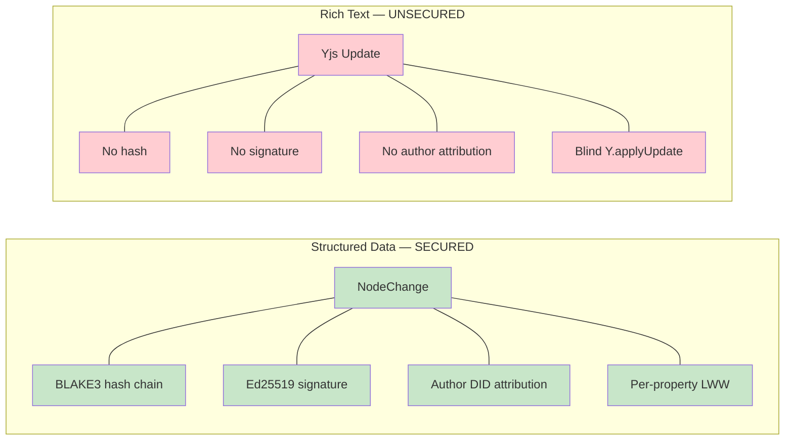
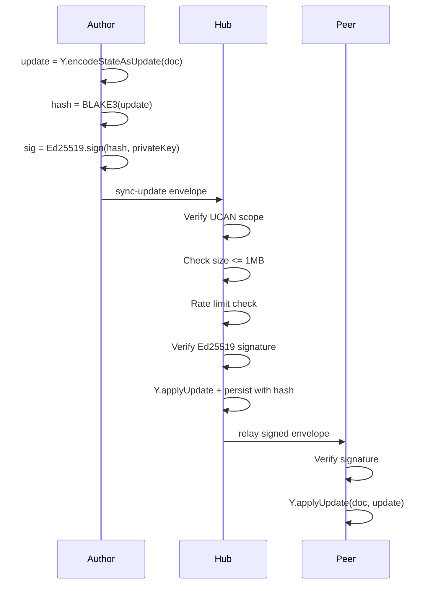
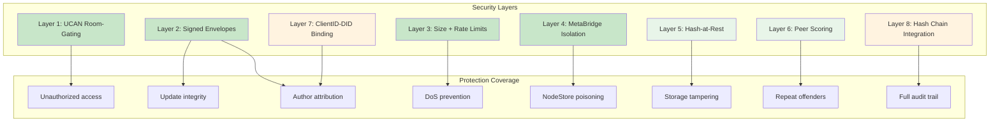
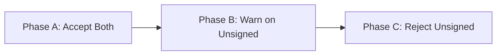

# xNet Implementation Plan - Step 04.1: Yjs Security

> Closing the security gap between signed NodeChanges and unsigned rich text updates

## Executive Summary

xNet has two data layers with radically different security postures. Structured data (NodeChanges) is signed, hashed, and chain-linked. Rich text (Yjs) has no signing, no hashing, and no author attribution — meaning an authorized-but-malicious peer can irreversibly corrupt documents, impersonate authors, or bypass NodeChange signatures via the MetaBridge.

This plan adds layered security to the Yjs sync path across three tiers: immediate hardening, defense-in-depth, and full integrity.

```typescript
// Before: blind relay, no verification
Y.applyUpdate(doc, rawBytes, 'remote')

// After: signed envelope, verified before apply
const envelope = decodeSignedEnvelope(msg)
const hash = blake3(envelope.update)
if (!ed25519Verify(hash, envelope.signature, envelope.authorPublicKey)) {
  peerScorer.penalize(peerId, 'invalid_signature')
  return // Reject
}
Y.applyUpdate(doc, envelope.update, envelope.authorDID)
```

## The Problem



| Property          | NodeChanges                        | Yjs Updates (today)          |
| ----------------- | ---------------------------------- | ---------------------------- |
| Content integrity | BLAKE3 hash of canonical JSON      | None                         |
| Author proof      | Ed25519 signature per change       | None                         |
| Attribution       | `authorDID` field, verifiable      | Random `clientID` integer    |
| Chain linkage     | `parentHash` → verifiable history  | None                         |
| Tamper detection  | `verifyChangeHash()` recomputes    | None                         |
| Hub verification  | Hash check before persist          | Blind `Y.applyUpdate()`      |
| Audit trail       | Full change log with DID per entry | No history of who wrote what |

## Attack Vectors

1. **Document Corruption** — Crafted Yjs update deletes/replaces content; CRDTs have no rollback
2. **Author Impersonation** — `clientID` is a random integer, trivially spoofable
3. **MetaBridge Poisoning** — Yjs meta map changes bypass signed NodeChange pipeline
4. **Denial of Service** — Oversized Yjs updates block the event loop
5. **Stealth Content Injection** — No audit trail for who inserted what text

See [Yjs Security Analysis](../explorations/0025_YJS_SECURITY_ANALYSIS.md) for the full threat model.

## Architecture (Target State)





## Implementation Phases

### Tier 1: Immediate Hardening (Days 1-4)

| Task | Document                                                   | Description                                  |
| ---- | ---------------------------------------------------------- | -------------------------------------------- |
| 1.1  | [01-signed-envelopes.md](./01-signed-envelopes.md)         | SignedYjsEnvelope type + sign/verify utils   |
| 1.2  | [01-signed-envelopes.md](./01-signed-envelopes.md)         | Hub-side envelope verification               |
| 1.3  | [01-signed-envelopes.md](./01-signed-envelopes.md)         | Client-side signing in WebSocketSyncProvider |
| 2.1  | [02-ucan-websocket-auth.md](./02-ucan-websocket-auth.md)   | UCAN token on WebSocket connect              |
| 2.2  | [02-ucan-websocket-auth.md](./02-ucan-websocket-auth.md)   | Room subscription capability checks          |
| 3.1  | [03-update-size-limits.md](./03-update-size-limits.md)     | Per-update size limits (client + hub)        |
| 3.2  | [03-update-size-limits.md](./03-update-size-limits.md)     | Rate limiting per connection                 |
| 3.3  | [03-update-size-limits.md](./03-update-size-limits.md)     | Large sync chunking                          |
| 4.1  | [04-metabridge-isolation.md](./04-metabridge-isolation.md) | Make MetaBridge unidirectional               |
| 4.2  | [04-metabridge-isolation.md](./04-metabridge-isolation.md) | Source tagging for Yjs→NodeStore writes      |

**Tier 1 Validation Gate:**

- [x] All Yjs updates are signed before sending (SignedYjsEnvelope)
- [ ] Hub rejects updates with invalid signatures (needs hub package)
- [ ] WebSocket connections require UCAN token (needs hub package)
- [x] Updates >1MB are rejected; >30/sec are rate-limited (YjsRateLimiter)
- [x] MetaBridge no longer writes Yjs meta changes to NodeStore

### Tier 2: Defense in Depth (Days 5-8)

| Task | Document                                           | Description                           |
| ---- | -------------------------------------------------- | ------------------------------------- |
| 5.1  | [05-hash-at-rest.md](./05-hash-at-rest.md)         | BLAKE3 hash stored with Yjs snapshots |
| 5.2  | [05-hash-at-rest.md](./05-hash-at-rest.md)         | Integrity verification on load        |
| 5.3  | [05-hash-at-rest.md](./05-hash-at-rest.md)         | Recovery from corrupted state         |
| 6.1  | [06-yjs-peer-scoring.md](./06-yjs-peer-scoring.md) | Yjs-specific peer metrics             |
| 6.2  | [06-yjs-peer-scoring.md](./06-yjs-peer-scoring.md) | Score degradation thresholds          |
| 6.3  | [06-yjs-peer-scoring.md](./06-yjs-peer-scoring.md) | Auto-block integration                |

**Tier 2 Validation Gate:**

- [x] Persisted Yjs state includes BLAKE3 hash (PersistedDocState)
- [x] Corrupted-at-rest state detected on load (YjsIntegrityError)
- [x] Peer blocked after 3 invalid signature attempts (YjsPeerScorer)
- [x] Rate/size violations degrade peer score (YjsPeerScorer)

### Tier 3: Full Integrity (Days 9-12)

| Task | Document                                                       | Description                        |
| ---- | -------------------------------------------------------------- | ---------------------------------- |
| 7.1  | [07-clientid-did-binding.md](./07-clientid-did-binding.md)     | Signed ClientIdAttestation on join |
| 7.2  | [07-clientid-did-binding.md](./07-clientid-did-binding.md)     | Verified clientID→DID map per room |
| 7.3  | [07-clientid-did-binding.md](./07-clientid-did-binding.md)     | Reject updates from unattested IDs |
| 8.1  | [08-hash-chain-integration.md](./08-hash-chain-integration.md) | YjsChange type wrapping updates    |
| 8.2  | [08-hash-chain-integration.md](./08-hash-chain-integration.md) | Unified hash chain (Node + Yjs)    |
| 8.3  | [08-hash-chain-integration.md](./08-hash-chain-integration.md) | Update batching (2s / paragraph)   |

**Tier 3 Validation Gate:**

- [x] ClientID→DID binding verified on room join (ClientIdAttestation)
- [x] Updates from unattested clientIDs rejected (validateClientIdOwnership)
- [x] Yjs updates appear in the per-node hash chain (YjsChange type)
- [x] Batching reduces overhead to <0.5 updates/sec (YjsBatcher)

## Affected Packages

| Package          | Changes                                                   |
| ---------------- | --------------------------------------------------------- |
| `@xnet/crypto`   | (existing) BLAKE3, Ed25519 — no changes needed            |
| `@xnet/identity` | (existing) resolveDidKey — no changes needed              |
| `@xnet/sync`     | Add `YjsChange` type (Tier 3 only)                        |
| `@xnet/react`    | WebSocketSyncProvider signing, MetaBridge isolation       |
| `@xnet/network`  | Yjs peer scoring extension to existing PeerScorer         |
| `@xnet/hub`      | Envelope verification, rate limits, hash-at-rest, scoring |

## Performance Budget

| Operation         | Cost          | At 5 updates/sec | Notes                    |
| ----------------- | ------------- | ---------------- | ------------------------ |
| BLAKE3 hash       | ~0.05ms/1KB   | 0.25ms/sec       | BLAKE3 is extremely fast |
| Ed25519 sign      | ~0.1ms        | 0.5ms/sec        | Per update on client     |
| Ed25519 verify    | ~0.2ms        | 1.0ms/sec        | Per update on hub+peers  |
| Envelope overhead | ~200 bytes    | 1KB/sec          | DID + sig + metadata     |
| Total per update  | ~0.3ms client | Negligible       | No perceptible latency   |

## Migration Strategy



1. **Phase A** — Hub accepts signed and unsigned. Logs unsigned as warnings.
2. **Phase B** — Hub still accepts unsigned but peer scorer penalizes them.
3. **Phase C** — `requireSignedUpdates: true` — unsigned rejected.

Anonymous mode (`--anonymous`) stays in Phase A for local dev.

## Minimum Viable Security

The minimum acceptable posture for production:

1. Signed Yjs envelopes (steps 01)
2. UCAN room-gating (step 02)
3. Update size limits (step 03)
4. MetaBridge isolation (step 04)

This covers unauthorized access, per-update verification, author attribution, DoS mitigation, and NodeStore integrity.

## Success Criteria

1. **Every Yjs update is signed** with Ed25519 over BLAKE3(update)
2. **Hub verifies before apply** — invalid signatures rejected, peer scored
3. **WebSocket connections authenticated** via UCAN (except anonymous mode)
4. **Size + rate limits** prevent DoS (1MB max, 30/sec max)
5. **MetaBridge is one-way** — NodeStore→Yjs only, no unsigned writeback
6. **Hash-at-rest** detects storage-level corruption
7. **Peer scoring** auto-blocks repeat offenders
8. **ClientID→DID binding** enables accurate attribution (Tier 3)
9. **Hash chain integration** provides full audit trail for rich text (Tier 3)
10. **Migration path** from unsigned → signed without breaking existing clients

## Reference Documents

- [Yjs Security Analysis](../explorations/0025_YJS_SECURITY_ANALYSIS.md) — Full threat model and research
- [Node Change Architecture](../explorations/0026_NODE_CHANGE_ARCHITECTURE.md) — How the secure path works
- [Hub Phase 1 Plan](../planStep03_8HubPhase1VPS/README.md) — Hub implementation context
- [Telemetry & Network Security](../planStep03_1TelemetryAndNetworkSecurity/README.md) — Peer scoring infrastructure

---

[Back to Main Plan](../plan/README.md) | [Start Implementation →](./01-signed-envelopes.md)
