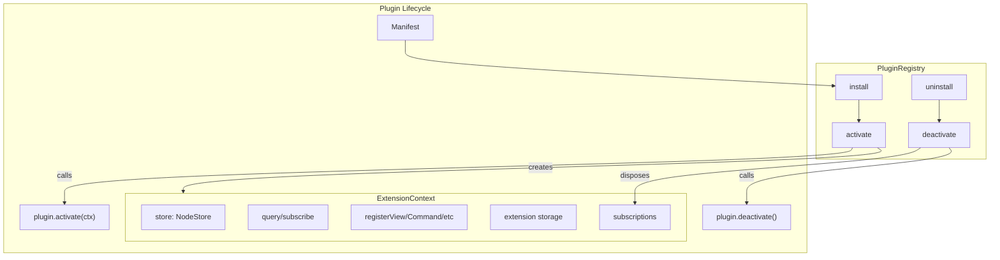

# 01: Plugin Registry Core

> Core infrastructure: PluginRegistry, ExtensionContext, manifest types, lifecycle management.

**Dependencies:** `@xnet/data` (NodeStore, SchemaRegistry)
**New Package:** `packages/plugins/`

## Overview

The PluginRegistry is the central coordinator for all plugins. It handles installation, activation, deactivation, and provides the ExtensionContext that plugins use to interact with xNet.



## Implementation

### 1. Manifest Types

```typescript
// packages/plugins/src/manifest.ts

export type Platform = 'web' | 'electron' | 'mobile'

export interface XNetExtension {
  id: string // reverse-domain: 'com.example.my-plugin'
  name: string
  version: string
  xnetVersion?: string // minimum compatible xNet version
  platforms?: Platform[] // default: all
  permissions?: PluginPermissions

  contributes?: {
    schemas?: SchemaContribution[]
    views?: ViewContribution[]
    editorExtensions?: EditorContribution[]
    propertyHandlers?: PropertyHandlerContribution[]
    blocks?: BlockContribution[]
    commands?: CommandContribution[]
    settings?: SettingContribution[]
    sidebarItems?: SidebarContribution[]
    slashCommands?: SlashCommandContribution[]
  }

  // Lifecycle hooks
  activate?(ctx: ExtensionContext): void | Promise<void>
  deactivate?(): void | Promise<void>
}

export interface PluginPermissions {
  schemas: {
    read: SchemaIRI[] | '*'
    write: SchemaIRI[] | '*'
    create: SchemaIRI[]
  }
  capabilities: {
    network?: boolean | string[] // domain allowlist
    storage?: 'local' | 'shared'
    clipboard?: boolean
    notifications?: boolean
    processes?: boolean // Electron only
  }
}

export function validateManifest(manifest: unknown): XNetExtension {
  // Validate required fields, permission declarations, platform compatibility
  // Throws PluginValidationError with specific issues
}
```

### 2. Extension Context

```typescript
// packages/plugins/src/context.ts

export interface Disposable {
  dispose(): void
}

export interface ExtensionStorage {
  get<T>(key: string): T | undefined
  set<T>(key: string, value: T): void
  delete(key: string): void
  keys(): string[]
}

export interface ExtensionContext {
  // Identity
  pluginId: string
  platform: Platform

  // Data access
  store: NodeStore
  query<T>(schema: SchemaIRI, filter?: Filter): FlatNode[]
  subscribe(schema: SchemaIRI, cb: NodeChangeListener): Disposable

  // Registration (all return Disposable for cleanup)
  registerSchema(schema: DefinedSchema): Disposable
  registerView(view: ViewContribution): Disposable
  registerPropertyHandler(type: string, handler: PropertyHandler): Disposable
  registerCommand(command: CommandContribution): Disposable
  registerSidebarItem(item: SidebarContribution): Disposable
  registerEditorExtension(ext: EditorContribution): Disposable
  registerSlashCommand(cmd: SlashCommandContribution): Disposable
  registerBlockType(block: BlockContribution): Disposable

  // Extension-private storage
  storage: ExtensionStorage

  // Platform capabilities
  capabilities: PlatformCapabilities

  // Auto-cleanup list
  subscriptions: Disposable[]
}

export function createExtensionContext(
  pluginId: string,
  store: NodeStore,
  contributions: ContributionRegistry,
  platform: Platform
): ExtensionContext {
  const disposables: Disposable[] = []
  const localStorage = new Map<string, unknown>()

  const ctx: ExtensionContext = {
    pluginId,
    platform,
    store,

    query(schema, filter) {
      return store.list({ schemaIRI: schema, filter })
    },

    subscribe(schema, cb) {
      const unsub = store.subscribe((event) => {
        if (!schema || event.node?.schemaIRI === schema) {
          cb(event)
        }
      })
      const disposable = { dispose: unsub }
      disposables.push(disposable)
      return disposable
    },

    registerSchema(schema) {
      schemaRegistry.register(schema)
      const d = { dispose: () => schemaRegistry.unregister(schema._schemaId) }
      disposables.push(d)
      return d
    },

    registerView(view) {
      return contributions.views.register(view)
    },

    registerPropertyHandler(type, handler) {
      return contributions.propertyHandlers.register(type, handler)
    },

    registerCommand(command) {
      return contributions.commands.register(command)
    },

    registerSidebarItem(item) {
      return contributions.sidebar.register(item)
    },

    registerEditorExtension(ext) {
      return contributions.editor.register(ext)
    },

    registerSlashCommand(cmd) {
      return contributions.slashCommands.register(cmd)
    },

    registerBlockType(block) {
      registerBlockType(block)
      return {
        dispose: () => {
          /* block registry needs unregister */
        }
      }
    },

    storage: {
      get: (key) => localStorage.get(key) as any,
      set: (key, value) => localStorage.set(key, value),
      delete: (key) => localStorage.delete(key),
      keys: () => [...localStorage.keys()]
    },

    capabilities: getPlatformCapabilities(platform),
    subscriptions: disposables
  }

  return ctx
}
```

### 3. Plugin Registry

```typescript
// packages/plugins/src/registry.ts

export interface RegisteredPlugin {
  manifest: XNetExtension
  status: 'installed' | 'active' | 'disabled' | 'error'
  context?: ExtensionContext
  error?: Error
}

export class PluginRegistry {
  private plugins = new Map<string, RegisteredPlugin>()
  private contributions = new ContributionRegistry()
  private store: NodeStore

  constructor(
    store: NodeStore,
    private platform: Platform
  ) {
    this.store = store
  }

  async install(manifest: XNetExtension): Promise<void> {
    // 1. Validate
    validateManifest(manifest)

    // 2. Check platform
    if (manifest.platforms && !manifest.platforms.includes(this.platform)) {
      throw new PluginError(
        `Plugin '${manifest.id}' requires platforms: ${manifest.platforms.join(', ')}`
      )
    }

    // 3. Check for conflicts
    if (this.plugins.has(manifest.id)) {
      throw new PluginError(`Plugin '${manifest.id}' is already installed`)
    }

    // 4. Store as Node
    await this.store.create({
      schemaIRI: 'xnet://xnet.dev/Plugin',
      properties: {
        pluginId: manifest.id,
        name: manifest.name,
        version: manifest.version,
        enabled: true,
        manifest: JSON.stringify(manifest)
      }
    })

    // 5. Register
    this.plugins.set(manifest.id, { manifest, status: 'installed' })

    // 6. Activate
    await this.activate(manifest.id)
  }

  async activate(pluginId: string): Promise<void> {
    const plugin = this.plugins.get(pluginId)
    if (!plugin) throw new PluginError(`Plugin '${pluginId}' not found`)
    if (plugin.status === 'active') return

    try {
      // Create context
      const context = createExtensionContext(
        pluginId,
        this.store,
        this.contributions,
        this.platform
      )

      // Register static contributions from manifest
      this.registerStaticContributions(plugin.manifest, context)

      // Call activate lifecycle hook
      if (plugin.manifest.activate) {
        await plugin.manifest.activate(context)
      }

      plugin.context = context
      plugin.status = 'active'
      plugin.error = undefined
    } catch (err) {
      plugin.status = 'error'
      plugin.error = err instanceof Error ? err : new Error(String(err))
      console.error(`Plugin '${pluginId}' activation failed:`, err)
    }
  }

  async deactivate(pluginId: string): Promise<void> {
    const plugin = this.plugins.get(pluginId)
    if (!plugin || plugin.status !== 'active') return

    try {
      // Call deactivate lifecycle hook
      if (plugin.manifest.deactivate) {
        await plugin.manifest.deactivate()
      }
    } finally {
      // Always dispose subscriptions, even if deactivate throws
      if (plugin.context) {
        for (const d of plugin.context.subscriptions) {
          try {
            d.dispose()
          } catch {}
        }
      }
      plugin.context = undefined
      plugin.status = 'disabled'
    }
  }

  async uninstall(pluginId: string): Promise<void> {
    await this.deactivate(pluginId)
    this.plugins.delete(pluginId)

    // Remove plugin Node from store
    const nodes = this.store.list({ schemaIRI: 'xnet://xnet.dev/Plugin' })
    const pluginNode = nodes.find((n) => n.pluginId === pluginId)
    if (pluginNode) {
      await this.store.delete(pluginNode.id)
    }
  }

  getAll(): RegisteredPlugin[] {
    return [...this.plugins.values()]
  }

  get(pluginId: string): RegisteredPlugin | undefined {
    return this.plugins.get(pluginId)
  }

  getContributions(): ContributionRegistry {
    return this.contributions
  }

  private registerStaticContributions(manifest: XNetExtension, ctx: ExtensionContext): void {
    const c = manifest.contributes
    if (!c) return

    if (c.schemas) {
      for (const s of c.schemas) ctx.registerSchema(s.schema)
    }
    if (c.views) {
      for (const v of c.views) ctx.registerView(v)
    }
    if (c.editorExtensions) {
      for (const e of c.editorExtensions) ctx.registerEditorExtension(e)
    }
    if (c.commands) {
      for (const cmd of c.commands) ctx.registerCommand(cmd)
    }
    if (c.sidebarItems) {
      for (const item of c.sidebarItems) ctx.registerSidebarItem(item)
    }
    if (c.slashCommands) {
      for (const cmd of c.slashCommands) ctx.registerSlashCommand(cmd)
    }
    if (c.propertyHandlers) {
      for (const h of c.propertyHandlers) ctx.registerPropertyHandler(h.type, h.handler)
    }
    if (c.blocks) {
      for (const b of c.blocks) ctx.registerBlockType(b)
    }
  }
}
```

### 4. Plugin Schema (Plugins as Nodes)

```typescript
// packages/plugins/src/schemas/plugin.ts

import { defineSchema, text, checkbox } from '@xnet/data'

export const PluginSchema = defineSchema({
  name: 'Plugin',
  namespace: 'xnet://xnet.dev/',
  properties: {
    pluginId: text({ required: true }),
    name: text({ required: true }),
    version: text({ required: true }),
    description: text({}),
    author: text({}),
    enabled: checkbox({ default: true }),
    manifest: text({ required: true }), // JSON-serialized manifest
    source: text({}), // URL or inline bundle
    permissions: text({}), // JSON-serialized permissions
    installedAt: date({})
  }
})
```

### 5. Contribution Registry

```typescript
// packages/plugins/src/contributions/registry.ts

export class ContributionRegistry {
  readonly views = new TypedRegistry<ViewContribution>()
  readonly commands = new TypedRegistry<CommandContribution>()
  readonly sidebar = new TypedRegistry<SidebarContribution>()
  readonly editor = new TypedRegistry<EditorContribution>()
  readonly slashCommands = new TypedRegistry<SlashCommandContribution>()
  readonly propertyHandlers = new TypedRegistry<PropertyHandlerContribution>()
}

class TypedRegistry<T extends { id?: string; type?: string }> {
  private items = new Map<string, T>()
  private listeners = new Set<() => void>()

  register(item: T): Disposable {
    const key = (item as any).id ?? (item as any).type ?? crypto.randomUUID()
    this.items.set(key, item)
    this.notify()
    return {
      dispose: () => {
        this.items.delete(key)
        this.notify()
      }
    }
  }

  getAll(): T[] {
    return [...this.items.values()]
  }

  get(key: string): T | undefined {
    return this.items.get(key)
  }

  onChange(listener: () => void): () => void {
    this.listeners.add(listener)
    return () => this.listeners.delete(listener)
  }

  private notify(): void {
    for (const l of this.listeners) l()
  }
}
```

### 6. React Integration

```typescript
// packages/react/src/hooks/usePlugins.ts

import { PluginRegistry } from '@xnet/plugins'

const PluginRegistryContext = createContext<PluginRegistry | null>(null)

export function usePluginRegistry(): PluginRegistry {
  const registry = useContext(PluginRegistryContext)
  if (!registry) throw new Error('PluginRegistry not found in context')
  return registry
}

export function useContributions<T>(type: keyof ContributionRegistry): T[] {
  const registry = usePluginRegistry()
  const contributions = registry.getContributions()
  const [items, setItems] = useState(contributions[type].getAll())

  useEffect(() => {
    return contributions[type].onChange(() => {
      setItems(contributions[type].getAll())
    })
  }, [contributions, type])

  return items as T[]
}

// Usage in XNetProvider:
// <PluginRegistryContext.Provider value={pluginRegistry}>
//   {children}
// </PluginRegistryContext.Provider>
```

## Package Setup

```json
// packages/plugins/package.json
{
  "name": "@xnet/plugins",
  "version": "0.1.0",
  "type": "module",
  "main": "src/index.ts",
  "dependencies": {
    "@xnet/data": "workspace:*",
    "@xnet/core": "workspace:*"
  },
  "devDependencies": {
    "vitest": "^3.0.0"
  }
}
```

## Tests

```typescript
// packages/plugins/src/__tests__/registry.test.ts

describe('PluginRegistry', () => {
  it('installs and activates a plugin', async () => {
    const store = createMemoryNodeStore()
    const registry = new PluginRegistry(store, 'web')

    const activated = vi.fn()
    await registry.install({
      id: 'test.plugin',
      name: 'Test',
      version: '1.0.0',
      activate: activated
    })

    expect(activated).toHaveBeenCalled()
    expect(registry.get('test.plugin')?.status).toBe('active')
  })

  it('disposes all subscriptions on deactivate', async () => {
    const store = createMemoryNodeStore()
    const registry = new PluginRegistry(store, 'web')

    const disposed = vi.fn()
    await registry.install({
      id: 'test.plugin',
      name: 'Test',
      version: '1.0.0',
      activate: (ctx) => {
        ctx.subscriptions.push({ dispose: disposed })
      }
    })

    await registry.deactivate('test.plugin')
    expect(disposed).toHaveBeenCalled()
  })

  it('rejects plugins incompatible with current platform', async () => {
    const store = createMemoryNodeStore()
    const registry = new PluginRegistry(store, 'web')

    await expect(
      registry.install({
        id: 'electron.only',
        name: 'Electron Only',
        version: '1.0.0',
        platforms: ['electron']
      })
    ).rejects.toThrow('requires platforms')
  })

  it('stores plugin metadata as a Node', async () => {
    const store = createMemoryNodeStore()
    const registry = new PluginRegistry(store, 'web')

    await registry.install({
      id: 'test.plugin',
      name: 'Test',
      version: '1.0.0'
    })

    const nodes = store.list({ schemaIRI: 'xnet://xnet.dev/Plugin' })
    expect(nodes).toHaveLength(1)
    expect(nodes[0].pluginId).toBe('test.plugin')
  })
})
```

## Checklist

- [ ] Create `packages/plugins/` with package.json and tsconfig
- [ ] Implement manifest types and validation
- [ ] Implement ExtensionContext with all registration methods
- [ ] Implement PluginRegistry (install/activate/deactivate/uninstall)
- [ ] Implement ContributionRegistry with change notifications
- [ ] Define PluginSchema for storing plugins as Nodes
- [ ] Add PluginRegistryContext to `@xnet/react`
- [ ] Add `usePluginRegistry` and `useContributions` hooks
- [ ] Wire PluginRegistry into XNetProvider
- [ ] Write unit tests (target: 20+ tests)
- [ ] Define `defineExtension()` helper for plugin authors

---

[Back to README](./README.md) | [Next: Extension Points](./02-extension-points.md)
