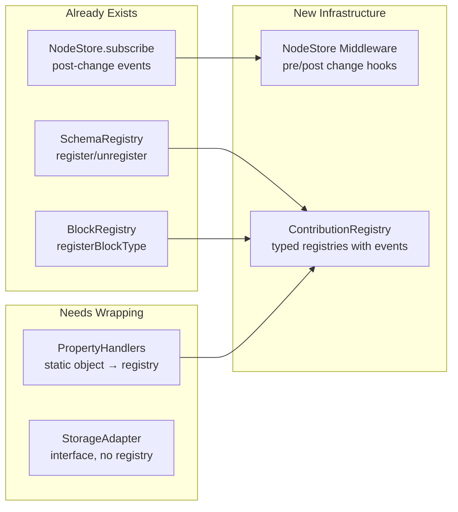

# 02: Extension Points

> Wire existing registries into the plugin system and add NodeStore middleware.

**Dependencies:** Step 01 (PluginRegistry, ExtensionContext)

## Overview

xNet already has several registration patterns (SchemaRegistry, BlockRegistry, NodeStore subscribe). This step formalizes them as plugin extension points and adds the missing middleware infrastructure on NodeStore.



## Implementation

### 1. NodeStore Middleware Chain

Add a middleware pipeline to NodeStore that intercepts create/update/delete before they're applied:

```typescript
// packages/data/src/store/middleware.ts

export interface NodeStoreMiddleware {
  id: string
  priority?: number // lower = runs first, default 100

  // Pre-change: can modify, reject, or pass through
  beforeChange?(
    change: PendingChange,
    next: () => Promise<NodeState | null>
  ): Promise<NodeState | null>

  // Post-change: observe only (can't modify)
  afterChange?(event: NodeChangeEvent): void
}

export interface PendingChange {
  type: 'create' | 'update' | 'delete' | 'restore'
  nodeId: NodeId
  schemaIRI?: SchemaIRI
  payload?: Partial<NodePayload>
  meta?: Record<string, unknown>
}

export class MiddlewareChain {
  private middlewares: NodeStoreMiddleware[] = []

  add(middleware: NodeStoreMiddleware): Disposable {
    this.middlewares.push(middleware)
    this.middlewares.sort((a, b) => (a.priority ?? 100) - (b.priority ?? 100))
    return {
      dispose: () => {
        this.middlewares = this.middlewares.filter((m) => m.id !== middleware.id)
      }
    }
  }

  async executeBefore(
    change: PendingChange,
    apply: () => Promise<NodeState | null>
  ): Promise<NodeState | null> {
    const chain = [...this.middlewares.filter((m) => m.beforeChange)]

    const execute = async (index: number): Promise<NodeState | null> => {
      if (index >= chain.length) return apply()
      return chain[index].beforeChange!(change, () => execute(index + 1))
    }

    return execute(0)
  }

  executeAfter(event: NodeChangeEvent): void {
    for (const m of this.middlewares) {
      if (m.afterChange) {
        try {
          m.afterChange(event)
        } catch (err) {
          console.error(`Middleware '${m.id}' afterChange error:`, err)
        }
      }
    }
  }
}
```

### 2. NodeStore Integration

Modify NodeStore to use the middleware chain:

```typescript
// packages/data/src/store/store.ts (modifications)

export class NodeStore {
  readonly middleware = new MiddlewareChain()

  // Existing create method, wrapped with middleware:
  async create(input: CreateNodeInput): Promise<NodeState> {
    const pending: PendingChange = {
      type: 'create',
      nodeId: input.id ?? generateNodeId(),
      schemaIRI: input.schemaIRI,
      payload: input.properties
    }

    const result = await this.middleware.executeBefore(pending, async () => {
      // ... existing create logic ...
      return nodeState
    })

    if (result) {
      const event: NodeChangeEvent = { change, node: result, isRemote: false }
      this.emit(event)
      this.middleware.executeAfter(event)
    }

    return result!
  }

  // Same pattern for update, delete, restore
}
```

### 3. PropertyHandler Dynamic Registry

Convert the static handler object in `@xnet/views` to a dynamic registry:

```typescript
// packages/views/src/properties/index.ts (modified)

const builtinHandlers: Record<string, PropertyHandler<any>> = {
  text: textHandler,
  number: numberHandler,
  checkbox: checkboxHandler,
  date: dateHandler,
  select: selectHandler,
  multiSelect: multiSelectHandler,
  url: urlHandler,
  email: emailHandler,
  phone: phoneHandler,
  created: dateHandler,
  updated: dateHandler,
  createdBy: textHandler
}

// Dynamic registry for plugin-added handlers
const customHandlers = new Map<string, PropertyHandler<any>>()
const listeners = new Set<() => void>()

export function registerPropertyHandler(type: string, handler: PropertyHandler<any>): Disposable {
  customHandlers.set(type, handler)
  listeners.forEach((l) => l())
  return {
    dispose: () => {
      customHandlers.delete(type)
      listeners.forEach((l) => l())
    }
  }
}

export function getPropertyHandler(type: PropertyType | string): PropertyHandler<any> {
  return customHandlers.get(type) ?? builtinHandlers[type] ?? textHandler
}

export function onPropertyHandlersChange(listener: () => void): () => void {
  listeners.add(listener)
  return () => listeners.delete(listener)
}
```

### 4. ExtensionContext Middleware Access

Add middleware registration to the ExtensionContext:

```typescript
// Addition to packages/plugins/src/context.ts

export interface ExtensionContext {
  // ... existing fields ...

  // Middleware
  addMiddleware(middleware: NodeStoreMiddleware): Disposable
}

// In createExtensionContext:
addMiddleware(middleware) {
  const namespaced = {
    ...middleware,
    id: `${pluginId}:${middleware.id}`
  }
  const d = store.middleware.add(namespaced)
  disposables.push(d)
  return d
}
```

### 5. Extension Point Discovery Helper

A utility for plugins to discover what extension points are available on the current platform:

```typescript
// packages/plugins/src/capabilities.ts

export interface PlatformCapabilities {
  platform: Platform
  features: {
    views: boolean // always true
    editorExtensions: boolean // true on web/electron, limited on mobile
    slashCommands: boolean // true on web/electron
    services: boolean // Electron only
    processes: boolean // Electron only
    localAPI: boolean // Electron only
    filesystem: boolean // Electron only
    clipboard: boolean // web/electron
    notifications: boolean // all platforms
    p2pSync: boolean // all platforms
  }
}

export function getPlatformCapabilities(platform: Platform): PlatformCapabilities {
  return {
    platform,
    features: {
      views: true,
      editorExtensions: platform !== 'mobile',
      slashCommands: platform !== 'mobile',
      services: platform === 'electron',
      processes: platform === 'electron',
      localAPI: platform === 'electron',
      filesystem: platform === 'electron',
      clipboard: platform !== 'mobile',
      notifications: true,
      p2pSync: true
    }
  }
}
```

## Example: Validation Middleware Plugin

```typescript
// Example of a plugin using middleware to enforce business rules

export default defineExtension({
  id: 'com.example.invoice-validation',
  name: 'Invoice Validation',
  version: '1.0.0',

  activate(ctx) {
    ctx.addMiddleware({
      id: 'validate-invoices',
      priority: 50, // run early

      async beforeChange(change, next) {
        if (change.schemaIRI !== 'xnet://xnet.dev/Invoice') {
          return next() // pass through non-invoice changes
        }

        // Validate required fields
        if (change.type === 'create' || change.type === 'update') {
          if (!change.payload?.amount || change.payload.amount <= 0) {
            throw new Error('Invoice amount must be positive')
          }
          if (!change.payload?.clientName) {
            throw new Error('Invoice must have a client name')
          }
        }

        return next()
      },

      afterChange(event) {
        if (event.node?.schemaIRI === 'xnet://xnet.dev/Invoice') {
          console.log(`Invoice ${event.node.id} changed:`, event.change)
        }
      }
    })
  }
})
```

## Tests

```typescript
describe('NodeStore Middleware', () => {
  it('calls beforeChange middleware in priority order', async () => {
    const store = createMemoryNodeStore()
    const order: string[] = []

    store.middleware.add({
      id: 'second',
      priority: 200,
      beforeChange: async (change, next) => {
        order.push('second')
        return next()
      }
    })
    store.middleware.add({
      id: 'first',
      priority: 50,
      beforeChange: async (change, next) => {
        order.push('first')
        return next()
      }
    })

    await store.create({ schemaIRI: 'xnet://test/Foo', properties: {} })
    expect(order).toEqual(['first', 'second'])
  })

  it('middleware can reject changes by throwing', async () => {
    const store = createMemoryNodeStore()
    store.middleware.add({
      id: 'reject-all',
      beforeChange: async () => {
        throw new Error('rejected')
      }
    })

    await expect(
      store.create({
        schemaIRI: 'xnet://test/Foo',
        properties: {}
      })
    ).rejects.toThrow('rejected')
  })

  it('middleware can modify pending changes', async () => {
    const store = createMemoryNodeStore()
    store.middleware.add({
      id: 'auto-timestamp',
      beforeChange: async (change, next) => {
        if (change.type === 'create') {
          change.payload = { ...change.payload, createdAt: Date.now() }
        }
        return next()
      }
    })

    const node = await store.create({
      schemaIRI: 'xnet://test/Foo',
      properties: { title: 'Hello' }
    })
    expect(node.properties.createdAt).toBeDefined()
  })
})

describe('PropertyHandler Registry', () => {
  it('returns custom handler when registered', () => {
    const handler: PropertyHandler = {
      /* ... */
    }
    const d = registerPropertyHandler('currency', handler)
    expect(getPropertyHandler('currency')).toBe(handler)
    d.dispose()
    expect(getPropertyHandler('currency')).toBe(textHandler)
  })
})
```

## Checklist

- [ ] Implement `MiddlewareChain` class with priority ordering
- [ ] Add `middleware` field to `NodeStore`
- [ ] Wrap NodeStore `create/update/delete/restore` with middleware calls
- [ ] Convert property handler lookup to dynamic registry
- [ ] Add `registerPropertyHandler()` and `onPropertyHandlersChange()` to `@xnet/views`
- [ ] Add `addMiddleware()` to `ExtensionContext`
- [ ] Implement `PlatformCapabilities` discovery
- [ ] Ensure middleware errors don't break the store (error isolation)
- [ ] Write middleware tests (priority, rejection, modification, disposal)
- [ ] Write property handler registry tests

---

[Back to README](./README.md) | [Previous: Plugin Registry Core](./01-plugin-registry-core.md) | [Next: View Registry](./03-view-registry.md)
