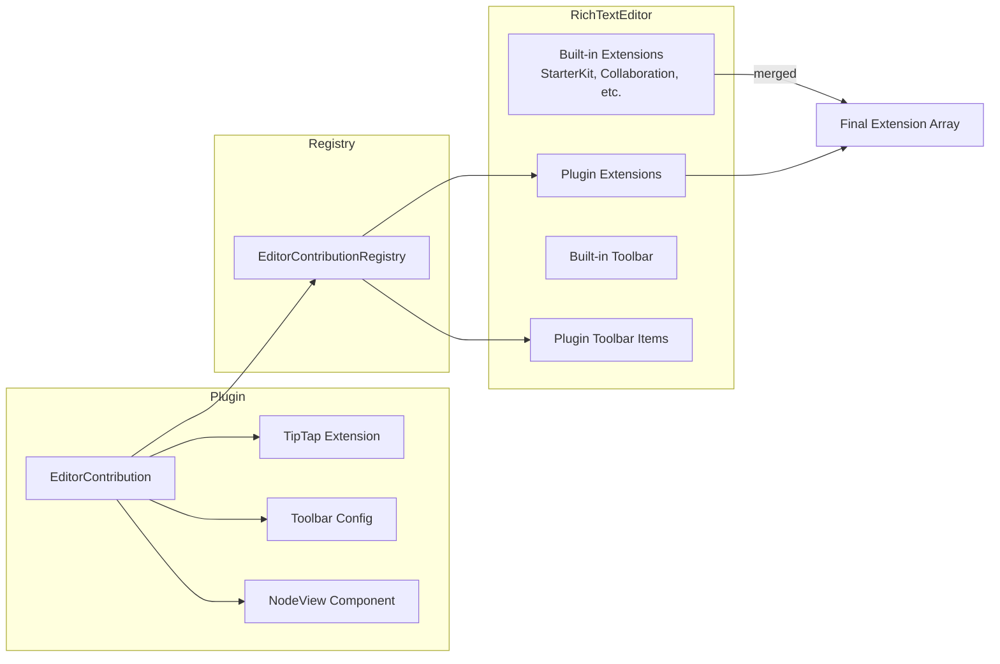

# 04: Editor Extensions

> Make RichTextEditor accept external TipTap extensions, custom blocks, and toolbar items from plugins.

**Dependencies:** Step 01 (ContributionRegistry)

## Overview

The `RichTextEditor` currently hardcodes its extension list. This step adds an `extensions` prop and a contribution-based system so plugins can inject TipTap extensions, custom node views, and toolbar buttons.



## Implementation

### 1. Editor Contribution Types

```typescript
// packages/plugins/src/contributions/editor.ts

export interface EditorContribution {
  id: string
  extension: Extension | Node | Mark // TipTap extension
  toolbar?: ToolbarContribution
  priority?: number // ordering (default: 100)
}

export interface ToolbarContribution {
  icon: string | React.ComponentType<{}>
  title: string
  group?: 'format' | 'insert' | 'block' | 'custom' // toolbar section
  isActive?: (editor: TipTapEditor) => boolean
  action: (editor: TipTapEditor) => void
  shortcut?: string // e.g., 'Mod-Shift-M'
}
```

### 2. Modify RichTextEditor to Accept Extensions

```typescript
// packages/editor/src/components/RichTextEditor.tsx (modified)

interface RichTextEditorProps {
  fragment: Y.XmlFragment
  onNavigate?: (target: string) => void
  placeholder?: string
  editable?: boolean
  // NEW: accept additional extensions
  extensions?: (Extension | Node | Mark)[]
  // NEW: accept additional toolbar items
  toolbarItems?: ToolbarContribution[]
}

export function RichTextEditor({
  fragment,
  onNavigate,
  placeholder,
  editable = true,
  extensions: additionalExtensions = [],
  toolbarItems: additionalToolbar = [],
}: RichTextEditorProps) {
  const editor = useEditor({
    extensions: [
      // Built-in extensions
      StarterKit.configure({ history: false }),
      Typography,
      Placeholder.configure({ placeholder: placeholder ?? 'Start writing...' }),
      Collaboration.configure({ fragment }),
      TaskList,
      TaskItem.configure({ nested: true }),
      Link.configure({ openOnClick: false }),
      Wikilink.configure({ onNavigate }),
      LivePreview,
      // Plugin extensions merged in
      ...additionalExtensions,
    ],
    editable,
  })

  return (
    <div className="editor-container">
      <FloatingToolbar
        editor={editor}
        additionalItems={additionalToolbar}
      />
      <EditorContent editor={editor} />
    </div>
  )
}
```

### 3. FloatingToolbar Extension

```typescript
// packages/editor/src/components/FloatingToolbar.tsx (modified)

interface FloatingToolbarProps {
  editor: TipTapEditor | null
  additionalItems?: ToolbarContribution[]
}

export function FloatingToolbar({ editor, additionalItems = [] }: FloatingToolbarProps) {
  if (!editor) return null

  // Group built-in + plugin items
  const formatItems = additionalItems.filter(i => i.group === 'format')
  const insertItems = additionalItems.filter(i => i.group === 'insert')
  const customItems = additionalItems.filter(i => i.group === 'custom' || !i.group)

  return (
    <BubbleMenu editor={editor}>
      {/* Built-in format buttons */}
      <ToolbarButton icon="bold" ... />
      <ToolbarButton icon="italic" ... />
      {/* Plugin format buttons */}
      {formatItems.map(item => (
        <PluginToolbarButton key={item.title} item={item} editor={editor} />
      ))}

      <Separator />

      {/* Built-in insert buttons */}
      {/* Plugin insert buttons */}
      {insertItems.map(item => (
        <PluginToolbarButton key={item.title} item={item} editor={editor} />
      ))}

      {customItems.length > 0 && <Separator />}
      {/* Plugin custom buttons */}
      {customItems.map(item => (
        <PluginToolbarButton key={item.title} item={item} editor={editor} />
      ))}
    </BubbleMenu>
  )
}

function PluginToolbarButton({ item, editor }: { item: ToolbarContribution; editor: TipTapEditor }) {
  const isActive = item.isActive?.(editor) ?? false
  return (
    <button
      onClick={() => item.action(editor)}
      className={isActive ? 'is-active' : ''}
      title={item.title + (item.shortcut ? ` (${item.shortcut})` : '')}
    >
      {typeof item.icon === 'string' ? <Icon name={item.icon} /> : <item.icon />}
    </button>
  )
}
```

### 4. Hook to Collect Editor Contributions

```typescript
// packages/editor/src/hooks/useEditorExtensions.ts

export function useEditorExtensions(): {
  extensions: (Extension | Node | Mark)[]
  toolbarItems: ToolbarContribution[]
} {
  const contributions = useContributions<EditorContribution>('editor')

  const extensions = useMemo(
    () =>
      contributions
        .sort((a, b) => (a.priority ?? 100) - (b.priority ?? 100))
        .map((c) => c.extension),
    [contributions]
  )

  const toolbarItems = useMemo(
    () => contributions.filter((c) => c.toolbar).map((c) => c.toolbar!),
    [contributions]
  )

  return { extensions, toolbarItems }
}
```

### 5. Wire Into Document Pages

```typescript
// apps/web/src/components/Editor.tsx (modified)

export function Editor({ docId }: { docId: string }) {
  const { data, doc } = useDocument(PageSchema, docId, { createIfMissing: true })
  const { extensions, toolbarItems } = useEditorExtensions()

  if (!doc) return <Loading />

  return (
    <RichTextEditor
      fragment={doc.getXmlFragment('content')}
      extensions={extensions}
      toolbarItems={toolbarItems}
      onNavigate={handleNavigate}
    />
  )
}
```

## Example: Mermaid Diagram Plugin

```typescript
import { Node } from '@tiptap/core'
import { ReactNodeViewRenderer } from '@tiptap/react'
import { defineExtension } from '@xnet/plugins'

// TipTap Node for Mermaid blocks
const MermaidNode = Node.create({
  name: 'mermaid',
  group: 'block',
  atom: true,
  addAttributes() {
    return { code: { default: '' } }
  },
  parseHTML() {
    return [{ tag: 'div[data-type="mermaid"]' }]
  },
  renderHTML({ HTMLAttributes }) {
    return ['div', { 'data-type': 'mermaid', ...HTMLAttributes }]
  },
  addNodeView() {
    return ReactNodeViewRenderer(MermaidNodeView)
  }
})

// React component for rendering/editing Mermaid
function MermaidNodeView({ node, updateAttributes }: NodeViewProps) {
  const [editing, setEditing] = useState(false)
  // ... render mermaid SVG or code editor
}

export default defineExtension({
  id: 'com.xnet.mermaid',
  name: 'Mermaid Diagrams',
  version: '1.0.0',
  contributes: {
    editorExtensions: [
      {
        id: 'mermaid-node',
        extension: MermaidNode,
        toolbar: {
          icon: 'git-branch',
          title: 'Insert Mermaid Diagram',
          group: 'insert',
          action: (editor) => {
            editor
              .chain()
              .focus()
              .insertContent({
                type: 'mermaid',
                attrs: { code: 'graph TD\n  A --> B' }
              })
              .run()
          }
        }
      }
    ]
  }
})
```

## Example: Highlight Mark Plugin

```typescript
import { Mark } from '@tiptap/core'
import { defineExtension } from '@xnet/plugins'

const Highlight = Mark.create({
  name: 'highlight',
  addAttributes() {
    return { color: { default: 'yellow' } }
  },
  parseHTML() {
    return [{ tag: 'mark' }]
  },
  renderHTML({ HTMLAttributes }) {
    return ['mark', { style: `background-color: ${HTMLAttributes.color}` }, 0]
  },
  addKeyboardShortcuts() {
    return { 'Mod-Shift-H': () => this.editor.commands.toggleMark('highlight') }
  }
})

export default defineExtension({
  id: 'com.xnet.highlight',
  name: 'Highlight',
  version: '1.0.0',
  contributes: {
    editorExtensions: [
      {
        id: 'highlight-mark',
        extension: Highlight,
        toolbar: {
          icon: 'highlighter',
          title: 'Highlight',
          group: 'format',
          shortcut: 'Mod-Shift-H',
          isActive: (editor) => editor.isActive('highlight'),
          action: (editor) => editor.chain().focus().toggleMark('highlight').run()
        }
      }
    ]
  }
})
```

## Checklist

- [ ] Add `extensions` prop to `RichTextEditor`
- [ ] Add `toolbarItems` prop to `FloatingToolbar`
- [ ] Create `PluginToolbarButton` component
- [ ] Create `useEditorExtensions` hook
- [ ] Define `EditorContribution` and `ToolbarContribution` types
- [ ] Wire `useEditorExtensions` into app document pages
- [ ] Ensure hot-reload works (extension list changes re-create editor)
- [ ] Handle extension conflicts (duplicate names)
- [ ] Test with a sample extension (highlight mark)
- [ ] Test NodeView rendering (custom block)

---

[Back to README](./README.md) | [Previous: View Registry](./03-view-registry.md) | [Next: Slash Commands](./05-slash-commands.md)
