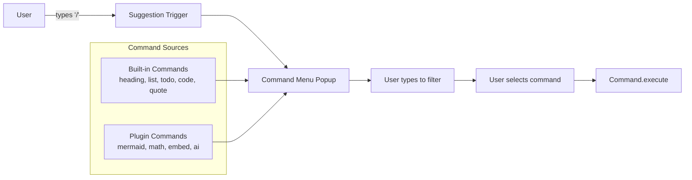

# 05: Slash Commands

> TipTap suggestion plugin enabling `/command` menus, extensible by plugins.

**Dependencies:** Step 01 (ContributionRegistry), Step 04 (Editor extension prop)

## Overview

Slash commands provide a discoverable way to insert content and trigger actions in the editor. Users type `/` and get a filterable menu of available commands — from built-in block types to plugin-contributed actions.



## Implementation

### 1. Slash Command Types

```typescript
// packages/plugins/src/contributions/slash-commands.ts

export interface SlashCommandContribution {
  id: string
  name: string // display name
  description?: string // shown below name
  icon?: string | React.ComponentType<{}>
  keywords?: string[] // for fuzzy search
  group?: string // grouping in menu
  priority?: number // ordering (lower = higher)
  platforms?: Platform[]
  execute: (editor: TipTapEditor, range: Range) => void
}

// Built-in commands
export const builtinSlashCommands: SlashCommandContribution[] = [
  {
    id: 'heading1',
    name: 'Heading 1',
    description: 'Large section heading',
    icon: 'heading-1',
    keywords: ['h1', 'title', 'large'],
    group: 'Basic Blocks',
    priority: 10,
    execute: (editor, range) => {
      editor.chain().focus().deleteRange(range).setHeading({ level: 1 }).run()
    }
  },
  {
    id: 'heading2',
    name: 'Heading 2',
    description: 'Medium section heading',
    icon: 'heading-2',
    keywords: ['h2', 'subtitle'],
    group: 'Basic Blocks',
    priority: 11,
    execute: (editor, range) => {
      editor.chain().focus().deleteRange(range).setHeading({ level: 2 }).run()
    }
  },
  {
    id: 'heading3',
    name: 'Heading 3',
    description: 'Small section heading',
    icon: 'heading-3',
    keywords: ['h3'],
    group: 'Basic Blocks',
    priority: 12,
    execute: (editor, range) => {
      editor.chain().focus().deleteRange(range).setHeading({ level: 3 }).run()
    }
  },
  {
    id: 'bullet-list',
    name: 'Bullet List',
    description: 'Unordered list',
    icon: 'list',
    keywords: ['ul', 'unordered', 'bullets'],
    group: 'Basic Blocks',
    priority: 20,
    execute: (editor, range) => {
      editor.chain().focus().deleteRange(range).toggleBulletList().run()
    }
  },
  {
    id: 'numbered-list',
    name: 'Numbered List',
    description: 'Ordered list',
    icon: 'list-ordered',
    keywords: ['ol', 'ordered', 'numbers'],
    group: 'Basic Blocks',
    priority: 21,
    execute: (editor, range) => {
      editor.chain().focus().deleteRange(range).toggleOrderedList().run()
    }
  },
  {
    id: 'todo-list',
    name: 'To-Do List',
    description: 'Checkable task list',
    icon: 'check-square',
    keywords: ['task', 'checkbox', 'todo'],
    group: 'Basic Blocks',
    priority: 22,
    execute: (editor, range) => {
      editor.chain().focus().deleteRange(range).toggleTaskList().run()
    }
  },
  {
    id: 'code-block',
    name: 'Code Block',
    description: 'Syntax-highlighted code',
    icon: 'code',
    keywords: ['pre', 'syntax', 'program'],
    group: 'Basic Blocks',
    priority: 30,
    execute: (editor, range) => {
      editor.chain().focus().deleteRange(range).toggleCodeBlock().run()
    }
  },
  {
    id: 'blockquote',
    name: 'Quote',
    description: 'Block quotation',
    icon: 'quote',
    keywords: ['blockquote', 'cite'],
    group: 'Basic Blocks',
    priority: 31,
    execute: (editor, range) => {
      editor.chain().focus().deleteRange(range).toggleBlockquote().run()
    }
  },
  {
    id: 'divider',
    name: 'Divider',
    description: 'Horizontal rule',
    icon: 'minus',
    keywords: ['hr', 'separator', 'line'],
    group: 'Basic Blocks',
    priority: 32,
    execute: (editor, range) => {
      editor.chain().focus().deleteRange(range).setHorizontalRule().run()
    }
  }
]
```

### 2. TipTap Suggestion Extension

```typescript
// packages/editor/src/extensions/slash-commands.ts

import { Extension } from '@tiptap/core'
import Suggestion, { SuggestionOptions } from '@tiptap/suggestion'

export interface SlashCommandsOptions {
  commands: SlashCommandContribution[]
  onOpen?: () => void
  onClose?: () => void
}

export const SlashCommands = Extension.create<SlashCommandsOptions>({
  name: 'slashCommands',

  addOptions() {
    return {
      commands: builtinSlashCommands
    }
  },

  addProseMirrorPlugins() {
    return [
      Suggestion({
        editor: this.editor,
        char: '/',
        startOfLine: false,
        command: ({ editor, range, props }) => {
          props.command.execute(editor, range)
        },
        items: ({ query }) => {
          return this.options.commands
            .filter((cmd) => {
              const q = query.toLowerCase()
              return (
                cmd.name.toLowerCase().includes(q) ||
                cmd.description?.toLowerCase().includes(q) ||
                cmd.keywords?.some((k) => k.includes(q))
              )
            })
            .sort((a, b) => (a.priority ?? 100) - (b.priority ?? 100))
            .slice(0, 10)
        },
        render: () => {
          let component: ReactRenderer<SlashCommandMenuRef>
          let popup: Instance[]

          return {
            onStart: (props) => {
              component = new ReactRenderer(SlashCommandMenu, {
                props,
                editor: props.editor
              })
              popup = tippy('body', {
                getReferenceClientRect: props.clientRect,
                appendTo: () => document.body,
                content: component.element,
                showOnCreate: true,
                interactive: true,
                trigger: 'manual',
                placement: 'bottom-start'
              })
            },
            onUpdate: (props) => {
              component.updateProps(props)
              popup[0].setProps({ getReferenceClientRect: props.clientRect })
            },
            onKeyDown: (props) => {
              if (props.event.key === 'Escape') {
                popup[0].hide()
                return true
              }
              return component.ref?.onKeyDown(props) ?? false
            },
            onExit: () => {
              popup[0].destroy()
              component.destroy()
            }
          }
        }
      })
    ]
  }
})
```

### 3. Slash Command Menu Component

```typescript
// packages/editor/src/components/SlashCommandMenu.tsx

export interface SlashCommandMenuRef {
  onKeyDown: (props: { event: KeyboardEvent }) => boolean
}

export const SlashCommandMenu = forwardRef<SlashCommandMenuRef, SuggestionProps>(
  (props, ref) => {
    const [selectedIndex, setSelectedIndex] = useState(0)
    const items = props.items as SlashCommandContribution[]

    // Group items
    const groups = useMemo(() => {
      const map = new Map<string, SlashCommandContribution[]>()
      for (const item of items) {
        const group = item.group ?? 'Other'
        if (!map.has(group)) map.set(group, [])
        map.get(group)!.push(item)
      }
      return map
    }, [items])

    const selectItem = useCallback((index: number) => {
      const item = items[index]
      if (item) props.command({ command: item })
    }, [items, props])

    useImperativeHandle(ref, () => ({
      onKeyDown: ({ event }) => {
        if (event.key === 'ArrowUp') {
          setSelectedIndex((selectedIndex + items.length - 1) % items.length)
          return true
        }
        if (event.key === 'ArrowDown') {
          setSelectedIndex((selectedIndex + 1) % items.length)
          return true
        }
        if (event.key === 'Enter') {
          selectItem(selectedIndex)
          return true
        }
        return false
      }
    }))

    if (items.length === 0) {
      return <div className="slash-menu-empty">No commands found</div>
    }

    let flatIndex = 0
    return (
      <div className="slash-menu">
        {[...groups.entries()].map(([group, groupItems]) => (
          <div key={group} className="slash-menu-group">
            <div className="slash-menu-group-title">{group}</div>
            {groupItems.map(item => {
              const index = flatIndex++
              return (
                <button
                  key={item.id}
                  className={`slash-menu-item ${index === selectedIndex ? 'is-selected' : ''}`}
                  onClick={() => selectItem(index)}
                  onMouseEnter={() => setSelectedIndex(index)}
                >
                  <span className="slash-menu-item-icon">
                    {typeof item.icon === 'string' ? <Icon name={item.icon} /> : item.icon && <item.icon />}
                  </span>
                  <span className="slash-menu-item-content">
                    <span className="slash-menu-item-name">{item.name}</span>
                    {item.description && (
                      <span className="slash-menu-item-desc">{item.description}</span>
                    )}
                  </span>
                </button>
              )
            })}
          </div>
        ))}
      </div>
    )
  }
)
```

### 4. Integration with Plugin System

```typescript
// packages/editor/src/hooks/useSlashCommands.ts

export function useSlashCommands(): SlashCommandContribution[] {
  const pluginCommands = useContributions<SlashCommandContribution>('slashCommands')

  return useMemo(
    () =>
      [...builtinSlashCommands, ...pluginCommands].sort(
        (a, b) => (a.priority ?? 100) - (b.priority ?? 100)
      ),
    [pluginCommands]
  )
}
```

Then in the editor setup:

```typescript
// In RichTextEditor, add SlashCommands to extension list:
const slashCommands = useSlashCommands()

const editor = useEditor({
  extensions: [
    // ... existing extensions ...
    SlashCommands.configure({ commands: slashCommands }),
    ...additionalExtensions
  ]
})
```

## Checklist

- [ ] Define `SlashCommandContribution` type
- [ ] Create built-in slash commands for all existing block types
- [ ] Implement `SlashCommands` TipTap extension using `@tiptap/suggestion`
- [ ] Build `SlashCommandMenu` React component with keyboard nav
- [ ] Create `useSlashCommands` hook merging built-in + plugin commands
- [ ] Wire into `RichTextEditor`
- [ ] Style the slash command menu (matches editor theme)
- [ ] Add fuzzy search across name + description + keywords
- [ ] Handle edge cases (empty state, menu positioning near edges)
- [ ] Add `@tiptap/suggestion` and `tippy.js` dependencies

---

[Back to README](./README.md) | [Previous: Editor Extensions](./04-editor-extensions.md) | [Next: Script Sandbox](./06-script-sandbox.md)
