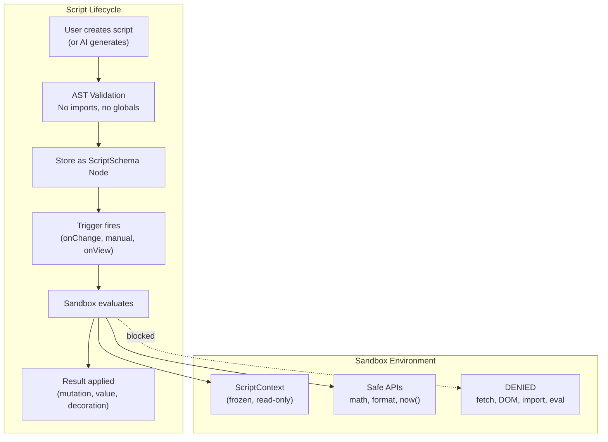

# 06: Script Sandbox

> Secure sandboxed execution environment for user-created scripts (Layer 1 plugins).

**Dependencies:** Step 01 (PluginRegistry), Step 02 (NodeStore middleware)

## Overview

Scripts are the simplest plugin type — single functions that transform or react to data. They run in a restricted sandbox with no network, DOM, or import access. This makes them safe for AI generation and end-user creation.



## Implementation

### 1. Script Schema

```typescript
// packages/plugins/src/schemas/script.ts

import { defineSchema, text, checkbox, select } from '@xnet/data'

export type ScriptTriggerType = 'manual' | 'onChange' | 'onView' | 'scheduled'
export type ScriptOutputType = 'value' | 'mutation' | 'decoration' | 'void'

export const ScriptSchema = defineSchema({
  name: 'Script',
  namespace: 'xnet://xnet.dev/',
  properties: {
    name: text({ required: true }),
    description: text({}),
    code: text({ required: true }),
    triggerType: select({
      options: ['manual', 'onChange', 'onView', 'scheduled'],
      default: 'manual'
    }),
    triggerProperty: text({}), // for onChange: which property
    triggerCron: text({}), // for scheduled: cron expression
    inputSchema: text({}), // SchemaIRI this script operates on
    outputType: select({
      options: ['value', 'mutation', 'decoration', 'void'],
      default: 'value'
    }),
    enabled: checkbox({ default: true }),
    lastError: text({}), // last execution error
    lastRun: date({}) // last execution timestamp
  }
})
```

### 2. Script Context (Safe API Surface)

```typescript
// packages/plugins/src/sandbox/context.ts

export interface ScriptContext {
  // Current node (read-only, frozen)
  node: Readonly<FlatNode>

  // Query sibling nodes
  nodes: (schemaIRI?: string) => Readonly<FlatNode>[]

  // Utilities (no side effects)
  now: () => number
  format: FormatHelpers
  math: MathHelpers
  text: TextHelpers
}

export interface FormatHelpers {
  date: (timestamp: number, format?: string) => string
  number: (value: number, options?: Intl.NumberFormatOptions) => string
  currency: (value: number, currency?: string) => string
  relative: (timestamp: number) => string
}

export interface MathHelpers {
  sum: (values: number[]) => number
  avg: (values: number[]) => number
  min: (values: number[]) => number
  max: (values: number[]) => number
  round: (value: number, decimals?: number) => number
  clamp: (value: number, min: number, max: number) => number
}

export interface TextHelpers {
  slugify: (text: string) => string
  truncate: (text: string, length: number) => string
  capitalize: (text: string) => string
  contains: (text: string, search: string) => boolean
  template: (template: string, vars: Record<string, unknown>) => string
}

export function createScriptContext(
  node: FlatNode,
  queryFn: (schema?: string) => FlatNode[]
): ScriptContext {
  return Object.freeze({
    node: Object.freeze({ ...node }),
    nodes: (schema) => Object.freeze(queryFn(schema).map((n) => Object.freeze({ ...n }))),
    now: () => Date.now(),
    format: Object.freeze({
      date: (ts, fmt) => new Intl.DateTimeFormat('en', {}).format(new Date(ts)),
      number: (val, opts) => new Intl.NumberFormat('en', opts).format(val),
      currency: (val, cur = 'USD') =>
        new Intl.NumberFormat('en', { style: 'currency', currency: cur }).format(val),
      relative: (ts) => {
        const diff = Date.now() - ts
        const mins = Math.floor(diff / 60000)
        if (mins < 60) return `${mins}m ago`
        const hours = Math.floor(mins / 60)
        if (hours < 24) return `${hours}h ago`
        return `${Math.floor(hours / 24)}d ago`
      }
    }),
    math: Object.freeze({
      sum: (vals) => vals.reduce((a, b) => a + b, 0),
      avg: (vals) => (vals.length ? vals.reduce((a, b) => a + b, 0) / vals.length : 0),
      min: (vals) => Math.min(...vals),
      max: (vals) => Math.max(...vals),
      round: (val, dec = 0) => Number(val.toFixed(dec)),
      clamp: (val, min, max) => Math.min(Math.max(val, min), max)
    }),
    text: Object.freeze({
      slugify: (t) =>
        t
          .toLowerCase()
          .replace(/[^a-z0-9]+/g, '-')
          .replace(/(^-|-$)/g, ''),
      truncate: (t, len) => (t.length > len ? t.slice(0, len) + '...' : t),
      capitalize: (t) => t.charAt(0).toUpperCase() + t.slice(1),
      contains: (t, s) => t.toLowerCase().includes(s.toLowerCase()),
      template: (tmpl, vars) => tmpl.replace(/\{(\w+)\}/g, (_, k) => String(vars[k] ?? ''))
    })
  })
}
```

### 3. AST Validator

```typescript
// packages/plugins/src/sandbox/ast-validator.ts

import * as acorn from 'acorn'

export interface ValidationResult {
  valid: boolean
  errors: string[]
}

const FORBIDDEN_GLOBALS = new Set([
  'window',
  'document',
  'globalThis',
  'self',
  'fetch',
  'XMLHttpRequest',
  'WebSocket',
  'eval',
  'Function',
  'require',
  'import',
  'module',
  'exports',
  'process',
  'Buffer',
  'setTimeout',
  'setInterval',
  'requestAnimationFrame',
  'localStorage',
  'sessionStorage',
  'indexedDB',
  'navigator',
  'location',
  'history'
])

export function validateScriptAST(code: string): ValidationResult {
  const errors: string[] = []

  try {
    // Parse as expression (arrow function) or function
    const wrappedCode = code.trim().startsWith('(') ? code : `(${code})`
    const ast = acorn.parse(wrappedCode, {
      ecmaVersion: 2022,
      sourceType: 'script' // no import/export
    })

    // Walk AST looking for forbidden patterns
    walkAST(ast, {
      Identifier(node: any) {
        if (FORBIDDEN_GLOBALS.has(node.name)) {
          errors.push(`Forbidden global: '${node.name}' at position ${node.start}`)
        }
      },
      ImportDeclaration() {
        errors.push('Import statements are not allowed in scripts')
      },
      ImportExpression() {
        errors.push('Dynamic import() is not allowed in scripts')
      },
      AwaitExpression() {
        errors.push('Async/await is not allowed in scripts (use sync operations only)')
      },
      NewExpression(node: any) {
        if (node.callee.name === 'Function') {
          errors.push('new Function() is not allowed')
        }
      },
      MemberExpression(node: any) {
        // Block __proto__, constructor access
        if (node.property.name === '__proto__' || node.property.name === 'constructor') {
          errors.push(`Access to '${node.property.name}' is forbidden`)
        }
      }
    })
  } catch (err) {
    errors.push(`Syntax error: ${(err as Error).message}`)
  }

  return { valid: errors.length === 0, errors }
}

function walkAST(node: any, visitors: Record<string, (node: any) => void>): void {
  if (!node || typeof node !== 'object') return
  if (node.type && visitors[node.type]) {
    visitors[node.type](node)
  }
  for (const key of Object.keys(node)) {
    const child = node[key]
    if (Array.isArray(child)) {
      child.forEach((c) => walkAST(c, visitors))
    } else if (child && typeof child === 'object' && child.type) {
      walkAST(child, visitors)
    }
  }
}
```

### 4. Sandbox Execution

```typescript
// packages/plugins/src/sandbox/sandbox.ts

export interface SandboxOptions {
  timeoutMs?: number // default: 1000
  maxMemoryMB?: number // default: 10 (where supported)
}

export class ScriptSandbox {
  private options: Required<SandboxOptions>

  constructor(options: SandboxOptions = {}) {
    this.options = {
      timeoutMs: options.timeoutMs ?? 1000,
      maxMemoryMB: options.maxMemoryMB ?? 10
    }
  }

  async execute(code: string, context: ScriptContext): Promise<unknown> {
    // 1. Validate AST
    const validation = validateScriptAST(code)
    if (!validation.valid) {
      throw new ScriptError('Validation failed', validation.errors)
    }

    // 2. Create isolated function
    // The function only has access to the frozen context object
    const fn = this.createIsolatedFunction(code)

    // 3. Execute with timeout
    const result = await this.executeWithTimeout(fn, context)

    // 4. Sanitize output
    return this.sanitizeOutput(result)
  }

  private createIsolatedFunction(code: string): (ctx: ScriptContext) => unknown {
    // Wrap in an IIFE that shadows dangerous globals
    const wrapped = `
      "use strict";
      const window = undefined, document = undefined, globalThis = undefined;
      const fetch = undefined, XMLHttpRequest = undefined, WebSocket = undefined;
      const eval = undefined, require = undefined, process = undefined;
      const setTimeout = undefined, setInterval = undefined;
      return (${code.trim()});
    `
    // Use Function constructor (we control the input via AST validation)
    const factory = new Function('node', 'nodes', 'now', 'format', 'math', 'text', wrapped)

    return (ctx: ScriptContext) => {
      const fn = factory(ctx.node, ctx.nodes, ctx.now, ctx.format, ctx.math, ctx.text)
      if (typeof fn === 'function') {
        return fn(ctx.node, ctx)
      }
      return fn // expression result
    }
  }

  private executeWithTimeout(
    fn: (ctx: ScriptContext) => unknown,
    ctx: ScriptContext
  ): Promise<unknown> {
    return new Promise((resolve, reject) => {
      const timer = setTimeout(() => {
        reject(
          new ScriptError('Script execution timed out', [
            `Exceeded ${this.options.timeoutMs}ms limit`
          ])
        )
      }, this.options.timeoutMs)

      try {
        const result = fn(ctx)
        clearTimeout(timer)
        resolve(result)
      } catch (err) {
        clearTimeout(timer)
        reject(
          new ScriptError('Script execution error', [
            err instanceof Error ? err.message : String(err)
          ])
        )
      }
    })
  }

  private sanitizeOutput(result: unknown): unknown {
    // Only allow plain data types out of the sandbox
    if (result === null || result === undefined) return result
    if (typeof result === 'string' || typeof result === 'number' || typeof result === 'boolean')
      return result
    if (Array.isArray(result)) return result.map((r) => this.sanitizeOutput(r))
    if (typeof result === 'object') {
      const clean: Record<string, unknown> = {}
      for (const [key, value] of Object.entries(result)) {
        if (key.startsWith('__')) continue // skip dunder
        clean[key] = this.sanitizeOutput(value)
      }
      return clean
    }
    return undefined // functions, symbols, etc. stripped
  }
}

export class ScriptError extends Error {
  constructor(
    message: string,
    public details: string[]
  ) {
    super(message)
    this.name = 'ScriptError'
  }
}
```

### 5. Script Runner (Reactive Execution)

```typescript
// packages/plugins/src/sandbox/runner.ts

export class ScriptRunner {
  private sandbox = new ScriptSandbox()
  private subscriptions: (() => void)[] = []

  constructor(private store: NodeStore) {}

  /** Register all enabled scripts and set up their triggers */
  async start(): Promise<void> {
    const scripts = this.store.list({ schemaIRI: 'xnet://xnet.dev/Script' })
    for (const script of scripts) {
      if (script.enabled) {
        this.registerScript(script)
      }
    }

    // Watch for new/modified scripts
    const unsub = this.store.subscribe((event) => {
      if (event.node?.schemaIRI === 'xnet://xnet.dev/Script') {
        this.handleScriptChange(event)
      }
    })
    this.subscriptions.push(unsub)
  }

  stop(): void {
    for (const unsub of this.subscriptions) unsub()
    this.subscriptions = []
  }

  private registerScript(script: FlatNode): void {
    const trigger = script.triggerType as ScriptTriggerType

    if (trigger === 'onChange') {
      const unsub = this.store.subscribe(async (event) => {
        if (!event.node || event.node.schemaIRI !== script.inputSchema) return
        if (script.triggerProperty && !event.change.payload?.[script.triggerProperty]) return

        await this.executeScript(script, event.node)
      })
      this.subscriptions.push(unsub)
    }
    // Other trigger types handled similarly
  }

  private async executeScript(script: FlatNode, targetNode: FlatNode): Promise<void> {
    try {
      const context = createScriptContext(targetNode, (schema) =>
        this.store.list({ schemaIRI: schema })
      )

      const result = await this.sandbox.execute(script.code, context)

      if (result && typeof result === 'object' && script.outputType === 'mutation') {
        // Apply mutation to the target node
        await this.store.update(targetNode.id, result as Partial<NodePayload>)
      }

      // Update last run timestamp
      await this.store.update(script.id, { lastRun: Date.now(), lastError: null })
    } catch (err) {
      const errorMsg = err instanceof ScriptError ? err.details.join('; ') : String(err)
      await this.store.update(script.id, { lastError: errorMsg })
      console.error(`Script '${script.name}' failed:`, err)
    }
  }

  /** Execute a script manually (for testing/preview) */
  async executeManual(code: string, node: FlatNode): Promise<unknown> {
    const context = createScriptContext(node, (schema) => this.store.list({ schemaIRI: schema }))
    return this.sandbox.execute(code, context)
  }

  private handleScriptChange(event: NodeChangeEvent): void {
    // Re-register script on change, unregister on delete
    // Implementation: clear subscriptions for this script, re-register if enabled
  }
}
```

### 6. Script as Computed Column

Scripts with `outputType: 'value'` can serve as computed columns in table views:

```typescript
// Integration with @xnet/views table

export function useComputedColumns(schema: DefinedSchema): ComputedColumn[] {
  const scripts = useQuery(ScriptSchema, {
    inputSchema: schema._schemaId,
    outputType: 'value',
    enabled: true
  })

  return scripts.map((script) => ({
    id: `script:${script.id}`,
    name: script.name,
    compute: async (node: FlatNode) => {
      const sandbox = new ScriptSandbox()
      const ctx = createScriptContext(node, () => [])
      return sandbox.execute(script.code, ctx)
    }
  }))
}
```

## Example Scripts

```javascript
// Simple: Tax calculator
(node) => node.subtotal * 0.08

// Medium: Status based on dates
(node, ctx) => {
  if (!node.dueDate) return null
  const overdue = node.dueDate < ctx.now() && node.status !== 'done'
  return overdue ? { priority: 'urgent', _decoration: 'OVERDUE' } : null
}

// Complex: Aggregate child items
(node, ctx) => {
  const items = ctx.nodes('xnet://myapp/LineItem')
    .filter(item => item.invoiceId === node.id)
  return {
    lineCount: items.length,
    total: ctx.math.sum(items.map(i => i.quantity * i.unitPrice)),
    totalFormatted: ctx.format.currency(
      ctx.math.sum(items.map(i => i.quantity * i.unitPrice))
    )
  }
}
```

## Checklist

- [ ] Define `ScriptSchema` with all trigger/output types
- [ ] Implement `ScriptContext` with frozen, read-only API
- [ ] Implement `validateScriptAST` with comprehensive forbidden pattern detection
- [ ] Implement `ScriptSandbox` with timeout and output sanitization
- [ ] Implement `ScriptRunner` with reactive trigger subscriptions
- [ ] Support `onChange` trigger with property-specific filtering
- [ ] Support `manual` trigger for testing
- [ ] Support `onView` trigger for computed columns
- [ ] Integrate computed columns with table view
- [ ] Handle script errors gracefully (store lastError, don't crash)
- [ ] Add `acorn` dependency for AST parsing
- [ ] Write security tests (prototype pollution, global access, timeout)
- [ ] Write functional tests (all trigger types, output types)

---

[Back to README](./README.md) | [Previous: Slash Commands](./05-slash-commands.md) | [Next: AI Script Generation](./07-ai-script-generation.md)
