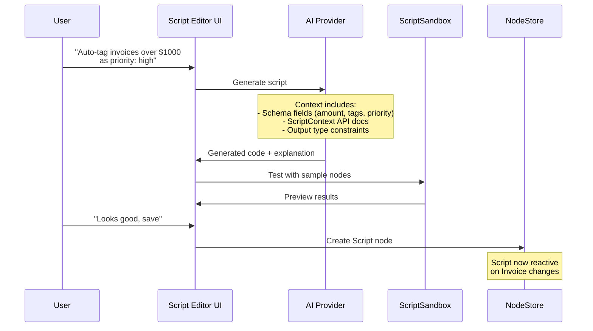

# 07: AI Script Generation

> In-app script editor with AI-powered generation, preview, and testing.

**Dependencies:** Step 06 (ScriptSandbox, ScriptSchema, ScriptContext)

## Overview

The key UX differentiator: users describe what they want in natural language, and AI generates a sandboxed script. The constrained API surface (ScriptContext) means AI can only generate safe, functional code. Users test against real data before saving.



## Implementation

### 1. AI Prompt Engineering

```typescript
// packages/plugins/src/ai/prompt.ts

export function buildScriptPrompt(request: AIScriptRequest): string {
  return `You are generating a JavaScript script for xNet, a data platform.
The script is a pure function that receives a node (data record) and a context object.
It must return a value, a mutation object, or null.

## Available API

The function signature is: (node, ctx) => result

### node (read-only)
The current data record with these properties:
${formatSchemaProperties(request.schema)}

### ctx object
- ctx.node - same as first argument
- ctx.nodes(schemaIRI?) - query other nodes (returns frozen array)
- ctx.now() - current timestamp (ms)
- ctx.format.date(ts, format?) - format timestamp
- ctx.format.number(val, opts?) - format number
- ctx.format.currency(val, currency?) - format as currency
- ctx.format.relative(ts) - "2h ago" style
- ctx.math.sum(numbers[]) - sum array
- ctx.math.avg(numbers[]) - average
- ctx.math.min(numbers[]) - minimum
- ctx.math.max(numbers[]) - maximum
- ctx.math.round(val, decimals?) - round
- ctx.math.clamp(val, min, max) - clamp
- ctx.text.slugify(str) - url-safe slug
- ctx.text.truncate(str, len) - truncate with ellipsis
- ctx.text.capitalize(str) - capitalize first letter
- ctx.text.contains(str, search) - case-insensitive contains
- ctx.text.template(tmpl, vars) - simple {var} replacement

## Constraints
- NO imports, require, or dynamic import
- NO fetch, XMLHttpRequest, or network access
- NO DOM access (window, document)
- NO async/await, setTimeout, setInterval
- NO eval, Function constructor
- Pure synchronous function only
- Must return: a value (for computed columns), an object (for mutations), or null

## Output Type: ${request.outputType}
${getOutputTypeDescription(request.outputType)}

## User Request
"${request.intent}"

${request.examples ? `## Sample Data\n${JSON.stringify(request.examples.slice(0, 3), null, 2)}` : ''}

Generate ONLY the arrow function expression. No markdown, no explanation outside the code.
Example format: (node, ctx) => { ... }
`
}

function formatSchemaProperties(schema: DefinedSchema): string {
  return Object.entries(schema.schema.properties)
    .map(([name, prop]) => `- ${name}: ${prop.type}${prop.required ? ' (required)' : ''}`)
    .join('\n')
}

function getOutputTypeDescription(type: ScriptOutputType): string {
  switch (type) {
    case 'value':
      return 'Return a computed value (string, number, boolean). Used as a virtual column.'
    case 'mutation':
      return 'Return an object with property updates to apply to the node. e.g., { priority: "high" }'
    case 'decoration':
      return 'Return { _decoration: "text" } to show a visual annotation without modifying data.'
    case 'void':
      return 'Return null. Script is used for its side effects (logging, etc).'
  }
}
```

### 2. AI Script Generator

````typescript
// packages/plugins/src/ai/generator.ts

export interface AIScriptRequest {
  intent: string // natural language description
  schema: DefinedSchema // available fields
  outputType: ScriptOutputType
  examples?: FlatNode[] // sample data for context
  triggerType?: ScriptTriggerType
}

export interface AIScriptResponse {
  code: string
  explanation: string
  suggestedName: string
  suggestedTrigger: ScriptTriggerType
}

export interface AIProvider {
  generate(prompt: string): Promise<string>
}

export class ScriptGenerator {
  constructor(private ai: AIProvider) {}

  async generate(request: AIScriptRequest): Promise<AIScriptResponse> {
    const prompt = buildScriptPrompt(request)
    const raw = await this.ai.generate(prompt)

    // Extract code (strip markdown fences if present)
    const code = this.extractCode(raw)

    // Validate the generated code
    const validation = validateScriptAST(code)
    if (!validation.valid) {
      // Retry once with error feedback
      const retryPrompt = `${prompt}\n\nYour previous attempt had errors:\n${validation.errors.join('\n')}\n\nPlease fix and regenerate.`
      const retry = await this.ai.generate(retryPrompt)
      const retryCode = this.extractCode(retry)
      const retryValidation = validateScriptAST(retryCode)
      if (!retryValidation.valid) {
        throw new Error(`AI generated invalid code: ${retryValidation.errors.join(', ')}`)
      }
      return this.parseResponse(retryCode, request)
    }

    return this.parseResponse(code, request)
  }

  private extractCode(raw: string): string {
    // Strip markdown code fences
    const fenced = raw.match(/```(?:javascript|js|typescript|ts)?\n([\s\S]*?)```/)
    if (fenced) return fenced[1].trim()
    // Strip single backticks
    const inline = raw.match(/^`([\s\S]*)`$/)
    if (inline) return inline[1].trim()
    return raw.trim()
  }

  private parseResponse(code: string, request: AIScriptRequest): AIScriptResponse {
    return {
      code,
      explanation: `Script that ${request.intent.toLowerCase()}`,
      suggestedName: this.generateName(request.intent),
      suggestedTrigger: request.triggerType ?? 'onChange'
    }
  }

  private generateName(intent: string): string {
    // Simple heuristic: take first few meaningful words
    return intent
      .replace(/[^a-zA-Z0-9\s]/g, '')
      .split(/\s+/)
      .slice(0, 4)
      .map((w, i) =>
        i === 0 ? w.toLowerCase() : w.charAt(0).toUpperCase() + w.slice(1).toLowerCase()
      )
      .join('')
  }
}
````

### 3. Script Editor UI Component

```typescript
// packages/plugins/src/ui/ScriptEditor.tsx

export interface ScriptEditorProps {
  schema: DefinedSchema
  initialScript?: FlatNode          // existing script to edit
  sampleNodes?: FlatNode[]          // data for preview
  onSave: (script: Partial<ScriptNode>) => void
  onClose: () => void
}

export function ScriptEditor({ schema, initialScript, sampleNodes, onSave, onClose }: ScriptEditorProps) {
  const [code, setCode] = useState(initialScript?.code ?? '')
  const [name, setName] = useState(initialScript?.name ?? '')
  const [intent, setIntent] = useState('')
  const [triggerType, setTriggerType] = useState<ScriptTriggerType>(initialScript?.triggerType ?? 'manual')
  const [outputType, setOutputType] = useState<ScriptOutputType>(initialScript?.outputType ?? 'value')
  const [preview, setPreview] = useState<PreviewResult[]>([])
  const [error, setError] = useState<string | null>(null)
  const [isGenerating, setIsGenerating] = useState(false)

  const sandbox = useMemo(() => new ScriptSandbox(), [])

  // AI Generation
  const handleGenerate = async () => {
    setIsGenerating(true)
    setError(null)
    try {
      const generator = new ScriptGenerator(getAIProvider())
      const response = await generator.generate({
        intent,
        schema,
        outputType,
        examples: sampleNodes?.slice(0, 5),
      })
      setCode(response.code)
      if (!name) setName(response.suggestedName)
    } catch (err) {
      setError(err instanceof Error ? err.message : 'Generation failed')
    } finally {
      setIsGenerating(false)
    }
  }

  // Preview execution
  const handlePreview = async () => {
    if (!sampleNodes?.length || !code) return
    setError(null)

    const results: PreviewResult[] = []
    for (const node of sampleNodes.slice(0, 10)) {
      try {
        const ctx = createScriptContext(node, () => sampleNodes)
        const result = await sandbox.execute(code, ctx)
        results.push({ node, result, error: null })
      } catch (err) {
        results.push({ node, result: null, error: (err as Error).message })
      }
    }
    setPreview(results)
  }

  // Auto-preview on code change (debounced)
  useEffect(() => {
    const timer = setTimeout(handlePreview, 500)
    return () => clearTimeout(timer)
  }, [code, sampleNodes])

  return (
    <div className="script-editor">
      {/* AI Intent Input */}
      <div className="script-editor-ai">
        <input
          placeholder="Describe what you want... e.g., 'Calculate tax at 8%'"
          value={intent}
          onChange={e => setIntent(e.target.value)}
          onKeyDown={e => e.key === 'Enter' && handleGenerate()}
        />
        <button onClick={handleGenerate} disabled={!intent || isGenerating}>
          {isGenerating ? 'Generating...' : 'Generate'}
        </button>
      </div>

      {/* Configuration */}
      <div className="script-editor-config">
        <input placeholder="Script name" value={name} onChange={e => setName(e.target.value)} />
        <select value={triggerType} onChange={e => setTriggerType(e.target.value as ScriptTriggerType)}>
          <option value="manual">Manual</option>
          <option value="onChange">On Change</option>
          <option value="onView">Computed Column</option>
        </select>
        <select value={outputType} onChange={e => setOutputType(e.target.value as ScriptOutputType)}>
          <option value="value">Value (computed column)</option>
          <option value="mutation">Mutation (update node)</option>
          <option value="decoration">Decoration (visual only)</option>
        </select>
      </div>

      {/* Code Editor */}
      <div className="script-editor-code">
        <CodeEditor
          value={code}
          onChange={setCode}
          language="javascript"
          schema={schema}  // for autocomplete
        />
      </div>

      {/* Error Display */}
      {error && <div className="script-editor-error">{error}</div>}

      {/* Preview Results */}
      <div className="script-editor-preview">
        <h4>Preview ({preview.length} results)</h4>
        <table>
          <thead><tr><th>Node</th><th>Result</th></tr></thead>
          <tbody>
            {preview.map((p, i) => (
              <tr key={i} className={p.error ? 'error' : ''}>
                <td>{JSON.stringify(p.node, null, 2).slice(0, 50)}</td>
                <td>{p.error ?? JSON.stringify(p.result)}</td>
              </tr>
            ))}
          </tbody>
        </table>
      </div>

      {/* Actions */}
      <div className="script-editor-actions">
        <button onClick={onClose}>Cancel</button>
        <button onClick={() => onSave({ name, code, triggerType, outputType, inputSchema: schema._schemaId, enabled: true })} disabled={!code || !name}>
          Save Script
        </button>
      </div>
    </div>
  )
}

interface PreviewResult {
  node: FlatNode
  result: unknown
  error: string | null
}
```

### 4. AI Provider Abstraction

```typescript
// packages/plugins/src/ai/providers.ts

export interface AIProvider {
  generate(prompt: string): Promise<string>
}

// Anthropic
export class AnthropicProvider implements AIProvider {
  constructor(private apiKey: string) {}
  async generate(prompt: string): Promise<string> {
    const response = await fetch('https://api.anthropic.com/v1/messages', {
      method: 'POST',
      headers: {
        'content-type': 'application/json',
        'x-api-key': this.apiKey,
        'anthropic-version': '2023-06-01'
      },
      body: JSON.stringify({
        model: 'claude-sonnet-4-20250514',
        max_tokens: 1024,
        messages: [{ role: 'user', content: prompt }]
      })
    })
    const data = await response.json()
    return data.content[0].text
  }
}

// OpenAI
export class OpenAIProvider implements AIProvider {
  constructor(private apiKey: string) {}
  async generate(prompt: string): Promise<string> {
    const response = await fetch('https://api.openai.com/v1/chat/completions', {
      method: 'POST',
      headers: {
        'content-type': 'application/json',
        authorization: `Bearer ${this.apiKey}`
      },
      body: JSON.stringify({
        model: 'gpt-4o',
        messages: [{ role: 'user', content: prompt }],
        max_tokens: 1024
      })
    })
    const data = await response.json()
    return data.choices[0].message.content
  }
}

// Local (Ollama via Service plugin)
export class LocalAIProvider implements AIProvider {
  constructor(private baseUrl = 'http://localhost:11434') {}
  async generate(prompt: string): Promise<string> {
    const response = await fetch(`${this.baseUrl}/api/generate`, {
      method: 'POST',
      body: JSON.stringify({
        model: 'codellama',
        prompt,
        stream: false
      })
    })
    const data = await response.json()
    return data.response
  }
}

// Provider factory (reads from user settings)
export function getAIProvider(): AIProvider {
  // Read from settings node or environment
  // Falls back to local provider
}
```

### 5. Schema-Aware Autocomplete

```typescript
// packages/plugins/src/ui/CodeEditor.tsx

export interface CodeEditorProps {
  value: string
  onChange: (value: string) => void
  language: string
  schema?: DefinedSchema          // enables property autocomplete
}

export function CodeEditor({ value, onChange, language, schema }: CodeEditorProps) {
  // Use CodeMirror with custom completions based on schema
  const completions = useMemo(() => {
    if (!schema) return []
    return [
      // node.propertyName completions
      ...Object.entries(schema.schema.properties).map(([name, prop]) => ({
        label: `node.${name}`,
        type: 'property',
        info: `${prop.type}${prop.required ? ' (required)' : ''}`,
      })),
      // ctx.method completions
      { label: 'ctx.now()', type: 'function', info: 'Current timestamp (ms)' },
      { label: 'ctx.nodes(schema?)', type: 'function', info: 'Query nodes by schema' },
      { label: 'ctx.math.sum(arr)', type: 'function', info: 'Sum an array of numbers' },
      { label: 'ctx.math.avg(arr)', type: 'function', info: 'Average of numbers' },
      { label: 'ctx.format.currency(val)', type: 'function', info: 'Format as currency' },
      { label: 'ctx.format.date(ts)', type: 'function', info: 'Format timestamp' },
      { label: 'ctx.text.contains(str, search)', type: 'function', info: 'Case-insensitive search' },
      // ... all ScriptContext methods
    ]
  }, [schema])

  return (
    <CodeMirrorEditor
      value={value}
      onChange={onChange}
      extensions={[
        javascript(),
        autocompletion({ override: [() => ({ from: 0, options: completions })] }),
      ]}
    />
  )
}
```

## Entry Points for Script Creation

Users can create scripts from multiple places:

1. **Database view toolbar** - "Add computed column" button opens ScriptEditor with `outputType: 'value'`
2. **Node context menu** - "Add automation" opens ScriptEditor with `outputType: 'mutation'`
3. **Command palette** - "Create Script" command
4. **Sidebar** - Scripts section showing all scripts with run/edit/disable controls
5. **Table column header** - Right-click → "Add formula" (same as computed column)

## Checklist

- [ ] Implement AI prompt builder with schema context
- [ ] Implement ScriptGenerator with retry on validation failure
- [ ] Build ScriptEditor UI component (intent → code → preview → save)
- [ ] Implement CodeEditor with schema-aware autocomplete
- [ ] Create AIProvider abstraction (Anthropic, OpenAI, Local)
- [ ] Add AI provider settings to user preferences
- [ ] Wire ScriptEditor into database view ("Add formula column")
- [ ] Wire ScriptEditor into command palette
- [ ] Add preview table showing per-node results
- [ ] Handle generation errors gracefully
- [ ] Add CodeMirror or Monaco dependency
- [ ] Test AI generation with various schemas and intents

---

[Back to README](./README.md) | [Previous: Script Sandbox](./06-script-sandbox.md) | [Next: UI Slots & Commands](./08-ui-slots-commands.md)
