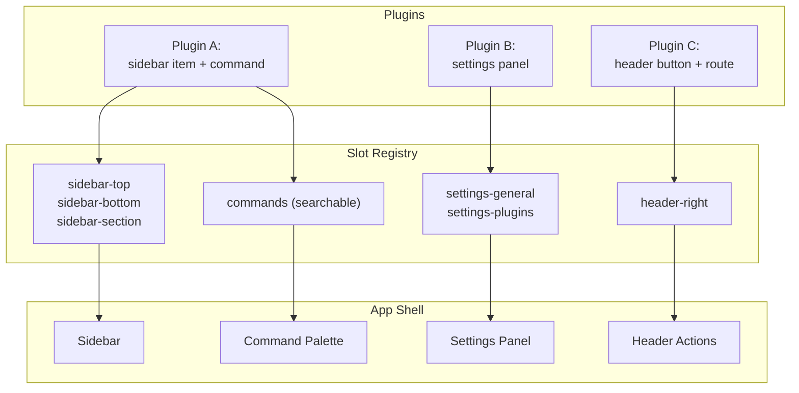

# 08: UI Slots & Commands

> App-level extension points: sidebar items, command palette, settings panels, dynamic routes.

**Dependencies:** Step 01 (ContributionRegistry)

## Overview

Plugins need to inject UI into the app shell — sidebar navigation, command palette entries, settings pages, and (on web) custom routes. This step creates a slot-based system.



## Implementation

### 1. Contribution Types

```typescript
// packages/plugins/src/contributions/ui.ts

export interface SidebarContribution {
  id: string
  label: string
  icon: string | React.ComponentType<{}>
  position?: 'top' | 'bottom' | 'section'
  section?: string // group name for 'section' position
  priority?: number // ordering within position
  badge?: () => string | number | null // dynamic badge (e.g., count)
  action: () => void // what happens on click
  // OR render a component in a panel:
  panel?: React.ComponentType<{}>
}

export interface CommandContribution {
  id: string
  title: string
  description?: string
  icon?: string
  keywords?: string[] // for fuzzy search
  shortcut?: string // e.g., 'Mod-Shift-P'
  when?: () => boolean // conditional visibility
  execute: () => void | Promise<void>
}

export interface SettingContribution {
  id: string
  title: string
  description?: string
  icon?: string
  section?: 'general' | 'appearance' | 'plugins' | 'data' | 'network'
  component: React.ComponentType<SettingsPanelProps>
}

export interface SettingsPanelProps {
  storage: ExtensionStorage // plugin's settings storage
}
```

### 2. Command Palette

```typescript
// packages/ui/src/composed/CommandPalette.tsx

export function CommandPalette() {
  const [open, setOpen] = useState(false)
  const [query, setQuery] = useState('')
  const commands = useContributions<CommandContribution>('commands')

  // Built-in commands
  const builtinCommands: CommandContribution[] = [
    { id: 'new-page', title: 'New Page', icon: 'file-plus', shortcut: 'Mod-N', execute: () => { /* create page */ } },
    { id: 'new-database', title: 'New Database', icon: 'database', execute: () => { /* create db */ } },
    { id: 'search', title: 'Search', icon: 'search', shortcut: 'Mod-K', execute: () => { /* open search */ } },
    { id: 'settings', title: 'Settings', icon: 'settings', execute: () => { /* open settings */ } },
  ]

  const allCommands = [...builtinCommands, ...commands]
    .filter(cmd => !cmd.when || cmd.when())

  const filtered = useMemo(() => {
    if (!query) return allCommands
    const q = query.toLowerCase()
    return allCommands.filter(cmd =>
      cmd.title.toLowerCase().includes(q) ||
      cmd.description?.toLowerCase().includes(q) ||
      cmd.keywords?.some(k => k.includes(q))
    )
  }, [allCommands, query])

  // Global shortcut to open
  useEffect(() => {
    const handler = (e: KeyboardEvent) => {
      if ((e.metaKey || e.ctrlKey) && e.shiftKey && e.key === 'p') {
        e.preventDefault()
        setOpen(true)
      }
    }
    window.addEventListener('keydown', handler)
    return () => window.removeEventListener('keydown', handler)
  }, [])

  return (
    <Dialog open={open} onOpenChange={setOpen}>
      <div className="command-palette">
        <input
          placeholder="Type a command..."
          value={query}
          onChange={e => setQuery(e.target.value)}
          autoFocus
        />
        <div className="command-palette-list">
          {filtered.map(cmd => (
            <button
              key={cmd.id}
              className="command-palette-item"
              onClick={() => { cmd.execute(); setOpen(false) }}
            >
              {cmd.icon && <Icon name={cmd.icon} />}
              <span>{cmd.title}</span>
              {cmd.shortcut && <kbd>{cmd.shortcut}</kbd>}
            </button>
          ))}
        </div>
      </div>
    </Dialog>
  )
}
```

### 3. Sidebar Slots

```typescript
// packages/ui/src/composed/Sidebar.tsx (modified)

export function Sidebar() {
  const topItems = useContributions<SidebarContribution>('sidebar')
    .filter(i => i.position === 'top' || !i.position)
    .sort((a, b) => (a.priority ?? 100) - (b.priority ?? 100))

  const bottomItems = useContributions<SidebarContribution>('sidebar')
    .filter(i => i.position === 'bottom')
    .sort((a, b) => (a.priority ?? 100) - (b.priority ?? 100))

  const sections = useContributions<SidebarContribution>('sidebar')
    .filter(i => i.position === 'section')

  const sectionGroups = useMemo(() => {
    const map = new Map<string, SidebarContribution[]>()
    for (const item of sections) {
      const section = item.section ?? 'Other'
      if (!map.has(section)) map.set(section, [])
      map.get(section)!.push(item)
    }
    return map
  }, [sections])

  return (
    <nav className="sidebar">
      {/* Built-in nav items */}
      <div className="sidebar-top">
        <SidebarItem icon="home" label="Home" onClick={...} />
        <SidebarItem icon="search" label="Search" onClick={...} />
        {/* Plugin top items */}
        {topItems.map(item => (
          <PluginSidebarItem key={item.id} item={item} />
        ))}
      </div>

      {/* Document tree */}
      <div className="sidebar-documents">
        {/* existing document list */}
      </div>

      {/* Plugin sections */}
      {[...sectionGroups.entries()].map(([section, items]) => (
        <div key={section} className="sidebar-section">
          <h4>{section}</h4>
          {items.map(item => (
            <PluginSidebarItem key={item.id} item={item} />
          ))}
        </div>
      ))}

      {/* Bottom items */}
      <div className="sidebar-bottom">
        {bottomItems.map(item => (
          <PluginSidebarItem key={item.id} item={item} />
        ))}
        <SidebarItem icon="settings" label="Settings" onClick={...} />
      </div>
    </nav>
  )
}

function PluginSidebarItem({ item }: { item: SidebarContribution }) {
  const badge = item.badge?.()
  return (
    <button className="sidebar-item" onClick={item.action}>
      {typeof item.icon === 'string' ? <Icon name={item.icon} /> : <item.icon />}
      <span>{item.label}</span>
      {badge != null && <span className="sidebar-badge">{badge}</span>}
    </button>
  )
}
```

### 4. Settings Panel Registry

```typescript
// packages/ui/src/composed/SettingsView.tsx

export function SettingsView() {
  const [activeSection, setActiveSection] = useState('general')
  const pluginPanels = useContributions<SettingContribution>('settings')

  const sections = [
    { id: 'general', title: 'General', icon: 'settings' },
    { id: 'appearance', title: 'Appearance', icon: 'palette' },
    { id: 'data', title: 'Data & Storage', icon: 'database' },
    { id: 'network', title: 'Network', icon: 'globe' },
    { id: 'plugins', title: 'Plugins', icon: 'puzzle' },
  ]

  const panelsForSection = pluginPanels.filter(p => p.section === activeSection)

  return (
    <div className="settings-view">
      <aside className="settings-nav">
        {sections.map(s => (
          <button key={s.id} onClick={() => setActiveSection(s.id)} className={activeSection === s.id ? 'active' : ''}>
            <Icon name={s.icon} /> {s.title}
          </button>
        ))}
      </aside>

      <main className="settings-content">
        {/* Built-in settings for active section */}
        <BuiltinSettings section={activeSection} />

        {/* Plugin settings panels */}
        {panelsForSection.map(panel => (
          <div key={panel.id} className="settings-plugin-panel">
            <h3>{panel.title}</h3>
            {panel.description && <p>{panel.description}</p>}
            <panel.component storage={getPluginStorage(panel.id)} />
          </div>
        ))}
      </main>
    </div>
  )
}
```

### 5. Dynamic Route Registration (Web App)

```typescript
// apps/web/src/plugins/routes.ts

import { Router } from '@tanstack/react-router'

export function registerPluginRoutes(router: Router, contributions: ContributionRegistry): void {
  // Plugin routes are rendered under /plugin/:pluginId/*
  // Each plugin gets its own route namespace

  const routes = contributions.getAll()
    .filter(c => c.type === 'route')

  for (const route of routes) {
    // TanStack Router supports adding routes at runtime
    // via router.routeTree manipulation
  }
}

// Plugin route wrapper ensures isolation
export function PluginRouteWrapper({ pluginId }: { pluginId: string }) {
  const registry = usePluginRegistry()
  const plugin = registry.get(pluginId)

  if (!plugin) return <div>Plugin not found</div>

  // Render plugin's route component within an error boundary
  return (
    <ErrorBoundary fallback={<div>Plugin crashed</div>}>
      <PluginRouteContent plugin={plugin} />
    </ErrorBoundary>
  )
}
```

### 6. Keyboard Shortcut Registration

```typescript
// packages/plugins/src/contributions/shortcuts.ts

export class ShortcutManager {
  private shortcuts = new Map<string, CommandContribution>()

  register(command: CommandContribution): Disposable {
    if (!command.shortcut) return { dispose: () => {} }

    const normalized = this.normalize(command.shortcut)
    this.shortcuts.set(normalized, command)

    return {
      dispose: () => this.shortcuts.delete(normalized)
    }
  }

  handleKeyDown(event: KeyboardEvent): boolean {
    const key = this.eventToString(event)
    const command = this.shortcuts.get(key)
    if (command && (!command.when || command.when())) {
      event.preventDefault()
      command.execute()
      return true
    }
    return false
  }

  private normalize(shortcut: string): string {
    return shortcut
      .replace('Mod', navigator.platform.includes('Mac') ? 'Meta' : 'Ctrl')
      .split('-')
      .sort()
      .join('-')
  }

  private eventToString(e: KeyboardEvent): string {
    const parts: string[] = []
    if (e.ctrlKey) parts.push('Ctrl')
    if (e.metaKey) parts.push('Meta')
    if (e.shiftKey) parts.push('Shift')
    if (e.altKey) parts.push('Alt')
    parts.push(e.key.length === 1 ? e.key.toUpperCase() : e.key)
    return parts.sort().join('-')
  }
}
```

## Example: Task Tracker Plugin

```typescript
export default defineExtension({
  id: 'com.xnet.task-tracker',
  name: 'Task Tracker',
  version: '1.0.0',
  contributes: {
    sidebarItems: [
      {
        id: 'tasks-inbox',
        label: 'Task Inbox',
        icon: 'inbox',
        position: 'top',
        priority: 20,
        badge: () => {
          // Count overdue tasks
          const tasks = useQuery(TaskSchema, { status: 'pending' })
          const overdue = tasks.filter((t) => t.dueDate < Date.now())
          return overdue.length || null
        },
        action: () => navigateTo('/plugin/com.xnet.task-tracker/inbox')
      }
    ],
    commands: [
      {
        id: 'task-tracker.quick-add',
        title: 'Quick Add Task',
        shortcut: 'Mod-Shift-T',
        icon: 'plus-circle',
        execute: () => openQuickAddDialog()
      }
    ],
    settings: [
      {
        id: 'task-tracker.settings',
        title: 'Task Tracker',
        section: 'plugins',
        component: TaskTrackerSettings
      }
    ]
  }
})
```

## Checklist

- [ ] Define `SidebarContribution`, `CommandContribution`, `SettingContribution` types
- [ ] Build `CommandPalette` component with fuzzy search
- [ ] Add Cmd+Shift+P global shortcut to open command palette
- [ ] Modify Sidebar to render plugin items in top/bottom/section slots
- [ ] Build `SettingsView` with plugin panel slots
- [ ] Implement `ShortcutManager` for plugin keyboard shortcuts
- [ ] Wire contributions into ContributionRegistry
- [ ] Add error boundaries around plugin UI components
- [ ] Handle badge callbacks reactively
- [ ] Test command palette search across built-in + plugin commands
- [ ] Add route registration for web app (plugin pages)

---

[Back to README](./README.md) | [Previous: AI Script Generation](./07-ai-script-generation.md) | [Next: Services (Electron)](./09-services-electron.md)
