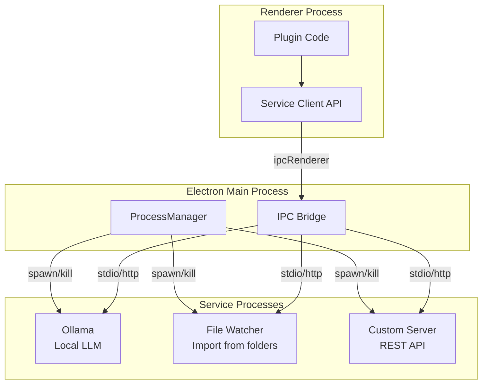

# 09: Services (Electron)

> Background process management, IPC bridge, and local capabilities for Electron-only plugins.

**Dependencies:** Step 01 (PluginRegistry), Step 02 (ExtensionContext)

## Overview

Service plugins run as separate processes managed by Electron's main process. They enable heavy workloads (local AI, file watchers, database connectors) without blocking the UI. Communication happens via IPC or local HTTP.



## Implementation

### 1. Service Plugin Manifest

```typescript
// packages/plugins/src/services/types.ts

export interface ServiceDefinition {
  id: string
  name: string

  process: {
    command: string // executable path or 'node'/'python'
    args?: string[]
    cwd?: string
    env?: Record<string, string>
    shell?: boolean // run in shell (for PATH resolution)
  }

  lifecycle: {
    restart: 'always' | 'on-failure' | 'never'
    maxRestarts?: number // default: 5
    restartDelayMs?: number // default: 1000
    startTimeoutMs?: number // default: 10000
    healthCheck?: {
      type: 'http' | 'stdout'
      url?: string // for http: GET this URL
      pattern?: string // for stdout: regex to match
      intervalMs?: number // default: 5000
    }
  }

  communication: {
    protocol: 'stdio' | 'http' | 'websocket' | 'ipc'
    port?: number // for http/websocket (0 = auto-assign)
    host?: string // default: '127.0.0.1'
  }

  provides?: {
    mcp?: {
      tools: string[] // tool names this service exposes
    }
    api?: {
      routes: string[] // API routes (for documentation)
    }
  }
}

export interface ServiceStatus {
  id: string
  state: 'starting' | 'running' | 'stopping' | 'stopped' | 'error'
  pid?: number
  port?: number
  startedAt?: number
  lastError?: string
  restartCount: number
}
```

### 2. Process Manager (Main Process)

```typescript
// packages/plugins/src/services/process-manager.ts
// Runs in Electron main process

import { ChildProcess, spawn } from 'child_process'
import { EventEmitter } from 'events'

export class ProcessManager extends EventEmitter {
  private processes = new Map<string, ManagedProcess>()

  async start(service: ServiceDefinition): Promise<ServiceStatus> {
    if (this.processes.has(service.id)) {
      throw new Error(`Service '${service.id}' is already running`)
    }

    const managed = new ManagedProcess(service)
    this.processes.set(service.id, managed)

    managed.on('status', (status) => {
      this.emit('service:status', { serviceId: service.id, status })
    })

    await managed.start()
    return managed.getStatus()
  }

  async stop(serviceId: string): Promise<void> {
    const managed = this.processes.get(serviceId)
    if (!managed) return
    await managed.stop()
    this.processes.delete(serviceId)
  }

  async restart(serviceId: string): Promise<void> {
    const managed = this.processes.get(serviceId)
    if (!managed) throw new Error(`Service '${serviceId}' not found`)
    await managed.stop()
    await managed.start()
  }

  getStatus(serviceId: string): ServiceStatus | undefined {
    return this.processes.get(serviceId)?.getStatus()
  }

  getAllStatuses(): ServiceStatus[] {
    return [...this.processes.values()].map((p) => p.getStatus())
  }

  async stopAll(): Promise<void> {
    await Promise.all([...this.processes.keys()].map((id) => this.stop(id)))
  }
}

class ManagedProcess extends EventEmitter {
  private process: ChildProcess | null = null
  private status: ServiceStatus
  private restartTimer: NodeJS.Timeout | null = null

  constructor(private service: ServiceDefinition) {
    super()
    this.status = {
      id: service.id,
      state: 'stopped',
      restartCount: 0
    }
  }

  async start(): Promise<void> {
    this.updateStatus('starting')

    const { command, args = [], cwd, env, shell } = this.service.process

    this.process = spawn(command, args, {
      cwd,
      env: { ...process.env, ...env },
      shell: shell ?? false,
      stdio: this.service.communication.protocol === 'stdio' ? 'pipe' : 'ignore'
    })

    this.status.pid = this.process.pid

    this.process.on('exit', (code, signal) => {
      this.handleExit(code, signal)
    })

    this.process.on('error', (err) => {
      this.status.lastError = err.message
      this.updateStatus('error')
    })

    // Wait for health check or timeout
    if (this.service.lifecycle.healthCheck) {
      await this.waitForHealthy()
    } else {
      // Assume ready after a short delay
      await new Promise((resolve) => setTimeout(resolve, 500))
    }

    this.updateStatus('running')
    this.status.startedAt = Date.now()
  }

  async stop(): Promise<void> {
    if (!this.process) return
    this.updateStatus('stopping')

    if (this.restartTimer) {
      clearTimeout(this.restartTimer)
      this.restartTimer = null
    }

    // Graceful shutdown: SIGTERM, then SIGKILL after 5s
    this.process.kill('SIGTERM')
    await new Promise<void>((resolve) => {
      const timeout = setTimeout(() => {
        this.process?.kill('SIGKILL')
        resolve()
      }, 5000)
      this.process!.on('exit', () => {
        clearTimeout(timeout)
        resolve()
      })
    })

    this.process = null
    this.updateStatus('stopped')
  }

  getStatus(): ServiceStatus {
    return { ...this.status }
  }

  private handleExit(code: number | null, signal: string | null): void {
    const { restart, maxRestarts = 5, restartDelayMs = 1000 } = this.service.lifecycle

    if (this.status.state === 'stopping') return // intentional stop

    const shouldRestart = restart === 'always' || (restart === 'on-failure' && code !== 0)

    if (shouldRestart && this.status.restartCount < maxRestarts) {
      this.status.restartCount++
      this.updateStatus('starting')
      this.restartTimer = setTimeout(() => this.start(), restartDelayMs)
    } else {
      this.status.lastError = `Exited with code ${code}, signal ${signal}`
      this.updateStatus('error')
    }
  }

  private async waitForHealthy(): Promise<void> {
    const { healthCheck } = this.service.lifecycle
    if (!healthCheck) return

    const timeout = this.service.lifecycle.startTimeoutMs ?? 10000
    const start = Date.now()

    while (Date.now() - start < timeout) {
      if (healthCheck.type === 'http' && healthCheck.url) {
        try {
          const res = await fetch(healthCheck.url)
          if (res.ok) return
        } catch {}
      }
      await new Promise((resolve) => setTimeout(resolve, 500))
    }

    throw new Error(`Service '${this.service.id}' health check timed out`)
  }

  private updateStatus(state: ServiceStatus['state']): void {
    this.status.state = state
    this.emit('status', this.status)
  }
}
```

### 3. IPC Bridge (Renderer ↔ Service)

```typescript
// packages/plugins/src/services/ipc-bridge.ts
// Main process: registers IPC handlers for service communication

import { ipcMain } from 'electron'

export function setupServiceIPC(processManager: ProcessManager): void {
  // Start a service
  ipcMain.handle(
    'plugin:service:start',
    async (_, serviceId: string, config: ServiceDefinition) => {
      return processManager.start(config)
    }
  )

  // Stop a service
  ipcMain.handle('plugin:service:stop', async (_, serviceId: string) => {
    await processManager.stop(serviceId)
  })

  // Get service status
  ipcMain.handle('plugin:service:status', async (_, serviceId: string) => {
    return processManager.getStatus(serviceId)
  })

  // Call a service (HTTP protocol)
  ipcMain.handle(
    'plugin:service:call',
    async (_, serviceId: string, method: string, path: string, body?: unknown) => {
      const status = processManager.getStatus(serviceId)
      if (!status || status.state !== 'running') {
        throw new Error(`Service '${serviceId}' is not running`)
      }

      const url = `http://${status.port ? `127.0.0.1:${status.port}` : 'localhost'}${path}`
      const response = await fetch(url, {
        method,
        headers: body ? { 'content-type': 'application/json' } : undefined,
        body: body ? JSON.stringify(body) : undefined
      })

      return response.json()
    }
  )

  // Forward service status events to renderer
  processManager.on('service:status', (event) => {
    BrowserWindow.getAllWindows().forEach((win) => {
      win.webContents.send('plugin:service:status-update', event)
    })
  })
}
```

### 4. Renderer Service Client

```typescript
// packages/plugins/src/services/client.ts
// Renderer process: API for plugins to call services

export interface ServiceClient {
  start(config: ServiceDefinition): Promise<ServiceStatus>
  stop(serviceId: string): Promise<void>
  status(serviceId: string): Promise<ServiceStatus | undefined>
  call<T>(serviceId: string, method: string, path: string, body?: unknown): Promise<T>
  onStatusChange(serviceId: string, callback: (status: ServiceStatus) => void): () => void
}

export function createServiceClient(): ServiceClient {
  return {
    start: (config) => window.xnet.invoke('plugin:service:start', config.id, config),
    stop: (id) => window.xnet.invoke('plugin:service:stop', id),
    status: (id) => window.xnet.invoke('plugin:service:status', id),
    call: (id, method, path, body) =>
      window.xnet.invoke('plugin:service:call', id, method, path, body),
    onStatusChange: (id, cb) => {
      const handler = (_: unknown, event: { serviceId: string; status: ServiceStatus }) => {
        if (event.serviceId === id) cb(event.status)
      }
      window.xnet.on('plugin:service:status-update', handler)
      return () => window.xnet.off('plugin:service:status-update', handler)
    }
  }
}
```

### 5. Local HTTP API (xNet as API Server)

A built-in service that exposes xNet's NodeStore via HTTP for external tools:

```typescript
// packages/plugins/src/services/local-api.ts

import express from 'express'

export function createLocalAPI(store: NodeStore, port = 31415): ServiceDefinition {
  return {
    id: 'xnet.local-api',
    name: 'xNet Local API',
    process: {
      command: 'node',
      args: ['--eval', createAPIServerScript(port)]
    },
    lifecycle: { restart: 'always' },
    communication: { protocol: 'http', port }
  }
}

// The actual Express server (runs in a child process or inline)
export function startLocalAPIServer(store: NodeStore, port: number): void {
  const app = express()
  app.use(express.json())

  // List/query nodes
  app.get('/api/v1/nodes', async (req, res) => {
    const { schema, limit, offset } = req.query
    const nodes = store.list({
      schemaIRI: schema as string,
      limit: Number(limit) || 100,
      offset: Number(offset) || 0
    })
    res.json({ nodes, total: nodes.length })
  })

  // Get single node
  app.get('/api/v1/nodes/:id', async (req, res) => {
    const node = store.get(req.params.id)
    if (!node) return res.status(404).json({ error: 'Not found' })
    res.json(node)
  })

  // Create node
  app.post('/api/v1/nodes', async (req, res) => {
    const { schema, properties } = req.body
    const node = await store.create({ schemaIRI: schema, properties })
    res.status(201).json(node)
  })

  // Update node
  app.patch('/api/v1/nodes/:id', async (req, res) => {
    const node = await store.update(req.params.id, req.body)
    res.json(node)
  })

  // Delete node
  app.delete('/api/v1/nodes/:id', async (req, res) => {
    await store.delete(req.params.id)
    res.status(204).end()
  })

  // Query with filters
  app.post('/api/v1/query', async (req, res) => {
    const { schema, filter, sort, limit } = req.body
    const nodes = store.list({ schemaIRI: schema, filter, sort, limit })
    res.json({ nodes })
  })

  // List schemas
  app.get('/api/v1/schemas', async (req, res) => {
    const iris = schemaRegistry.getAllIRIs()
    res.json({ schemas: iris })
  })

  // WebSocket for real-time events
  // (using ws library)

  app.listen(port, '127.0.0.1', () => {
    console.log(`xNet Local API running on http://127.0.0.1:${port}`)
  })
}
```

## Example: Local LLM Service Plugin

```typescript
export default defineExtension({
  id: 'com.xnet.local-llm',
  name: 'Local LLM (Ollama)',
  version: '1.0.0',
  platforms: ['electron'],

  async activate(ctx) {
    if (ctx.platform !== 'electron') return

    // Start Ollama service
    const services = ctx.capabilities.services ? createServiceClient() : null
    if (!services) return

    await services.start({
      id: 'ollama',
      name: 'Ollama',
      process: {
        command: 'ollama',
        args: ['serve'],
        shell: true
      },
      lifecycle: {
        restart: 'on-failure',
        healthCheck: { type: 'http', url: 'http://127.0.0.1:11434/api/version' }
      },
      communication: { protocol: 'http', port: 11434 }
    })

    // Register slash command that uses the service
    ctx.registerSlashCommand({
      id: 'ai-complete',
      name: '/ai',
      description: 'Ask AI to continue writing',
      execute: async (editor, range) => {
        const textBefore = editor.getText()
        const response = await services.call('ollama', 'POST', '/api/generate', {
          model: 'llama3',
          prompt: `Continue this text:\n\n${textBefore}`,
          stream: false
        })
        editor.chain().focus().deleteRange(range).insertContent(response.response).run()
      }
    })
  }
})
```

## Checklist

- [ ] Define `ServiceDefinition` and `ServiceStatus` types
- [ ] Implement `ProcessManager` with spawn/kill/restart
- [ ] Implement health checks (HTTP and stdout patterns)
- [ ] Implement restart policies (always, on-failure, never)
- [ ] Set up IPC bridge in Electron main process
- [ ] Create `ServiceClient` for renderer process
- [ ] Implement local HTTP API server (Express)
- [ ] Expose NodeStore CRUD via REST endpoints
- [ ] Add WebSocket support for real-time events
- [ ] Bind to 127.0.0.1 only (security)
- [ ] Clean up all processes on app quit
- [ ] Add service status UI (settings panel or status bar)
- [ ] Handle port conflicts gracefully
- [ ] Write tests for ProcessManager lifecycle

---

[Back to README](./README.md) | [Previous: UI Slots & Commands](./08-ui-slots-commands.md) | [Next: N8N & MCP Integrations](./10-n8n-mcp-integrations.md)
