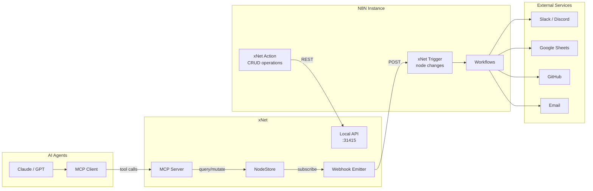

# 10: N8N & MCP Integrations

> External system integration: N8N community node, MCP server/client, webhook bridge.

**Dependencies:** Step 09 (Local API, ServiceClient)

## Overview

Rather than building integrations into xNet for every external service, we create bridges to existing automation platforms. N8N provides 400+ integrations via visual workflows. MCP enables AI agents to interact with xNet data.



## Part 1: N8N Community Node

### Package Structure

```
integrations/
  n8n-nodes-xnet/
    package.json
    tsconfig.json
    nodes/
      XNet/
        XNet.node.ts              # CRUD action node
        XNet.node.json            # Node UI description
      XNetTrigger/
        XNetTrigger.node.ts       # Webhook trigger node
        XNetTrigger.node.json
    credentials/
      XNetApi.credentials.ts      # Connection settings
```

### N8N Credential

```typescript
// integrations/n8n-nodes-xnet/credentials/XNetApi.credentials.ts

import { ICredentialType, INodeProperties } from 'n8n-workflow'

export class XNetApi implements ICredentialType {
  name = 'xNetApi'
  displayName = 'xNet API'
  documentationUrl = 'https://xnet.dev/docs/api'
  properties: INodeProperties[] = [
    {
      displayName: 'API URL',
      name: 'apiUrl',
      type: 'string',
      default: 'http://127.0.0.1:31415',
      description: 'xNet local API URL (Electron app must be running)'
    },
    {
      displayName: 'API Token',
      name: 'apiToken',
      type: 'string',
      typeOptions: { password: true },
      default: '',
      description: 'Optional authentication token'
    }
  ]
}
```

### N8N Trigger Node (Watches for Changes)

```typescript
// integrations/n8n-nodes-xnet/nodes/XNetTrigger/XNetTrigger.node.ts

import { ITriggerFunctions, INodeType, INodeTypeDescription, ITriggerResponse } from 'n8n-workflow'

export class XNetTrigger implements INodeType {
  description: INodeTypeDescription = {
    displayName: 'xNet Trigger',
    name: 'xNetTrigger',
    icon: 'file:xnet.svg',
    group: ['trigger'],
    version: 1,
    description: 'Triggers when nodes are created, updated, or deleted in xNet',
    defaults: { name: 'xNet Trigger' },
    inputs: [],
    outputs: ['main'],
    credentials: [{ name: 'xNetApi', required: true }],
    properties: [
      {
        displayName: 'Schema',
        name: 'schema',
        type: 'string',
        default: '',
        placeholder: 'xnet://xnet.dev/Invoice',
        description: 'Schema IRI to watch (leave empty for all)'
      },
      {
        displayName: 'Events',
        name: 'events',
        type: 'multiOptions',
        options: [
          { name: 'Created', value: 'created' },
          { name: 'Updated', value: 'updated' },
          { name: 'Deleted', value: 'deleted' }
        ],
        default: ['created', 'updated']
      },
      {
        displayName: 'Poll Interval (seconds)',
        name: 'pollInterval',
        type: 'number',
        default: 10,
        description: 'How often to check for changes (WebSocket preferred if available)'
      }
    ]
  }

  async trigger(this: ITriggerFunctions): Promise<ITriggerResponse> {
    const credentials = await this.getCredentials('xNetApi')
    const schema = this.getNodeParameter('schema', '') as string
    const events = this.getNodeParameter('events', []) as string[]
    const pollInterval = this.getNodeParameter('pollInterval', 10) as number

    const apiUrl = credentials.apiUrl as string
    let lastCheck = Date.now()

    // Polling approach (WebSocket upgrade in future)
    const poll = async () => {
      try {
        const response = await fetch(`${apiUrl}/api/v1/events?since=${lastCheck}&schema=${schema}`)
        const data = await response.json()
        lastCheck = Date.now()

        for (const event of data.events) {
          if (events.includes(event.type)) {
            this.emit([this.helpers.returnJsonArray([event])])
          }
        }
      } catch (err) {
        // Connection failed - xNet might not be running
      }
    }

    const interval = setInterval(poll, pollInterval * 1000)

    // Initial poll
    await poll()

    return {
      closeFunction: async () => clearInterval(interval)
    }
  }
}
```

### N8N Action Node (CRUD Operations)

```typescript
// integrations/n8n-nodes-xnet/nodes/XNet/XNet.node.ts

import {
  IExecuteFunctions,
  INodeType,
  INodeTypeDescription,
  INodeExecutionData
} from 'n8n-workflow'

export class XNet implements INodeType {
  description: INodeTypeDescription = {
    displayName: 'xNet',
    name: 'xNet',
    icon: 'file:xnet.svg',
    group: ['transform'],
    version: 1,
    description: 'Create, read, update, and delete nodes in xNet',
    defaults: { name: 'xNet' },
    inputs: ['main'],
    outputs: ['main'],
    credentials: [{ name: 'xNetApi', required: true }],
    properties: [
      {
        displayName: 'Operation',
        name: 'operation',
        type: 'options',
        options: [
          { name: 'Create', value: 'create', description: 'Create a new node' },
          { name: 'Get', value: 'get', description: 'Get a node by ID' },
          { name: 'Get Many', value: 'getMany', description: 'Query nodes' },
          { name: 'Update', value: 'update', description: 'Update a node' },
          { name: 'Delete', value: 'delete', description: 'Delete a node' }
        ],
        default: 'create'
      },
      {
        displayName: 'Schema',
        name: 'schema',
        type: 'string',
        default: '',
        placeholder: 'xnet://xnet.dev/Invoice',
        required: true,
        displayOptions: { show: { operation: ['create', 'getMany'] } }
      },
      {
        displayName: 'Node ID',
        name: 'nodeId',
        type: 'string',
        default: '',
        required: true,
        displayOptions: { show: { operation: ['get', 'update', 'delete'] } }
      },
      {
        displayName: 'Properties',
        name: 'properties',
        type: 'json',
        default: '{}',
        displayOptions: { show: { operation: ['create', 'update'] } }
      },
      {
        displayName: 'Filter',
        name: 'filter',
        type: 'json',
        default: '{}',
        displayOptions: { show: { operation: ['getMany'] } }
      },
      {
        displayName: 'Limit',
        name: 'limit',
        type: 'number',
        default: 50,
        displayOptions: { show: { operation: ['getMany'] } }
      }
    ]
  }

  async execute(this: IExecuteFunctions): Promise<INodeExecutionData[][]> {
    const credentials = await this.getCredentials('xNetApi')
    const apiUrl = credentials.apiUrl as string
    const operation = this.getNodeParameter('operation', 0) as string
    const items = this.getInputData()
    const results: INodeExecutionData[] = []

    for (let i = 0; i < items.length; i++) {
      let response: unknown

      switch (operation) {
        case 'create': {
          const schema = this.getNodeParameter('schema', i) as string
          const properties = JSON.parse(this.getNodeParameter('properties', i) as string)
          response = await fetch(`${apiUrl}/api/v1/nodes`, {
            method: 'POST',
            headers: { 'content-type': 'application/json' },
            body: JSON.stringify({ schema, properties })
          }).then((r) => r.json())
          break
        }
        case 'get': {
          const nodeId = this.getNodeParameter('nodeId', i) as string
          response = await fetch(`${apiUrl}/api/v1/nodes/${nodeId}`).then((r) => r.json())
          break
        }
        case 'getMany': {
          const schema = this.getNodeParameter('schema', i) as string
          const filter = JSON.parse(this.getNodeParameter('filter', i) as string)
          const limit = this.getNodeParameter('limit', i) as number
          response = await fetch(`${apiUrl}/api/v1/query`, {
            method: 'POST',
            headers: { 'content-type': 'application/json' },
            body: JSON.stringify({ schema, filter, limit })
          }).then((r) => r.json())
          break
        }
        case 'update': {
          const nodeId = this.getNodeParameter('nodeId', i) as string
          const properties = JSON.parse(this.getNodeParameter('properties', i) as string)
          response = await fetch(`${apiUrl}/api/v1/nodes/${nodeId}`, {
            method: 'PATCH',
            headers: { 'content-type': 'application/json' },
            body: JSON.stringify(properties)
          }).then((r) => r.json())
          break
        }
        case 'delete': {
          const nodeId = this.getNodeParameter('nodeId', i) as string
          await fetch(`${apiUrl}/api/v1/nodes/${nodeId}`, { method: 'DELETE' })
          response = { success: true }
          break
        }
      }

      results.push({ json: response as any })
    }

    return [results]
  }
}
```

## Part 2: MCP Server (xNet Exposes Tools to AI)

```typescript
// packages/plugins/src/services/mcp-server.ts

import { Server } from '@modelcontextprotocol/sdk/server'
import { StdioServerTransport } from '@modelcontextprotocol/sdk/server/stdio'

export function createMCPServer(store: NodeStore): Server {
  const server = new Server(
    {
      name: 'xnet',
      version: '1.0.0'
    },
    {
      capabilities: {
        tools: {},
        resources: {}
      }
    }
  )

  // Tool: Query nodes
  server.setRequestHandler('tools/list', async () => ({
    tools: [
      {
        name: 'xnet_query',
        description: 'Query nodes by schema and optional filter. Returns matching nodes.',
        inputSchema: {
          type: 'object',
          properties: {
            schema: { type: 'string', description: 'Schema IRI (e.g., xnet://xnet.dev/Task)' },
            filter: { type: 'object', description: 'Filter conditions' },
            limit: { type: 'number', description: 'Max results (default: 20)' }
          },
          required: ['schema']
        }
      },
      {
        name: 'xnet_create',
        description: 'Create a new node with the given schema and properties.',
        inputSchema: {
          type: 'object',
          properties: {
            schema: { type: 'string', description: 'Schema IRI' },
            properties: { type: 'object', description: 'Node properties' }
          },
          required: ['schema', 'properties']
        }
      },
      {
        name: 'xnet_update',
        description: 'Update properties of an existing node.',
        inputSchema: {
          type: 'object',
          properties: {
            nodeId: { type: 'string', description: 'Node ID to update' },
            properties: { type: 'object', description: 'Properties to update' }
          },
          required: ['nodeId', 'properties']
        }
      },
      {
        name: 'xnet_search',
        description: 'Full-text search across all nodes.',
        inputSchema: {
          type: 'object',
          properties: {
            query: { type: 'string', description: 'Search text' },
            limit: { type: 'number', description: 'Max results (default: 10)' }
          },
          required: ['query']
        }
      },
      {
        name: 'xnet_schemas',
        description: 'List all available schemas and their properties.',
        inputSchema: { type: 'object', properties: {} }
      }
    ]
  }))

  // Tool execution
  server.setRequestHandler('tools/call', async (request) => {
    const { name, arguments: args } = request.params

    switch (name) {
      case 'xnet_query': {
        const nodes = store.list({
          schemaIRI: args.schema,
          filter: args.filter,
          limit: args.limit ?? 20
        })
        return { content: [{ type: 'text', text: JSON.stringify(nodes, null, 2) }] }
      }
      case 'xnet_create': {
        const node = await store.create({
          schemaIRI: args.schema,
          properties: args.properties
        })
        return { content: [{ type: 'text', text: JSON.stringify(node, null, 2) }] }
      }
      case 'xnet_update': {
        const node = await store.update(args.nodeId, args.properties)
        return { content: [{ type: 'text', text: JSON.stringify(node, null, 2) }] }
      }
      case 'xnet_search': {
        // Use search index
        const results = searchIndex.search({ text: args.query, limit: args.limit ?? 10 })
        return { content: [{ type: 'text', text: JSON.stringify(results, null, 2) }] }
      }
      case 'xnet_schemas': {
        const iris = schemaRegistry.getAllIRIs()
        const schemas = await Promise.all(
          iris.map(async (iri) => {
            const s = await schemaRegistry.get(iri)
            return { iri, name: s?.schema.name, properties: s?.schema.properties }
          })
        )
        return { content: [{ type: 'text', text: JSON.stringify(schemas, null, 2) }] }
      }
      default:
        throw new Error(`Unknown tool: ${name}`)
    }
  })

  // Resources: expose nodes as resources
  server.setRequestHandler('resources/list', async () => ({
    resources: [
      {
        uri: 'xnet://nodes',
        name: 'All Nodes',
        description: 'List of all nodes in the local store',
        mimeType: 'application/json'
      }
    ]
  }))

  return server
}

// Start as stdio server (for MCP client connections)
export async function startMCPServer(store: NodeStore): Promise<void> {
  const server = createMCPServer(store)
  const transport = new StdioServerTransport()
  await server.connect(transport)
}
```

## Part 3: Webhook Event Emitter

```typescript
// packages/plugins/src/services/webhook-emitter.ts

export interface WebhookConfig {
  url: string
  events: ('created' | 'updated' | 'deleted')[]
  schema?: SchemaIRI // filter by schema
  secret?: string // HMAC signing key
  retries?: number // default: 3
}

export class WebhookEmitter {
  private configs: WebhookConfig[] = []
  private unsubscribe?: () => void

  constructor(private store: NodeStore) {}

  register(config: WebhookConfig): Disposable {
    this.configs.push(config)
    this.ensureSubscribed()
    return {
      dispose: () => {
        this.configs = this.configs.filter((c) => c !== config)
      }
    }
  }

  private ensureSubscribed(): void {
    if (this.unsubscribe) return
    this.unsubscribe = this.store.subscribe((event) => {
      this.handleEvent(event)
    })
  }

  private async handleEvent(event: NodeChangeEvent): void {
    const eventType = this.getEventType(event)
    if (!eventType) return

    for (const config of this.configs) {
      if (!config.events.includes(eventType)) continue
      if (config.schema && event.node?.schemaIRI !== config.schema) continue

      await this.send(config, {
        type: eventType,
        timestamp: Date.now(),
        node: event.node,
        change: event.change
      })
    }
  }

  private async send(config: WebhookConfig, payload: unknown, attempt = 0): Promise<void> {
    try {
      const body = JSON.stringify(payload)
      const headers: Record<string, string> = { 'content-type': 'application/json' }

      if (config.secret) {
        const signature = await this.sign(body, config.secret)
        headers['x-xnet-signature'] = signature
      }

      const response = await fetch(config.url, { method: 'POST', headers, body })

      if (!response.ok && attempt < (config.retries ?? 3)) {
        await new Promise((resolve) => setTimeout(resolve, 1000 * (attempt + 1)))
        return this.send(config, payload, attempt + 1)
      }
    } catch (err) {
      if (attempt < (config.retries ?? 3)) {
        await new Promise((resolve) => setTimeout(resolve, 1000 * (attempt + 1)))
        return this.send(config, payload, attempt + 1)
      }
      console.error(`Webhook delivery failed to ${config.url}:`, err)
    }
  }

  private getEventType(event: NodeChangeEvent): 'created' | 'updated' | 'deleted' | null {
    if (event.change.type === 'create') return 'created'
    if (event.change.type === 'update') return 'updated'
    if (event.change.type === 'delete') return 'deleted'
    return null
  }

  private async sign(body: string, secret: string): Promise<string> {
    const encoder = new TextEncoder()
    const key = await crypto.subtle.importKey(
      'raw',
      encoder.encode(secret),
      { name: 'HMAC', hash: 'SHA-256' },
      false,
      ['sign']
    )
    const signature = await crypto.subtle.sign('HMAC', key, encoder.encode(body))
    return Array.from(new Uint8Array(signature))
      .map((b) => b.toString(16).padStart(2, '0'))
      .join('')
  }
}
```

## Part 4: Event Endpoint for Local API

```typescript
// Addition to local-api.ts

// GET /api/v1/events?since=timestamp&schema=iri
app.get('/api/v1/events', (req, res) => {
  const since = Number(req.query.since) || 0
  const schema = req.query.schema as string | undefined
  const events = eventBuffer.getSince(since, schema)
  res.json({ events, timestamp: Date.now() })
})

// WebSocket for real-time events
import { WebSocketServer } from 'ws'

const wss = new WebSocketServer({ noServer: true })

server.on('upgrade', (request, socket, head) => {
  if (request.url === '/api/v1/events/ws') {
    wss.handleUpgrade(request, socket, head, (ws) => {
      // Subscribe to NodeStore and forward events
      const unsub = store.subscribe((event) => {
        ws.send(
          JSON.stringify({
            type: event.change.type,
            node: event.node,
            timestamp: Date.now()
          })
        )
      })
      ws.on('close', unsub)
    })
  }
})
```

## N8N Workflow Examples

### Example 1: Invoice → PDF → Email

```
[xNet Trigger: Invoice created]
  → [Generate PDF from template]
  → [Upload to xNet (file property)]
  → [Send Email with PDF attachment]
```

### Example 2: Task Overdue → Slack Notification

```
[Schedule: Every hour]
  → [xNet: Get Many (Tasks, filter: dueDate < now, status != done)]
  → [Filter: only tasks overdue by > 1 day]
  → [Slack: Post message to #tasks channel]
  → [xNet: Update (set notified: true)]
```

### Example 3: GitHub Issue → xNet Task

```
[GitHub Trigger: Issue created]
  → [xNet: Create (Task schema)]
    properties: {
      title: "{{$node.GitHub.json.title}}",
      description: "{{$node.GitHub.json.body}}",
      url: "{{$node.GitHub.json.html_url}}",
      status: "pending"
    }
```

## Checklist

- [ ] Create `integrations/n8n-nodes-xnet/` package
- [ ] Implement xNet credential type
- [ ] Implement XNetTrigger node (polling + future WebSocket)
- [ ] Implement XNet action node (create/get/getMany/update/delete)
- [ ] Add event buffer to local API for polling
- [ ] Add WebSocket endpoint to local API for real-time events
- [ ] Implement MCP server with all tools
- [ ] Register MCP server as a Service plugin
- [ ] Implement WebhookEmitter with retry and HMAC signing
- [ ] Add webhook configuration UI in settings
- [ ] Publish n8n-nodes-xnet to npm (when ready)
- [ ] Write integration tests for N8N nodes
- [ ] Document API endpoints
- [ ] Add authentication/token support to local API

---

[Back to README](./README.md) | [Previous: Services (Electron)](./09-services-electron.md)
