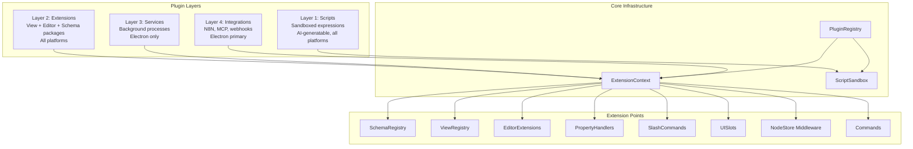

# xNet Implementation Plan - Step 03.5: Plugin Architecture

> A layered plugin system enabling users to extend xNet with custom views, editor extensions, automations, and integrations — from AI-generated scripts to full background services.

## Executive Summary

xNet needs a plugin system that spans the full spectrum: from a non-technical user asking AI to "color-code my overdue tasks" to a developer building a Gantt chart view or connecting a local LLM. The architecture uses four layers of increasing power and complexity:

```typescript
// Layer 1: A script (AI-generatable, runs everywhere)
const script = {
  trigger: { type: 'onChange', property: 'amount' },
  code: `(node) => node.amount > 1000 ? { priority: 'high' } : null`
}

// Layer 2: An extension (developer-built, cross-platform)
export default defineExtension({
  id: 'com.example.gantt',
  contributes: { views: [{ type: 'gantt', component: GanttView }] }
})
```

The system leverages xNet's existing registries (SchemaRegistry, BlockRegistry, NodeStore events) and adds the missing pieces (ViewRegistry, PluginRegistry, Script Sandbox, UI slots).

## Architecture Overview



## Architecture Decisions

| Decision          | Choice                                 | Rationale                                           |
| ----------------- | -------------------------------------- | --------------------------------------------------- |
| Script execution  | ShadowRealm / iframe sandbox           | Secure on web, no network/DOM access, AI-safe       |
| Extension model   | Obsidian-style (same process)          | Simple DX, full React access, TipTap-native         |
| Service model     | VS Code-style (separate process)       | Isolation for heavy workloads, crash safety         |
| Integration model | N8N community node                     | Leverages 400+ existing N8N integrations            |
| Plugin storage    | Plugins are Nodes                      | P2P sync, version history, same permissions model   |
| View registration | Runtime registry                       | Dynamic loading, hot-reload in dev                  |
| Permission model  | Declared in manifest                   | Reviewable before install, progressive capabilities |
| Script = Formula  | Scripts implement formula/rollup types | One system, not two; AI generates both              |

## Implementation Phases

### Phase 1: Plugin Foundation (Steps 01-02)

Core infrastructure that all other phases depend on.

| Task | Document                                                   | Description                                                 | Status |
| ---- | ---------------------------------------------------------- | ----------------------------------------------------------- | ------ |
| 1.1  | [01-plugin-registry-core.md](./01-plugin-registry-core.md) | PluginRegistry, ExtensionContext, lifecycle, manifest types | [x]    |
| 1.2  | [02-extension-points.md](./02-extension-points.md)         | Wire existing registries + add missing ones to NodeStore    | [x]    |

**Validation Gate:**

- [x] Can register/unregister a plugin programmatically
- [x] Extension context provides access to NodeStore, schemas, subscriptions
- [x] Middleware chain on NodeStore works for pre/post change hooks
- [x] Plugin metadata stored as Nodes

### Phase 2: Views & Editor (Steps 03-05)

Make the UI extensible — custom views, editor blocks, slash commands.

| Task | Document                                             | Description                                                  | Status |
| ---- | ---------------------------------------------------- | ------------------------------------------------------------ | ------ |
| 2.1  | [03-view-registry.md](./03-view-registry.md)         | ViewRegistry, ViewContribution, dynamic view type resolution | [x]    |
| 2.2  | [04-editor-extensions.md](./04-editor-extensions.md) | Extension prop, custom blocks, toolbar items                 | [x]    |
| 2.3  | [05-slash-commands.md](./05-slash-commands.md)       | TipTap suggestion plugin, command registry                   | [x]    |

**Validation Gate:**

- [x] A plugin can register a custom view type visible in the view switcher
- [x] A plugin can add a TipTap extension to the editor
- [x] Slash commands work with plugin-registered commands
- [x] PropertyHandler registration is dynamic

### Phase 3: Scripts & AI (Steps 06-07)

End-user plugin creation: sandbox, script editor, AI generation.

| Task | Document                                                   | Description                                    | Status |
| ---- | ---------------------------------------------------------- | ---------------------------------------------- | ------ |
| 3.1  | [06-script-sandbox.md](./06-script-sandbox.md)             | ScriptSandbox, ScriptSchema, reactive triggers | [x]    |
| 3.2  | [07-ai-script-generation.md](./07-ai-script-generation.md) | AI prompt engineering, in-app editor, preview  | [x]    |

**Validation Gate:**

- [x] Scripts execute safely in sandbox with no escape
- [x] Scripts stored as Nodes and sync via P2P
- [x] AI can generate valid scripts from natural language
- [x] Scripts work as computed column values in table views
- [x] Script errors don't crash the app

### Phase 4: UI Shell (Step 08)

App-level extension points: sidebar, command palette, settings, routes.

| Task | Document                                             | Description                                             | Status |
| ---- | ---------------------------------------------------- | ------------------------------------------------------- | ------ |
| 4.1  | [08-ui-slots-commands.md](./08-ui-slots-commands.md) | Sidebar slots, command palette, settings panels, routes | [~]    |

**Validation Gate:**

- [x] Enhanced SidebarContribution with position, section, badge
- [x] CommandPalette component with fuzzy search
- [x] ShortcutManager for keyboard shortcuts
- [x] Cmd+Shift+P global shortcut to open command palette
- [ ] Sidebar modified to render plugin items
- [ ] Plugin settings panels render in settings view
- [ ] Web app supports dynamic route registration

### Phase 5: Services & Integrations (Steps 09-10)

Electron-only background processes + external system connections.

| Task | Document                                                   | Description                                    | Status |
| ---- | ---------------------------------------------------------- | ---------------------------------------------- | ------ |
| 5.1  | [09-services-electron.md](./09-services-electron.md)       | Process manager, IPC bridge, MCP server        | [ ]    |
| 5.2  | [10-n8n-mcp-integrations.md](./10-n8n-mcp-integrations.md) | N8N community node, local REST API, MCP client | [ ]    |

**Validation Gate:**

- [ ] A service plugin can spawn and manage a child process
- [ ] xNet exposes local HTTP API for external tools
- [ ] N8N can trigger workflows on node changes
- [ ] xNet works as MCP server (AI agents can query nodes)

## Package Structure (Target)

```
packages/
  plugins/                        # NEW: Core plugin infrastructure
    src/
      registry.ts                 # PluginRegistry class
      context.ts                  # ExtensionContext factory
      manifest.ts                 # Manifest types and validation
      sandbox/
        sandbox.ts                # ScriptSandbox implementation
        context.ts                # ScriptContext (safe API surface)
        ast-validator.ts          # AST checking for unsafe patterns
      contributions/
        views.ts                  # ViewContributionRegistry
        commands.ts               # CommandRegistry
        slots.ts                  # UISlotRegistry
        editor.ts                 # EditorContributionRegistry
      services/
        process-manager.ts        # Electron: child process lifecycle
        local-api.ts              # HTTP API server
      schemas/
        plugin.ts                 # PluginSchema (plugin metadata as Node)
        script.ts                 # ScriptSchema (user scripts as Nodes)
      index.ts
    package.json

  editor/                         # MODIFIED
    src/
      components/
        RichTextEditor.tsx        # + extensions prop
        SlashCommandMenu.tsx      # NEW: suggestion popup
      extensions/
        slash-commands.ts         # NEW: TipTap suggestion extension

  views/                          # MODIFIED
    src/
      registry.ts                 # NEW: ViewRegistry
      properties/
        index.ts                  # + registerPropertyHandler()

  react/                          # MODIFIED
    src/
      context.ts                  # + plugins field on XNetConfig
      hooks/
        usePlugins.ts             # NEW: plugin access hook

integrations/
  n8n-nodes-xnet/                 # NEW: Separate package (community node)
    nodes/
      XNet.node.ts
      XNetTrigger.node.ts
    credentials/
      XNetApi.credentials.ts
    package.json
```

## Platform Compatibility Matrix

| Feature                | Web/PWA       | Electron | Mobile                 |
| ---------------------- | ------------- | -------- | ---------------------- |
| Scripts (Layer 1)      | Full          | Full     | Full                   |
| Extensions - Views     | Full          | Full     | Partial (React Native) |
| Extensions - Editor    | Full          | Full     | WebView only           |
| Extensions - Schemas   | Full          | Full     | Full                   |
| Extensions - Commands  | Full          | Full     | Limited                |
| Services (Layer 3)     | N/A           | Full     | N/A                    |
| Integrations (Layer 4) | Webhooks only | Full     | N/A                    |
| AI Script Generation   | Full          | Full     | Full                   |
| Plugin P2P Sync        | Full          | Full     | Full                   |

## Dependencies

| Package                        | Purpose                 | Used By           |
| ------------------------------ | ----------------------- | ----------------- |
| `@anthropic-ai/sdk` or similar | AI script generation    | Script editor     |
| `quickjs-emscripten`           | WASM sandbox (fallback) | ScriptSandbox     |
| `@codemirror/lang-javascript`  | Script editor           | In-app IDE        |
| `@tiptap/suggestion`           | Slash command popup     | Editor extensions |
| `n8n-workflow`                 | N8N node SDK            | n8n-nodes-xnet    |

## Success Criteria

1. A developer can create a custom view plugin in under 30 minutes
2. A non-developer can create a computed column via AI in under 2 minutes
3. Scripts run safely with no access to network, DOM, or global state
4. Plugins sync between peers via P2P (stored as Nodes)
5. The editor accepts third-party TipTap extensions without forking
6. At least 3 view types are registered via the plugin system (table, board, gallery)
7. N8N can create/read/update xNet nodes via community node
8. Background services restart on crash (Electron)
9. Plugin install/uninstall is clean (no orphaned registrations)
10. The script sandbox passes security fuzzing (no breakouts)

## Reference Documents

- [Plugin Architecture Exploration](../explorations/0006_PLUGIN_ARCHITECTURE.md) - Full research with prior art comparison
- [Data Model Consolidation](../planStep02_1DataModelConsolidation/README.md) - Schema/Node system (plugin data model)
- [Editor Redesign Research](../explorations/0003_EDITOR_REDESIGN_RESEARCH.md) - TipTap extension patterns

---

[Back to docs/](../) | [Start Implementation](./01-plugin-registry-core.md)
