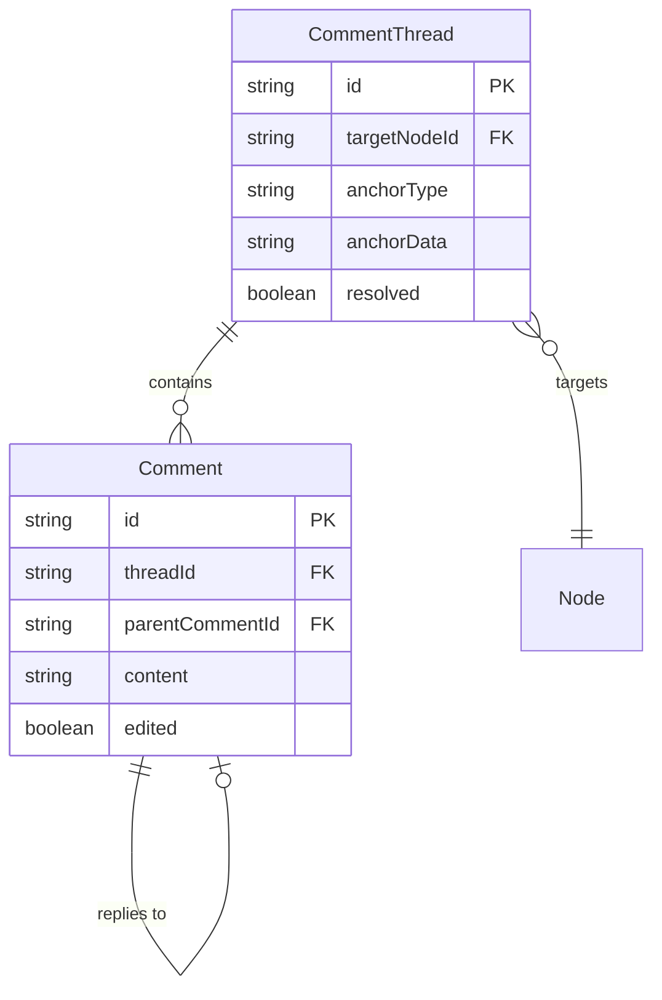

# 01: Comment Schemas

> CommentThread and Comment schema definitions for the xNet data layer

**Duration:** 1-2 days  
**Dependencies:** `@xnet/data` (defineSchema, NodeStore)

## Overview

Comments are modeled as two schemas: `CommentThread` (the container with anchor info) and `Comment` (individual messages within a thread). Both are standard Nodes — they sync, query, and get history like any other data.



## Implementation

### CommentThread Schema

```typescript
// packages/data/src/schema/schemas/commentThread.ts

import {
  defineSchema,
  relation,
  select,
  text,
  checkbox,
  person,
  date,
  created,
  createdBy
} from '../properties'

export const CommentThreadSchema = defineSchema({
  name: 'CommentThread',
  namespace: 'xnet://xnet.dev/',

  properties: {
    // What this thread is attached to
    targetNodeId: relation({
      required: true,
      description: 'The Node this thread comments on (Page, Database, Canvas, etc.)'
    }),

    // How the thread is anchored to the target
    anchorType: select({
      options: [
        'text',
        'cell',
        'row',
        'column',
        'canvas-position',
        'canvas-object',
        'node'
      ] as const,
      required: true,
      description: 'Type of anchor point'
    }),

    // Anchor-specific positioning data (JSON-encoded, type depends on anchorType)
    anchorData: text({
      required: true,
      description: 'JSON-encoded anchor position data'
    }),

    // Thread state
    resolved: checkbox({
      default: false,
      description: 'Whether the thread has been resolved'
    }),
    resolvedBy: person({
      description: 'Who resolved the thread'
    }),
    resolvedAt: date({
      description: 'When the thread was resolved'
    }),

    // Metadata
    createdAt: created(),
    createdBy: createdBy()
  },

  hasContent: false,
  icon: 'message-circle'
})

export type CommentThread = InferNode<typeof CommentThreadSchema>
```

### Comment Schema

```typescript
// packages/data/src/schema/schemas/comment.ts

import { defineSchema, relation, text, checkbox, date, created, createdBy } from '../properties'

export const CommentSchema = defineSchema({
  name: 'Comment',
  namespace: 'xnet://xnet.dev/',

  properties: {
    // Thread membership
    threadId: relation({
      required: true,
      description: 'Parent CommentThread this comment belongs to'
    }),

    // Reply threading (flat — one level of replies)
    parentCommentId: relation({
      description: 'If this is a reply, the parent comment ID'
    }),

    // Content: plain text with markdown rendering
    content: text({
      required: true,
      description: 'Comment body (plain text, rendered as markdown)'
    }),

    // Edit tracking
    edited: checkbox({
      default: false,
      description: 'Whether this comment has been edited'
    }),
    editedAt: date({
      description: 'When this comment was last edited'
    }),

    // Metadata
    createdAt: created(),
    createdBy: createdBy()
  },

  hasContent: false,
  icon: 'message-square'
})

export type Comment = InferNode<typeof CommentSchema>
```

### Schema Registration

```typescript
// packages/data/src/schema/schemas/index.ts (additions)

export { CommentThreadSchema, type CommentThread } from './commentThread'
export { CommentSchema, type Comment } from './comment'
```

### Anchor Data Types

```typescript
// packages/data/src/schema/schemas/commentAnchors.ts

/**
 * Anchor type definitions.
 * The anchorData field on CommentThread is JSON-encoded using these types.
 */

/** Text selection in the rich text editor */
export interface TextAnchor {
  /** Yjs relative position for selection start (survives concurrent edits) */
  startRelative: string // Base64-encoded Uint8Array from Y.encodeRelativePosition
  /** Yjs relative position for selection end */
  endRelative: string
  /** The quoted text at time of comment (fallback for orphaned anchors) */
  quotedText: string
}

/** Database cell */
export interface CellAnchor {
  rowId: string // Node ID of the database row
  propertyKey: string // Schema property key of the column
}

/** Database row */
export interface RowAnchor {
  rowId: string
}

/** Database column */
export interface ColumnAnchor {
  propertyKey: string
}

/** Fixed canvas position (Figma-style pin) */
export interface CanvasPositionAnchor {
  x: number // Canvas-space X coordinate
  y: number // Canvas-space Y coordinate
}

/** Canvas object attachment (follows object movement) */
export interface CanvasObjectAnchor {
  objectId: string // ID of the canvas object
  offsetX?: number // Optional offset from object origin
  offsetY?: number
}

/** Whole-node comment (no additional positioning needed) */
export interface NodeAnchor {
  // Empty — targetNodeId on CommentThread is sufficient
}

/** Union type for all anchor data */
export type AnchorData =
  | TextAnchor
  | CellAnchor
  | RowAnchor
  | ColumnAnchor
  | CanvasPositionAnchor
  | CanvasObjectAnchor
  | NodeAnchor

/** Encode anchor data for storage */
export function encodeAnchor(data: AnchorData): string {
  return JSON.stringify(data)
}

/** Decode anchor data from storage */
export function decodeAnchor<T extends AnchorData>(json: string): T {
  return JSON.parse(json) as T
}
```

## Tests

```typescript
// packages/data/test/schemas/comment.test.ts

import { describe, it, expect } from 'vitest'
import { CommentThreadSchema, CommentSchema } from '../src/schema/schemas'
import {
  encodeAnchor,
  decodeAnchor,
  TextAnchor,
  CellAnchor
} from '../src/schema/schemas/commentAnchors'

describe('CommentThreadSchema', () => {
  it('should have correct IRI', () => {
    expect(CommentThreadSchema.schema['@id']).toBe('xnet://xnet.dev/CommentThread')
  })

  it('should require targetNodeId and anchorType', () => {
    const props = CommentThreadSchema.schema.properties
    const targetProp = props.find((p) => p.name === 'targetNodeId')
    const anchorProp = props.find((p) => p.name === 'anchorType')
    expect(targetProp?.required).toBe(true)
    expect(anchorProp?.required).toBe(true)
  })

  it('should have all anchor type options', () => {
    const props = CommentThreadSchema.schema.properties
    const anchorProp = props.find((p) => p.name === 'anchorType')
    expect(anchorProp?.options).toContain('text')
    expect(anchorProp?.options).toContain('cell')
    expect(anchorProp?.options).toContain('canvas-position')
    expect(anchorProp?.options).toContain('canvas-object')
    expect(anchorProp?.options).toContain('node')
  })

  it('should default resolved to false', () => {
    const props = CommentThreadSchema.schema.properties
    const resolvedProp = props.find((p) => p.name === 'resolved')
    expect(resolvedProp?.default).toBe(false)
  })
})

describe('CommentSchema', () => {
  it('should have correct IRI', () => {
    expect(CommentSchema.schema['@id']).toBe('xnet://xnet.dev/Comment')
  })

  it('should require threadId and content', () => {
    const props = CommentSchema.schema.properties
    const threadProp = props.find((p) => p.name === 'threadId')
    const contentProp = props.find((p) => p.name === 'content')
    expect(threadProp?.required).toBe(true)
    expect(contentProp?.required).toBe(true)
  })

  it('should not require parentCommentId (optional replies)', () => {
    const props = CommentSchema.schema.properties
    const parentProp = props.find((p) => p.name === 'parentCommentId')
    expect(parentProp?.required).toBeFalsy()
  })
})

describe('Anchor encoding', () => {
  it('should round-trip text anchors', () => {
    const anchor: TextAnchor = {
      startRelative: 'base64start...',
      endRelative: 'base64end...',
      quotedText: 'the quick brown fox'
    }
    const encoded = encodeAnchor(anchor)
    const decoded = decodeAnchor<TextAnchor>(encoded)
    expect(decoded.quotedText).toBe('the quick brown fox')
    expect(decoded.startRelative).toBe('base64start...')
  })

  it('should round-trip cell anchors', () => {
    const anchor: CellAnchor = {
      rowId: 'row-123',
      propertyKey: 'status'
    }
    const encoded = encodeAnchor(anchor)
    const decoded = decodeAnchor<CellAnchor>(encoded)
    expect(decoded.rowId).toBe('row-123')
    expect(decoded.propertyKey).toBe('status')
  })
})
```

## Checklist

- [ ] Create CommentThreadSchema with all properties
- [ ] Create CommentSchema with threadId reference
- [ ] Create anchor type definitions and encode/decode utilities
- [ ] Register schemas in schema index
- [ ] Verify schemas pass validation
- [ ] Write schema tests
- [ ] Tests pass

---

[Back to README](./README.md) | [Next: Comment Mark](./02-comment-mark.md)
