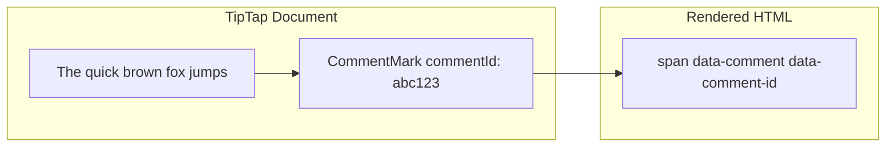

# 02: Comment Mark Extension

> TipTap Mark for highlighting commented text in the editor

**Duration:** 1-2 days  
**Dependencies:** [01-comment-schemas.md](./01-comment-schemas.md), `@xnet/editor`

## Overview

The `CommentMark` is a TipTap Mark extension that visually highlights text ranges associated with comments. It stores the `commentId` (the root Comment's ID) as an attribute and renders as a styled `<span>` element.

With the **Universal Social Primitives** pattern, a "thread" is simply a root Comment plus its replies. The mark references the root Comment's ID.



## Implementation

### CommentMark Extension

```typescript
// packages/editor/src/extensions/comment-mark.ts

import { Mark, mergeAttributes } from '@tiptap/core'

declare module '@tiptap/core' {
  interface Commands<ReturnType> {
    commentMark: {
      setComment: (commentId: string) => ReturnType
      unsetComment: (commentId: string) => ReturnType
      toggleComment: (commentId: string) => ReturnType
    }
  }
}

export const CommentMark = Mark.create({
  name: 'comment',

  // Allow multiple comment marks on same text (overlapping comments)
  inclusive: false,
  excludes: '',

  addAttributes() {
    return {
      commentId: {
        default: null,
        parseHTML: (el) => el.getAttribute('data-comment-id'),
        renderHTML: (attrs) => ({ 'data-comment-id': attrs.commentId })
      },
      resolved: {
        default: false,
        parseHTML: (el) => el.getAttribute('data-resolved') === 'true',
        renderHTML: (attrs) => (attrs.resolved ? { 'data-resolved': 'true' } : {})
      }
    }
  },

  parseHTML() {
    return [{ tag: 'span[data-comment]' }]
  },

  renderHTML({ HTMLAttributes }) {
    const classes = [
      HTMLAttributes['data-resolved'] === 'true' ? 'comment-resolved' : 'comment-active'
    ].join(' ')

    return [
      'span',
      mergeAttributes(HTMLAttributes, {
        'data-comment': '',
        class: classes
      }),
      0
    ]
  },

  addCommands() {
    return {
      setComment:
        (commentId: string) =>
        ({ commands }) => {
          return commands.setMark(this.name, { commentId, resolved: false })
        },

      unsetComment:
        (commentId: string) =>
        ({ tr, state }) => {
          // Remove only the mark with this specific commentId
          const { from, to } = state.selection
          state.doc.nodesBetween(from, to, (node, pos) => {
            node.marks.forEach((mark) => {
              if (mark.type.name === this.name && mark.attrs.commentId === commentId) {
                tr.removeMark(pos, pos + node.nodeSize, mark)
              }
            })
          })
          return true
        },

      toggleComment:
        (commentId: string) =>
        ({ commands, state }) => {
          const { from, to } = state.selection
          let hasComment = false

          state.doc.nodesBetween(from, to, (node) => {
            if (
              node.marks.some((m) => m.type.name === this.name && m.attrs.commentId === commentId)
            ) {
              hasComment = true
            }
          })

          return hasComment ? commands.unsetComment(commentId) : commands.setComment(commentId)
        }
    }
  }
})
```

### Styling

```css
/* packages/editor/src/styles/comments.css */

/* Active comment highlight */
span[data-comment].comment-active {
  background-color: rgba(255, 212, 0, 0.25);
  border-bottom: 2px solid rgba(255, 212, 0, 0.8);
  cursor: pointer;
  transition: background-color 0.15s ease;
}

span[data-comment].comment-active:hover {
  background-color: rgba(255, 212, 0, 0.4);
}

/* Selected/focused comment (when popover is open) */
span[data-comment].comment-active.comment-selected {
  background-color: rgba(255, 212, 0, 0.45);
  box-shadow: 0 0 0 2px rgba(255, 212, 0, 0.3);
}

/* Resolved comment (subtle, de-emphasized) */
span[data-comment].comment-resolved {
  background-color: transparent;
  border-bottom: 1px dashed rgba(0, 0, 0, 0.15);
}

/* Dark mode */
.dark span[data-comment].comment-active {
  background-color: rgba(255, 212, 0, 0.15);
  border-bottom-color: rgba(255, 212, 0, 0.6);
}

.dark span[data-comment].comment-active:hover {
  background-color: rgba(255, 212, 0, 0.25);
}

.dark span[data-comment].comment-resolved {
  border-bottom-color: rgba(255, 255, 255, 0.15);
}

/* Overlapping comments (nested marks) — progressively darker */
span[data-comment] span[data-comment] {
  background-color: rgba(255, 180, 0, 0.35);
}

span[data-comment] span[data-comment] span[data-comment] {
  background-color: rgba(255, 160, 0, 0.45);
}
```

### Registration in Editor

```typescript
// packages/editor/src/components/RichTextEditor.tsx (additions)

import { CommentMark } from '../extensions/comment-mark'

// Add to extensions array:
extensions: [
  // ...existing extensions
  CommentMark
]
```

## Usage

### Applying a comment mark

```typescript
// After creating a Comment Node:
editor.chain().focus().setComment(comment.id).run()
```

### Removing a comment mark (on comment deletion)

```typescript
editor.chain().focus().unsetComment(comment.id).run()
```

### Updating resolved state

```typescript
// When thread is resolved, update the mark to show subtle styling
const { doc, tr } = editor.state

doc.descendants((node, pos) => {
  node.marks.forEach((mark) => {
    if (mark.type.name === 'comment' && mark.attrs.commentId === commentId) {
      tr.removeMark(pos, pos + node.nodeSize, mark)
      tr.addMark(
        pos,
        pos + node.nodeSize,
        editor.schema.marks.comment.create({ commentId, resolved: true })
      )
    }
  })
})

editor.view.dispatch(tr)
```

## Tests

```typescript
// packages/editor/test/comment-mark.test.ts

import { describe, it, expect } from 'vitest'
import { Editor } from '@tiptap/core'
import StarterKit from '@tiptap/starter-kit'
import { CommentMark } from '../src/extensions/comment-mark'

function createEditor(content: string) {
  return new Editor({
    extensions: [StarterKit, CommentMark],
    content
  })
}

describe('CommentMark', () => {
  it('should apply comment mark with commentId', () => {
    const editor = createEditor('<p>Hello world</p>')
    editor.commands.setTextSelection({ from: 1, to: 6 })
    editor.commands.setComment('comment-1')

    const marks = editor.state.doc.nodeAt(1)?.marks ?? []
    expect(marks.some((m) => m.type.name === 'comment' && m.attrs.commentId === 'comment-1')).toBe(
      true
    )
  })

  it('should allow overlapping comments', () => {
    const editor = createEditor('<p>Hello world</p>')

    // First comment on "Hello"
    editor.commands.setTextSelection({ from: 1, to: 6 })
    editor.commands.setComment('comment-1')

    // Second comment on "lo wor"
    editor.commands.setTextSelection({ from: 4, to: 10 })
    editor.commands.setComment('comment-2')

    // "lo" (positions 4-5) should have both marks
    const node = editor.state.doc.nodeAt(4)
    const commentMarks = node?.marks.filter((m) => m.type.name === 'comment') ?? []
    expect(commentMarks.length).toBe(2)
  })

  it('should remove only specific commentId mark', () => {
    const editor = createEditor('<p>Hello world</p>')
    editor.commands.setTextSelection({ from: 1, to: 6 })
    editor.commands.setComment('comment-1')
    editor.commands.setComment('comment-2')

    editor.commands.setTextSelection({ from: 1, to: 6 })
    editor.commands.unsetComment('comment-1')

    const marks = editor.state.doc.nodeAt(1)?.marks ?? []
    expect(marks.some((m) => m.attrs.commentId === 'comment-1')).toBe(false)
    expect(marks.some((m) => m.attrs.commentId === 'comment-2')).toBe(true)
  })

  it('should render with data-comment attribute', () => {
    const editor = createEditor('<p>Hello world</p>')
    editor.commands.setTextSelection({ from: 1, to: 6 })
    editor.commands.setComment('comment-1')

    const html = editor.getHTML()
    expect(html).toContain('data-comment')
    expect(html).toContain('data-comment-id="comment-1"')
    expect(html).toContain('comment-active')
  })
})
```

## Checklist

- [ ] Create CommentMark extension with commentId/resolved attributes
- [ ] Implement setComment, unsetComment, toggleComment commands
- [ ] Allow overlapping marks (excludes: '')
- [ ] Add comment highlight CSS (active, hover, resolved, dark mode, overlapping)
- [ ] Register in RichTextEditor extensions
- [ ] Write mark tests
- [ ] Tests pass

---

[Back to README](./README.md) | [Previous: Comment Schemas](./01-comment-schemas.md) | [Next: Anchoring](./03-anchoring.md)
