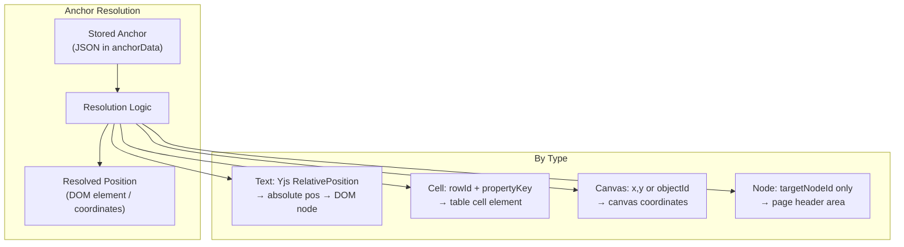
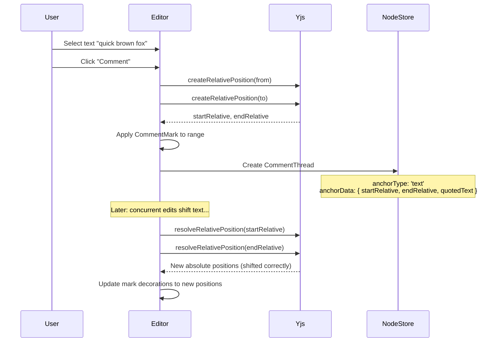

# 03: Anchoring Strategies

> Positional anchoring for comments across text, database, and canvas surfaces

**Duration:** 2-3 days  
**Dependencies:** [01-comment-schemas.md](./01-comment-schemas.md), [02-comment-mark.md](./02-comment-mark.md)

## Overview

Each comment thread has an anchor that defines where it attaches. The anchoring strategy varies by surface type, with the key challenge being **text anchors** that must survive concurrent edits.



## Text Anchor Implementation

### Capturing Anchors

When a user creates a comment on a text selection, we capture Yjs `RelativePosition` values that survive concurrent edits.

```typescript
// packages/editor/src/comments/text-anchor.ts

import * as Y from 'yjs'
import { Editor } from '@tiptap/core'
import { TextAnchor } from '@xnet/data'
import { ySyncPluginKey } from 'y-prosemirror'

/**
 * Capture a text anchor from the current editor selection.
 * Returns a TextAnchor that survives concurrent edits via Yjs RelativePosition.
 */
export function captureTextAnchor(editor: Editor): TextAnchor | null {
  const { from, to } = editor.state.selection

  if (from === to) return null // No selection

  // Get the Y.XmlFragment binding
  const ystate = ySyncPluginKey.getState(editor.state)
  if (!ystate?.type) return null

  const ydoc = ystate.type.doc
  if (!ydoc) return null

  // Convert ProseMirror positions to Yjs relative positions
  const startAbsolute = Y.createAbsolutePositionFromRelativePosition(
    Y.createRelativePositionFromTypeIndex(ystate.type, from - 1),
    ydoc
  )
  const endAbsolute = Y.createAbsolutePositionFromRelativePosition(
    Y.createRelativePositionFromTypeIndex(ystate.type, to - 1),
    ydoc
  )

  if (!startAbsolute || !endAbsolute) return null

  // Encode as relative positions (these survive concurrent edits)
  const startRelative = Y.encodeRelativePosition(
    Y.createRelativePositionFromTypeIndex(ystate.type, from - 1)
  )
  const endRelative = Y.encodeRelativePosition(
    Y.createRelativePositionFromTypeIndex(ystate.type, to - 1)
  )

  // Capture the quoted text for fallback display if anchor becomes orphaned
  const quotedText = editor.state.doc.textBetween(from, to, ' ')

  return {
    startRelative: uint8ArrayToBase64(startRelative),
    endRelative: uint8ArrayToBase64(endRelative),
    quotedText
  }
}

/**
 * Resolve a text anchor to absolute ProseMirror positions.
 * Returns null if the anchor is orphaned (text was deleted).
 */
export function resolveTextAnchor(
  editor: Editor,
  anchor: TextAnchor
): { from: number; to: number } | null {
  const ystate = ySyncPluginKey.getState(editor.state)
  if (!ystate?.type) return null

  const ydoc = ystate.type.doc
  if (!ydoc) return null

  const startRelPos = Y.decodeRelativePosition(base64ToUint8Array(anchor.startRelative))
  const endRelPos = Y.decodeRelativePosition(base64ToUint8Array(anchor.endRelative))

  const startAbs = Y.createAbsolutePositionFromRelativePosition(startRelPos, ydoc)
  const endAbs = Y.createAbsolutePositionFromRelativePosition(endRelPos, ydoc)

  if (!startAbs || !endAbs) return null // Orphaned

  // Convert Yjs indices back to ProseMirror positions (+1 for doc offset)
  return {
    from: startAbs.index + 1,
    to: endAbs.index + 1
  }
}

// Utility: Base64 encoding for Uint8Array storage in JSON
function uint8ArrayToBase64(arr: Uint8Array): string {
  return btoa(String.fromCharCode(...arr))
}

function base64ToUint8Array(base64: string): Uint8Array {
  const binary = atob(base64)
  const arr = new Uint8Array(binary.length)
  for (let i = 0; i < binary.length; i++) {
    arr[i] = binary.charCodeAt(i)
  }
  return arr
}
```

### Anchor Lifecycle



### Anchor Restoration on Document Open

When a document is opened, we need to re-apply comment marks at the correct positions:

```typescript
// packages/editor/src/comments/restore-marks.ts

import { Editor } from '@tiptap/core'
import { CommentThread, TextAnchor, decodeAnchor } from '@xnet/data'
import { resolveTextAnchor } from './text-anchor'

/**
 * Restore comment marks from stored CommentThread nodes.
 * Called when a document is first opened.
 */
export function restoreCommentMarks(
  editor: Editor,
  threads: CommentThread[]
): { resolved: string[]; orphaned: string[] } {
  const resolved: string[] = []
  const orphaned: string[] = []

  const { tr } = editor.state

  for (const thread of threads) {
    if (thread.properties.anchorType !== 'text') continue

    const anchor = decodeAnchor<TextAnchor>(thread.properties.anchorData as string)
    const positions = resolveTextAnchor(editor, anchor)

    if (positions) {
      // Apply the mark at the resolved position
      const markType = editor.schema.marks.comment
      tr.addMark(
        positions.from,
        positions.to,
        markType.create({
          threadId: thread.id,
          resolved: thread.properties.resolved
        })
      )
      resolved.push(thread.id)
    } else {
      // Anchor is orphaned — text was deleted
      orphaned.push(thread.id)
    }
  }

  if (tr.steps.length > 0) {
    editor.view.dispatch(tr)
  }

  return { resolved, orphaned }
}
```

## Database Anchor Resolution

Database anchors are stable (ID-based) and don't need CRDT-relative positioning:

```typescript
// packages/views/src/comments/database-anchor.ts

import { CellAnchor, RowAnchor, ColumnAnchor } from '@xnet/data'

/**
 * Resolve a database anchor to a DOM element.
 */
export function resolveDatabaseAnchor(
  anchorType: 'cell' | 'row' | 'column',
  anchor: CellAnchor | RowAnchor | ColumnAnchor,
  tableContainer: HTMLElement
): HTMLElement | null {
  switch (anchorType) {
    case 'cell': {
      const { rowId, propertyKey } = anchor as CellAnchor
      return tableContainer.querySelector(
        `[data-row-id="${rowId}"][data-property="${propertyKey}"]`
      )
    }
    case 'row': {
      const { rowId } = anchor as RowAnchor
      return tableContainer.querySelector(`[data-row-id="${rowId}"]`)
    }
    case 'column': {
      const { propertyKey } = anchor as ColumnAnchor
      return tableContainer.querySelector(`[data-column="${propertyKey}"]`)
    }
    default:
      return null
  }
}
```

## Canvas Anchor Resolution

Canvas anchors resolve to viewport coordinates for popover positioning:

```typescript
// packages/canvas/src/comments/canvas-anchor.ts

import { CanvasPositionAnchor, CanvasObjectAnchor } from '@xnet/data'

interface CanvasTransform {
  panX: number
  panY: number
  zoom: number
}

/**
 * Resolve a canvas anchor to viewport coordinates.
 */
export function resolveCanvasAnchor(
  anchorType: 'canvas-position' | 'canvas-object',
  anchor: CanvasPositionAnchor | CanvasObjectAnchor,
  transform: CanvasTransform,
  objects?: Map<string, { x: number; y: number; width: number; height: number }>
): { viewportX: number; viewportY: number } | null {
  if (anchorType === 'canvas-position') {
    const { x, y } = anchor as CanvasPositionAnchor
    return {
      viewportX: (x - transform.panX) * transform.zoom,
      viewportY: (y - transform.panY) * transform.zoom
    }
  }

  if (anchorType === 'canvas-object') {
    const { objectId, offsetX = 0, offsetY = 0 } = anchor as CanvasObjectAnchor
    const obj = objects?.get(objectId)
    if (!obj) return null // Object deleted — orphaned

    const x = obj.x + obj.width + offsetX
    const y = obj.y + offsetY
    return {
      viewportX: (x - transform.panX) * transform.zoom,
      viewportY: (y - transform.panY) * transform.zoom
    }
  }

  return null
}
```

## Anchor Resolver (Unified API)

```typescript
// packages/data/src/comments/anchor-resolver.ts

import { CommentThread, AnchorData, decodeAnchor } from '../schema/schemas/commentAnchors'

export interface ResolvedAnchor {
  /** DOM element to position popover relative to */
  anchorEl?: HTMLElement
  /** Viewport coordinates (for canvas) */
  position?: { x: number; y: number }
  /** Whether the anchor is orphaned */
  orphaned: boolean
  /** The original quoted text (for orphaned text anchors) */
  quotedText?: string
}

export type AnchorResolver = (thread: CommentThread) => ResolvedAnchor
```

## Tests

```typescript
// packages/editor/test/text-anchor.test.ts

import { describe, it, expect } from 'vitest'
import * as Y from 'yjs'
import { uint8ArrayToBase64, base64ToUint8Array } from '../src/comments/text-anchor'

describe('Text anchor utilities', () => {
  it('should round-trip base64 encoding', () => {
    const original = new Uint8Array([1, 2, 3, 255, 0, 128])
    const encoded = uint8ArrayToBase64(original)
    const decoded = base64ToUint8Array(encoded)
    expect(decoded).toEqual(original)
  })

  it('should create relative positions that survive edits', () => {
    const ydoc = new Y.Doc()
    const ytext = ydoc.getText('content')

    // Initial content: "Hello world"
    ytext.insert(0, 'Hello world')

    // Create relative position at index 6 ("world")
    const relPos = Y.createRelativePositionFromTypeIndex(ytext, 6)
    const encoded = Y.encodeRelativePosition(relPos)

    // Simulate concurrent edit: insert "beautiful " before "world"
    ytext.insert(6, 'beautiful ')
    // Content is now: "Hello beautiful world"

    // Resolve — should now point to index 16 (still "world")
    const decoded = Y.decodeRelativePosition(encoded)
    const abs = Y.createAbsolutePositionFromRelativePosition(decoded, ydoc)
    expect(abs?.index).toBe(16)
    expect(ytext.toString().slice(abs!.index)).toBe('world')
  })

  it('should return null for orphaned positions', () => {
    const ydoc = new Y.Doc()
    const ytext = ydoc.getText('content')

    ytext.insert(0, 'Hello world')
    const relPos = Y.createRelativePositionFromTypeIndex(ytext, 6)
    const encoded = Y.encodeRelativePosition(relPos)

    // Delete all content
    ytext.delete(0, ytext.length)

    const decoded = Y.decodeRelativePosition(encoded)
    const abs = Y.createAbsolutePositionFromRelativePosition(decoded, ydoc)
    // Position resolves to 0 (beginning) since content is gone
    expect(abs?.index).toBe(0)
  })
})
```

## Checklist

- [ ] Implement captureTextAnchor (Yjs RelativePosition capture)
- [ ] Implement resolveTextAnchor (RelativePosition → absolute position)
- [ ] Implement restoreCommentMarks (on document open)
- [ ] Implement resolveDatabaseAnchor (ID-based lookup)
- [ ] Implement resolveCanvasAnchor (coordinate transform)
- [ ] Add base64 utilities for Uint8Array serialization
- [ ] Handle orphaned anchors (return null)
- [ ] Write anchoring tests (especially Yjs relative position survival)
- [ ] Tests pass

---

[Back to README](./README.md) | [Previous: Comment Mark](./02-comment-mark.md) | [Next: Comment Popover](./04-comment-popover.md)
