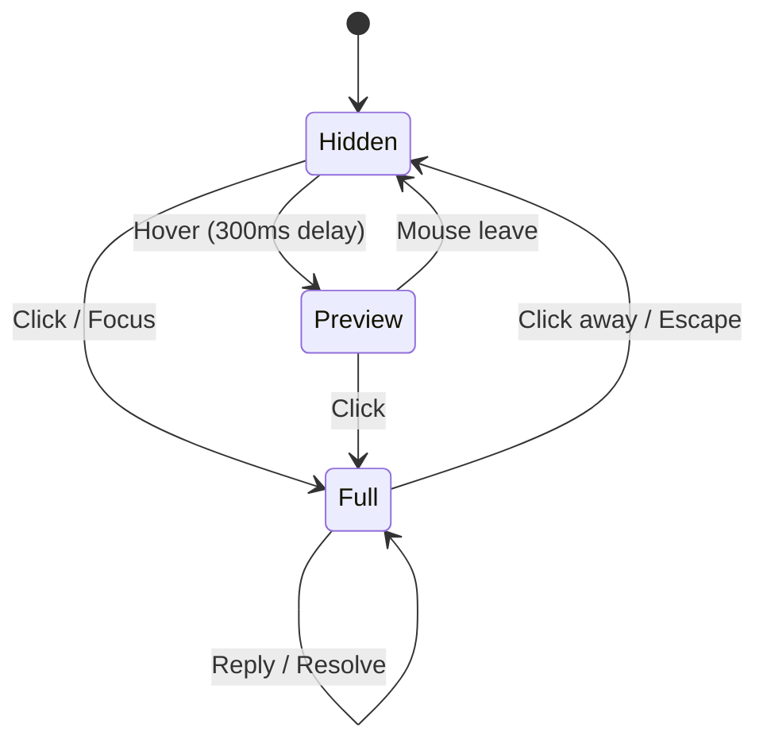

# 04: Comment Popover UI

> Inline comment popover — the primary interaction for viewing and replying to comments

**Duration:** 2-3 days  
**Dependencies:** [01-comment-schemas.md](./01-comment-schemas.md), `@xnet/ui` (Popover primitive)

## Overview

The comment popover is the primary way users interact with comments. It appears inline next to the commented content on hover (preview) or click (full thread), eliminating the need to open a sidebar.



## Popover States

### Preview State (Hover)

Lightweight preview showing first comment and reply count. Appears after 300ms hover delay.

```
┌──────────────────────────────────┐
│ 👤 Alice Chen          2 min ago │
│                                  │
│ This needs null handling.        │
│                                  │
│ 💬 3 replies                     │
└──────────────────────────────────┘
```

### Full State (Click / Focus)

Complete thread with all replies and input for new replies.

```
┌──────────────────────────────────────┐
│ 👤 Alice Chen              2 min ago │
│                                      │
│ This needs null handling.            │
│                                      │
│ ┌──────────────────────────────────┐ │
│ │ 👤 Bob Smith           1 min ago │ │
│ │                                  │ │
│ │ Good catch, I'll fix it.         │ │
│ └──────────────────────────────────┘ │
│ ┌──────────────────────────────────┐ │
│ │ 👤 Alice Chen          30s ago   │ │
│ │                                  │ │
│ │ Thanks! Also check line 42.     │ │
│ └──────────────────────────────────┘ │
│                                      │
│ ┌──────────────────────────────────┐ │
│ │ Reply...                     ⏎  │ │
│ └──────────────────────────────────┘ │
│                                      │
│ [Resolve]          [···]             │
└──────────────────────────────────────┘
```

## Implementation

### CommentPopover Component

```typescript
// packages/ui/src/components/CommentPopover.tsx

import React, { useState, useCallback } from 'react'
import { Popover } from '../primitives/Popover'
import { CommentThread, Comment } from '@xnet/data'

export interface CommentPopoverProps {
  /** The thread to display */
  thread: CommentThread

  /** Comments in the thread (ordered by creation time) */
  comments: Comment[]

  /** Anchor element or coordinates for positioning */
  anchor: HTMLElement | { x: number; y: number }

  /** Display mode */
  mode: 'preview' | 'full'

  /** Preferred side for popover placement */
  side?: 'top' | 'right' | 'bottom' | 'left'

  /** Callbacks */
  onReply: (content: string) => void
  onResolve: () => void
  onReopen: () => void
  onDelete: (commentId: string) => void
  onEdit: (commentId: string, newContent: string) => void
  onDismiss: () => void
  onUpgradeToFull?: () => void  // Preview → Full transition
}

export function CommentPopover({
  thread,
  comments,
  anchor,
  mode,
  side = 'right',
  onReply,
  onResolve,
  onReopen,
  onDelete,
  onEdit,
  onDismiss,
  onUpgradeToFull
}: CommentPopoverProps) {
  const [replyText, setReplyText] = useState('')
  const [editingId, setEditingId] = useState<string | null>(null)

  const handleSubmitReply = useCallback(() => {
    if (replyText.trim()) {
      onReply(replyText.trim())
      setReplyText('')
    }
  }, [replyText, onReply])

  const handleKeyDown = useCallback((e: React.KeyboardEvent) => {
    if (e.key === 'Enter' && (e.metaKey || e.ctrlKey)) {
      handleSubmitReply()
    }
    if (e.key === 'Escape') {
      onDismiss()
    }
  }, [handleSubmitReply, onDismiss])

  const isResolved = thread.properties.resolved

  if (mode === 'preview') {
    return (
      <Popover anchor={anchor} side={side} onClose={onDismiss}>
        <div className="comment-popover comment-popover--preview" onClick={onUpgradeToFull}>
          <CommentBubble comment={comments[0]} compact />
          {comments.length > 1 && (
            <div className="comment-popover__reply-count">
              {comments.length - 1} {comments.length - 1 === 1 ? 'reply' : 'replies'}
            </div>
          )}
        </div>
      </Popover>
    )
  }

  return (
    <Popover anchor={anchor} side={side} onClose={onDismiss}>
      <div className="comment-popover comment-popover--full" onKeyDown={handleKeyDown}>
        {/* Thread comments */}
        <div className="comment-popover__thread">
          {comments.map((comment) => (
            <CommentBubble
              key={comment.id}
              comment={comment}
              isEditing={editingId === comment.id}
              onEdit={(newContent) => {
                onEdit(comment.id, newContent)
                setEditingId(null)
              }}
              onStartEdit={() => setEditingId(comment.id)}
              onDelete={() => onDelete(comment.id)}
              onCancelEdit={() => setEditingId(null)}
            />
          ))}
        </div>

        {/* Reply input */}
        <div className="comment-popover__reply">
          <textarea
            className="comment-popover__reply-input"
            placeholder="Reply..."
            value={replyText}
            onChange={(e) => setReplyText(e.target.value)}
            onKeyDown={handleKeyDown}
            rows={1}
            autoFocus
          />
          {replyText.trim() && (
            <button
              className="comment-popover__reply-submit"
              onClick={handleSubmitReply}
              title="Submit (Cmd+Enter)"
            >
              ⏎
            </button>
          )}
        </div>

        {/* Thread actions */}
        <div className="comment-popover__actions">
          {isResolved ? (
            <button onClick={onReopen} className="comment-popover__action">
              Reopen
            </button>
          ) : (
            <button onClick={onResolve} className="comment-popover__action">
              Resolve
            </button>
          )}
        </div>
      </div>
    </Popover>
  )
}
```

### CommentBubble Component

```typescript
// packages/ui/src/components/CommentBubble.tsx

import React, { useState } from 'react'
import { Comment } from '@xnet/data'
import { renderMarkdown } from '../utils/markdown'
import { formatRelativeTime } from '../utils/time'

interface CommentBubbleProps {
  comment: Comment
  compact?: boolean
  isEditing?: boolean
  onEdit?: (newContent: string) => void
  onStartEdit?: () => void
  onDelete?: () => void
  onCancelEdit?: () => void
}

export function CommentBubble({
  comment,
  compact = false,
  isEditing = false,
  onEdit,
  onStartEdit,
  onDelete,
  onCancelEdit
}: CommentBubbleProps) {
  const [editText, setEditText] = useState(comment.properties.content as string)

  return (
    <div className="comment-bubble">
      <div className="comment-bubble__header">
        <span className="comment-bubble__avatar">
          {/* Avatar placeholder — resolve from DID */}
        </span>
        <span className="comment-bubble__author">
          {comment.properties.createdBy}
        </span>
        <span className="comment-bubble__time">
          {formatRelativeTime(comment.properties.createdAt as number)}
        </span>
        {comment.properties.edited && (
          <span className="comment-bubble__edited">(edited)</span>
        )}
      </div>

      {isEditing ? (
        <div className="comment-bubble__edit">
          <textarea
            value={editText}
            onChange={(e) => setEditText(e.target.value)}
            autoFocus
          />
          <div className="comment-bubble__edit-actions">
            <button onClick={() => onEdit?.(editText)}>Save</button>
            <button onClick={onCancelEdit}>Cancel</button>
          </div>
        </div>
      ) : (
        <div
          className="comment-bubble__content"
          dangerouslySetInnerHTML={{ __html: renderMarkdown(comment.properties.content as string) }}
        />
      )}

      {!compact && !isEditing && (
        <div className="comment-bubble__menu">
          <button onClick={onStartEdit}>Edit</button>
          <button onClick={onDelete}>Delete</button>
        </div>
      )}
    </div>
  )
}
```

### Popover Styling

```css
/* packages/ui/src/styles/comment-popover.css */

.comment-popover {
  width: 320px;
  max-height: 400px;
  overflow-y: auto;
  padding: 12px;
  border-radius: 8px;
  background: var(--color-surface);
  border: 1px solid var(--color-border);
  box-shadow:
    0 4px 12px rgba(0, 0, 0, 0.1),
    0 1px 3px rgba(0, 0, 0, 0.06);
}

.comment-popover--preview {
  cursor: pointer;
  max-height: none;
}

.comment-popover--preview:hover {
  background: var(--color-surface-hover);
}

.comment-popover__thread {
  display: flex;
  flex-direction: column;
  gap: 8px;
}

.comment-popover__reply-count {
  font-size: 12px;
  color: var(--color-text-secondary);
  margin-top: 4px;
  padding-top: 4px;
  border-top: 1px solid var(--color-border-subtle);
}

/* Reply input */
.comment-popover__reply {
  margin-top: 8px;
  padding-top: 8px;
  border-top: 1px solid var(--color-border-subtle);
  display: flex;
  gap: 4px;
  align-items: flex-end;
}

.comment-popover__reply-input {
  flex: 1;
  resize: none;
  border: 1px solid var(--color-border);
  border-radius: 6px;
  padding: 6px 8px;
  font-size: 13px;
  min-height: 32px;
  max-height: 120px;
  background: var(--color-input-bg);
}

.comment-popover__reply-input:focus {
  outline: none;
  border-color: var(--color-primary);
}

.comment-popover__reply-submit {
  padding: 6px 8px;
  border-radius: 6px;
  background: var(--color-primary);
  color: white;
  border: none;
  cursor: pointer;
  font-size: 14px;
}

/* Actions */
.comment-popover__actions {
  margin-top: 8px;
  display: flex;
  justify-content: space-between;
}

.comment-popover__action {
  font-size: 12px;
  color: var(--color-text-secondary);
  cursor: pointer;
  background: none;
  border: none;
  padding: 4px 8px;
  border-radius: 4px;
}

.comment-popover__action:hover {
  background: var(--color-surface-hover);
  color: var(--color-text-primary);
}

/* Comment bubble */
.comment-bubble {
  padding: 8px;
  border-radius: 6px;
}

.comment-bubble:hover {
  background: var(--color-surface-hover);
}

.comment-bubble__header {
  display: flex;
  align-items: center;
  gap: 6px;
  margin-bottom: 4px;
}

.comment-bubble__author {
  font-size: 13px;
  font-weight: 500;
  color: var(--color-text-primary);
}

.comment-bubble__time {
  font-size: 11px;
  color: var(--color-text-tertiary);
}

.comment-bubble__edited {
  font-size: 11px;
  color: var(--color-text-tertiary);
  font-style: italic;
}

.comment-bubble__content {
  font-size: 13px;
  line-height: 1.4;
  color: var(--color-text-primary);
}

.comment-bubble__content code {
  background: var(--color-code-bg);
  padding: 1px 4px;
  border-radius: 3px;
  font-size: 12px;
}

.comment-bubble__menu {
  display: none;
  gap: 4px;
  margin-top: 4px;
}

.comment-bubble:hover .comment-bubble__menu {
  display: flex;
}
```

### Popover Controller Hook

```typescript
// packages/react/src/hooks/useCommentPopover.ts

import { useState, useCallback, useRef } from 'react'
import { CommentThread, Comment } from '@xnet/data'

interface PopoverState {
  visible: boolean
  mode: 'preview' | 'full'
  thread: CommentThread | null
  comments: Comment[]
  anchor: HTMLElement | { x: number; y: number } | null
}

export function useCommentPopover() {
  const [state, setState] = useState<PopoverState>({
    visible: false,
    mode: 'preview',
    thread: null,
    comments: [],
    anchor: null
  })

  const hoverTimeout = useRef<ReturnType<typeof setTimeout> | null>(null)

  const showPreview = useCallback(
    (
      thread: CommentThread,
      comments: Comment[],
      anchor: HTMLElement | { x: number; y: number }
    ) => {
      // Delay preview by 300ms
      hoverTimeout.current = setTimeout(() => {
        setState({ visible: true, mode: 'preview', thread, comments, anchor })
      }, 300)
    },
    []
  )

  const showFull = useCallback(
    (
      thread: CommentThread,
      comments: Comment[],
      anchor: HTMLElement | { x: number; y: number }
    ) => {
      if (hoverTimeout.current) clearTimeout(hoverTimeout.current)
      setState({ visible: true, mode: 'full', thread, comments, anchor })
    },
    []
  )

  const upgradeToFull = useCallback(() => {
    setState((prev) => ({ ...prev, mode: 'full' }))
  }, [])

  const dismiss = useCallback(() => {
    if (hoverTimeout.current) clearTimeout(hoverTimeout.current)
    setState({ visible: false, mode: 'preview', thread: null, comments: [], anchor: null })
  }, [])

  const cancelPreview = useCallback(() => {
    if (hoverTimeout.current) {
      clearTimeout(hoverTimeout.current)
      hoverTimeout.current = null
    }
    // Only dismiss if in preview mode (don't dismiss full popover on mouse leave)
    setState((prev) => (prev.mode === 'preview' ? { ...prev, visible: false } : prev))
  }, [])

  return {
    state,
    showPreview,
    showFull,
    upgradeToFull,
    dismiss,
    cancelPreview
  }
}
```

## Positioning Reference

| Context       | Side     | Alignment                  | Notes                                         |
| ------------- | -------- | -------------------------- | --------------------------------------------- |
| Editor text   | `right`  | `start` (top of highlight) | Falls back to `bottom` if viewport too narrow |
| Database cell | `bottom` | `start` (left of cell)     | Avoids overlapping table rows                 |
| Canvas pin    | `right`  | `start`                    | Offset to not cover the pin itself            |
| Canvas object | `right`  | `center`                   | Beside bounding box                           |

## Checklist

- [ ] Create CommentPopover component (preview + full modes)
- [ ] Create CommentBubble component (individual comment display)
- [ ] Implement reply input with Cmd+Enter submit
- [ ] Implement resolve/reopen actions
- [ ] Implement edit/delete on individual comments
- [ ] Add hover delay logic (300ms preview, dismiss on leave)
- [ ] Create useCommentPopover hook
- [ ] Add markdown rendering for comment content
- [ ] Style popover (light + dark mode)
- [ ] Tests pass

---

[Back to README](./README.md) | [Previous: Anchoring](./03-anchoring.md) | [Next: Editor Integration](./05-editor-integration.md)
