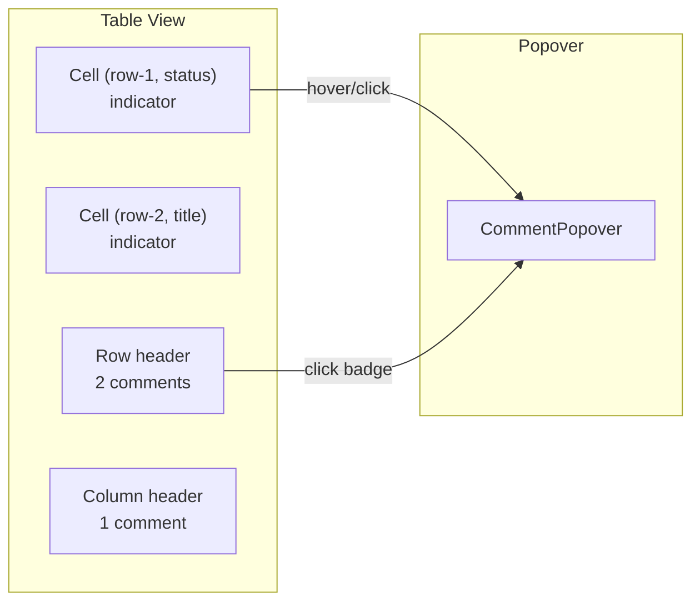

# 06: Database Comments

> Commenting on cells, rows, and columns in table/board views using the universal Comment schema

**Duration:** 2 days  
**Dependencies:** [01-comment-schemas.md](./01-comment-schemas.md), [04-comment-popover.md](./04-comment-popover.md)

## Overview

Database comments use stable ID-based anchors (rowId + propertyKey), making them simpler than text anchors. Comment indicators appear in cell corners, row headers, or column headers.

Following the **Universal Social Primitives** pattern, database comments use the same `useComments(nodeId)` hook -- the `nodeId` is the database Node, and `anchorType` filters to the specific anchor type.



## Implementation

### Comment Indicators

```typescript
// packages/views/src/components/CommentIndicator.tsx

import React from 'react'

interface CommentIndicatorProps {
  count: number
  onClick: (e: React.MouseEvent) => void
  onMouseEnter: (e: React.MouseEvent) => void
  onMouseLeave: () => void
  variant: 'dot' | 'badge' // dot for cells, badge for rows/columns
}

export function CommentIndicator({
  count,
  onClick,
  onMouseEnter,
  onMouseLeave,
  variant
}: CommentIndicatorProps) {
  if (count === 0) return null

  if (variant === 'dot') {
    return (
      <button
        className="comment-indicator comment-indicator--dot"
        onClick={onClick}
        onMouseEnter={onMouseEnter}
        onMouseLeave={onMouseLeave}
        aria-label={`${count} comment${count > 1 ? 's' : ''}`}
      >
        <span className="comment-indicator__dot" />
      </button>
    )
  }

  return (
    <button
      className="comment-indicator comment-indicator--badge"
      onClick={onClick}
      onMouseEnter={onMouseEnter}
      onMouseLeave={onMouseLeave}
    >
      {count}
    </button>
  )
}
```

### Database Comment Hook (extends useComments)

```typescript
// packages/views/src/hooks/useDatabaseComments.ts

import { useMemo, useCallback } from 'react'
import { useComments } from '@xnet/react'
import {
  Comment,
  encodeAnchor,
  CellAnchor,
  RowAnchor,
  ColumnAnchor,
  decodeAnchor
} from '@xnet/data'

interface UseDatabaseCommentsOptions {
  databaseNodeId: string
  databaseSchema?: string // e.g., 'xnet://xnet.dev/Database'
}

/**
 * Extends the universal useComments hook with database-specific helpers.
 */
export function useDatabaseComments({
  databaseNodeId,
  databaseSchema
}: UseDatabaseCommentsOptions) {
  // Use the universal hook
  const {
    comments,
    threads,
    addComment,
    replyTo,
    resolveThread,
    reopenThread,
    deleteComment,
    editComment
  } = useComments({ nodeId: databaseNodeId })

  // Index: cell key -> thread count
  const cellCommentCounts = useMemo(() => {
    const map = new Map<string, number>()
    for (const thread of threads) {
      if (thread.root.properties.anchorType === 'cell') {
        const anchor = decodeAnchor<CellAnchor>(thread.root.properties.anchorData as string)
        const key = `${anchor.rowId}:${anchor.propertyKey}`
        map.set(key, (map.get(key) ?? 0) + 1)
      }
    }
    return map
  }, [threads])

  // Index: rowId -> thread count
  const rowCommentCounts = useMemo(() => {
    const map = new Map<string, number>()
    for (const thread of threads) {
      if (thread.root.properties.anchorType === 'row') {
        const anchor = decodeAnchor<RowAnchor>(thread.root.properties.anchorData as string)
        map.set(anchor.rowId, (map.get(anchor.rowId) ?? 0) + 1)
      }
    }
    return map
  }, [threads])

  // Index: propertyKey -> thread count
  const columnCommentCounts = useMemo(() => {
    const map = new Map<string, number>()
    for (const thread of threads) {
      if (thread.root.properties.anchorType === 'column') {
        const anchor = decodeAnchor<ColumnAnchor>(thread.root.properties.anchorData as string)
        map.set(anchor.propertyKey, (map.get(anchor.propertyKey) ?? 0) + 1)
      }
    }
    return map
  }, [threads])

  // Create comment on cell
  const commentOnCell = useCallback(
    async (rowId: string, propertyKey: string, content: string) => {
      const anchor: CellAnchor = { rowId, propertyKey }
      return addComment({
        content,
        anchorType: 'cell',
        anchorData: encodeAnchor(anchor),
        targetSchema: databaseSchema
      })
    },
    [addComment, databaseSchema]
  )

  // Create comment on row
  const commentOnRow = useCallback(
    async (rowId: string, content: string) => {
      const anchor: RowAnchor = { rowId }
      return addComment({
        content,
        anchorType: 'row',
        anchorData: encodeAnchor(anchor),
        targetSchema: databaseSchema
      })
    },
    [addComment, databaseSchema]
  )

  // Create comment on column
  const commentOnColumn = useCallback(
    async (propertyKey: string, content: string) => {
      const anchor: ColumnAnchor = { propertyKey }
      return addComment({
        content,
        anchorType: 'column',
        anchorData: encodeAnchor(anchor),
        targetSchema: databaseSchema
      })
    },
    [addComment, databaseSchema]
  )

  // Get threads for a specific cell
  const getThreadsForCell = useCallback(
    (rowId: string, propertyKey: string) => {
      return threads.filter((t) => {
        if (t.root.properties.anchorType !== 'cell') return false
        const anchor = decodeAnchor<CellAnchor>(t.root.properties.anchorData as string)
        return anchor.rowId === rowId && anchor.propertyKey === propertyKey
      })
    },
    [threads]
  )

  // Get threads for a specific row
  const getThreadsForRow = useCallback(
    (rowId: string) => {
      return threads.filter((t) => {
        if (t.root.properties.anchorType !== 'row') return false
        const anchor = decodeAnchor<RowAnchor>(t.root.properties.anchorData as string)
        return anchor.rowId === rowId
      })
    },
    [threads]
  )

  // Get threads for a specific column
  const getThreadsForColumn = useCallback(
    (propertyKey: string) => {
      return threads.filter((t) => {
        if (t.root.properties.anchorType !== 'column') return false
        const anchor = decodeAnchor<ColumnAnchor>(t.root.properties.anchorData as string)
        return anchor.propertyKey === propertyKey
      })
    },
    [threads]
  )

  return {
    // From universal hook
    comments,
    threads,
    replyTo,
    resolveThread,
    reopenThread,
    deleteComment,
    editComment,

    // Database-specific
    cellCommentCounts,
    rowCommentCounts,
    columnCommentCounts,
    commentOnCell,
    commentOnRow,
    commentOnColumn,
    getThreadsForCell,
    getThreadsForRow,
    getThreadsForColumn
  }
}
```

### Table Cell Integration

```typescript
// Integration point in the table cell component

import { useDatabaseComments } from '../hooks/useDatabaseComments'
import { useCommentPopover } from '@xnet/react'
import { CommentIndicator } from './CommentIndicator'

function TableCell({ rowId, propertyKey, databaseNodeId, databaseSchema, children }) {
  const { cellCommentCounts, getThreadsForCell, replyTo, resolveThread } = useDatabaseComments({
    databaseNodeId,
    databaseSchema
  })
  const { showPreview, showFull, cancelPreview } = useCommentPopover()

  const key = `${rowId}:${propertyKey}`
  const count = cellCommentCounts.get(key) ?? 0

  const handleClick = (e: React.MouseEvent) => {
    const threads = getThreadsForCell(rowId, propertyKey)
    if (threads.length > 0) {
      const thread = threads[0]
      showFull(
        { root: thread.root, replies: thread.replies },
        e.currentTarget as HTMLElement
      )
    }
  }

  const handleHover = (e: React.MouseEvent) => {
    const threads = getThreadsForCell(rowId, propertyKey)
    if (threads.length > 0) {
      const thread = threads[0]
      showPreview(
        { root: thread.root, replies: thread.replies },
        e.currentTarget as HTMLElement
      )
    }
  }

  return (
    <td data-row-id={rowId} data-property={propertyKey}>
      {/* Cell content */}
      {children}

      {/* Comment indicator */}
      <CommentIndicator
        count={count}
        variant="dot"
        onClick={handleClick}
        onMouseEnter={handleHover}
        onMouseLeave={cancelPreview}
      />
    </td>
  )
}
```

### Context Menu Integration

```typescript
// Add "Comment" to cell/row/column context menus

import { useDatabaseComments } from '../hooks/useDatabaseComments'

function CellContextMenu({ rowId, propertyKey, databaseNodeId, databaseSchema }) {
  const { commentOnCell } = useDatabaseComments({ databaseNodeId, databaseSchema })
  const [showCommentInput, setShowCommentInput] = useState(false)
  const [commentText, setCommentText] = useState('')

  const handleComment = async () => {
    if (commentText.trim()) {
      await commentOnCell(rowId, propertyKey, commentText.trim())
      setCommentText('')
      setShowCommentInput(false)
    }
  }

  return (
    <>
      {/* ...existing menu items */}
      <MenuItem
        icon="message-square"
        label="Comment on cell"
        onClick={() => setShowCommentInput(true)}
      />

      {showCommentInput && (
        <CommentInputPopover
          onSubmit={handleComment}
          onCancel={() => setShowCommentInput(false)}
          value={commentText}
          onChange={setCommentText}
        />
      )}
    </>
  )
}

function RowContextMenu({ rowId, databaseNodeId, databaseSchema }) {
  const { commentOnRow } = useDatabaseComments({ databaseNodeId, databaseSchema })
  // Similar pattern...
}

function ColumnContextMenu({ propertyKey, databaseNodeId, databaseSchema }) {
  const { commentOnColumn } = useDatabaseComments({ databaseNodeId, databaseSchema })
  // Similar pattern...
}
```

### Indicator Styling

```css
/* packages/views/src/styles/comment-indicators.css */

.comment-indicator {
  position: absolute;
  cursor: pointer;
  border: none;
  background: none;
  padding: 0;
}

/* Cell dot indicator -- top-right corner */
.comment-indicator--dot {
  top: 2px;
  right: 2px;
  width: 16px;
  height: 16px;
  display: flex;
  align-items: center;
  justify-content: center;
  opacity: 0.6;
  transition: opacity 0.15s;
}

.comment-indicator--dot:hover {
  opacity: 1;
}

.comment-indicator__dot {
  width: 6px;
  height: 6px;
  border-radius: 50%;
  background: var(--color-warning);
}

/* Row/column badge */
.comment-indicator--badge {
  font-size: 11px;
  color: var(--color-text-secondary);
  padding: 2px 6px;
  border-radius: 4px;
  background: var(--color-surface-secondary);
}

.comment-indicator--badge:hover {
  background: var(--color-surface-hover);
  color: var(--color-text-primary);
}
```

## Orphaned Database Anchors

Database anchors can become orphaned when:

- A row is deleted (cell and row anchors orphan)
- A column/property is removed from the schema (column anchors orphan)

Detection is simpler than text anchors -- just check if the row/property still exists:

```typescript
function isDatabaseAnchorOrphaned(
  anchorType: 'cell' | 'row' | 'column',
  anchor: CellAnchor | RowAnchor | ColumnAnchor,
  existingRowIds: Set<string>,
  existingPropertyKeys: Set<string>
): boolean {
  if (anchorType === 'cell') {
    const { rowId, propertyKey } = anchor as CellAnchor
    return !existingRowIds.has(rowId) || !existingPropertyKeys.has(propertyKey)
  }
  if (anchorType === 'row') {
    return !existingRowIds.has((anchor as RowAnchor).rowId)
  }
  if (anchorType === 'column') {
    return !existingPropertyKeys.has((anchor as ColumnAnchor).propertyKey)
  }
  return false
}
```

## Checklist

- [x] Create CommentIndicator component (dot + badge variants) - in `packages/views/src/table/TableCell.tsx`
- [x] Implement useDatabaseComments hook (extends useComments) - `packages/views/src/hooks/useDatabaseComments.ts`
- [x] Wire indicators into table cell renderer - `TableView.tsx` + `TableCell.tsx`
- [x] Add context menu "Comment on cell/row/column" actions (TODO - basic indicator done)
- [x] Popover positioning below/beside cells (uses standard popover)
- [x] Handle orphaned anchors (row/column deleted) - `commentOrphans.ts`
- [x] Tests pass - `useDatabaseComments.test.ts` (15 tests)

---

[Back to README](./README.md) | [Previous: Editor Integration](./05-editor-integration.md) | [Next: Canvas Comments](./07-canvas-comments.md)
