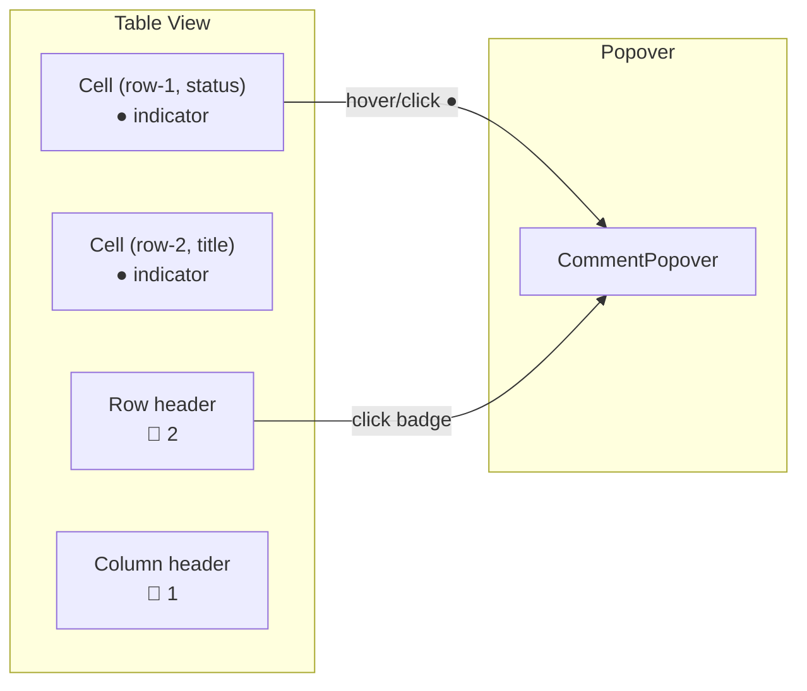

# 06: Database Comments

> Commenting on cells, rows, and columns in table/board views

**Duration:** 2 days  
**Dependencies:** [01-comment-schemas.md](./01-comment-schemas.md), [04-comment-popover.md](./04-comment-popover.md)

## Overview

Database comments use stable ID-based anchors (rowId + propertyKey), making them simpler than text anchors. Comment indicators appear in cell corners, row headers, or column headers.



## Implementation

### Comment Indicators

```typescript
// packages/views/src/components/CommentIndicator.tsx

import React from 'react'

interface CommentIndicatorProps {
  count: number
  onClick: (e: React.MouseEvent) => void
  onMouseEnter: (e: React.MouseEvent) => void
  onMouseLeave: () => void
  variant: 'dot' | 'badge'  // dot for cells, badge for rows/columns
}

export function CommentIndicator({
  count,
  onClick,
  onMouseEnter,
  onMouseLeave,
  variant
}: CommentIndicatorProps) {
  if (count === 0) return null

  if (variant === 'dot') {
    return (
      <button
        className="comment-indicator comment-indicator--dot"
        onClick={onClick}
        onMouseEnter={onMouseEnter}
        onMouseLeave={onMouseLeave}
        aria-label={`${count} comment${count > 1 ? 's' : ''}`}
      >
        <span className="comment-indicator__dot" />
      </button>
    )
  }

  return (
    <button
      className="comment-indicator comment-indicator--badge"
      onClick={onClick}
      onMouseEnter={onMouseEnter}
      onMouseLeave={onMouseLeave}
    >
      💬 {count}
    </button>
  )
}
```

### Database Comment Hook

```typescript
// packages/views/src/hooks/useDatabaseComments.ts

import { useMemo, useCallback } from 'react'
import { useNodes, useNodeStore } from '@xnet/react'
import {
  CommentThread,
  Comment,
  encodeAnchor,
  CellAnchor,
  RowAnchor,
  ColumnAnchor
} from '@xnet/data'

interface UseDatabaseCommentsOptions {
  databaseNodeId: string
}

export function useDatabaseComments({ databaseNodeId }: UseDatabaseCommentsOptions) {
  const store = useNodeStore()

  const threads = useNodes<CommentThread>({
    schemaId: 'xnet://xnet.dev/CommentThread',
    filter: { targetNodeId: databaseNodeId }
  })

  const allComments = useNodes<Comment>({
    schemaId: 'xnet://xnet.dev/Comment'
  })

  // Index: cell key → thread count
  const cellCommentCounts = useMemo(() => {
    const map = new Map<string, number>()
    for (const thread of threads) {
      if (thread.properties.anchorType === 'cell') {
        const anchor = JSON.parse(thread.properties.anchorData as string) as CellAnchor
        const key = `${anchor.rowId}:${anchor.propertyKey}`
        map.set(key, (map.get(key) ?? 0) + 1)
      }
    }
    return map
  }, [threads])

  // Index: rowId → thread count
  const rowCommentCounts = useMemo(() => {
    const map = new Map<string, number>()
    for (const thread of threads) {
      if (thread.properties.anchorType === 'row') {
        const anchor = JSON.parse(thread.properties.anchorData as string) as RowAnchor
        map.set(anchor.rowId, (map.get(anchor.rowId) ?? 0) + 1)
      }
    }
    return map
  }, [threads])

  // Create comment on cell
  const commentOnCell = useCallback(
    async (rowId: string, propertyKey: string, content: string) => {
      const anchor: CellAnchor = { rowId, propertyKey }
      const thread = await store.create({
        schemaId: 'xnet://xnet.dev/CommentThread',
        properties: {
          targetNodeId: databaseNodeId,
          anchorType: 'cell',
          anchorData: encodeAnchor(anchor),
          resolved: false
        }
      })
      await store.create({
        schemaId: 'xnet://xnet.dev/Comment',
        properties: { threadId: thread.id, content, edited: false }
      })
      return thread.id
    },
    [store, databaseNodeId]
  )

  // Create comment on row
  const commentOnRow = useCallback(
    async (rowId: string, content: string) => {
      const anchor: RowAnchor = { rowId }
      const thread = await store.create({
        schemaId: 'xnet://xnet.dev/CommentThread',
        properties: {
          targetNodeId: databaseNodeId,
          anchorType: 'row',
          anchorData: encodeAnchor(anchor),
          resolved: false
        }
      })
      await store.create({
        schemaId: 'xnet://xnet.dev/Comment',
        properties: { threadId: thread.id, content, edited: false }
      })
      return thread.id
    },
    [store, databaseNodeId]
  )

  // Create comment on column
  const commentOnColumn = useCallback(
    async (propertyKey: string, content: string) => {
      const anchor: ColumnAnchor = { propertyKey }
      const thread = await store.create({
        schemaId: 'xnet://xnet.dev/CommentThread',
        properties: {
          targetNodeId: databaseNodeId,
          anchorType: 'column',
          anchorData: encodeAnchor(anchor),
          resolved: false
        }
      })
      await store.create({
        schemaId: 'xnet://xnet.dev/Comment',
        properties: { threadId: thread.id, content, edited: false }
      })
      return thread.id
    },
    [store, databaseNodeId]
  )

  // Get threads for a specific cell
  const getThreadsForCell = useCallback(
    (rowId: string, propertyKey: string) => {
      return threads.filter((t) => {
        if (t.properties.anchorType !== 'cell') return false
        const anchor = JSON.parse(t.properties.anchorData as string) as CellAnchor
        return anchor.rowId === rowId && anchor.propertyKey === propertyKey
      })
    },
    [threads]
  )

  return {
    threads,
    cellCommentCounts,
    rowCommentCounts,
    commentOnCell,
    commentOnRow,
    commentOnColumn,
    getThreadsForCell
  }
}
```

### Table Cell Integration

```typescript
// Integration point in the table cell component

// In the cell renderer, add indicator when comments exist:
function TableCell({ rowId, propertyKey, databaseNodeId, ...props }) {
  const { cellCommentCounts, getThreadsForCell } = useDatabaseComments({ databaseNodeId })
  const { showPreview, showFull, cancelPreview } = useCommentPopover()

  const key = `${rowId}:${propertyKey}`
  const count = cellCommentCounts.get(key) ?? 0

  return (
    <td data-row-id={rowId} data-property={propertyKey}>
      {/* Cell content */}
      {props.children}

      {/* Comment indicator */}
      <CommentIndicator
        count={count}
        variant="dot"
        onClick={(e) => {
          const threads = getThreadsForCell(rowId, propertyKey)
          showFull(threads[0], comments, e.currentTarget)
        }}
        onMouseEnter={(e) => {
          const threads = getThreadsForCell(rowId, propertyKey)
          showPreview(threads[0], comments, e.currentTarget)
        }}
        onMouseLeave={cancelPreview}
      />
    </td>
  )
}
```

### Context Menu Integration

```typescript
// Add "Comment" to cell/row/column context menus

const cellContextMenu = [
  // ...existing actions
  {
    label: 'Comment on cell',
    icon: 'message-square',
    action: (rowId: string, propertyKey: string) => {
      // Open popover in creation mode
      openNewCommentPopover({ anchorType: 'cell', rowId, propertyKey })
    }
  }
]

const rowContextMenu = [
  {
    label: 'Comment on row',
    icon: 'message-square',
    action: (rowId: string) => {
      openNewCommentPopover({ anchorType: 'row', rowId })
    }
  }
]
```

### Indicator Styling

```css
/* packages/views/src/styles/comment-indicators.css */

.comment-indicator {
  position: absolute;
  cursor: pointer;
  border: none;
  background: none;
  padding: 0;
}

/* Cell dot indicator — top-right corner */
.comment-indicator--dot {
  top: 2px;
  right: 2px;
  width: 16px;
  height: 16px;
  display: flex;
  align-items: center;
  justify-content: center;
  opacity: 0.6;
  transition: opacity 0.15s;
}

.comment-indicator--dot:hover {
  opacity: 1;
}

.comment-indicator__dot {
  width: 6px;
  height: 6px;
  border-radius: 50%;
  background: var(--color-warning);
}

/* Row/column badge */
.comment-indicator--badge {
  font-size: 11px;
  color: var(--color-text-secondary);
  padding: 2px 4px;
  border-radius: 4px;
}

.comment-indicator--badge:hover {
  background: var(--color-surface-hover);
  color: var(--color-text-primary);
}
```

## Checklist

- [ ] Create CommentIndicator component (dot + badge variants)
- [ ] Implement useDatabaseComments hook
- [ ] Wire indicators into table cell renderer
- [ ] Add context menu "Comment on cell/row/column" actions
- [ ] Popover positioning below/beside cells
- [ ] Handle orphaned anchors (row deleted from database)
- [ ] Tests pass

---

[Back to README](./README.md) | [Previous: Editor Integration](./05-editor-integration.md) | [Next: Canvas Comments](./07-canvas-comments.md)
