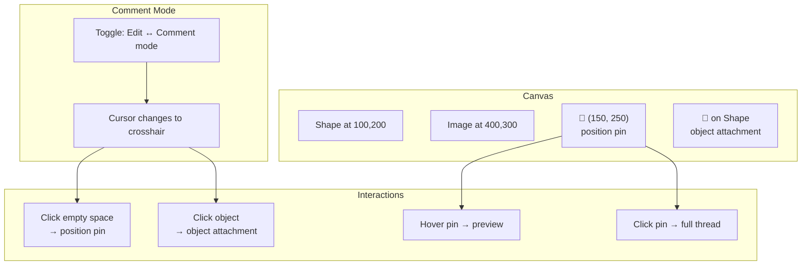
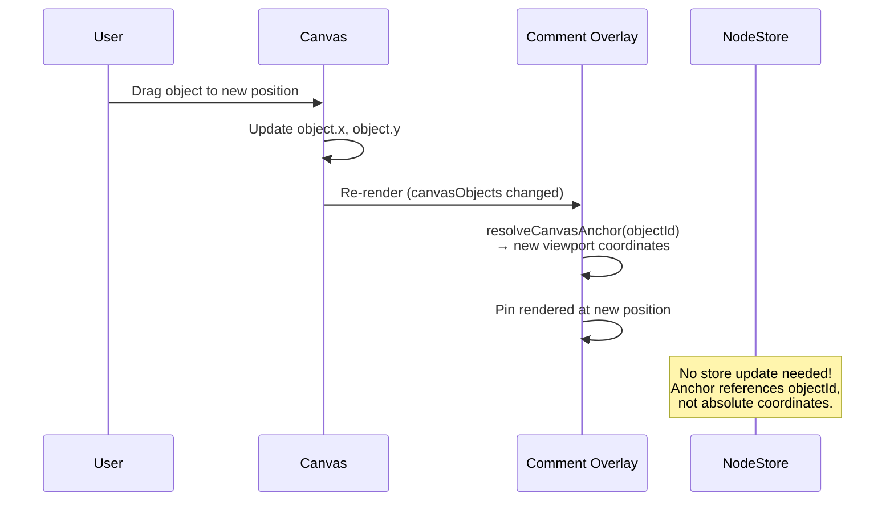

# 07: Canvas Comments

> Figma/Miro-style commenting with position pins and object attachment

**Duration:** 2-3 days  
**Dependencies:** [01-comment-schemas.md](./01-comment-schemas.md), [04-comment-popover.md](./04-comment-popover.md), `@xnet/canvas`

## Overview

Canvas comments support two anchor types:

1. **Position pins** — fixed (x, y) coordinates on the canvas (Figma-style "click anywhere to comment")
2. **Object attachment** — comments that follow an object when it moves



## Implementation

### Comment Pin Renderer

Pins are rendered in an overlay layer above the canvas objects but below the cursor/selection layer.

```typescript
// packages/canvas/src/comments/CommentPin.tsx

import React from 'react'
import { CommentThread, Comment } from '@xnet/data'

interface CommentPinProps {
  thread: CommentThread
  comments: Comment[]
  viewportX: number
  viewportY: number
  isHovered: boolean
  isSelected: boolean
  onMouseEnter: () => void
  onMouseLeave: () => void
  onClick: () => void
}

export function CommentPin({
  thread,
  comments,
  viewportX,
  viewportY,
  isHovered,
  isSelected,
  onMouseEnter,
  onMouseLeave,
  onClick
}: CommentPinProps) {
  const firstComment = comments[0]
  const authorInitial = getAuthorInitial(firstComment?.properties.createdBy as string)
  const isResolved = thread.properties.resolved as boolean
  const replyCount = comments.length - 1

  return (
    <div
      className={`comment-pin ${isResolved ? 'comment-pin--resolved' : ''} ${isSelected ? 'comment-pin--selected' : ''}`}
      style={{
        position: 'absolute',
        left: viewportX,
        top: viewportY,
        transform: 'translate(-50%, -100%)' // Pin point at bottom-center
      }}
      onMouseEnter={onMouseEnter}
      onMouseLeave={onMouseLeave}
      onClick={onClick}
    >
      <div className="comment-pin__marker">
        <span className="comment-pin__avatar">{authorInitial}</span>
        {replyCount > 0 && (
          <span className="comment-pin__count">{replyCount + 1}</span>
        )}
      </div>
    </div>
  )
}

function getAuthorInitial(did?: string): string {
  // Placeholder — resolve display name from DID
  return did ? did.slice(-2).toUpperCase() : '?'
}
```

### Canvas Comment Overlay

```typescript
// packages/canvas/src/comments/CommentOverlay.tsx

import React, { useMemo } from 'react'
import { CommentThread, Comment, decodeAnchor, CanvasPositionAnchor, CanvasObjectAnchor } from '@xnet/data'
import { CommentPin } from './CommentPin'
import { CommentPopover } from '@xnet/ui'
import { useCommentPopover } from '@xnet/react'
import { resolveCanvasAnchor } from './canvas-anchor'

interface CommentOverlayProps {
  threads: CommentThread[]
  commentsByThread: Map<string, Comment[]>
  canvasTransform: { panX: number; panY: number; zoom: number }
  canvasObjects: Map<string, { x: number; y: number; width: number; height: number }>
  onReply: (threadId: string, content: string) => void
  onResolve: (threadId: string) => void
}

export function CommentOverlay({
  threads,
  commentsByThread,
  canvasTransform,
  canvasObjects,
  onReply,
  onResolve
}: CommentOverlayProps) {
  const { state, showPreview, showFull, dismiss, cancelPreview, upgradeToFull } = useCommentPopover()

  // Resolve all canvas-type thread positions
  const resolvedPins = useMemo(() => {
    return threads
      .filter((t) => ['canvas-position', 'canvas-object'].includes(t.properties.anchorType as string))
      .map((thread) => {
        const anchorType = thread.properties.anchorType as 'canvas-position' | 'canvas-object'
        const anchor = decodeAnchor(thread.properties.anchorData as string)
        const position = resolveCanvasAnchor(anchorType, anchor, canvasTransform, canvasObjects)

        return { thread, position }
      })
      .filter((p) => p.position !== null)
  }, [threads, canvasTransform, canvasObjects])

  return (
    <div className="comment-overlay" style={{ position: 'absolute', inset: 0, pointerEvents: 'none' }}>
      {resolvedPins.map(({ thread, position }) => {
        const comments = commentsByThread.get(thread.id) ?? []
        return (
          <div key={thread.id} style={{ pointerEvents: 'auto' }}>
            <CommentPin
              thread={thread}
              comments={comments}
              viewportX={position!.viewportX}
              viewportY={position!.viewportY}
              isHovered={state.thread?.id === thread.id && state.mode === 'preview'}
              isSelected={state.thread?.id === thread.id && state.mode === 'full'}
              onMouseEnter={() => showPreview(thread, comments, { x: position!.viewportX, y: position!.viewportY })}
              onMouseLeave={cancelPreview}
              onClick={() => showFull(thread, comments, { x: position!.viewportX + 20, y: position!.viewportY })}
            />
          </div>
        )
      })}

      {/* Popover */}
      {state.visible && state.thread && (
        <div style={{ pointerEvents: 'auto' }}>
          <CommentPopover
            thread={state.thread}
            comments={state.comments}
            anchor={state.anchor!}
            mode={state.mode}
            side="right"
            onReply={(content) => onReply(state.thread!.id, content)}
            onResolve={() => onResolve(state.thread!.id)}
            onReopen={() => {}}
            onDelete={() => {}}
            onEdit={() => {}}
            onDismiss={dismiss}
            onUpgradeToFull={upgradeToFull}
          />
        </div>
      )}
    </div>
  )
}
```

### Comment Mode

```typescript
// packages/canvas/src/comments/comment-mode.ts

export interface CommentModeState {
  active: boolean
}

/**
 * Canvas comment mode handler.
 * When active, clicking on the canvas creates a comment pin instead of selecting objects.
 */
export function handleCommentModeClick(
  e: React.MouseEvent,
  canvasTransform: { panX: number; panY: number; zoom: number },
  canvasObjects: Map<string, { x: number; y: number; width: number; height: number }>,
  createComment: (anchorType: 'canvas-position' | 'canvas-object', anchor: any) => void
): void {
  const rect = (e.currentTarget as HTMLElement).getBoundingClientRect()
  const viewportX = e.clientX - rect.left
  const viewportY = e.clientY - rect.top

  // Convert viewport coords to canvas coords
  const canvasX = viewportX / canvasTransform.zoom + canvasTransform.panX
  const canvasY = viewportY / canvasTransform.zoom + canvasTransform.panY

  // Check if click is on an object
  const hitObject = findObjectAtPoint(canvasX, canvasY, canvasObjects)

  if (hitObject) {
    // Attach to object
    createComment('canvas-object', {
      objectId: hitObject.id,
      offsetX: canvasX - hitObject.x,
      offsetY: canvasY - hitObject.y
    })
  } else {
    // Pin at position
    createComment('canvas-position', { x: canvasX, y: canvasY })
  }
}

function findObjectAtPoint(
  x: number,
  y: number,
  objects: Map<string, { x: number; y: number; width: number; height: number }>
): { id: string; x: number; y: number } | null {
  // Simple bounding box hit test (iterate in reverse z-order)
  for (const [id, obj] of objects) {
    if (x >= obj.x && x <= obj.x + obj.width && y >= obj.y && y <= obj.y + obj.height) {
      return { id, x: obj.x, y: obj.y }
    }
  }
  return null
}
```

### Pin Styling

```css
/* packages/canvas/src/styles/comment-pins.css */

.comment-pin {
  cursor: pointer;
  z-index: 100;
  transition: transform 0.1s ease;
}

.comment-pin:hover {
  transform: translate(-50%, -100%) scale(1.1);
}

.comment-pin--selected {
  z-index: 101;
}

.comment-pin__marker {
  display: flex;
  align-items: center;
  gap: 2px;
  background: var(--color-primary);
  color: white;
  border-radius: 16px 16px 16px 0;
  padding: 4px 8px;
  font-size: 12px;
  font-weight: 500;
  box-shadow: 0 2px 8px rgba(0, 0, 0, 0.15);
  white-space: nowrap;
}

.comment-pin--resolved .comment-pin__marker {
  background: var(--color-text-tertiary);
  opacity: 0.6;
}

.comment-pin__avatar {
  width: 20px;
  height: 20px;
  border-radius: 50%;
  background: rgba(255, 255, 255, 0.3);
  display: flex;
  align-items: center;
  justify-content: center;
  font-size: 10px;
}

.comment-pin__count {
  font-size: 11px;
  opacity: 0.8;
}

/* Comment mode cursor */
.canvas--comment-mode {
  cursor: crosshair;
}

/* Overlay layer */
.comment-overlay {
  pointer-events: none;
  z-index: 50;
}
```

## Object Movement Sync

When a canvas object moves, comments attached to it automatically follow because the anchor stores the `objectId` and the position is resolved at render time from the object's current position.



## Checklist

- [ ] Create CommentPin component
- [ ] Create CommentOverlay (renders all pins + popover)
- [ ] Implement comment mode (crosshair cursor, click → create)
- [ ] Implement position pin creation (x, y coordinates)
- [ ] Implement object attachment (objectId-based)
- [ ] Handle object movement (pins follow automatically)
- [ ] Handle object deletion (orphaned pins)
- [ ] Style pins (active, resolved, hover, selected)
- [ ] Wire popover to canvas pins
- [ ] Tests pass

---

[Back to README](./README.md) | [Previous: Database Comments](./06-database-comments.md) | [Next: Thread Lifecycle](./08-thread-lifecycle.md)
