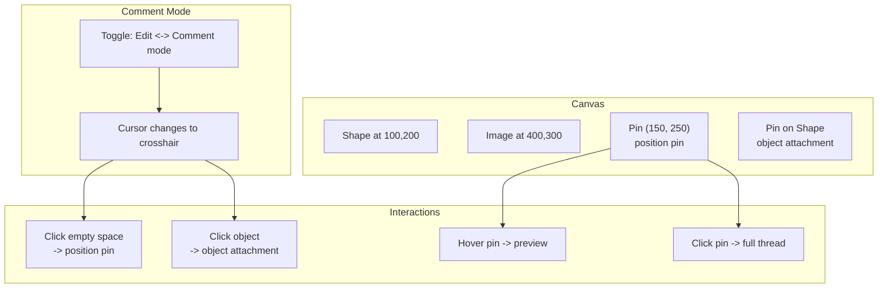
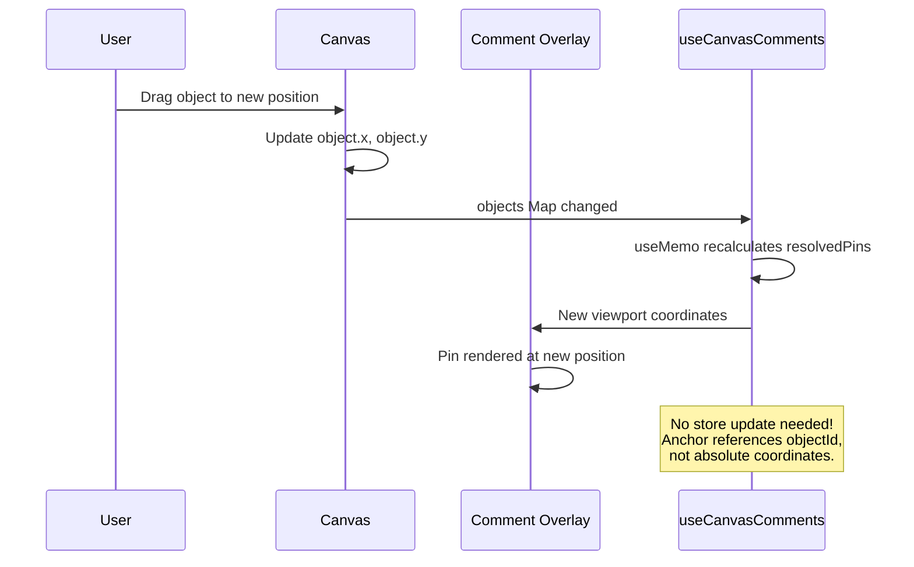

# 07: Canvas Comments

> Figma/Miro-style commenting with position pins and object attachment using the universal Comment schema

**Duration:** 2-3 days  
**Dependencies:** [01-comment-schemas.md](./01-comment-schemas.md), [04-comment-popover.md](./04-comment-popover.md), `@xnet/canvas`

## Overview

Canvas comments support two anchor types:

1. **Position pins** -- fixed (x, y) coordinates on the canvas (Figma-style "click anywhere to comment")
2. **Object attachment** -- comments that follow an object when it moves

Following the **Universal Social Primitives** pattern, canvas comments use the same `useComments(nodeId)` hook.



## Implementation

### Canvas Comment Hook (extends useComments)

```typescript
// packages/canvas/src/hooks/useCanvasComments.ts

import { useMemo, useCallback } from 'react'
import { useComments } from '@xnet/react'
import {
  Comment,
  encodeAnchor,
  decodeAnchor,
  CanvasPositionAnchor,
  CanvasObjectAnchor
} from '@xnet/data'

interface CanvasTransform {
  panX: number
  panY: number
  zoom: number
}

interface CanvasObject {
  id: string
  x: number
  y: number
  width: number
  height: number
}

interface UseCanvasCommentsOptions {
  canvasNodeId: string
  canvasSchema?: string
  transform: CanvasTransform
  objects: Map<string, CanvasObject>
}

interface ResolvedPin {
  thread: { root: Comment; replies: Comment[] }
  viewportX: number
  viewportY: number
  orphaned: boolean
}

/**
 * Extends the universal useComments hook with canvas-specific helpers.
 */
export function useCanvasComments({
  canvasNodeId,
  canvasSchema,
  transform,
  objects
}: UseCanvasCommentsOptions) {
  // Use the universal hook
  const {
    comments,
    threads,
    addComment,
    replyTo,
    resolveThread,
    reopenThread,
    deleteComment,
    editComment
  } = useComments({ nodeId: canvasNodeId })

  // Resolve all canvas thread positions
  const resolvedPins = useMemo((): ResolvedPin[] => {
    return threads
      .filter((t) =>
        ['canvas-position', 'canvas-object'].includes(t.root.properties.anchorType as string)
      )
      .map((thread) => {
        const anchorType = thread.root.properties.anchorType as 'canvas-position' | 'canvas-object'
        const anchor = decodeAnchor(thread.root.properties.anchorData as string)

        if (anchorType === 'canvas-position') {
          const { x, y } = anchor as CanvasPositionAnchor
          return {
            thread,
            viewportX: (x - transform.panX) * transform.zoom,
            viewportY: (y - transform.panY) * transform.zoom,
            orphaned: false
          }
        }

        if (anchorType === 'canvas-object') {
          const { objectId, offsetX = 0, offsetY = 0 } = anchor as CanvasObjectAnchor
          const obj = objects.get(objectId)

          if (!obj) {
            // Object deleted -- orphaned
            return {
              thread,
              viewportX: 0,
              viewportY: 0,
              orphaned: true
            }
          }

          const x = obj.x + obj.width + offsetX
          const y = obj.y + offsetY
          return {
            thread,
            viewportX: (x - transform.panX) * transform.zoom,
            viewportY: (y - transform.panY) * transform.zoom,
            orphaned: false
          }
        }

        return null
      })
      .filter((p): p is ResolvedPin => p !== null)
  }, [threads, transform, objects])

  // Non-orphaned pins only
  const activePins = useMemo(() => {
    return resolvedPins.filter((p) => !p.orphaned)
  }, [resolvedPins])

  // Orphaned pins
  const orphanedPins = useMemo(() => {
    return resolvedPins.filter((p) => p.orphaned)
  }, [resolvedPins])

  // Create comment at canvas position
  const commentAtPosition = useCallback(
    async (canvasX: number, canvasY: number, content: string) => {
      const anchor: CanvasPositionAnchor = { x: canvasX, y: canvasY }
      return addComment({
        content,
        anchorType: 'canvas-position',
        anchorData: encodeAnchor(anchor),
        targetSchema: canvasSchema
      })
    },
    [addComment, canvasSchema]
  )

  // Create comment attached to object
  const commentOnObject = useCallback(
    async (objectId: string, content: string, offsetX?: number, offsetY?: number) => {
      const anchor: CanvasObjectAnchor = { objectId, offsetX, offsetY }
      return addComment({
        content,
        anchorType: 'canvas-object',
        anchorData: encodeAnchor(anchor),
        targetSchema: canvasSchema
      })
    },
    [addComment, canvasSchema]
  )

  return {
    // From universal hook
    comments,
    threads,
    replyTo,
    resolveThread,
    reopenThread,
    deleteComment,
    editComment,

    // Canvas-specific
    resolvedPins,
    activePins,
    orphanedPins,
    commentAtPosition,
    commentOnObject
  }
}
```

### Comment Pin Renderer

Pins are rendered in an overlay layer above the canvas objects but below the cursor/selection layer.

```typescript
// packages/canvas/src/comments/CommentPin.tsx

import React from 'react'
import { Comment } from '@xnet/data'

interface CommentPinProps {
  root: Comment
  replies: Comment[]
  viewportX: number
  viewportY: number
  isHovered: boolean
  isSelected: boolean
  onMouseEnter: () => void
  onMouseLeave: () => void
  onClick: () => void
}

export function CommentPin({
  root,
  replies,
  viewportX,
  viewportY,
  isHovered,
  isSelected,
  onMouseEnter,
  onMouseLeave,
  onClick
}: CommentPinProps) {
  const authorInitial = getAuthorInitial(root.properties.createdBy as string)
  const isResolved = root.properties.resolved as boolean
  const totalCount = replies.length + 1

  return (
    <div
      className={`comment-pin ${isResolved ? 'comment-pin--resolved' : ''} ${isSelected ? 'comment-pin--selected' : ''}`}
      style={{
        position: 'absolute',
        left: viewportX,
        top: viewportY,
        transform: 'translate(-50%, -100%)' // Pin point at bottom-center
      }}
      onMouseEnter={onMouseEnter}
      onMouseLeave={onMouseLeave}
      onClick={onClick}
    >
      <div className="comment-pin__marker">
        <span className="comment-pin__avatar">{authorInitial}</span>
        {totalCount > 1 && <span className="comment-pin__count">{totalCount}</span>}
      </div>
    </div>
  )
}

function getAuthorInitial(did?: string): string {
  // Placeholder -- resolve display name from DID
  return did ? did.slice(-2).toUpperCase() : '?'
}
```

### Canvas Comment Overlay

```typescript
// packages/canvas/src/comments/CommentOverlay.tsx

import React from 'react'
import { CommentPin } from './CommentPin'
import { CommentPopover } from '@xnet/ui'
import { useCommentPopover } from '@xnet/react'
import { useCanvasComments } from '../hooks/useCanvasComments'

interface CommentOverlayProps {
  canvasNodeId: string
  canvasSchema?: string
  transform: { panX: number; panY: number; zoom: number }
  objects: Map<string, { id: string; x: number; y: number; width: number; height: number }>
}

export function CommentOverlay({
  canvasNodeId,
  canvasSchema,
  transform,
  objects
}: CommentOverlayProps) {
  const {
    activePins,
    replyTo,
    resolveThread,
    reopenThread,
    deleteComment,
    editComment
  } = useCanvasComments({
    canvasNodeId,
    canvasSchema,
    transform,
    objects
  })

  const { state, showPreview, showFull, dismiss, cancelPreview, upgradeToFull } =
    useCommentPopover()

  return (
    <div
      className="comment-overlay"
      style={{ position: 'absolute', inset: 0, pointerEvents: 'none' }}
    >
      {activePins.map(({ thread, viewportX, viewportY }) => (
        <div key={thread.root.id} style={{ pointerEvents: 'auto' }}>
          <CommentPin
            root={thread.root}
            replies={thread.replies}
            viewportX={viewportX}
            viewportY={viewportY}
            isHovered={state.thread?.root.id === thread.root.id && state.mode === 'preview'}
            isSelected={state.thread?.root.id === thread.root.id && state.mode === 'full'}
            onMouseEnter={() =>
              showPreview(thread, { x: viewportX, y: viewportY })
            }
            onMouseLeave={cancelPreview}
            onClick={() =>
              showFull(thread, { x: viewportX + 20, y: viewportY })
            }
          />
        </div>
      ))}

      {/* Popover */}
      {state.visible && state.thread && (
        <div style={{ pointerEvents: 'auto' }}>
          <CommentPopover
            thread={state.thread.root}
            comments={[state.thread.root, ...state.thread.replies]}
            anchor={state.anchor!}
            mode={state.mode}
            side="right"
            onReply={(content) => replyTo(state.thread!.root.id, content)}
            onResolve={() => resolveThread(state.thread!.root.id)}
            onReopen={() => reopenThread(state.thread!.root.id)}
            onDelete={(id) => deleteComment(id)}
            onEdit={(id, content) => editComment(id, content)}
            onDismiss={dismiss}
            onUpgradeToFull={upgradeToFull}
          />
        </div>
      )}
    </div>
  )
}
```

### Comment Mode

```typescript
// packages/canvas/src/comments/comment-mode.ts

export interface CommentModeState {
  active: boolean
}

/**
 * Canvas comment mode handler.
 * When active, clicking on the canvas creates a comment pin instead of selecting objects.
 */
export function handleCommentModeClick(
  e: React.MouseEvent,
  canvasTransform: { panX: number; panY: number; zoom: number },
  canvasObjects: Map<string, { id: string; x: number; y: number; width: number; height: number }>,
  createPositionComment: (x: number, y: number) => void,
  createObjectComment: (objectId: string, offsetX: number, offsetY: number) => void
): void {
  const rect = (e.currentTarget as HTMLElement).getBoundingClientRect()
  const viewportX = e.clientX - rect.left
  const viewportY = e.clientY - rect.top

  // Convert viewport coords to canvas coords
  const canvasX = viewportX / canvasTransform.zoom + canvasTransform.panX
  const canvasY = viewportY / canvasTransform.zoom + canvasTransform.panY

  // Check if click is on an object
  const hitObject = findObjectAtPoint(canvasX, canvasY, canvasObjects)

  if (hitObject) {
    // Attach to object
    createObjectComment(hitObject.id, canvasX - hitObject.x, canvasY - hitObject.y)
  } else {
    // Pin at position
    createPositionComment(canvasX, canvasY)
  }
}

function findObjectAtPoint(
  x: number,
  y: number,
  objects: Map<string, { id: string; x: number; y: number; width: number; height: number }>
): { id: string; x: number; y: number } | null {
  // Simple bounding box hit test (iterate in reverse z-order for top-most)
  for (const [id, obj] of objects) {
    if (x >= obj.x && x <= obj.x + obj.width && y >= obj.y && y <= obj.y + obj.height) {
      return { id, x: obj.x, y: obj.y }
    }
  }
  return null
}
```

### Pin Styling

```css
/* packages/canvas/src/styles/comment-pins.css */

.comment-pin {
  cursor: pointer;
  z-index: 100;
  transition: transform 0.1s ease;
}

.comment-pin:hover {
  transform: translate(-50%, -100%) scale(1.1);
}

.comment-pin--selected {
  z-index: 101;
}

.comment-pin__marker {
  display: flex;
  align-items: center;
  gap: 2px;
  background: var(--color-primary);
  color: white;
  border-radius: 16px 16px 16px 0;
  padding: 4px 8px;
  font-size: 12px;
  font-weight: 500;
  box-shadow: 0 2px 8px rgba(0, 0, 0, 0.15);
  white-space: nowrap;
}

.comment-pin--resolved .comment-pin__marker {
  background: var(--color-text-tertiary);
  opacity: 0.6;
}

.comment-pin__avatar {
  width: 20px;
  height: 20px;
  border-radius: 50%;
  background: rgba(255, 255, 255, 0.3);
  display: flex;
  align-items: center;
  justify-content: center;
  font-size: 10px;
}

.comment-pin__count {
  font-size: 11px;
  opacity: 0.8;
}

/* Comment mode cursor */
.canvas--comment-mode {
  cursor: crosshair;
}

/* Overlay layer */
.comment-overlay {
  pointer-events: none;
  z-index: 50;
}
```

## Object Movement Sync

When a canvas object moves, comments attached to it automatically follow because the anchor stores the `objectId` and the position is resolved at render time from the object's current position.



## Checklist

- [x] Create useCanvasComments hook (extends useComments) - `packages/canvas/src/hooks/useCanvasComments.ts`
- [x] Create CommentPin component - `packages/canvas/src/comments/CommentPin.tsx`
- [x] Create CommentOverlay (renders all pins + popover) - `packages/canvas/src/comments/CommentOverlay.tsx`
- [x] Implement comment mode (crosshair cursor, click -> create) - in CommentOverlay
- [x] Implement position pin creation (x, y coordinates)
- [x] Implement object attachment (objectId-based)
- [x] Handle object movement (pins follow automatically) - via object position lookup
- [x] Handle object deletion (orphaned pins) - `commentOrphans.ts`
- [x] Style pins (active, resolved, hover, selected)
- [x] Wire popover to canvas pins - integrated in Canvas.tsx
- [x] Tests pass - `useCanvasComments.test.ts` (19 tests)

---

[Back to README](./README.md) | [Previous: Database Comments](./06-database-comments.md) | [Next: Thread Lifecycle](./08-thread-lifecycle.md)
