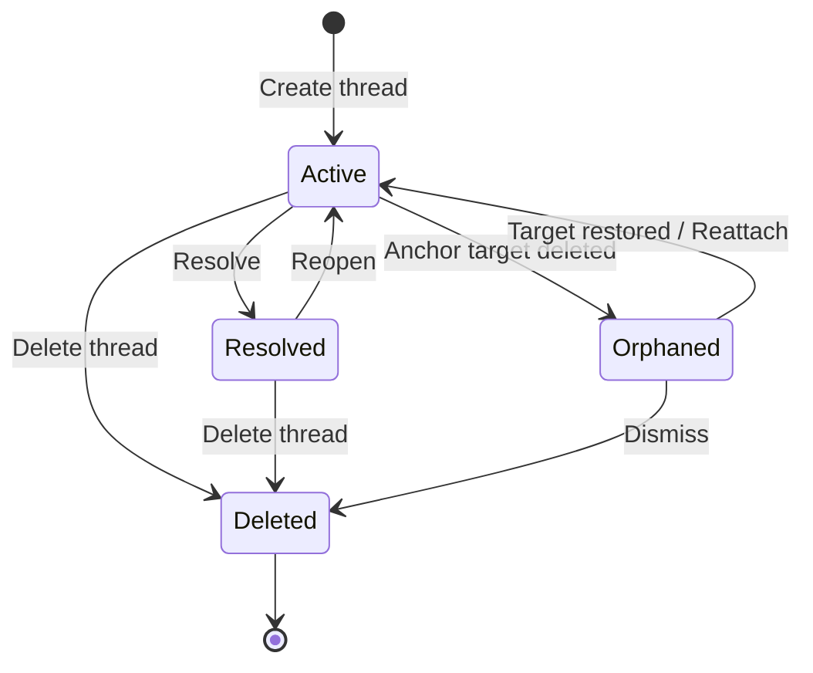
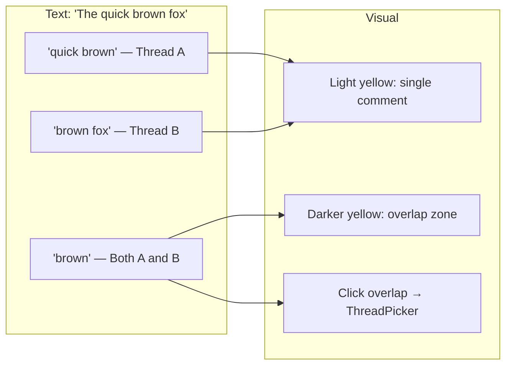

# 08: Thread Lifecycle

> Orphaned anchors, overlapping comments, notifications, and thread management

**Duration:** 2 days  
**Dependencies:** [03-anchoring.md](./03-anchoring.md), [05-editor-integration.md](./05-editor-integration.md)

## Overview

This step handles the edge cases and polish for the commenting system: what happens when commented content is deleted, how overlapping comments behave, and how comment counts/notifications work.



## Orphaned Anchors

### Detection

An anchor is orphaned when its target no longer exists or can't be resolved:

```typescript
// packages/data/src/comments/orphan-detection.ts

import { CommentThread, TextAnchor, CellAnchor, CanvasObjectAnchor, decodeAnchor } from '@xnet/data'

export type OrphanReason = 'text-deleted' | 'row-deleted' | 'object-deleted' | 'node-deleted'

export interface OrphanedThread {
  thread: CommentThread
  reason: OrphanReason
  context: string // Human-readable context (quoted text, row title, etc.)
}

/**
 * Check if a thread's anchor is orphaned.
 * Returns the orphan reason if orphaned, null if still valid.
 */
export function checkOrphanStatus(
  thread: CommentThread,
  resolvers: {
    resolveTextAnchor: (anchor: TextAnchor) => { from: number; to: number } | null
    rowExists: (rowId: string) => boolean
    objectExists: (objectId: string) => boolean
    nodeExists: (nodeId: string) => boolean
  }
): OrphanReason | null {
  const anchorType = thread.properties.anchorType as string
  const anchorData = thread.properties.anchorData as string

  switch (anchorType) {
    case 'text': {
      const anchor = decodeAnchor<TextAnchor>(anchorData)
      const resolved = resolvers.resolveTextAnchor(anchor)
      return resolved === null ? 'text-deleted' : null
    }

    case 'cell':
    case 'row': {
      const anchor = decodeAnchor<CellAnchor>(anchorData)
      return resolvers.rowExists(anchor.rowId) ? null : 'row-deleted'
    }

    case 'canvas-object': {
      const anchor = decodeAnchor<CanvasObjectAnchor>(anchorData)
      return resolvers.objectExists(anchor.objectId) ? null : 'object-deleted'
    }

    case 'node': {
      const targetId = thread.properties.targetNodeId as string
      return resolvers.nodeExists(targetId) ? null : 'node-deleted'
    }

    default:
      return null // canvas-position and column anchors can't orphan
  }
}
```

### Orphaned Thread UI

Orphaned threads appear in a "Detached Comments" section, showing the original context:

```typescript
// packages/ui/src/components/OrphanedThreadList.tsx

import React from 'react'
import { OrphanedThread } from '@xnet/data'
import { Comment } from '@xnet/data'

interface OrphanedThreadListProps {
  orphanedThreads: OrphanedThread[]
  commentsByThread: Map<string, Comment[]>
  onDismiss: (threadId: string) => void
  onReattach: (threadId: string) => void
}

export function OrphanedThreadList({
  orphanedThreads,
  commentsByThread,
  onDismiss,
  onReattach
}: OrphanedThreadListProps) {
  if (orphanedThreads.length === 0) return null

  return (
    <div className="orphaned-threads">
      <h4 className="orphaned-threads__header">
        Detached Comments ({orphanedThreads.length})
      </h4>
      <p className="orphaned-threads__description">
        These comments were on content that has been removed.
      </p>

      {orphanedThreads.map(({ thread, reason, context }) => {
        const comments = commentsByThread.get(thread.id) ?? []
        return (
          <div key={thread.id} className="orphaned-thread">
            <div className="orphaned-thread__context">
              Originally on: "{context}"
            </div>
            <div className="orphaned-thread__preview">
              {comments[0]?.properties.content as string}
            </div>
            <div className="orphaned-thread__actions">
              <button onClick={() => onReattach(thread.id)}>
                Reattach
              </button>
              <button onClick={() => onDismiss(thread.id)}>
                Dismiss
              </button>
            </div>
          </div>
        )
      })}
    </div>
  )
}
```

### Auto-Reattachment

If an undo operation restores deleted text, orphaned text anchors automatically resolve again:

```typescript
// On each document change, re-check orphaned threads
function recheckOrphanedAnchors(editor: Editor, orphanedThreadIds: string[], store: NodeStore) {
  for (const threadId of orphanedThreadIds) {
    const thread = store.get(threadId)
    if (!thread || thread.properties.anchorType !== 'text') continue

    const anchor = decodeAnchor<TextAnchor>(thread.properties.anchorData as string)
    const resolved = resolveTextAnchor(editor, anchor)

    if (resolved) {
      // Anchor is valid again — restore the mark
      const markType = editor.schema.marks.comment
      const { tr } = editor.state
      tr.addMark(
        resolved.from,
        resolved.to,
        markType.create({ threadId, resolved: thread.properties.resolved })
      )
      editor.view.dispatch(tr)

      // Remove from orphaned list
      orphanedThreadIds.splice(orphanedThreadIds.indexOf(threadId), 1)
    }
  }
}
```

## Overlapping Comments

### Detection

```typescript
// packages/editor/src/comments/overlap-detection.ts

/**
 * Find all thread IDs at a given document position.
 */
export function getThreadsAtPosition(editor: Editor, pos: number): string[] {
  const resolvedPos = editor.state.doc.resolve(pos)
  const marks = resolvedPos.marks()

  return marks.filter((m) => m.type.name === 'comment').map((m) => m.attrs.threadId as string)
}
```

### Thread Picker (for overlapping regions)

When clicking on text with multiple comment marks, show a small picker:

```typescript
// packages/ui/src/components/ThreadPicker.tsx

import React from 'react'
import { CommentThread, Comment } from '@xnet/data'

interface ThreadPickerProps {
  threads: CommentThread[]
  commentsByThread: Map<string, Comment[]>
  anchor: HTMLElement
  onSelect: (threadId: string) => void
  onDismiss: () => void
}

export function ThreadPicker({ threads, commentsByThread, anchor, onSelect, onDismiss }: ThreadPickerProps) {
  return (
    <Popover anchor={anchor} side="bottom" onClose={onDismiss}>
      <div className="thread-picker">
        <div className="thread-picker__header">
          {threads.length} comments on this text
        </div>
        {threads.map((thread) => {
          const comments = commentsByThread.get(thread.id) ?? []
          const firstComment = comments[0]
          return (
            <button
              key={thread.id}
              className="thread-picker__item"
              onClick={() => onSelect(thread.id)}
            >
              <span className="thread-picker__author">
                {firstComment?.properties.createdBy}
              </span>
              <span className="thread-picker__preview">
                {(firstComment?.properties.content as string)?.slice(0, 50)}
              </span>
            </button>
          )
        })}
      </div>
    </Popover>
  )
}
```

### Overlap Visual Treatment



## Comment Count Badges

Show comment counts on Nodes in the navigation/sidebar:

```typescript
// packages/react/src/hooks/useCommentCount.ts

import { useMemo } from 'react'
import { useNodes } from './useNodes'
import { CommentThread } from '@xnet/data'

/**
 * Get the unresolved comment count for a Node.
 * Useful for showing badges in navigation.
 */
export function useCommentCount(nodeId: string): number {
  const threads = useNodes<CommentThread>({
    schemaId: 'xnet://xnet.dev/CommentThread',
    filter: { targetNodeId: nodeId }
  })

  return useMemo(() => {
    return threads.filter((t) => !(t.properties.resolved as boolean)).length
  }, [threads])
}
```

## @Mention Parsing

Parse `@mentions` from comment content for in-app notification badges:

```typescript
// packages/data/src/comments/mentions.ts

export interface Mention {
  /** The raw mention text (e.g., '@Alice' or '@did:key:z6Mk...') */
  raw: string
  /** Resolved DID if available */
  did?: string
  /** Display name if resolved */
  displayName?: string
  /** Position in the content string */
  index: number
}

const MENTION_REGEX = /@(\S+)/g

/**
 * Extract mentions from comment content.
 */
export function extractMentions(content: string): Mention[] {
  const mentions: Mention[] = []
  let match: RegExpExecArray | null

  while ((match = MENTION_REGEX.exec(content)) !== null) {
    mentions.push({
      raw: match[0],
      did: match[1].startsWith('did:') ? match[1] : undefined,
      displayName: match[1].startsWith('did:') ? undefined : match[1],
      index: match.index
    })
  }

  return mentions
}

/**
 * Check if a DID is mentioned in a comment.
 */
export function isMentioned(content: string, did: string): boolean {
  return content.includes(`@${did}`)
}
```

## Edit History (Event-Sourced)

Comment edit history is free via the existing change log. No additional implementation needed — when we expose change log queries, comment history is automatically available:

```typescript
// Future API (when change log queries are exposed):
const history = await store.getPropertyHistory(commentId, 'content')
// Returns all previous values with timestamps and authors
```

For now, just show the `edited` flag and `editedAt` timestamp in the UI.

## Checklist

- [ ] Implement orphan detection (checkOrphanStatus)
- [ ] Create OrphanedThreadList component
- [ ] Implement auto-reattachment on undo
- [ ] Implement overlap detection (getThreadsAtPosition)
- [ ] Create ThreadPicker component
- [ ] Implement useCommentCount hook
- [ ] Implement @mention extraction
- [ ] Handle thread deletion (soft-delete, remove marks)
- [ ] Add "Detached Comments" section to sidebar
- [ ] Tests pass

---

[Back to README](./README.md) | [Previous: Canvas Comments](./07-canvas-comments.md)
