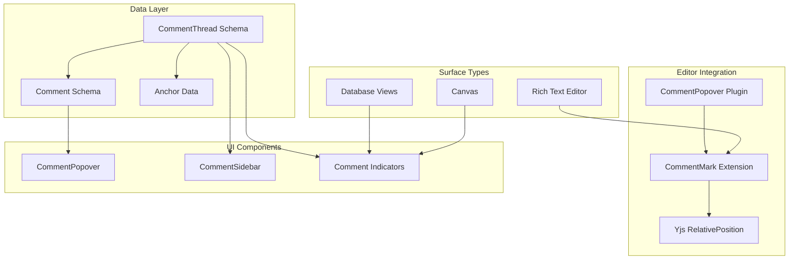

# xNet Implementation Plan - Step 03.6: Commenting System

> Universal commenting: comment on anything, anywhere — text selections, database cells, canvas objects, or entire Nodes.

## Executive Summary

This plan adds a commenting system to xNet where comments are first-class Nodes. The key insight is that **comments are just another Node type** — they sync via the existing Change infrastructure, respect UCAN permissions, and get edit history for free from the event-sourced log.

```typescript
// Comments use the same patterns as user data
const thread = await store.create({
  schemaId: 'xnet://xnet.dev/CommentThread',
  properties: {
    targetNodeId: pageId,
    anchorType: 'text',
    anchorData: JSON.stringify({ startRelative, endRelative, quotedText }),
    resolved: false
  }
})

const comment = await store.create({
  schemaId: 'xnet://xnet.dev/Comment',
  properties: {
    threadId: thread.id,
    content: 'This needs to handle the null case.'
  }
})
```

## Design Principles

| Principle                 | Implementation                                                 |
| ------------------------- | -------------------------------------------------------------- |
| **Comment on anything**   | Polymorphic anchor system (text, cell, canvas, node)           |
| **Inline-first**          | Popover on click/hover — no sidebar required to read comments  |
| **Comments are Nodes**    | Same sync, permissions, query, and history as user data        |
| **Real-time**             | Existing Change propagation handles all comment operations     |
| **Plain text + markdown** | Simple storage, rich rendering, no Yjs overhead per comment    |
| **Edit history free**     | Event-sourced Changes give full revision history automatically |

## Architecture Overview



## Implementation Phases

### Phase 1: Data Model & Editor Comments (Week 1-2)

| Task | Document                                         | Description                                 |
| ---- | ------------------------------------------------ | ------------------------------------------- |
| 1.1  | [01-comment-schemas.md](./01-comment-schemas.md) | CommentThread + Comment schema definitions  |
| 1.2  | [02-comment-mark.md](./02-comment-mark.md)       | TipTap Mark extension for text highlighting |
| 1.3  | [03-anchoring.md](./03-anchoring.md)             | Anchoring strategies for all surface types  |

**Validation Gate:**

- [ ] CommentThread and Comment schemas defined and registered
- [ ] CommentMark highlights text with threadId attribute
- [ ] Yjs RelativePosition captures survive concurrent edits
- [ ] All tests pass

### Phase 2: UI Components (Week 2-3)

| Task | Document                                               | Description                                        |
| ---- | ------------------------------------------------------ | -------------------------------------------------- |
| 2.1  | [04-comment-popover.md](./04-comment-popover.md)       | Inline popover (hover preview + click full thread) |
| 2.2  | [05-editor-integration.md](./05-editor-integration.md) | ProseMirror plugin + optional sidebar              |

**Validation Gate:**

- [ ] Popover appears on hover (preview) and click (full thread)
- [ ] Reply input works inline
- [ ] Resolve/reopen actions work
- [ ] Comment creation from text selection works end-to-end

### Phase 3: Database & Canvas (Week 3-4)

| Task | Document                                             | Description                                          |
| ---- | ---------------------------------------------------- | ---------------------------------------------------- |
| 3.1  | [06-database-comments.md](./06-database-comments.md) | Cell, row, column commenting in table/board views    |
| 3.2  | [07-canvas-comments.md](./07-canvas-comments.md)     | Position pins + object attachment (Figma/Miro style) |

**Validation Gate:**

- [ ] Database cells show comment indicators
- [ ] Canvas pins render in overlay layer
- [ ] Canvas object comments follow object movement
- [ ] Popover works in all three contexts

### Phase 4: Thread Lifecycle & Polish (Week 4-5)

| Task | Document                                           | Description                                           |
| ---- | -------------------------------------------------- | ----------------------------------------------------- |
| 4.1  | [08-thread-lifecycle.md](./08-thread-lifecycle.md) | Orphaned anchors, overlapping comments, notifications |

**Validation Gate:**

- [ ] Orphaned threads show in "Detached" section with quoted text
- [ ] Overlapping comment highlights show thread picker
- [ ] Comment count badges on Nodes in navigation
- [ ] @mention parsing works

## Key Types

```typescript
// Anchor types (polymorphic)
type AnchorType = 'text' | 'cell' | 'row' | 'column' | 'canvas-position' | 'canvas-object' | 'node'

// Text anchor (Yjs-relative positions)
interface TextAnchor {
  startRelative: Uint8Array // Y.encodeRelativePosition(...)
  endRelative: Uint8Array
  quotedText: string // Fallback for orphaned anchors
}

// Database anchors
interface CellAnchor {
  rowId: string
  propertyKey: string
}
interface RowAnchor {
  rowId: string
}
interface ColumnAnchor {
  propertyKey: string
}

// Canvas anchors
interface CanvasPositionAnchor {
  x: number
  y: number
}
interface CanvasObjectAnchor {
  objectId: string
  offsetX?: number
  offsetY?: number
}

// Thread state
interface CommentThread {
  targetNodeId: string
  anchorType: AnchorType
  anchorData: string // JSON-encoded anchor
  resolved: boolean
}

// Comment content (plain text with markdown rendering)
interface Comment {
  threadId: string
  parentCommentId?: string
  content: string // Markdown-formatted plain text
  edited: boolean
}
```

## Real-Time Sync

Comments sync via the existing `Change<NodePayload>` mechanism — no new infrastructure:

| Operation      | Mechanism                          | Conflict Resolution      |
| -------------- | ---------------------------------- | ------------------------ |
| Create thread  | New Node creation                  | No conflict (unique IDs) |
| Add reply      | New Comment Node                   | No conflict (unique IDs) |
| Edit comment   | Property update                    | LWW per-property         |
| Resolve thread | Property update (`resolved: true`) | LWW — last resolver wins |
| Delete comment | Soft-delete Node                   | LWW on `deleted` flag    |

## Edit History (Free)

Because comments are Nodes and all mutations are event-sourced as `Change<NodePayload>` records, full edit history comes for free. No extra versioning table or `previousVersions` array needed — just expose a query API over the existing change log.

## Success Criteria

After completing this plan:

1. **Comment on text** — Select text, comment, see inline popover
2. **Comment on database** — Cell/row/column indicators with popovers
3. **Comment on canvas** — Figma-style pins and object attachment
4. **Real-time sync** — All comment operations sync to peers
5. **Inline UX** — Popovers on hover/click, no sidebar required
6. **Thread management** — Resolve, reopen, delete, orphan handling
7. **Tests pass** — Unit tests for schemas, anchoring, popover logic

## What's NOT in This Plan

Deferred to future work:

- **Rich text comments** — Yjs Doc per comment (upgrade path exists if needed)
- **@mention notifications** — Push notifications system (in-app badges only for now)
- **Emoji reactions** — Quick reactions on comments
- **Comment permissions** — Fine-grained ACL beyond Node-level UCAN
- **Comment search** — Full-text search across all comments
- **Comment export** — Export threads as markdown/PDF

## Dependencies

| Component         | Depends On                             |
| ----------------- | -------------------------------------- |
| Comment schemas   | `@xnet/data` (defineSchema, NodeStore) |
| CommentMark       | `@xnet/editor` (TipTap extensions)     |
| Anchoring (text)  | `yjs` (RelativePosition)               |
| CommentPopover    | `@xnet/ui` (Popover primitive)         |
| Database comments | `@xnet/views` (table/board views)      |
| Canvas comments   | `@xnet/canvas` (canvas package)        |

## Reference Documents

- [COMMENTING_SYSTEM.md](../explorations/0014_COMMENTING_SYSTEM.md) — Full design exploration
- [TipTap Comments](https://tiptap.dev/docs/comments/getting-started/overview) — TipTap's approach (reference)
- [Figma Multiplayer](https://www.figma.com/blog/how-figmas-multiplayer-technology-works/) — Canvas collaboration patterns

---

[Back to Main Plan](../plan/README.md) | [Start Implementation](./01-comment-schemas.md)
