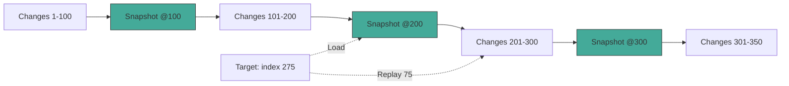

# 02: Snapshot Cache

> Periodic state checkpoints for fast point-in-time reconstruction.

**Dependencies:** Step 01 (HistoryEngine types)

## Overview

Without snapshots, reconstructing a node with 10,000 changes means replaying all 10,000 from scratch. The SnapshotCache stores periodic checkpoints (every 100 changes by default) so reconstruction only replays the remainder.



## Implementation

### 1. Types

```typescript
// packages/history/src/snapshot-cache.ts

export interface Snapshot {
  nodeId: NodeId
  changeIndex: number // which change index this snapshot is at
  changeHash: ContentId // hash of the change at this index
  state: NodeState // full materialized state at this point
  createdAt: number // when the snapshot was created
  byteSize?: number // approximate size for cache management
}

export interface SnapshotCacheOptions {
  /** Create a snapshot every N changes (default: 100) */
  interval: number
  /** Maximum snapshots to keep per node (default: 50) */
  maxPerNode: number
  /** Maximum total cache size in bytes (default: 50MB) */
  maxTotalBytes: number
}
```

### 2. SnapshotCache Class

```typescript
// packages/history/src/snapshot-cache.ts

export class SnapshotCache {
  private options: Required<SnapshotCacheOptions>

  constructor(
    private storage: SnapshotStorageAdapter,
    options?: Partial<SnapshotCacheOptions>
  ) {
    this.options = {
      interval: options?.interval ?? 100,
      maxPerNode: options?.maxPerNode ?? 50,
      maxTotalBytes: options?.maxTotalBytes ?? 50 * 1024 * 1024
    }
  }

  /** Get the nearest snapshot at or before the target index */
  async getNearestBefore(nodeId: NodeId, changeIndex: number): Promise<Snapshot | null> {
    const snapshots = await this.storage.getSnapshots(nodeId)
    // Find the highest-indexed snapshot that's <= changeIndex
    let best: Snapshot | null = null
    for (const snap of snapshots) {
      if (snap.changeIndex <= changeIndex) {
        if (!best || snap.changeIndex > best.changeIndex) {
          best = snap
        }
      }
    }
    return best
  }

  /** Save a snapshot (called by HistoryEngine after reconstruction) */
  async save(
    nodeId: NodeId,
    changeIndex: number,
    changeHash: ContentId,
    state: NodeState
  ): Promise<void> {
    const snapshot: Snapshot = {
      nodeId,
      changeIndex,
      changeHash,
      state: structuredClone(state),
      createdAt: Date.now(),
      byteSize: this.estimateSize(state)
    }

    await this.storage.saveSnapshot(snapshot)
    await this.evictIfNeeded(nodeId)
  }

  /** Check if a snapshot should be created at this index */
  shouldSnapshot(changeIndex: number): boolean {
    return changeIndex > 0 && changeIndex % this.options.interval === 0
  }

  /** Delete all snapshots for a node */
  async clear(nodeId: NodeId): Promise<void> {
    await this.storage.deleteSnapshots(nodeId)
  }

  /** Get cache stats */
  async getStats(): Promise<CacheStats> {
    const all = await this.storage.getAllSnapshots()
    return {
      totalSnapshots: all.length,
      totalBytes: all.reduce((sum, s) => sum + (s.byteSize ?? 0), 0),
      nodeCount: new Set(all.map((s) => s.nodeId)).size
    }
  }

  // --- Private ---

  private async evictIfNeeded(nodeId: NodeId): Promise<void> {
    const snapshots = await this.storage.getSnapshots(nodeId)

    // Per-node limit: keep most recent N
    if (snapshots.length > this.options.maxPerNode) {
      const sorted = snapshots.sort((a, b) => a.changeIndex - b.changeIndex)
      const toDelete = sorted.slice(0, snapshots.length - this.options.maxPerNode)
      for (const snap of toDelete) {
        await this.storage.deleteSnapshot(snap.nodeId, snap.changeIndex)
      }
    }

    // Total size limit
    const stats = await this.getStats()
    if (stats.totalBytes > this.options.maxTotalBytes) {
      // Evict oldest snapshots globally until under budget
      const all = await this.storage.getAllSnapshots()
      const sorted = all.sort((a, b) => a.createdAt - b.createdAt)
      let totalBytes = stats.totalBytes
      for (const snap of sorted) {
        if (totalBytes <= this.options.maxTotalBytes) break
        await this.storage.deleteSnapshot(snap.nodeId, snap.changeIndex)
        totalBytes -= snap.byteSize ?? 0
      }
    }
  }

  private estimateSize(state: NodeState): number {
    return new TextEncoder().encode(JSON.stringify(state)).byteLength
  }
}

interface CacheStats {
  totalSnapshots: number
  totalBytes: number
  nodeCount: number
}
```

### 3. Snapshot Storage Adapter

```typescript
// packages/history/src/snapshot-storage.ts

export interface SnapshotStorageAdapter {
  saveSnapshot(snapshot: Snapshot): Promise<void>
  getSnapshots(nodeId: NodeId): Promise<Snapshot[]>
  getAllSnapshots(): Promise<Snapshot[]>
  deleteSnapshot(nodeId: NodeId, changeIndex: number): Promise<void>
  deleteSnapshots(nodeId: NodeId): Promise<void>
}

/** IndexedDB implementation */
export class IndexedDBSnapshotStorage implements SnapshotStorageAdapter {
  private db: IDBDatabase | null = null
  private readonly DB_NAME = 'xnet-snapshots'
  private readonly STORE_NAME = 'snapshots'

  async open(): Promise<void> {
    this.db = await new Promise((resolve, reject) => {
      const request = indexedDB.open(this.DB_NAME, 1)
      request.onupgradeneeded = () => {
        const db = request.result
        if (!db.objectStoreNames.contains(this.STORE_NAME)) {
          const store = db.createObjectStore(this.STORE_NAME, {
            keyPath: ['nodeId', 'changeIndex']
          })
          store.createIndex('byNodeId', 'nodeId')
          store.createIndex('byCreatedAt', 'createdAt')
        }
      }
      request.onsuccess = () => resolve(request.result)
      request.onerror = () => reject(request.error)
    })
  }

  async saveSnapshot(snapshot: Snapshot): Promise<void> {
    const tx = this.db!.transaction(this.STORE_NAME, 'readwrite')
    tx.objectStore(this.STORE_NAME).put(snapshot)
    await new Promise((resolve, reject) => {
      tx.oncomplete = resolve
      tx.onerror = () => reject(tx.error)
    })
  }

  async getSnapshots(nodeId: NodeId): Promise<Snapshot[]> {
    const tx = this.db!.transaction(this.STORE_NAME, 'readonly')
    const index = tx.objectStore(this.STORE_NAME).index('byNodeId')
    const request = index.getAll(nodeId)
    return new Promise((resolve, reject) => {
      request.onsuccess = () => resolve(request.result)
      request.onerror = () => reject(request.error)
    })
  }

  // ... getAllSnapshots, deleteSnapshot, deleteSnapshots
}

/** In-memory implementation for testing */
export class MemorySnapshotStorage implements SnapshotStorageAdapter {
  private snapshots: Snapshot[] = []

  async saveSnapshot(snapshot: Snapshot): Promise<void> {
    this.snapshots.push(structuredClone(snapshot))
  }

  async getSnapshots(nodeId: NodeId): Promise<Snapshot[]> {
    return this.snapshots.filter((s) => s.nodeId === nodeId)
  }

  async getAllSnapshots(): Promise<Snapshot[]> {
    return [...this.snapshots]
  }

  async deleteSnapshot(nodeId: NodeId, changeIndex: number): Promise<void> {
    this.snapshots = this.snapshots.filter(
      (s) => !(s.nodeId === nodeId && s.changeIndex === changeIndex)
    )
  }

  async deleteSnapshots(nodeId: NodeId): Promise<void> {
    this.snapshots = this.snapshots.filter((s) => s.nodeId !== nodeId)
  }
}
```

### 4. Integration with HistoryEngine

```typescript
// Modified HistoryEngine.materializeAt to auto-create snapshots:

async materializeAt(nodeId: NodeId, target: HistoryTarget): Promise<HistoricalState> {
  // ... existing reconstruction logic ...

  // After reconstruction, maybe save a snapshot for future use
  if (this.snapshots.shouldSnapshot(targetIndex)) {
    const existing = await this.snapshots.getNearestBefore(nodeId, targetIndex)
    if (!existing || existing.changeIndex !== targetIndex) {
      await this.snapshots.save(nodeId, targetIndex, sorted[targetIndex].hash, state)
    }
  }

  return result
}
```

### 5. NodeStore Integration (Auto-Snapshot on Write)

```typescript
// Hook into NodeStore to create snapshots as changes accumulate:

export function setupAutoSnapshots(store: NodeStore, snapshots: SnapshotCache): () => void {
  const changeCounts = new Map<NodeId, number>()

  return store.subscribe(async (event) => {
    if (!event.node) return
    const nodeId = event.change.payload.nodeId
    const count = (changeCounts.get(nodeId) ?? 0) + 1
    changeCounts.set(nodeId, count)

    if (snapshots.shouldSnapshot(count)) {
      await snapshots.save(nodeId, count, event.change.hash, event.node)
    }
  })
}
```

## Performance Characteristics

| Scenario                    | Without Snapshots | With Snapshots (interval=100) |
| --------------------------- | ----------------- | ----------------------------- |
| 100 changes, seek to 50     | Replay 50         | Replay 50                     |
| 500 changes, seek to 350    | Replay 350        | Load snap@300, replay 50      |
| 5000 changes, seek to 4500  | Replay 4500       | Load snap@4400, replay 100    |
| 10000 changes, seek to 9999 | Replay 9999       | Load snap@9900, replay 99     |

**Worst case replay: `interval - 1` changes** (e.g., 99 with interval=100).

## Tests

```typescript
describe('SnapshotCache', () => {
  it('returns null when no snapshots exist', async () => {
    const snap = await cache.getNearestBefore('node1', 50)
    expect(snap).toBeNull()
  })

  it('returns nearest snapshot before target', async () => {
    await cache.save('node1', 100, 'hash100', state100)
    await cache.save('node1', 200, 'hash200', state200)

    const snap = await cache.getNearestBefore('node1', 250)
    expect(snap!.changeIndex).toBe(200)
  })

  it('does not return snapshots after target', async () => {
    await cache.save('node1', 200, 'hash200', state200)
    const snap = await cache.getNearestBefore('node1', 150)
    expect(snap).toBeNull()
  })

  it('evicts oldest when per-node limit exceeded', async () => {
    // Save maxPerNode + 1 snapshots, oldest should be evicted
  })

  it('shouldSnapshot returns true at intervals', () => {
    expect(cache.shouldSnapshot(0)).toBe(false)
    expect(cache.shouldSnapshot(50)).toBe(false)
    expect(cache.shouldSnapshot(100)).toBe(true)
    expect(cache.shouldSnapshot(200)).toBe(true)
  })
})
```

## Checklist

- [x] Implement `Snapshot` type and `SnapshotCacheOptions`
- [x] Implement `SnapshotCache` with getNearestBefore, save, eviction
- [ ] Implement `IndexedDBSnapshotStorage` adapter
- [x] Implement `MemorySnapshotStorage` for testing
- [x] Integrate snapshot lookup into `HistoryEngine.materializeAt()`
- [x] Add auto-snapshot on write via NodeStore subscription
- [x] Implement per-node and total-size eviction policies
- [x] Add `getStats()` for cache monitoring
- [x] Write unit tests for cache behavior and eviction
- [ ] Benchmark: verify reconstruction with snapshots is < 5ms for 100 replays

---

[Back to README](./README.md) | [Previous: History Engine](./01-history-engine.md) | [Next: Audit Index](./03-audit-index.md)
