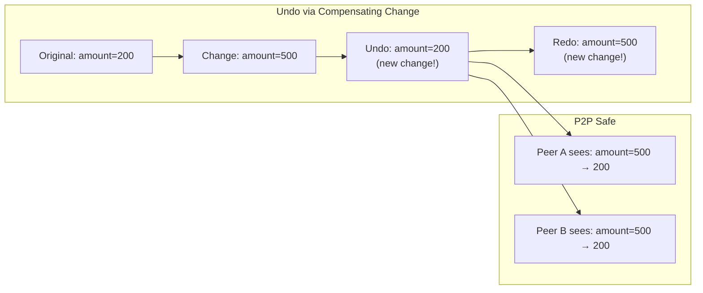

# 04: Undo/Redo

> Per-node undo/redo via compensating changes, with batch support and keyboard shortcuts.

**Dependencies:** Step 01 (HistoryEngine), `@xnet/data` (NodeStore)

## Overview

Undo creates a new compensating change that restores previous values. This is P2P-safe — peers see the undo as a normal change. The UndoManager tracks per-node stacks and supports batch undo (undoing an entire transaction).



## Implementation

### 1. Types

```typescript
// packages/history/src/undo-manager.ts

interface UndoEntry {
  changeHash: ContentId // which change this undoes
  nodeId: NodeId
  previousValues: Record<string, unknown> // values before the change
  currentValues: Record<string, unknown> // values the change set
  batchId?: string // if part of a transaction
  wallTime: number // when the original change was made
}

interface UndoManagerOptions {
  /** Maximum undo stack depth per node (default: 100) */
  maxStackSize: number
  /** Only track changes by the local author (default: true) */
  localOnly: boolean
  /** Merge rapid sequential changes into one undo entry (default: 300ms) */
  mergeInterval: number
}
```

### 2. UndoManager Class

```typescript
// packages/history/src/undo-manager.ts

export class UndoManager {
  private undoStacks = new Map<NodeId, UndoEntry[]>()
  private redoStacks = new Map<NodeId, UndoEntry[]>()
  private options: Required<UndoManagerOptions>
  private unsubscribe: (() => void) | null = null
  private lastEntryTime = new Map<NodeId, number>()
  private localDID: DID

  constructor(
    private store: NodeStore,
    localDID: DID,
    options?: Partial<UndoManagerOptions>
  ) {
    this.localDID = localDID
    this.options = {
      maxStackSize: options?.maxStackSize ?? 100,
      localOnly: options?.localOnly ?? true,
      mergeInterval: options?.mergeInterval ?? 300
    }
  }

  /** Start tracking changes for undo */
  start(): void {
    this.unsubscribe = this.store.subscribe((event) => {
      if (!event.node) return
      if (event.isRemote && this.options.localOnly) return
      if (this.options.localOnly && event.change.authorDID !== this.localDID) return

      this.trackChange(event.change, event.node)
    })
  }

  /** Stop tracking */
  stop(): void {
    this.unsubscribe?.()
    this.unsubscribe = null
  }

  /** Undo the last change for a node */
  async undo(nodeId: NodeId): Promise<boolean> {
    const stack = this.undoStacks.get(nodeId)
    if (!stack?.length) return false

    const entry = stack.pop()!

    // Create compensating change
    await this.store.update(nodeId, entry.previousValues)

    // Push to redo
    const redoStack = this.getOrCreateStack(this.redoStacks, nodeId)
    redoStack.push(entry)

    return true
  }

  /** Redo the last undone change for a node */
  async redo(nodeId: NodeId): Promise<boolean> {
    const stack = this.redoStacks.get(nodeId)
    if (!stack?.length) return false

    const entry = stack.pop()!

    // Re-apply the original values
    await this.store.update(nodeId, entry.currentValues)

    // Push back to undo
    const undoStack = this.getOrCreateStack(this.undoStacks, nodeId)
    undoStack.push(entry)

    return true
  }

  /** Undo all changes in a batch/transaction */
  async undoBatch(batchId: string): Promise<boolean> {
    // Find all entries with this batchId across all nodes
    const entries: { nodeId: NodeId; entry: UndoEntry }[] = []

    for (const [nodeId, stack] of this.undoStacks) {
      for (let i = stack.length - 1; i >= 0; i--) {
        if (stack[i].batchId === batchId) {
          entries.push({ nodeId, entry: stack[i] })
        }
      }
    }

    if (entries.length === 0) return false

    // Remove from undo stacks and create compensating transaction
    const operations = entries.map(({ nodeId, entry }) => {
      const stack = this.undoStacks.get(nodeId)!
      const idx = stack.indexOf(entry)
      if (idx !== -1) stack.splice(idx, 1)
      return { nodeId, updates: entry.previousValues }
    })

    // Apply all reverts as a transaction
    await this.store.transaction(
      operations.map((op) => ({
        type: 'update' as const,
        nodeId: op.nodeId,
        payload: op.updates
      }))
    )

    // Push to redo stacks
    for (const { nodeId, entry } of entries) {
      const redoStack = this.getOrCreateStack(this.redoStacks, nodeId)
      redoStack.push(entry)
    }

    return true
  }

  /** Check if undo is available */
  canUndo(nodeId: NodeId): boolean {
    return (this.undoStacks.get(nodeId)?.length ?? 0) > 0
  }

  /** Check if redo is available */
  canRedo(nodeId: NodeId): boolean {
    return (this.redoStacks.get(nodeId)?.length ?? 0) > 0
  }

  /** Get undo stack size */
  getUndoCount(nodeId: NodeId): number {
    return this.undoStacks.get(nodeId)?.length ?? 0
  }

  /** Clear all stacks for a node */
  clear(nodeId: NodeId): void {
    this.undoStacks.delete(nodeId)
    this.redoStacks.delete(nodeId)
  }

  /** Clear all stacks */
  clearAll(): void {
    this.undoStacks.clear()
    this.redoStacks.clear()
  }

  // --- Private ---

  private trackChange(change: NodeChange, nodeState: NodeState): void {
    const nodeId = change.payload.nodeId
    const now = Date.now()
    const lastTime = this.lastEntryTime.get(nodeId) ?? 0

    // Compute previous values (what the properties were before this change)
    const previousValues: Record<string, unknown> = {}
    const currentValues: Record<string, unknown> = {}

    for (const [key, value] of Object.entries(change.payload.properties ?? {})) {
      currentValues[key] = value
      // The current nodeState already has the new value applied,
      // so we need to look at what it was BEFORE.
      // Since this is called in the subscriber AFTER apply, we reconstruct:
      // If the change set a value, the previous was whatever was there before.
      // We track this via the timestamps — if this change won LWW, the old value
      // was different. We'll capture from the event.
      previousValues[key] = undefined // Will be populated below
    }

    // To get actual previous values, we need the state before this change.
    // Strategy: maintain a one-deep "previous state" cache per node
    // OR: on subscriber, we already have `event.node` which is AFTER the change.
    // We can reconstruct "before" from the change + current:
    // For now, we use a simpler approach: store the node state before each change.
    // This is handled via a middleware that captures pre-change state.

    const entry: UndoEntry = {
      changeHash: change.hash,
      nodeId,
      previousValues,
      currentValues,
      batchId: change.batchId,
      wallTime: change.wallTime
    }

    // Merge with previous entry if within merge interval
    const stack = this.getOrCreateStack(this.undoStacks, nodeId)
    if (stack.length > 0 && now - lastTime < this.options.mergeInterval) {
      const prev = stack[stack.length - 1]
      // Merge: keep prev's previousValues, update currentValues
      for (const [key, value] of Object.entries(currentValues)) {
        if (!(key in prev.previousValues)) {
          prev.previousValues[key] = previousValues[key]
        }
        prev.currentValues[key] = value
      }
    } else {
      stack.push(entry)
      // Trim stack if too large
      if (stack.length > this.options.maxStackSize) {
        stack.shift()
      }
    }

    this.lastEntryTime.set(nodeId, now)

    // Clear redo stack on new change (standard undo behavior)
    this.redoStacks.delete(nodeId)
  }

  private getOrCreateStack(map: Map<NodeId, UndoEntry[]>, nodeId: NodeId): UndoEntry[] {
    if (!map.has(nodeId)) map.set(nodeId, [])
    return map.get(nodeId)!
  }
}
```

### 3. Pre-Change State Capture (Middleware)

To correctly capture "previous values" for undo, we need the state before the change is applied:

```typescript
// Integration: capture pre-change state via NodeStore middleware

export function setupUndoCapture(store: NodeStore, undoManager: UndoManager): Disposable {
  return store.middleware.add({
    id: 'undo-capture',
    priority: 10, // run early, before the change is applied

    async beforeChange(change, next) {
      // Capture current state before applying
      const currentNode = await store.get(change.nodeId)
      const previousValues: Record<string, unknown> = {}

      if (currentNode && change.payload) {
        for (const key of Object.keys(change.payload)) {
          previousValues[key] = currentNode.properties[key]
        }
      }

      // Stash for the subscriber to pick up
      ;(change as any)._previousValues = previousValues

      return next()
    }
  })
}
```

### 4. React Hook

```typescript
// packages/history/src/hooks.ts (additions)

export function useUndo(nodeId: NodeId) {
  const undoManager = useUndoManager()
  const [canUndo, setCanUndo] = useState(false)
  const [canRedo, setCanRedo] = useState(false)

  // Update state on changes
  useEffect(() => {
    const update = () => {
      setCanUndo(undoManager.canUndo(nodeId))
      setCanRedo(undoManager.canRedo(nodeId))
    }
    update()
    // Re-check after any store change
    const unsub = store.subscribe(update)
    return unsub
  }, [nodeId])

  const undo = useCallback(() => undoManager.undo(nodeId), [nodeId])
  const redo = useCallback(() => undoManager.redo(nodeId), [nodeId])

  return { canUndo, canRedo, undo, redo }
}
```

### 5. Keyboard Shortcuts

```typescript
// Wire Ctrl+Z / Ctrl+Shift+Z to the active node's undo/redo

export function UndoKeyboardHandler({ activeNodeId }: { activeNodeId: NodeId | null }) {
  const undoManager = useUndoManager()

  useEffect(() => {
    const handler = async (e: KeyboardEvent) => {
      if (!activeNodeId) return
      const mod = e.metaKey || e.ctrlKey

      if (mod && e.key === 'z' && !e.shiftKey) {
        e.preventDefault()
        await undoManager.undo(activeNodeId)
      }
      if (mod && e.key === 'z' && e.shiftKey) {
        e.preventDefault()
        await undoManager.redo(activeNodeId)
      }
    }

    window.addEventListener('keydown', handler)
    return () => window.removeEventListener('keydown', handler)
  }, [activeNodeId])

  return null
}
```

## P2P Behavior

Since undo creates a real compensating change:

1. The change gets a new Lamport timestamp (latest)
2. It's broadcast to all peers via the sync protocol
3. Peers apply it as any other remote change
4. The undo "wins" because it has a higher Lamport time (LWW)
5. Peers see the value revert to the previous state

This means undo is **collaborative-safe** — it doesn't require any special protocol.

## Checklist

- [x] Implement `UndoManager` with per-node undo/redo stacks
- [x] Implement compensating change creation (reverse the property values)
- [x] Implement change merging (rapid edits within 300ms merge into one entry)
- [ ] Implement batch undo (undo entire transactions)
- [x] Set up pre-change state capture via capturePreChangeState()
- [ ] Create `useUndo()` React hook
- [ ] Wire Ctrl+Z / Ctrl+Shift+Z keyboard shortcuts
- [ ] Handle edge cases: undo after remote change, undo deleted node
- [x] Implement stack size limits and cleanup
- [x] Write tests: single undo, redo, batch undo, merge, stack overflow
- [ ] Verify P2P behavior: undo syncs correctly to peers

---

[Back to README](./README.md) | [Previous: Audit Index](./03-audit-index.md) | [Next: Timeline Scrubber](./05-timeline-scrubber.md)
