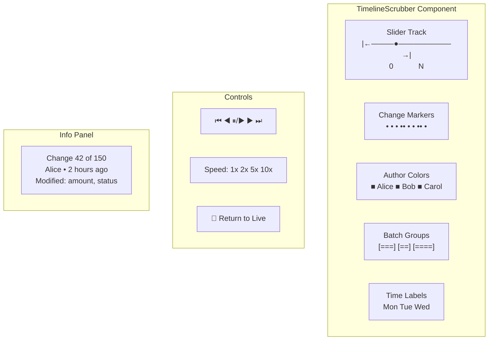

# 05: Timeline Scrubber

> The core Time Machine UI component: slider with playback controls, author markers, and smooth seeking.

**Dependencies:** Step 01 (HistoryEngine), Step 02 (SnapshotCache)

## Overview

The TimelineScrubber is the Apple Time Machine-inspired UI. A slider maps to change indices. Dragging it reconstructs and renders the historical state in real time. Playback controls animate through changes at configurable speed.



## Implementation

### 1. ScrubCache (Pre-Computed States for Smooth Seeking)

```typescript
// packages/history/src/scrub-cache.ts

export class ScrubCache {
  private cache = new Map<number, NodeState>() // index → pre-computed state
  private changes: NodeChange[] = []
  private resolution: number

  constructor(resolution = 10) {
    this.resolution = resolution
  }

  /** Pre-compute states at regular intervals for a node */
  async precompute(
    nodeId: NodeId,
    engine: HistoryEngine,
    storage: NodeStorageAdapter
  ): Promise<void> {
    const allChanges = await storage.getChanges(nodeId)
    this.changes = topologicalSort(allChanges)

    if (this.changes.length === 0) return

    // Compute state at every `resolution` interval
    let state = this.createEmptyState(nodeId, this.changes[0])
    for (let i = 0; i < this.changes.length; i++) {
      state = applyChangeToState(state, this.changes[i])
      if (i % this.resolution === 0) {
        this.cache.set(i, structuredClone(state))
      }
    }
    // Always cache the final state
    this.cache.set(this.changes.length - 1, structuredClone(state))
  }

  /** Fast seek to any index (max `resolution` replays) */
  getStateAt(index: number): NodeState | null {
    if (this.changes.length === 0) return null
    const clamped = Math.max(0, Math.min(index, this.changes.length - 1))

    // Find nearest cached state at or before index
    const nearestCacheIndex = Math.floor(clamped / this.resolution) * this.resolution
    let state = this.cache.get(nearestCacheIndex)
    if (!state) return null

    state = structuredClone(state)

    // Replay the remaining changes
    for (let i = nearestCacheIndex + 1; i <= clamped; i++) {
      state = applyChangeToState(state, this.changes[i])
    }

    return state
  }

  /** Get the change at a specific index */
  getChangeAt(index: number): NodeChange | null {
    return this.changes[index] ?? null
  }

  get totalChanges(): number {
    return this.changes.length
  }

  clear(): void {
    this.cache.clear()
    this.changes = []
  }
}
```

### 2. PlaybackEngine

```typescript
// packages/history/src/playback.ts

export type PlaybackState = 'stopped' | 'playing' | 'paused'

export interface PlaybackOptions {
  speed: number // 1, 2, 5, 10
  loop: boolean
  skipBatches: boolean // treat batch as single step
}

export class PlaybackEngine {
  private state: PlaybackState = 'stopped'
  private position = 0
  private timer: number | null = null
  private speed = 1
  private listeners = new Set<(position: number, state: PlaybackState) => void>()

  constructor(private totalChanges: number) {}

  play(): void {
    if (this.state === 'playing') return
    this.state = 'playing'
    this.scheduleNext()
    this.emit()
  }

  pause(): void {
    this.state = 'paused'
    if (this.timer) {
      clearTimeout(this.timer)
      this.timer = null
    }
    this.emit()
  }

  stop(): void {
    this.state = 'stopped'
    this.position = 0
    if (this.timer) {
      clearTimeout(this.timer)
      this.timer = null
    }
    this.emit()
  }

  seek(index: number): void {
    this.position = Math.max(0, Math.min(index, this.totalChanges - 1))
    this.emit()
  }

  stepForward(): void {
    if (this.position < this.totalChanges - 1) {
      this.position++
      this.emit()
    }
  }

  stepBackward(): void {
    if (this.position > 0) {
      this.position--
      this.emit()
    }
  }

  jumpToStart(): void {
    this.seek(0)
  }
  jumpToEnd(): void {
    this.seek(this.totalChanges - 1)
  }

  setSpeed(speed: number): void {
    this.speed = speed
    if (this.state === 'playing') {
      if (this.timer) clearTimeout(this.timer)
      this.scheduleNext()
    }
  }

  getPosition(): number {
    return this.position
  }
  getState(): PlaybackState {
    return this.state
  }

  onChange(listener: (position: number, state: PlaybackState) => void): () => void {
    this.listeners.add(listener)
    return () => this.listeners.delete(listener)
  }

  private scheduleNext(): void {
    const delay = Math.max(50, 1000 / this.speed) // min 50ms between frames
    this.timer = window.setTimeout(() => {
      if (this.position >= this.totalChanges - 1) {
        this.pause()
        return
      }
      this.position++
      this.emit()
      if (this.state === 'playing') this.scheduleNext()
    }, delay)
  }

  private emit(): void {
    for (const l of this.listeners) l(this.position, this.state)
  }
}
```

### 3. TimelineScrubber Component

```typescript
// packages/views/src/timeline/TimelineScrubber.tsx

export interface TimelineScrubberProps {
  timeline: TimelineEntry[]
  position: number
  onPositionChange: (index: number) => void
  onRestoreClick?: (index: number) => void
  showAuthors?: boolean
  showBatches?: boolean
  colorMap?: Map<DID, string>        // author → color
}

export function TimelineScrubber({
  timeline,
  position,
  onPositionChange,
  onRestoreClick,
  showAuthors = true,
  showBatches = true,
  colorMap,
}: TimelineScrubberProps) {
  const [playback] = useState(() => new PlaybackEngine(timeline.length))
  const [playState, setPlayState] = useState<PlaybackState>('stopped')
  const [speed, setSpeed] = useState(1)
  const sliderRef = useRef<HTMLDivElement>(null)

  // Sync playback position
  useEffect(() => {
    return playback.onChange((pos, state) => {
      onPositionChange(pos)
      setPlayState(state)
    })
  }, [playback])

  const currentEntry = timeline[position]
  const isLive = position === timeline.length - 1

  // Author color assignment
  const authors = useMemo(() => {
    if (colorMap) return colorMap
    const unique = [...new Set(timeline.map(t => t.author))]
    const colors = ['#3b82f6', '#ef4444', '#22c55e', '#f59e0b', '#8b5cf6', '#ec4899']
    return new Map(unique.map((a, i) => [a, colors[i % colors.length]]))
  }, [timeline, colorMap])

  return (
    <div className="timeline-scrubber">
      {/* Slider Track */}
      <div className="timeline-track" ref={sliderRef}>
        {/* Author-colored segments */}
        {showAuthors && (
          <div className="timeline-segments">
            {timeline.map((entry, i) => (
              <div
                key={i}
                className="timeline-segment"
                style={{
                  left: `${(i / timeline.length) * 100}%`,
                  backgroundColor: authors.get(entry.author),
                }}
              />
            ))}
          </div>
        )}

        {/* Batch groupings */}
        {showBatches && renderBatchMarkers(timeline)}

        {/* Scrubber handle */}
        <input
          type="range"
          min={0}
          max={timeline.length - 1}
          value={position}
          onChange={(e) => {
            playback.seek(Number(e.target.value))
            onPositionChange(Number(e.target.value))
          }}
          className="timeline-slider"
        />
      </div>

      {/* Playback Controls */}
      <div className="timeline-controls">
        <button onClick={() => playback.jumpToStart()} title="Jump to start">⏮</button>
        <button onClick={() => playback.stepBackward()} title="Step back">◀</button>
        {playState === 'playing' ? (
          <button onClick={() => playback.pause()} title="Pause">⏸</button>
        ) : (
          <button onClick={() => playback.play()} title="Play">▶</button>
        )}
        <button onClick={() => playback.stepForward()} title="Step forward">▶</button>
        <button onClick={() => playback.jumpToEnd()} title="Jump to end">⏭</button>

        {/* Speed selector */}
        <select value={speed} onChange={(e) => { setSpeed(Number(e.target.value)); playback.setSpeed(Number(e.target.value)) }}>
          <option value={1}>1x</option>
          <option value={2}>2x</option>
          <option value={5}>5x</option>
          <option value={10}>10x</option>
        </select>

        {/* Return to live */}
        {!isLive && (
          <button className="timeline-live-btn" onClick={() => onPositionChange(timeline.length - 1)}>
            Return to Present
          </button>
        )}

        {/* Restore this state */}
        {!isLive && onRestoreClick && (
          <button className="timeline-restore-btn" onClick={() => onRestoreClick(position)}>
            Restore This State
          </button>
        )}
      </div>

      {/* Info Panel */}
      {currentEntry && (
        <div className="timeline-info">
          <span className="timeline-info-position">
            Change {position + 1} of {timeline.length}
          </span>
          <span className="timeline-info-author" style={{ color: authors.get(currentEntry.author) }}>
            {formatDID(currentEntry.author)}
          </span>
          <span className="timeline-info-time">
            {formatRelativeTime(currentEntry.wallTime)}
          </span>
          <span className="timeline-info-props">
            {currentEntry.operation}: {currentEntry.properties.join(', ')}
          </span>
        </div>
      )}

      {/* Author Legend */}
      {showAuthors && (
        <div className="timeline-legend">
          {[...authors.entries()].map(([did, color]) => (
            <span key={did} className="timeline-legend-item">
              <span className="timeline-legend-dot" style={{ backgroundColor: color }} />
              {formatDID(did)}
            </span>
          ))}
        </div>
      )}
    </div>
  )
}
```

### 4. Time Machine Wrapper (Generic)

A higher-order component that wraps any view with a timeline scrubber:

```typescript
// packages/views/src/timeline/TimeMachineWrapper.tsx

export interface TimeMachineProps {
  nodeId?: NodeId                    // single node mode
  schemaIRI?: SchemaIRI              // multi-node (database) mode
  children: (props: TimeMachineChildProps) => React.ReactNode
}

export interface TimeMachineChildProps {
  isLive: boolean
  historicalState: NodeState | null          // single node
  historicalStates: Map<NodeId, NodeState> | null  // multi-node
  position: number
  totalChanges: number
}

export function TimeMachineWrapper({ nodeId, schemaIRI, children }: TimeMachineProps) {
  const [enabled, setEnabled] = useState(false)
  const [position, setPosition] = useState(0)
  const { timeline, materializeAt } = useHistory(nodeId!)
  const [historicalState, setHistoricalState] = useState<NodeState | null>(null)
  const scrubCache = useRef<ScrubCache | null>(null)

  // Initialize scrub cache when enabled
  useEffect(() => {
    if (!enabled || !nodeId) return
    const cache = new ScrubCache(10)
    cache.precompute(nodeId, historyEngine, storage).then(() => {
      scrubCache.current = cache
      setPosition(cache.totalChanges - 1)
    })
    return () => cache.clear()
  }, [enabled, nodeId])

  // Update historical state on position change
  useEffect(() => {
    if (!enabled || !scrubCache.current) return
    const state = scrubCache.current.getStateAt(position)
    setHistoricalState(state)
  }, [position, enabled])

  const isLive = !enabled || position === (scrubCache.current?.totalChanges ?? 0) - 1

  return (
    <div className="time-machine">
      <button
        className="time-machine-toggle"
        onClick={() => setEnabled(!enabled)}
        title={enabled ? 'Exit Time Machine' : 'Enter Time Machine'}
      >
        🕐 {enabled ? 'Exit History' : 'History'}
      </button>

      {children({
        isLive,
        historicalState: enabled ? historicalState : null,
        historicalStates: null,
        position,
        totalChanges: scrubCache.current?.totalChanges ?? 0,
      })}

      {enabled && (
        <TimelineScrubber
          timeline={timeline}
          position={position}
          onPositionChange={setPosition}
          onRestoreClick={(idx) => {
            // Revert to this point
            historyEngine.revertTo(nodeId!, { type: 'index', index: idx })
            setEnabled(false)
          }}
        />
      )}
    </div>
  )
}
```

## Checklist

- [x] Implement `ScrubCache` with pre-computed states at configurable resolution
- [x] Implement `PlaybackEngine` with play/pause/seek/speed/step
- [ ] Build `TimelineScrubber` React component with slider and controls
- [ ] Add author-colored segments on the timeline track
- [ ] Add batch group markers
- [ ] Add change info panel (who/when/what)
- [ ] Build `TimeMachineWrapper` generic component
- [ ] Implement smooth seeking (< 16ms per position change with ScrubCache)
- [ ] Style the scrubber to match app theme
- [ ] Add keyboard shortcuts (left/right arrows for step, space for play/pause)
- [x] Handle edge cases: empty timeline, single change, very long timeline

---

[Back to README](./README.md) | [Previous: Undo/Redo](./04-undo-redo.md) | [Next: Document Time Machine](./06-document-time-machine.md)
