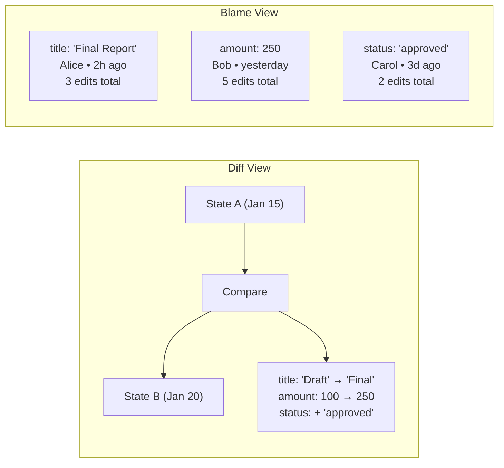

# 08: Diff & Blame

> Side-by-side property diffs and per-property attribution history.

**Dependencies:** Step 01 (HistoryEngine), Step 03 (AuditIndex)

## Overview

Diff shows what changed between any two points in time. Blame shows who last edited each property and the full history of changes for each field.



## Implementation

### 1. Diff Engine

```typescript
// packages/history/src/diff.ts

export interface PropertyDiff {
  property: string
  before: unknown
  after: unknown
  type: 'added' | 'modified' | 'removed'
  changedBy: DID
  changedAt: number
}

export interface DiffResult {
  nodeId: NodeId
  from: HistoryTarget
  to: HistoryTarget
  diffs: PropertyDiff[]
  summary: {
    added: number
    modified: number
    removed: number
  }
}

export class DiffEngine {
  constructor(private engine: HistoryEngine) {}

  /** Compare a node between two points in time */
  async diffNode(nodeId: NodeId, from: HistoryTarget, to: HistoryTarget): Promise<DiffResult> {
    const [stateFrom, stateTo] = await Promise.all([
      this.engine.materializeAt(nodeId, from),
      this.engine.materializeAt(nodeId, to)
    ])

    const diffs: PropertyDiff[] = []
    const allKeys = new Set([
      ...Object.keys(stateFrom.node.properties),
      ...Object.keys(stateTo.node.properties)
    ])

    for (const key of allKeys) {
      const before = stateFrom.node.properties[key]
      const after = stateTo.node.properties[key]

      if (before === undefined && after !== undefined) {
        diffs.push({
          property: key,
          before: undefined,
          after,
          type: 'added',
          changedBy: stateTo.node.timestamps?.[key]?.lamport?.author ?? stateTo.author,
          changedAt: stateTo.node.timestamps?.[key]?.wallTime ?? stateTo.timestamp
        })
      } else if (before !== undefined && after === undefined) {
        diffs.push({
          property: key,
          before,
          after: undefined,
          type: 'removed',
          changedBy: stateTo.author,
          changedAt: stateTo.timestamp
        })
      } else if (!deepEqual(before, after)) {
        diffs.push({
          property: key,
          before,
          after,
          type: 'modified',
          changedBy: stateTo.node.timestamps?.[key]?.lamport?.author ?? stateTo.author,
          changedAt: stateTo.node.timestamps?.[key]?.wallTime ?? stateTo.timestamp
        })
      }
    }

    return {
      nodeId,
      from,
      to,
      diffs,
      summary: {
        added: diffs.filter((d) => d.type === 'added').length,
        modified: diffs.filter((d) => d.type === 'modified').length,
        removed: diffs.filter((d) => d.type === 'removed').length
      }
    }
  }

  /** Compare a node between current state and N changes ago */
  async diffFromCurrent(nodeId: NodeId, changesAgo: number): Promise<DiffResult> {
    return this.diffNode(nodeId, { type: 'relative', offset: -changesAgo }, { type: 'latest' })
  }

  /** Compare between two wall clock timestamps */
  async diffByTime(nodeId: NodeId, fromTime: number, toTime: number): Promise<DiffResult> {
    return this.diffNode(
      nodeId,
      { type: 'wall', timestamp: fromTime },
      { type: 'wall', timestamp: toTime }
    )
  }
}
```

### 2. Blame Engine

```typescript
// packages/history/src/blame.ts

export interface BlameInfo {
  property: string
  currentValue: unknown
  lastChangedBy: DID
  lastChangedAt: number
  totalEdits: number
  history: PropertyHistoryEntry[]
}

export interface PropertyHistoryEntry {
  value: unknown
  author: DID
  wallTime: number
  lamport: LamportTimestamp
  changeHash: ContentId
  changeIndex: number
}

export class BlameEngine {
  constructor(private storage: NodeStorageAdapter) {}

  /** Get blame info for all properties of a node */
  async getBlame(nodeId: NodeId): Promise<BlameInfo[]> {
    const changes = await this.storage.getChanges(nodeId)
    const sorted = topologicalSort(changes)

    const blame = new Map<string, BlameInfo>()

    for (let i = 0; i < sorted.length; i++) {
      const change = sorted[i]
      for (const [prop, value] of Object.entries(change.payload.properties ?? {})) {
        if (!blame.has(prop)) {
          blame.set(prop, {
            property: prop,
            currentValue: value,
            lastChangedBy: change.authorDID,
            lastChangedAt: change.wallTime,
            totalEdits: 0,
            history: []
          })
        }

        const info = blame.get(prop)!
        info.currentValue = value
        info.lastChangedBy = change.authorDID
        info.lastChangedAt = change.wallTime
        info.totalEdits++
        info.history.push({
          value,
          author: change.authorDID,
          wallTime: change.wallTime,
          lamport: change.lamport,
          changeHash: change.hash,
          changeIndex: i
        })
      }
    }

    return [...blame.values()]
  }

  /** Get blame for a specific property */
  async getPropertyBlame(nodeId: NodeId, property: string): Promise<BlameInfo | null> {
    const all = await this.getBlame(nodeId)
    return all.find((b) => b.property === property) ?? null
  }

  /** Get "what changed since" summary */
  async getChangesSince(
    nodeId: NodeId,
    since: number
  ): Promise<{
    properties: string[]
    authors: DID[]
    changeCount: number
  }> {
    const changes = await this.storage.getChanges(nodeId)
    const recent = changes.filter((c) => c.wallTime > since)
    return {
      properties: [...new Set(recent.flatMap((c) => Object.keys(c.payload.properties ?? {})))],
      authors: [...new Set(recent.map((c) => c.authorDID))],
      changeCount: recent.length
    }
  }
}
```

### 3. DiffView Component

```typescript
// packages/ui/src/composed/DiffView.tsx

export interface DiffViewProps {
  nodeId: NodeId
  from: HistoryTarget
  to: HistoryTarget
  schema?: DefinedSchema             // for property display names
}

export function DiffView({ nodeId, from, to, schema }: DiffViewProps) {
  const [diff, setDiff] = useState<DiffResult | null>(null)
  const diffEngine = useMemo(() => new DiffEngine(historyEngine), [])

  useEffect(() => {
    diffEngine.diffNode(nodeId, from, to).then(setDiff)
  }, [nodeId, from, to])

  if (!diff) return <Loading />

  return (
    <div className="diff-view">
      <div className="diff-summary">
        {diff.summary.added > 0 && <span className="diff-added">+{diff.summary.added} added</span>}
        {diff.summary.modified > 0 && <span className="diff-modified">~{diff.summary.modified} modified</span>}
        {diff.summary.removed > 0 && <span className="diff-removed">-{diff.summary.removed} removed</span>}
      </div>

      <table className="diff-table">
        <thead>
          <tr>
            <th>Property</th>
            <th>Before</th>
            <th>After</th>
            <th>Changed By</th>
          </tr>
        </thead>
        <tbody>
          {diff.diffs.map(d => (
            <tr key={d.property} className={`diff-row diff-${d.type}`}>
              <td className="diff-prop">{getPropertyLabel(d.property, schema)}</td>
              <td className="diff-before">{formatValue(d.before)}</td>
              <td className="diff-after">{formatValue(d.after)}</td>
              <td className="diff-author">{formatDID(d.changedBy)} • {formatRelative(d.changedAt)}</td>
            </tr>
          ))}
        </tbody>
      </table>
    </div>
  )
}
```

### 4. BlameView Component

```typescript
// packages/ui/src/composed/BlameView.tsx

export interface BlameViewProps {
  nodeId: NodeId
  schema?: DefinedSchema
}

export function BlameView({ nodeId, schema }: BlameViewProps) {
  const [blame, setBlame] = useState<BlameInfo[]>([])
  const [expanded, setExpanded] = useState<string | null>(null)
  const blameEngine = useMemo(() => new BlameEngine(storage), [])

  useEffect(() => {
    blameEngine.getBlame(nodeId).then(setBlame)
  }, [nodeId])

  return (
    <div className="blame-view">
      {blame.map(info => (
        <div key={info.property} className="blame-item">
          <div
            className="blame-item-header"
            onClick={() => setExpanded(expanded === info.property ? null : info.property)}
          >
            <span className="blame-prop">{getPropertyLabel(info.property, schema)}</span>
            <span className="blame-value">{formatValue(info.currentValue)}</span>
            <span className="blame-author">{formatDID(info.lastChangedBy)}</span>
            <span className="blame-time">{formatRelative(info.lastChangedAt)}</span>
            <span className="blame-count">{info.totalEdits} edits</span>
          </div>

          {expanded === info.property && (
            <div className="blame-history">
              {info.history.map((entry, i) => (
                <div key={i} className="blame-history-entry">
                  <span className="blame-history-value">{formatValue(entry.value)}</span>
                  <span className="blame-history-author">{formatDID(entry.author)}</span>
                  <span className="blame-history-time">{formatDate(entry.wallTime)}</span>
                </div>
              )).reverse()}
            </div>
          )}
        </div>
      ))}
    </div>
  )
}
```

### 5. React Hooks

```typescript
export function useDiff(nodeId: NodeId, from: HistoryTarget, to: HistoryTarget) {
  const [diff, setDiff] = useState<DiffResult | null>(null)
  const diffEngine = useDiffEngine()

  useEffect(() => {
    diffEngine.diffNode(nodeId, from, to).then(setDiff)
  }, [nodeId, JSON.stringify(from), JSON.stringify(to)])

  return diff
}

export function useBlame(nodeId: NodeId) {
  const [blame, setBlame] = useState<BlameInfo[]>([])
  const blameEngine = useBlameEngine()

  useEffect(() => {
    blameEngine.getBlame(nodeId).then(setBlame)
  }, [nodeId])

  return blame
}

export function useChangesBadge(nodeId: NodeId, since: number) {
  const [info, setInfo] = useState<{
    properties: string[]
    authors: DID[]
    changeCount: number
  } | null>(null)
  const blameEngine = useBlameEngine()

  useEffect(() => {
    blameEngine.getChangesSince(nodeId, since).then(setInfo)
  }, [nodeId, since])

  return info
}
```

## Checklist

- [ ] Implement `DiffEngine` with property-level diffing
- [ ] Implement `BlameEngine` with per-property attribution history
- [ ] Build `DiffView` component (side-by-side table)
- [ ] Build `BlameView` component (expandable property history)
- [ ] Create `useDiff`, `useBlame`, `useChangesBadge` hooks
- [ ] Style diff types (added=green, modified=yellow, removed=red)
- [ ] Handle complex values in diffs (objects, arrays)
- [ ] Add "Changes since last visit" badge using `useChangesBadge`
- [ ] Integrate blame into node detail / property panels
- [ ] Write tests for diff accuracy and blame ordering

---

[Back to README](./README.md) | [Previous: Database Time Machine](./07-database-time-machine.md) | [Next: Verification & Pruning](./09-verification-pruning.md)
