# 09: Verification & Pruning

> Cryptographic chain verification, signature validation, and optional change log pruning for storage recovery.

**Dependencies:** Step 01 (HistoryEngine), Step 02 (SnapshotCache), `@xnet/sync` (chain utilities, verifyChange, verifyChangeHash), `@xnet/crypto` (verify, hash)

## Overview

Every change in xNet is content-addressed (BLAKE3), signed (Ed25519), and linked in a hash chain (parentHash). This step adds infrastructure to verify the entire history of any node is intact and authentic, plus optional pruning to reclaim storage by removing old changes behind verified snapshots.

```mermaid
flowchart TD
    subgraph "Verification Pipeline"
        V1["1. Hash Integrity<br/>Recompute & compare each change hash"]
        V2["2. Signature Validation<br/>Ed25519 verify against author DID"]
        V3["3. Chain Continuity<br/>Every parentHash exists in the set"]
        V4["4. Clock Monotonicity<br/>Lamport times increase along chain"]
        V5["5. Fork Analysis<br/>Detect concurrent branches"]
    end
    V1 --> V2 --> V3 --> V4 --> V5

    subgraph "Pruning Pipeline"
        P1["1. Find verified snapshots"]
        P2["2. Identify prunable changes<br/>(behind snapshot, synced to all peers)"]
        P3["3. Delete changes from IndexedDB"]
        P4["4. Update chain roots<br/>(snapshot becomes virtual root)"]
    end
    P1 --> P2 --> P3 --> P4
```



## Implementation

### 1. Verification Engine

```typescript
// packages/history/src/verification.ts

import { verifyChangeHash, verifyChange, computeChangeHash } from '@xnet/sync'
import { verify as ed25519Verify } from '@xnet/crypto'
import { topologicalSort, getChainHeads, getChainRoots } from '@xnet/sync'
import type { NodeChange, NodeId, ContentId, DID } from '@xnet/data'

export type VerificationErrorType =
  | 'tampered-hash' // Hash doesn't match recomputed value
  | 'invalid-signature' // Ed25519 signature fails verification
  | 'broken-chain' // parentHash references missing change
  | 'clock-anomaly' // Lamport time doesn't increase from parent
  | 'orphan-change' // Change not reachable from any head/root

export interface VerificationError {
  changeHash: ContentId
  changeIndex: number
  type: VerificationErrorType
  details: string
  authorDID: DID
  wallTime: number
}

export interface VerificationStats {
  totalChanges: number
  verifiedHashes: number
  verifiedSignatures: number
  validChainLinks: number
  authors: DID[]
  timespan: [number, number] // [firstWallTime, lastWallTime]
  forks: number
  heads: number
  roots: number
}

export interface VerificationResult {
  valid: boolean
  errors: VerificationError[]
  stats: VerificationStats
  duration: number // ms
}

export interface VerificationOptions {
  /** Skip signature verification (faster, only checks hashes + chain) */
  skipSignatures?: boolean
  /** Resolve DID to public key. Required if skipSignatures is false */
  resolvePublicKey?: (did: DID) => Promise<Uint8Array | null>
  /** Abort signal for long-running verification */
  signal?: AbortSignal
  /** Progress callback (0-1) */
  onProgress?: (progress: number) => void
}

export class VerificationEngine {
  constructor(private storage: NodeStorageAdapter) {}

  /** Verify the full history of a single node */
  async verifyNodeHistory(
    nodeId: NodeId,
    options: VerificationOptions = {}
  ): Promise<VerificationResult> {
    const start = performance.now()
    const changes = await this.storage.getChanges(nodeId)
    const sorted = topologicalSort(changes)
    const errors: VerificationError[] = []

    // Build lookup for fast parent resolution
    const hashMap = new Map<ContentId, NodeChange>()
    for (const change of changes) {
      hashMap.set(change.hash, change)
    }

    let verifiedHashes = 0
    let verifiedSignatures = 0
    let validChainLinks = 0

    for (let i = 0; i < sorted.length; i++) {
      if (options.signal?.aborted) {
        throw new DOMException('Verification aborted', 'AbortError')
      }

      const change = sorted[i]
      options.onProgress?.(i / sorted.length)

      // 1. Verify hash integrity (recompute from payload)
      const hashValid = verifyChangeHash(change)
      if (hashValid) {
        verifiedHashes++
      } else {
        errors.push({
          changeHash: change.hash,
          changeIndex: i,
          type: 'tampered-hash',
          details: `Hash mismatch: content has been modified`,
          authorDID: change.authorDID,
          wallTime: change.wallTime
        })
      }

      // 2. Verify signature (Ed25519 against author's public key)
      if (!options.skipSignatures) {
        const publicKey = await options.resolvePublicKey?.(change.authorDID)
        if (publicKey) {
          const sigValid = verifyChange(change, publicKey)
          if (sigValid) {
            verifiedSignatures++
          } else {
            errors.push({
              changeHash: change.hash,
              changeIndex: i,
              type: 'invalid-signature',
              details: `Signature does not match author ${change.authorDID}`,
              authorDID: change.authorDID,
              wallTime: change.wallTime
            })
          }
        } else {
          errors.push({
            changeHash: change.hash,
            changeIndex: i,
            type: 'invalid-signature',
            details: `Cannot resolve public key for ${change.authorDID}`,
            authorDID: change.authorDID,
            wallTime: change.wallTime
          })
        }
      }

      // 3. Verify chain continuity (parentHash exists)
      if (change.parentHash !== null) {
        if (hashMap.has(change.parentHash)) {
          validChainLinks++
        } else {
          errors.push({
            changeHash: change.hash,
            changeIndex: i,
            type: 'broken-chain',
            details: `Parent ${change.parentHash} not found in change set`,
            authorDID: change.authorDID,
            wallTime: change.wallTime
          })
        }
      }

      // 4. Verify clock monotonicity (Lamport time > parent's Lamport time)
      if (change.parentHash !== null) {
        const parent = hashMap.get(change.parentHash)
        if (parent && change.lamport.time <= parent.lamport.time) {
          errors.push({
            changeHash: change.hash,
            changeIndex: i,
            type: 'clock-anomaly',
            details: `Lamport ${change.lamport.time} <= parent's ${parent.lamport.time}`,
            authorDID: change.authorDID,
            wallTime: change.wallTime
          })
        }
      }
    }

    const heads = getChainHeads(changes)
    const roots = getChainRoots(changes)
    const authors = [...new Set(changes.map((c) => c.authorDID))]

    options.onProgress?.(1)

    return {
      valid: errors.length === 0,
      errors,
      stats: {
        totalChanges: changes.length,
        verifiedHashes,
        verifiedSignatures: options.skipSignatures ? 0 : verifiedSignatures,
        validChainLinks,
        authors,
        timespan: [sorted[0]?.wallTime ?? 0, sorted[sorted.length - 1]?.wallTime ?? 0],
        forks: heads.length > 1 ? heads.length - 1 : 0,
        heads: heads.length,
        roots: roots.length
      },
      duration: performance.now() - start
    }
  }

  /** Batch verify all nodes (e.g., for integrity audit) */
  async verifyAll(
    options: VerificationOptions & {
      onNodeComplete?: (nodeId: NodeId, result: VerificationResult) => void
    } = {}
  ): Promise<Map<NodeId, VerificationResult>> {
    const allChanges = await this.storage.getAllChanges()
    const byNode = new Map<NodeId, NodeChange[]>()

    for (const change of allChanges) {
      const nodeId = change.payload.nodeId
      if (!byNode.has(nodeId)) byNode.set(nodeId, [])
      byNode.get(nodeId)!.push(change)
    }

    const results = new Map<NodeId, VerificationResult>()
    const nodeIds = [...byNode.keys()]

    for (let i = 0; i < nodeIds.length; i++) {
      if (options.signal?.aborted) break
      const nodeId = nodeIds[i]
      const result = await this.verifyNodeHistory(nodeId, {
        ...options,
        onProgress: undefined // suppress per-node progress for batch
      })
      results.set(nodeId, result)
      options.onNodeComplete?.(nodeId, result)
      options.onProgress?.((i + 1) / nodeIds.length)
    }

    return results
  }

  /** Quick integrity check: only hashes + chain, no signatures */
  async quickCheck(nodeId: NodeId): Promise<{ valid: boolean; errors: number }> {
    const result = await this.verifyNodeHistory(nodeId, { skipSignatures: true })
    return { valid: result.valid, errors: result.errors.length }
  }
}
```

### 2. Pruning Engine

```typescript
// packages/history/src/pruning.ts

import type { NodeChange, NodeId, ContentId } from '@xnet/data'
import type { SnapshotCache, Snapshot } from './snapshot-cache'
import type { VerificationEngine } from './verification'
import { topologicalSort } from '@xnet/sync'

export interface PruningPolicy {
  /** Minimum number of recent changes to always keep */
  keepRecentChanges: number // default: 200
  /** Minimum age (ms) before a change is prunable */
  minAge: number // default: 30 days
  /** Only prune if total changes exceed this threshold */
  pruneThreshold: number // default: 500
  /** Require verified snapshot before pruning behind it */
  requireVerifiedSnapshot: boolean // default: true
  /** Never prune nodes matching these schemas */
  protectedSchemas?: SchemaIRI[] // compliance-exempt schemas
  /** Storage budget (bytes) - prune most aggressively when exceeded */
  storageBudget?: number
}

export const DEFAULT_POLICY: PruningPolicy = {
  keepRecentChanges: 200,
  minAge: 30 * 24 * 60 * 60 * 1000, // 30 days
  pruneThreshold: 500,
  requireVerifiedSnapshot: true
}

export const MOBILE_POLICY: PruningPolicy = {
  keepRecentChanges: 50,
  minAge: 7 * 24 * 60 * 60 * 1000, // 7 days
  pruneThreshold: 100,
  requireVerifiedSnapshot: true,
  storageBudget: 50 * 1024 * 1024 // 50 MB
}

export interface PruneCandidate {
  nodeId: NodeId
  totalChanges: number
  prunableChanges: number
  snapshotHash: ContentId // snapshot we're pruning behind
  snapshotIndex: number // change index of the snapshot
  estimatedRecovery: number // bytes (approximate)
}

export interface PruneResult {
  nodeId: NodeId
  deletedChanges: number
  recoveredBytes: number // approximate
  newRootSnapshot: ContentId
  duration: number
}

export interface PruneOptions {
  /** Dry run - report what would be pruned without deleting */
  dryRun?: boolean
  /** Check that all peers have synced before pruning */
  checkSyncState?: (nodeId: NodeId) => Promise<boolean>
  /** Abort signal */
  signal?: AbortSignal
  /** Progress callback */
  onProgress?: (progress: number) => void
}

export class PruningEngine {
  constructor(
    private storage: NodeStorageAdapter,
    private snapshotCache: SnapshotCache,
    private verification: VerificationEngine,
    private policy: PruningPolicy = DEFAULT_POLICY
  ) {}

  /** Identify which nodes have prunable changes */
  async findCandidates(): Promise<PruneCandidate[]> {
    const allChanges = await this.storage.getAllChanges()
    const byNode = new Map<NodeId, NodeChange[]>()

    for (const change of allChanges) {
      const nodeId = change.payload.nodeId
      if (!byNode.has(nodeId)) byNode.set(nodeId, [])
      byNode.get(nodeId)!.push(change)
    }

    const candidates: PruneCandidate[] = []
    const now = Date.now()

    for (const [nodeId, changes] of byNode) {
      // Skip if below threshold
      if (changes.length < this.policy.pruneThreshold) continue

      // Skip protected schemas
      const schemaId = changes.find((c) => c.payload.schemaId)?.payload.schemaId
      if (schemaId && this.policy.protectedSchemas?.includes(schemaId)) continue

      // Find the latest verified snapshot
      const snapshot = await this.snapshotCache.getLatestSnapshot(nodeId)
      if (!snapshot) continue

      const sorted = topologicalSort(changes)
      const snapshotIdx = sorted.findIndex((c) => c.hash === snapshot.atChangeHash)
      if (snapshotIdx < 0) continue

      // Calculate prunable: behind snapshot, old enough, keeping N recent
      const keepFrom = Math.max(snapshotIdx, sorted.length - this.policy.keepRecentChanges)
      const prunableEnd = Math.min(snapshotIdx, keepFrom)
      const prunable = sorted
        .slice(0, prunableEnd)
        .filter((c) => now - c.wallTime > this.policy.minAge)

      if (prunable.length === 0) continue

      candidates.push({
        nodeId,
        totalChanges: changes.length,
        prunableChanges: prunable.length,
        snapshotHash: snapshot.atChangeHash,
        snapshotIndex: snapshotIdx,
        estimatedRecovery: prunable.length * 512 // ~512 bytes avg per change
      })
    }

    return candidates.sort((a, b) => b.prunableChanges - a.prunableChanges)
  }

  /** Prune changes for a specific node */
  async pruneNode(nodeId: NodeId, options: PruneOptions = {}): Promise<PruneResult> {
    const start = performance.now()
    const changes = await this.storage.getChanges(nodeId)
    const sorted = topologicalSort(changes)

    // 1. Safety: check sync state
    if (options.checkSyncState) {
      const synced = await options.checkSyncState(nodeId)
      if (!synced) {
        throw new Error(`Cannot prune ${nodeId}: unsynced peers exist`)
      }
    }

    // 2. Find the snapshot to prune behind
    const snapshot = await this.snapshotCache.getLatestSnapshot(nodeId)
    if (!snapshot) {
      throw new Error(`Cannot prune ${nodeId}: no snapshot exists`)
    }

    // 3. Verify snapshot integrity if required
    if (this.policy.requireVerifiedSnapshot) {
      const verification = await this.verification.quickCheck(nodeId)
      if (!verification.valid) {
        throw new Error(
          `Cannot prune ${nodeId}: chain verification failed (${verification.errors} errors)`
        )
      }
    }

    // 4. Determine which changes to delete
    const snapshotIdx = sorted.findIndex((c) => c.hash === snapshot.atChangeHash)
    if (snapshotIdx < 0) {
      throw new Error(`Cannot prune ${nodeId}: snapshot change not found in log`)
    }

    const now = Date.now()
    const keepFrom = Math.max(snapshotIdx, sorted.length - this.policy.keepRecentChanges)
    const prunableEnd = Math.min(snapshotIdx, keepFrom)
    const toDelete = sorted
      .slice(0, prunableEnd)
      .filter((c) => now - c.wallTime > this.policy.minAge)

    if (options.dryRun) {
      return {
        nodeId,
        deletedChanges: toDelete.length,
        recoveredBytes: toDelete.length * 512,
        newRootSnapshot: snapshot.atChangeHash,
        duration: performance.now() - start
      }
    }

    // 5. Delete changes from storage
    let deleted = 0
    for (let i = 0; i < toDelete.length; i++) {
      if (options.signal?.aborted) break
      await this.storage.deleteChange(toDelete[i].hash)
      deleted++
      options.onProgress?.(i / toDelete.length)
    }

    options.onProgress?.(1)

    return {
      nodeId,
      deletedChanges: deleted,
      recoveredBytes: deleted * 512,
      newRootSnapshot: snapshot.atChangeHash,
      duration: performance.now() - start
    }
  }

  /** Run pruning across all eligible nodes */
  async pruneAll(options: PruneOptions = {}): Promise<PruneResult[]> {
    const candidates = await this.findCandidates()
    const results: PruneResult[] = []

    for (let i = 0; i < candidates.length; i++) {
      if (options.signal?.aborted) break
      const candidate = candidates[i]
      try {
        const result = await this.pruneNode(candidate.nodeId, {
          ...options,
          onProgress: undefined
        })
        results.push(result)
      } catch (err) {
        // Skip nodes that can't be pruned (unsynced, etc.)
        console.warn(`Skipping prune for ${candidate.nodeId}:`, err)
      }
      options.onProgress?.((i + 1) / candidates.length)
    }

    return results
  }

  /** Get storage metrics for a node */
  async getStorageMetrics(nodeId: NodeId): Promise<{
    totalChanges: number
    prunableChanges: number
    estimatedSize: number
    oldestChange: number
    newestChange: number
    hasSnapshot: boolean
  }> {
    const changes = await this.storage.getChanges(nodeId)
    const snapshot = await this.snapshotCache.getLatestSnapshot(nodeId)

    const sorted = changes.sort((a, b) => a.wallTime - b.wallTime)

    let prunableChanges = 0
    if (snapshot) {
      const snapshotIdx = sorted.findIndex((c) => c.hash === snapshot.atChangeHash)
      if (snapshotIdx > 0) {
        const now = Date.now()
        prunableChanges = sorted
          .slice(0, snapshotIdx)
          .filter((c) => now - c.wallTime > this.policy.minAge).length
      }
    }

    return {
      totalChanges: changes.length,
      prunableChanges,
      estimatedSize: changes.length * 512,
      oldestChange: sorted[0]?.wallTime ?? 0,
      newestChange: sorted[sorted.length - 1]?.wallTime ?? 0,
      hasSnapshot: !!snapshot
    }
  }
}
```

### 3. Storage Adapter Extension

The `NodeStorageAdapter` needs a new method for pruning:

```typescript
// packages/data/src/store/types.ts — additions

interface NodeStorageAdapter {
  // ... existing methods ...

  /** Delete a single change by hash (for pruning) */
  deleteChange(hash: ContentId): Promise<void>

  /** Delete multiple changes by hash (batch pruning) */
  deleteChanges?(hashes: ContentId[]): Promise<number>
}
```

### 4. IndexedDB Adapter Extension

```typescript
// packages/data/src/store/indexeddb-adapter.ts — additions

async deleteChange(hash: ContentId): Promise<void> {
  const tx = this.db.transaction('changes', 'readwrite')
  await tx.objectStore('changes').delete(hash)
  await tx.done
}

async deleteChanges(hashes: ContentId[]): Promise<number> {
  const tx = this.db.transaction('changes', 'readwrite')
  const store = tx.objectStore('changes')
  let deleted = 0
  for (const hash of hashes) {
    try {
      await store.delete(hash)
      deleted++
    } catch {
      // Skip changes that don't exist
    }
  }
  await tx.done
  return deleted
}
```

### 5. DID-to-PublicKey Resolution

Verification needs to resolve `did:key:` DIDs to raw Ed25519 public keys:

```typescript
// packages/history/src/did-resolver.ts

import { base64urlToBytes } from '@xnet/crypto'

/**
 * Extract Ed25519 public key from a did:key identifier.
 * did:key:z6Mk... uses the multicodec-prefixed base58btc encoding.
 */
export function publicKeyFromDID(did: DID): Uint8Array | null {
  if (!did.startsWith('did:key:z6Mk')) return null

  // z6Mk prefix = base58btc + Ed25519 multicodec (0xed01)
  const multibaseValue = did.slice('did:key:'.length)
  const decoded = base58btcDecode(multibaseValue.slice(1)) // remove 'z' prefix
  // Skip 2-byte multicodec prefix (0xed, 0x01)
  return decoded.slice(2)
}

/** Default resolver: extracts key from did:key, caches results */
export function createDIDResolver(): (did: DID) => Promise<Uint8Array | null> {
  const cache = new Map<DID, Uint8Array | null>()

  return async (did: DID) => {
    if (cache.has(did)) return cache.get(did)!
    const key = publicKeyFromDID(did)
    cache.set(did, key)
    return key
  }
}
```

### 6. React Hooks

```typescript
// packages/react/src/hooks/useVerification.ts

export function useVerification(
  nodeId: NodeId,
  options?: {
    autoRun?: boolean
    skipSignatures?: boolean
  }
) {
  const [result, setResult] = useState<VerificationResult | null>(null)
  const [running, setRunning] = useState(false)
  const [progress, setProgress] = useState(0)
  const abortRef = useRef<AbortController | null>(null)

  const verify = useCallback(async () => {
    abortRef.current?.abort()
    const controller = new AbortController()
    abortRef.current = controller

    setRunning(true)
    setProgress(0)

    try {
      const engine = getVerificationEngine()
      const res = await engine.verifyNodeHistory(nodeId, {
        skipSignatures: options?.skipSignatures,
        resolvePublicKey: createDIDResolver(),
        signal: controller.signal,
        onProgress: setProgress
      })
      setResult(res)
    } finally {
      setRunning(false)
    }
  }, [nodeId, options?.skipSignatures])

  useEffect(() => {
    if (options?.autoRun) verify()
    return () => abortRef.current?.abort()
  }, [nodeId])

  return { result, running, progress, verify }
}

export function useStorageMetrics(nodeId: NodeId) {
  const [metrics, setMetrics] = useState<StorageMetrics | null>(null)

  useEffect(() => {
    const engine = getPruningEngine()
    engine.getStorageMetrics(nodeId).then(setMetrics)
  }, [nodeId])

  return metrics
}
```

### 7. Verification UI Component

```typescript
// packages/ui/src/composed/VerificationBadge.tsx

export interface VerificationBadgeProps {
  nodeId: NodeId
  compact?: boolean  // just icon + status
}

export function VerificationBadge({ nodeId, compact }: VerificationBadgeProps) {
  const { result, running, progress, verify } = useVerification(nodeId)

  if (running) {
    return (
      <div className="verification-badge running">
        <Spinner size="sm" />
        {!compact && <span>Verifying... {Math.round(progress * 100)}%</span>}
      </div>
    )
  }

  if (!result) {
    return (
      <button className="verification-badge idle" onClick={verify}>
        <ShieldIcon />
        {!compact && <span>Verify integrity</span>}
      </button>
    )
  }

  return (
    <div className={`verification-badge ${result.valid ? 'valid' : 'invalid'}`}>
      {result.valid ? <ShieldCheckIcon /> : <ShieldAlertIcon />}
      {!compact && (
        <div className="verification-details">
          <span>{result.stats.totalChanges} changes verified</span>
          <span>{result.stats.authors.length} authors</span>
          {result.errors.length > 0 && (
            <span className="verification-errors">
              {result.errors.length} errors
            </span>
          )}
          <span className="verification-time">
            {result.duration.toFixed(0)}ms
          </span>
        </div>
      )}
    </div>
  )
}
```

### 8. Storage Management Panel

```typescript
// packages/ui/src/composed/StoragePanel.tsx

export function StoragePanel({ nodeId }: { nodeId: NodeId }) {
  const metrics = useStorageMetrics(nodeId)
  const [pruneResult, setPruneResult] = useState<PruneResult | null>(null)

  const handlePrune = async () => {
    const engine = getPruningEngine()
    // Always dry-run first
    const preview = await engine.pruneNode(nodeId, { dryRun: true })
    if (confirm(`Delete ${preview.deletedChanges} old changes (~${formatBytes(preview.recoveredBytes)})?`)) {
      const result = await engine.pruneNode(nodeId)
      setPruneResult(result)
    }
  }

  if (!metrics) return <Loading />

  return (
    <div className="storage-panel">
      <h4>Storage</h4>
      <dl>
        <dt>Total changes</dt>
        <dd>{metrics.totalChanges}</dd>
        <dt>Estimated size</dt>
        <dd>{formatBytes(metrics.estimatedSize)}</dd>
        <dt>Prunable changes</dt>
        <dd>{metrics.prunableChanges}</dd>
        <dt>History span</dt>
        <dd>{formatDate(metrics.oldestChange)} — {formatDate(metrics.newestChange)}</dd>
        <dt>Snapshot</dt>
        <dd>{metrics.hasSnapshot ? 'Yes' : 'No'}</dd>
      </dl>

      {metrics.prunableChanges > 0 && (
        <button onClick={handlePrune} className="prune-button">
          Reclaim ~{formatBytes(metrics.prunableChanges * 512)}
        </button>
      )}

      {pruneResult && (
        <div className="prune-result">
          Deleted {pruneResult.deletedChanges} changes,
          recovered ~{formatBytes(pruneResult.recoveredBytes)}
          in {pruneResult.duration.toFixed(0)}ms
        </div>
      )}
    </div>
  )
}
```

## Safety Rules

| Rule                                  | Rationale                                         |
| ------------------------------------- | ------------------------------------------------- |
| Never prune with unsynced peers       | Peers may need those changes for sync             |
| Only prune behind a verified snapshot | Ensures state can still be reconstructed          |
| Keep at least N recent changes        | Undo, blame, and diffs need recent history        |
| Require min age before pruning        | Prevents premature deletion during active editing |
| Protected schemas skip pruning        | Compliance/audit nodes keep full history          |
| Verify before prune                   | Don't delete changes if chain is already broken   |
| Dry-run first in UI                   | User sees what will be deleted before confirming  |

## Platform-Specific Policies

| Platform | keepRecent | minAge  | threshold | Budget      |
| -------- | ---------- | ------- | --------- | ----------- |
| Desktop  | 200        | 30 days | 500       | None        |
| Web/PWA  | 200        | 30 days | 500       | None        |
| Mobile   | 50         | 7 days  | 100       | 50 MB total |

Mobile uses aggressive pruning because IndexedDB storage is limited on iOS Safari. Desktop can keep everything unless the user explicitly requests cleanup.

## Testing Strategy

```typescript
describe('VerificationEngine', () => {
  it('passes for a valid chain of signed changes')
  it('detects tampered hash (modified payload after signing)')
  it('detects invalid signature (wrong key)')
  it('detects broken chain (missing parent)')
  it('detects clock anomaly (non-monotonic Lamport)')
  it('handles forked chains (reports fork count, still valid)')
  it('supports abort signal for long-running verification')
  it('reports progress callback accurately')
  it('quickCheck skips signatures and runs faster')
  it('verifyAll processes multiple nodes')
})

describe('PruningEngine', () => {
  it('identifies candidates above threshold with snapshots')
  it('skips nodes below pruneThreshold')
  it('skips protected schemas')
  it('respects keepRecentChanges (never prunes recent)')
  it('respects minAge (never prunes young changes)')
  it('refuses to prune without snapshot')
  it('refuses to prune with unsynced peers')
  it('refuses to prune when verification fails')
  it('dryRun returns correct counts without deleting')
  it('actually deletes changes from storage')
  it('node can still be materialized after pruning (from snapshot)')
  it('getStorageMetrics returns accurate counts')
})
```

## Checklist

- [ ] Implement `VerificationEngine` with hash, signature, chain, and clock checks
- [ ] Implement `PruningEngine` with policy-based candidate selection
- [ ] Add `deleteChange` / `deleteChanges` to `NodeStorageAdapter`
- [ ] Implement `deleteChange` in IndexedDB adapter
- [ ] Create DID-to-public-key resolver for `did:key:` verification
- [ ] Build `useVerification` and `useStorageMetrics` React hooks
- [ ] Build `VerificationBadge` component (icon + status + details)
- [ ] Build `StoragePanel` component (metrics + prune button)
- [ ] Add platform-specific pruning policies (Desktop, Web, Mobile)
- [ ] Implement dry-run with user confirmation before actual deletion
- [ ] Verify reconstruction still works after pruning (snapshot-based)
- [ ] Write unit tests for verification (tamper, signature, chain, clock)
- [ ] Write unit tests for pruning (policy, safety, storage recovery)
- [ ] Integration test: full flow (create changes → snapshot → prune → materialize)

---

[Back to README](./README.md) | [Previous: Diff & Blame](./08-diff-blame.md)
