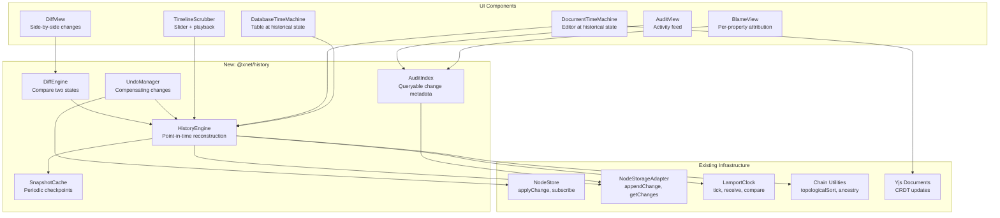

# xNet Implementation Plan - Step 03.7: History, Audit & Time Travel

> Expose the event-sourced change log to power Time Machine scrubbers, undo/redo, audit trails, diffs, and cryptographic verification — across documents, databases, and canvases.

## Executive Summary

xNet already stores a complete, cryptographically-signed, content-addressed change log for every node. Every mutation is an immutable `NodeChange` in a hash chain with Lamport timestamps and author DIDs. Currently this is only used for P2P sync. This plan exposes that infrastructure to users via a Time Machine UI (Apple Time Machine-style scrubber), undo/redo, audit logs, diffs, blame views, and integrity verification.

```typescript
// What already exists (the raw material):
const change: NodeChange = {
  hash: 'cid:blake3:...', // content-addressed
  parentHash: 'cid:blake3:...', // hash chain
  authorDID: 'did:key:z6Mk...', // attribution
  signature: Uint8Array, // Ed25519 proof
  lamport: { time: 42, author }, // causal ordering
  wallTime: 1706123456789, // display time
  payload: { nodeId, properties: { amount: 500 } }
}

// What this plan adds:
const state = await history.materializeAt(nodeId, { type: 'lamport', time: 42 })
const diff = await history.diff(nodeId, { type: 'index', index: 10 }, { type: 'index', index: 50 })
await history.revertTo(nodeId, { type: 'wall', timestamp: yesterday })
```

## Architecture Overview



## Architecture Decisions

| Decision              | Choice                                | Rationale                                                   |
| --------------------- | ------------------------------------- | ----------------------------------------------------------- |
| Undo mechanism        | Compensating changes                  | P2P safe — peers see the undo as a new change               |
| Materialization       | Incremental from snapshots            | Replay from nearest snapshot, not from scratch              |
| Snapshot interval     | Every 100 changes                     | Balances storage vs reconstruction speed                    |
| Scrubbing performance | Pre-computed cache at intervals of 10 | Enables 60fps seeking without full replay                   |
| Document history      | Yjs snapshots + incremental updates   | Native Yjs capability, consistent with CRDT model           |
| Audit storage         | Additional IndexedDB indexes          | No new stores needed, just new indexes on changes           |
| Pruning               | Optional, behind snapshots only       | Default: keep everything. Prune only under storage pressure |
| Timeline scope        | Per-node and per-schema               | Single node scrubber + database-wide merged timeline        |

## Implementation Phases

### Phase 1: Core Engine (Steps 01-03)

Build the reconstruction and indexing infrastructure.

| Task | Document                                       | Description                                            | Status |
| ---- | ---------------------------------------------- | ------------------------------------------------------ | ------ |
| 1.1  | [01-history-engine.md](./01-history-engine.md) | HistoryEngine: materializeAt, timeline, revert         | [ ]    |
| 1.2  | [02-snapshot-cache.md](./02-snapshot-cache.md) | SnapshotCache: periodic checkpoints, nearest lookup    | [ ]    |
| 1.3  | [03-audit-index.md](./03-audit-index.md)       | AuditIndex: storage indexes, queryable change metadata | [ ]    |

**Validation Gate:**

- [ ] Can reconstruct any node's state at any Lamport time
- [ ] Snapshots created every 100 changes, nearest-before lookup works
- [ ] Can query changes by author, time range, schema, operation
- [ ] Reconstruction from snapshot + 50 changes completes in < 5ms

### Phase 2: Undo/Redo (Step 04)

User-facing undo via compensating changes.

| Task | Document                             | Description                                                  | Status |
| ---- | ------------------------------------ | ------------------------------------------------------------ | ------ |
| 2.1  | [04-undo-redo.md](./04-undo-redo.md) | UndoManager: per-node stacks, batch undo, keyboard shortcuts | [ ]    |

**Validation Gate:**

- [ ] Ctrl+Z undoes last local change (creates compensating change)
- [ ] Ctrl+Shift+Z redoes
- [ ] Transaction/batch undo undoes all changes in a group
- [ ] Undo syncs to peers (they see the revert)

### Phase 3: Time Machine UI (Steps 05-07)

The scrubber UI and platform-specific Time Machine modes.

| Task | Document                                                     | Description                                                    | Status |
| ---- | ------------------------------------------------------------ | -------------------------------------------------------------- | ------ |
| 3.1  | [05-timeline-scrubber.md](./05-timeline-scrubber.md)         | TimelineScrubber component, PlaybackEngine, ScrubCache         | [ ]    |
| 3.2  | [06-document-time-machine.md](./06-document-time-machine.md) | Yjs snapshot integration, read-only editor at historical state | [ ]    |
| 3.3  | [07-database-time-machine.md](./07-database-time-machine.md) | Multi-node reconstruction, table/board at historical state     | [ ]    |

**Validation Gate:**

- [ ] Timeline scrubber shows change markers and author colors
- [ ] Scrubbing a document shows text appearing/disappearing in real time
- [ ] Scrubbing a database shows rows appearing and values changing
- [ ] Play/pause/speed controls work smoothly
- [ ] "Restore This State" button reverts to the scrubbed point

### Phase 4: Diff, Blame & Verification (Steps 08-09)

Advanced history features for power users and compliance.

| Task | Document                                                   | Description                                             | Status |
| ---- | ---------------------------------------------------------- | ------------------------------------------------------- | ------ |
| 4.1  | [08-diff-blame.md](./08-diff-blame.md)                     | DiffEngine, BlameView, per-property attribution history | [ ]    |
| 4.2  | [09-verification-pruning.md](./09-verification-pruning.md) | Chain verification, signature checks, optional pruning  | [ ]    |

**Validation Gate:**

- [ ] Diff view shows side-by-side property changes between two points
- [ ] Blame view shows who last edited each property with full history
- [ ] Verification confirms hash chain integrity and signature validity
- [ ] Pruning removes old changes behind snapshots without breaking reconstruction

## Package Structure (Target)

```
packages/
  history/                          # NEW: History/audit infrastructure
    src/
      engine.ts                     # HistoryEngine: materializeAt, timeline, revert
      snapshot-cache.ts             # SnapshotCache: periodic checkpoints
      audit-index.ts                # AuditIndex: queryable change metadata
      undo-manager.ts               # UndoManager: compensating changes
      diff.ts                       # DiffEngine: compare two states
      blame.ts                      # Blame: per-property attribution
      verification.ts               # Chain/signature verification
      pruning.ts                    # Optional change log pruning
      scrub-cache.ts                # ScrubCache: pre-computed states for smooth seeking
      types.ts                      # HistoryTarget, TimelineEntry, AuditQuery, etc.
      index.ts
    package.json

  data/                             # MODIFIED
    src/store/
      indexeddb-adapter.ts          # + new indexes (byAuthor, byWallTime, byBatch)
      types.ts                      # + EnhancedNodeStorageAdapter methods

  editor/                           # MODIFIED
    src/components/
      HistoricalDocumentView.tsx    # Read-only editor at historical state

  views/                            # MODIFIED
    src/
      timeline/
        TimelineScrubber.tsx        # Scrubber + playback controls
        DatabaseTimeMachine.tsx     # Table view with time travel

  ui/                               # MODIFIED
    src/composed/
      DiffView.tsx                  # Side-by-side property diffs
      BlameView.tsx                 # Per-property attribution
      AuditLog.tsx                  # Activity feed component
```

## Platform Considerations

| Feature               | Web/PWA   | Electron  | Mobile                      |
| --------------------- | --------- | --------- | --------------------------- |
| History Engine        | Full      | Full      | Full                        |
| Snapshot Cache        | IndexedDB | IndexedDB | Limited (fewer snapshots)   |
| Audit Index           | Full      | Full      | Last 30 days                |
| Undo/Redo             | Full      | Full      | Full                        |
| Timeline Scrubber     | Full      | Full      | Simplified (no playback)    |
| Document Time Machine | Full      | Full      | View-only (no scrubber)     |
| Database Time Machine | Full      | Full      | N/A (table view limited)    |
| Verification          | Full      | Full      | On-demand only              |
| Pruning               | Optional  | Optional  | Aggressive (storage limits) |

## Dependencies

| Package          | Purpose                                      | Used By             |
| ---------------- | -------------------------------------------- | ------------------- |
| (none new)       | Uses existing `@xnet/sync` chain utilities   | HistoryEngine       |
| (none new)       | Uses existing `@xnet/data` NodeStore/adapter | All                 |
| `yjs` (existing) | Document snapshot/reconstruction             | DocumentTimeMachine |

## Success Criteria

1. Reconstructing a 1000-change node at any point takes < 50ms (with snapshots)
2. Scrubbing is smooth at 60fps with pre-computed cache
3. Undo/Redo works across P2P sync (peers see the compensating change)
4. Audit queries by author+timeRange return in < 100ms for 10k changes
5. Document Time Machine shows text changes appearing/disappearing smoothly
6. Database Time Machine handles 100+ rows with < 200ms reconstruction
7. Verification catches any tampered changes in the hash chain
8. Pruning recovers storage without breaking any active features
9. Timeline shows author-colored segments and batch groupings
10. "Restore This State" creates a single clean revert change

## Reference Documents

- [Event Sourcing History Exploration](../explorations/0008_EVENT_SOURCING_HISTORY.md) - Full research with architecture details
- [Data Model Consolidation](../planStep02_1DataModelConsolidation/README.md) - NodeStore, Change<T>, LWW
- [Persistence Architecture](../explorations/0016_PERSISTENCE_ARCHITECTURE.md) - Storage durability tiers
- [Tradeoffs](../TRADEOFFS.md) - Why hybrid sync (Yjs + event sourcing)

---

[Back to docs/](../) | [Start Implementation](./01-history-engine.md)
