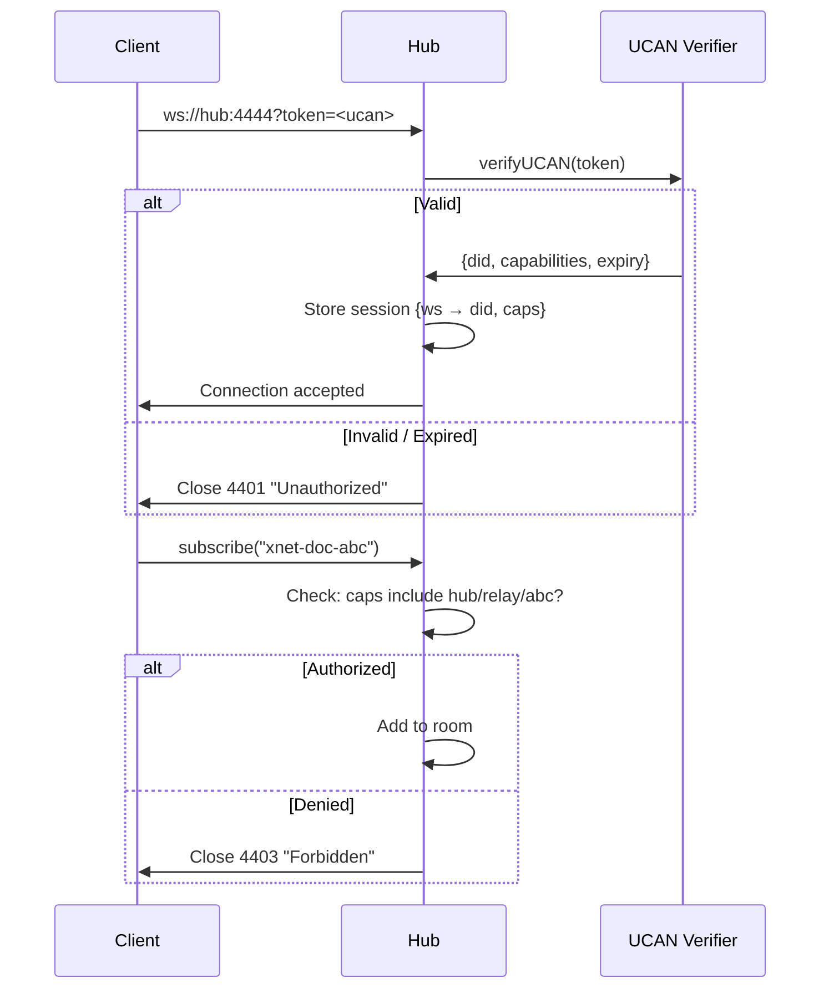

# 02: UCAN Authentication

> Stateless auth using existing DID/UCAN identity system

**Dependencies:** `01-package-scaffold.md`, `@xnet/identity` (UCAN verify)
**Modifies:** `packages/hub/src/server.ts`, new `packages/hub/src/auth/`

## Codebase Status (Feb 2026)

| Existing Asset         | Location                                  | Status                                                                                          |
| ---------------------- | ----------------------------------------- | ----------------------------------------------------------------------------------------------- |
| `createUCAN()`         | `packages/identity/src/ucan.ts` (163 LOC) | **Complete** — JWT-like format, EdDSA signing                                                   |
| `verifyUCAN()`         | `packages/identity/src/ucan.ts`           | **Complete** — signature + expiry check                                                         |
| `getCapabilities()`    | `packages/identity/src/ucan.ts`           | **Complete** — extracts capabilities array                                                      |
| `hasCapability()`      | `packages/identity/src/ucan.ts`           | **Complete** — single capability check                                                          |
| `generateKeyBundle()`  | `packages/identity/src/keys.ts`           | **Complete** — Ed25519 key generation                                                           |
| Network security layer | `packages/network/security/` (6 files)    | **Complete** but at libp2p level — PeerAccessControl, PeerScorer, AutoBlocker not wired into WS |

### Known UCAN Bugs (from Exploration 0040)

> **MUST FIX BEFORE IMPLEMENTING HUB AUTH:**
>
> 1. **Signature format wrong** — currently signs raw JSON payload instead of base64url-encoded payload. This means signatures may be fragile to serialization changes.
> 2. **No proof chain validation** — `verifyUCAN` checks the issuer's signature but does not validate the delegation chain (proof array).
> 3. **No attenuation checking** — a delegated UCAN can claim MORE capabilities than its parent, which violates UCAN spec.
> 4. **UCAN is never called at runtime** — the signaling server has zero authentication. The BSM connects with a bare WebSocket URL.
>
> The fixes for (1)-(3) should be done in `@xnet/identity` as a prerequisite to this step.

## Overview

The hub uses UCAN tokens for authentication. Clients send a UCAN as a query parameter on WebSocket connect. The hub verifies the signature, extracts capabilities, and enforces per-room access. Anonymous mode (for local dev) skips verification.



## Implementation

### 1. Hub Capabilities

```typescript
// packages/hub/src/auth/capabilities.ts

/**
 * Hub-specific UCAN capabilities.
 *
 * Resource format: "hub:<hubDID>/<resource-path>"
 * Action format: "hub/<action>"
 */

export type HubAction =
  | 'hub/connect' // Connect to the hub at all
  | 'hub/signal' // Use signaling (pub/sub rooms)
  | 'hub/relay' // Use sync relay (doc persistence)
  | 'hub/backup' // Upload/download backups
  | 'hub/query' // Run queries
  | 'hub/admin' // Server administration

/**
 * Check if a set of capabilities grants a specific action on a resource.
 *
 * Matching rules:
 * - Exact match: 'hub/relay' on 'doc-123' matches 'hub/relay' on 'doc-123'
 * - Wildcard resource: '*' matches any resource
 * - Prefix match: 'workspace-abc/*' matches 'workspace-abc/doc-123'
 */
export function hasHubCapability(
  capabilities: Array<{ with: string; can: string }>,
  action: HubAction,
  resource?: string
): boolean {
  for (const cap of capabilities) {
    // Check action matches
    if (cap.can !== action && cap.can !== '*') continue

    // If no resource required, action match is sufficient
    if (!resource) return true

    // Check resource matches
    if (cap.with === '*') return true
    if (cap.with === resource) return true

    // Prefix match (e.g., 'workspace-abc/*' matches 'workspace-abc/doc-123')
    if (cap.with.endsWith('/*')) {
      const prefix = cap.with.slice(0, -2)
      if (resource.startsWith(prefix)) return true
    }
  }
  return false
}
```

### 2. UCAN Verification Middleware

```typescript
// packages/hub/src/auth/ucan.ts

import { verifyUCAN, getCapabilities, type UCANToken } from '@xnet/identity'
import type { WebSocket } from 'ws'
import type { IncomingMessage } from 'http'
import type { HubConfig } from '../types'

export interface AuthSession {
  did: string
  capabilities: Array<{ with: string; can: string }>
  token: UCANToken
}

// Map WebSocket connections to their auth sessions
const sessions = new Map<WebSocket, AuthSession>()

/**
 * Authenticate a WebSocket connection via UCAN token.
 *
 * Token is passed as a query parameter: ws://host:port?token=<ucan-jwt>
 * In anonymous mode, all connections are allowed with full capabilities.
 */
export async function authenticateConnection(
  ws: WebSocket,
  req: IncomingMessage,
  config: HubConfig
): Promise<AuthSession | null> {
  // Anonymous mode: allow all
  if (!config.auth) {
    const session: AuthSession = {
      did: 'did:key:anonymous',
      capabilities: [{ with: '*', can: '*' }],
      token: {} as UCANToken
    }
    sessions.set(ws, session)
    return session
  }

  // Extract token from query string
  const url = new URL(req.url ?? '/', `http://${req.headers.host}`)
  const token = url.searchParams.get('token')

  if (!token) {
    ws.close(4401, 'Missing UCAN token')
    return null
  }

  try {
    // Verify signature and expiration
    const ucan = await verifyUCAN(token)

    const session: AuthSession = {
      did: ucan.iss,
      capabilities: getCapabilities(ucan),
      token: ucan
    }
    sessions.set(ws, session)
    return session
  } catch (err) {
    ws.close(4401, `Invalid UCAN: ${(err as Error).message}`)
    return null
  }
}

export function getSession(ws: WebSocket): AuthSession | null {
  return sessions.get(ws) ?? null
}

export function removeSession(ws: WebSocket): void {
  sessions.delete(ws)
}
```

### 3. Updated Server with Auth

```typescript
// packages/hub/src/server.ts (additions to ws connection handler)

// In the wss.on('connection') handler, add auth before processing messages:

wss.on('connection', async (ws: WebSocket, req: IncomingMessage) => {
  if (connectionCount >= config.maxConnections) {
    ws.close(4429, 'Too many connections')
    return
  }

  // Authenticate
  const session = await authenticateConnection(ws, req, config)
  if (!session) return // Connection closed by auth

  connectionCount++

  ws.on('message', (data: Buffer) => {
    if (data.length > config.maxMessageSize) {
      ws.close(4413, 'Message too large')
      return
    }

    try {
      const msg = JSON.parse(data.toString())

      // Check room-level auth for subscribe
      if (msg.type === 'subscribe' && config.auth) {
        const authorized = checkRoomAuth(session, msg.topics ?? [])
        if (!authorized) {
          ws.close(4403, 'Insufficient capabilities for room')
          return
        }
      }

      signaling.handleMessage(ws, msg)
    } catch {
      // Ignore malformed
    }
  })

  ws.on('close', () => {
    connectionCount--
    removeSession(ws)
    signaling.handleDisconnect(ws)
  })
})

function checkRoomAuth(session: AuthSession, topics: string[]): boolean {
  for (const topic of topics) {
    // Room naming: "xnet-doc-{docId}" → resource is docId
    const docId = topic.replace(/^xnet-doc-/, '')
    if (
      !hasHubCapability(session.capabilities, 'hub/relay', docId) &&
      !hasHubCapability(session.capabilities, 'hub/signal', docId)
    ) {
      return false
    }
  }
  return true
}
```

## Tests

```typescript
// packages/hub/test/auth.test.ts

import { describe, it, expect, beforeAll, afterAll } from 'vitest'
import { WebSocket } from 'ws'
import { createHub, type HubInstance } from '../src'
import { createUCAN, generateKeyBundle } from '@xnet/identity'

describe('Hub UCAN Auth', () => {
  let hub: HubInstance
  const PORT = 14445

  beforeAll(async () => {
    hub = await createHub({ port: PORT, auth: true, storage: 'memory' })
    await hub.start()
  })

  afterAll(async () => {
    await hub.stop()
  })

  it('rejects connections without token', async () => {
    const ws = new WebSocket(`ws://localhost:${PORT}`)
    const code = await new Promise<number>((resolve) => {
      ws.on('close', (code) => resolve(code))
    })
    expect(code).toBe(4401)
  })

  it('accepts connections with valid UCAN', async () => {
    const keys = generateKeyBundle()
    const token = await createUCAN({
      issuer: keys.identity.did,
      audience: 'did:key:hub',
      signingKey: keys.signingKey,
      capabilities: [{ with: '*', can: 'hub/relay' }]
    })

    const ws = new WebSocket(`ws://localhost:${PORT}?token=${token}`)
    await new Promise<void>((resolve) => {
      ws.on('open', () => resolve())
    })
    expect(ws.readyState).toBe(WebSocket.OPEN)
    ws.close()
  })

  it('anonymous mode allows all connections', async () => {
    const anonHub = await createHub({ port: PORT + 1, auth: false, storage: 'memory' })
    await anonHub.start()

    const ws = new WebSocket(`ws://localhost:${PORT + 1}`)
    await new Promise<void>((resolve) => {
      ws.on('open', () => resolve())
    })
    expect(ws.readyState).toBe(WebSocket.OPEN)
    ws.close()
    await anonHub.stop()
  })
})
```

## Checklist

- [ ] Implement `auth/capabilities.ts` (hub-specific capability matching)
- [ ] Implement `auth/ucan.ts` (verify token, manage sessions)
- [ ] Add auth to WebSocket connection handler in `server.ts`
- [ ] Add room-level authorization checks on subscribe
- [ ] Add `--no-auth` CLI flag (anonymous mode)
- [ ] Write auth tests (reject invalid, accept valid, anonymous mode)
- [ ] Test with existing `WebSocketSyncProvider` (passes token in URL)

---

[← Previous: Package Scaffold](./01-package-scaffold.md) | [Back to README](./README.md) | [Next: Sync Relay →](./03-sync-relay.md)
