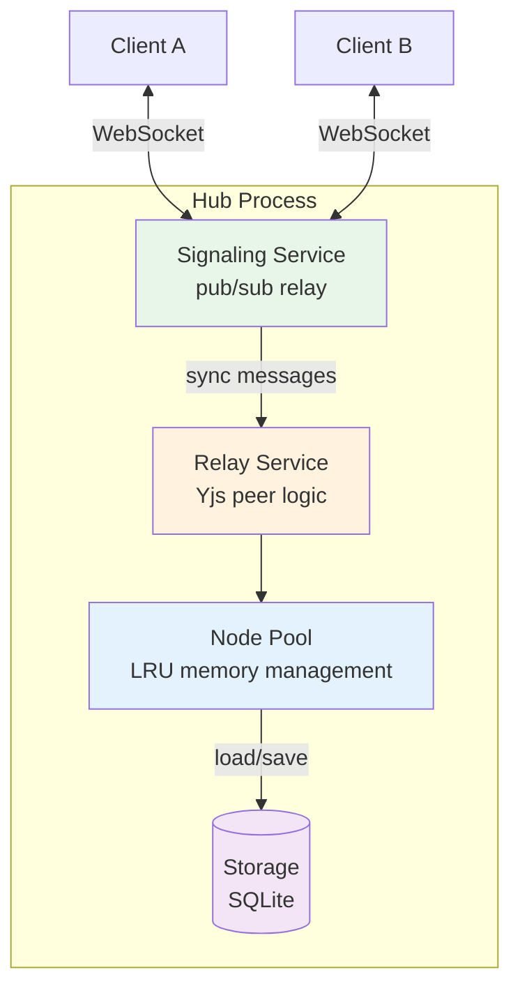

# 03: Sync Relay

> Hub acts as an always-on Yjs peer, persisting document state

**Dependencies:** `01-package-scaffold.md`, `02-ucan-auth.md`
**Modifies:** `packages/hub/src/services/`, new `packages/hub/src/pool/`

## Overview

The sync relay makes the hub participate in Yjs sync as a persistent peer. When clients connect and broadcast `sync-step1` (their state vector), the hub responds with `sync-step2` (the diff from its stored state). When clients send `sync-update`, the hub applies it to its Y.Doc and persists. This means clients can sync through the hub even when not online simultaneously.



## Implementation

### 1. Node Pool (LRU Memory Management)

```typescript
// packages/hub/src/pool/node-pool.ts

import * as Y from 'yjs'
import type { HubStorage } from '../storage/interface'

interface PoolEntry {
  doc: Y.Doc
  lastAccess: number
  dirty: boolean
  subscribers: number
  persistTimer: ReturnType<typeof setTimeout> | null
}

/**
 * Manages Y.Doc instances with LRU eviction.
 *
 * - Hot: docs with active subscribers (never evicted)
 * - Warm: recently accessed, no subscribers (evicted when pool is full)
 * - Cold: on disk only (loaded on demand)
 */
export class NodePool {
  private entries = new Map<string, PoolEntry>()
  private maxWarmDocs: number
  private persistDelay: number

  constructor(
    private storage: HubStorage,
    options?: { maxWarmDocs?: number; persistDelay?: number }
  ) {
    this.maxWarmDocs = options?.maxWarmDocs ?? 500
    this.persistDelay = options?.persistDelay ?? 1000
  }

  /**
   * Get or load a Y.Doc for a document ID.
   */
  async get(docId: string): Promise<Y.Doc> {
    const existing = this.entries.get(docId)
    if (existing) {
      existing.lastAccess = Date.now()
      return existing.doc
    }

    // Load from storage
    const doc = new Y.Doc()
    const state = await this.storage.getDocState(docId)
    if (state) {
      Y.applyUpdate(doc, state)
    }

    const entry: PoolEntry = {
      doc,
      lastAccess: Date.now(),
      dirty: false,
      subscribers: 0,
      persistTimer: null
    }
    this.entries.set(docId, entry)

    // Evict warm docs if pool is too large
    this.evictIfNeeded()

    return doc
  }

  /**
   * Mark a doc as having active subscribers (prevents eviction).
   */
  addSubscriber(docId: string): void {
    const entry = this.entries.get(docId)
    if (entry) entry.subscribers++
  }

  /**
   * Remove a subscriber. Doc becomes evictable when subscribers = 0.
   */
  removeSubscriber(docId: string): void {
    const entry = this.entries.get(docId)
    if (entry) {
      entry.subscribers = Math.max(0, entry.subscribers - 1)
    }
  }

  /**
   * Mark a doc as dirty and schedule persistence.
   */
  markDirty(docId: string): void {
    const entry = this.entries.get(docId)
    if (!entry) return

    entry.dirty = true

    // Debounce persistence
    if (entry.persistTimer) clearTimeout(entry.persistTimer)
    entry.persistTimer = setTimeout(() => {
      this.persist(docId).catch(console.error)
    }, this.persistDelay)
  }

  /**
   * Persist a doc's state to storage.
   */
  async persist(docId: string): Promise<void> {
    const entry = this.entries.get(docId)
    if (!entry || !entry.dirty) return

    const state = Y.encodeStateAsUpdate(entry.doc)
    await this.storage.setDocState(docId, state)
    entry.dirty = false
    entry.persistTimer = null
  }

  /**
   * Persist ALL dirty docs (for graceful shutdown).
   */
  async persistAll(): Promise<void> {
    const promises: Promise<void>[] = []
    for (const [docId, entry] of this.entries) {
      if (entry.dirty) {
        if (entry.persistTimer) clearTimeout(entry.persistTimer)
        promises.push(this.persist(docId))
      }
    }
    await Promise.all(promises)
  }

  /**
   * Get pool statistics.
   */
  getStats(): { hot: number; warm: number; total: number } {
    let hot = 0
    let warm = 0
    for (const entry of this.entries.values()) {
      if (entry.subscribers > 0) hot++
      else warm++
    }
    return { hot, warm, total: this.entries.size }
  }

  private evictIfNeeded(): void {
    // Only evict warm docs (no subscribers)
    const warmDocs: [string, PoolEntry][] = []
    for (const [id, entry] of this.entries) {
      if (entry.subscribers === 0) warmDocs.push([id, entry])
    }

    if (warmDocs.length <= this.maxWarmDocs) return

    // Sort by last access (oldest first)
    warmDocs.sort((a, b) => a[1].lastAccess - b[1].lastAccess)

    // Evict oldest warm docs
    const toEvict = warmDocs.length - this.maxWarmDocs
    for (let i = 0; i < toEvict; i++) {
      const [id, entry] = warmDocs[i]
      if (entry.persistTimer) clearTimeout(entry.persistTimer)
      // Persist before evicting if dirty
      if (entry.dirty) {
        const state = Y.encodeStateAsUpdate(entry.doc)
        this.storage.setDocState(id, state).catch(console.error)
      }
      entry.doc.destroy()
      this.entries.delete(id)
    }
  }

  destroy(): void {
    for (const entry of this.entries.values()) {
      if (entry.persistTimer) clearTimeout(entry.persistTimer)
      entry.doc.destroy()
    }
    this.entries.clear()
  }
}
```

### 2. Relay Service

```typescript
// packages/hub/src/services/relay.ts

import * as Y from 'yjs'
import type { WebSocket } from 'ws'
import type { NodePool } from '../pool/node-pool'

interface SyncMessage {
  type: 'sync-step1' | 'sync-step2' | 'sync-update' | 'awareness'
  from: string
  to?: string
  sv?: string // base64 state vector
  update?: string // base64 update
}

/**
 * Sync Relay Service - makes the hub act as a Yjs peer.
 *
 * When a client broadcasts sync-step1 (state vector), the hub responds
 * with sync-step2 (the diff the client needs). When clients send
 * sync-update, the hub applies it and persists.
 *
 * The hub's peerId is 'hub-relay' to distinguish from client peers.
 */
export class RelayService {
  private static HUB_PEER_ID = 'hub-relay'

  constructor(private pool: NodePool) {}

  /**
   * Handle a sync message published to a room.
   * Called by the signaling service after broadcasting to other clients.
   */
  async handleSyncMessage(
    topic: string,
    data: SyncMessage,
    sendToRoom: (topic: string, data: object) => void
  ): Promise<void> {
    // Ignore our own messages
    if (data.from === RelayService.HUB_PEER_ID) return

    // Extract doc ID from room topic
    const docId = this.extractDocId(topic)
    if (!docId) return

    switch (data.type) {
      case 'sync-step1': {
        // Client sent their state vector — respond with what they need
        const remoteSV = fromBase64(data.sv!)
        const doc = await this.pool.get(docId)
        const diff = Y.encodeStateAsUpdate(doc, remoteSV)

        if (diff.length > 2) {
          // Skip empty updates
          sendToRoom(topic, {
            type: 'sync-step2',
            from: RelayService.HUB_PEER_ID,
            to: data.from,
            update: toBase64(diff)
          })
        }

        // Also send our state vector so the client can send us what we're missing
        const sv = Y.encodeStateVector(doc)
        sendToRoom(topic, {
          type: 'sync-step1',
          from: RelayService.HUB_PEER_ID,
          sv: toBase64(sv)
        })
        break
      }

      case 'sync-step2': {
        // Only process if addressed to us
        if (data.to && data.to !== RelayService.HUB_PEER_ID) return

        const update = fromBase64(data.update!)
        const doc = await this.pool.get(docId)
        Y.applyUpdate(doc, update, 'relay')
        this.pool.markDirty(docId)
        break
      }

      case 'sync-update': {
        // Incremental update from a client — apply and persist
        const update = fromBase64(data.update!)
        const doc = await this.pool.get(docId)
        Y.applyUpdate(doc, update, 'relay')
        this.pool.markDirty(docId)
        break
      }

      case 'awareness':
        // Hub doesn't track awareness (presence) — just relay
        break
    }
  }

  /**
   * Called when a client subscribes to a room.
   * The hub proactively sends its state to help the client catch up.
   */
  async handleRoomJoin(
    topic: string,
    sendToRoom: (topic: string, data: object) => void
  ): Promise<void> {
    const docId = this.extractDocId(topic)
    if (!docId) return

    this.pool.addSubscriber(docId)

    // Send hub's state vector so the new client knows what we have
    const doc = await this.pool.get(docId)
    const sv = Y.encodeStateVector(doc)

    if (Y.encodeStateAsUpdate(doc).length > 2) {
      sendToRoom(topic, {
        type: 'sync-step1',
        from: RelayService.HUB_PEER_ID,
        sv: toBase64(sv)
      })
    }
  }

  /**
   * Called when a client leaves a room.
   */
  handleRoomLeave(topic: string): void {
    const docId = this.extractDocId(topic)
    if (docId) this.pool.removeSubscriber(docId)
  }

  private extractDocId(topic: string): string | null {
    if (topic.startsWith('xnet-doc-')) {
      return topic.slice('xnet-doc-'.length)
    }
    return null
  }
}

// Base64 helpers (same as WebSocketSyncProvider)
function toBase64(data: Uint8Array): string {
  return Buffer.from(data).toString('base64')
}

function fromBase64(str: string): Uint8Array {
  return new Uint8Array(Buffer.from(str, 'base64'))
}
```

### 3. Signaling Integration

The signaling service needs a hook to notify the relay about sync messages:

```typescript
// Addition to packages/hub/src/services/signaling.ts

// Add a message interceptor that the relay can use:
export class SignalingService {
  private messageInterceptor: ((topic: string, data: any) => void) | null = null

  /**
   * Set a function that will be called for every published message.
   * Used by the relay to intercept sync messages.
   */
  setMessageInterceptor(fn: (topic: string, data: any) => void): void {
    this.messageInterceptor = fn
  }

  // In handlePublish, after broadcasting:
  private handlePublish(ws: WebSocket, topic: string, data: unknown): void {
    const t = this.topics.get(topic)
    if (!t) return

    const msg = JSON.stringify({ type: 'publish', topic, data })
    for (const subscriber of t.subscribers) {
      if (subscriber !== ws && subscriber.readyState === 1) {
        subscriber.send(msg)
      }
    }

    // Notify interceptor (relay)
    if (this.messageInterceptor) {
      this.messageInterceptor(topic, data)
    }
  }

  /**
   * Publish a message from the hub itself (not from a client WebSocket).
   * Used by the relay to send sync-step1/2 responses.
   */
  publishFromHub(topic: string, data: object): void {
    const t = this.topics.get(topic)
    if (!t) return

    const msg = JSON.stringify({ type: 'publish', topic, data })
    for (const subscriber of t.subscribers) {
      if (subscriber.readyState === 1) {
        subscriber.send(msg)
      }
    }
  }
}
```

### 4. Wiring It Together

```typescript
// Updated packages/hub/src/server.ts (createServer additions)

import { RelayService } from './services/relay'
import { NodePool } from './pool/node-pool'
import { createSQLiteStorage } from './storage/sqlite'

export function createServer(config: HubConfig): HubInstance {
  // ... existing setup ...

  // Storage + pool + relay
  const storage = config.storage === 'sqlite'
    ? createSQLiteStorage(config.dataDir)
    : createMemoryStorage()
  const pool = new NodePool(storage, { maxWarmDocs: 500, persistDelay: 1000 })
  const relay = new RelayService(pool)

  // Wire relay into signaling
  signaling.setMessageInterceptor((topic, data) => {
    if (data?.type?.startsWith('sync-') || data?.type === 'awareness') {
      relay.handleSyncMessage(topic, data, (t, d) => {
        signaling.publishFromHub(t, d)
      }).catch(console.error)
    }
  })

  // ... existing hub object, with updated stop():
  async stop() {
    // Persist all dirty docs before shutdown
    await pool.persistAll()
    pool.destroy()
    await storage.close()
    // ... close WS + HTTP ...
  }
}
```

## Tests

```typescript
// packages/hub/test/relay.test.ts

import { describe, it, expect, beforeAll, afterAll } from 'vitest'
import { WebSocket } from 'ws'
import * as Y from 'yjs'
import { createHub, type HubInstance } from '../src'

describe('Sync Relay', () => {
  let hub: HubInstance
  const PORT = 14446

  beforeAll(async () => {
    hub = await createHub({ port: PORT, auth: false, storage: 'memory' })
    await hub.start()
  })

  afterAll(async () => {
    await hub.stop()
  })

  function connect(): Promise<WebSocket> {
    return new Promise((resolve) => {
      const ws = new WebSocket(`ws://localhost:${PORT}`)
      ws.on('open', () => resolve(ws))
    })
  }

  it('persists sync-update and serves to new client', async () => {
    const DOC_ID = 'test-relay-1'
    const ROOM = `xnet-doc-${DOC_ID}`

    // Client A connects and sends an update
    const wsA = await connect()
    wsA.send(JSON.stringify({ type: 'subscribe', topics: [ROOM] }))
    await new Promise((r) => setTimeout(r, 50))

    // Create a Y.Doc and encode an update
    const docA = new Y.Doc()
    docA.getText('content').insert(0, 'Hello from A')
    const update = Y.encodeStateAsUpdate(docA)

    wsA.send(
      JSON.stringify({
        type: 'publish',
        topic: ROOM,
        data: {
          type: 'sync-update',
          from: 'clientA',
          update: Buffer.from(update).toString('base64')
        }
      })
    )

    // Wait for hub to persist
    await new Promise((r) => setTimeout(r, 1500))
    wsA.close()

    // Client B connects later and should get A's content from hub
    const wsB = await connect()
    wsB.send(JSON.stringify({ type: 'subscribe', topics: [ROOM] }))

    // Send sync-step1 (empty state vector = "I have nothing")
    const emptyDoc = new Y.Doc()
    const sv = Y.encodeStateVector(emptyDoc)
    wsB.send(
      JSON.stringify({
        type: 'publish',
        topic: ROOM,
        data: { type: 'sync-step1', from: 'clientB', sv: Buffer.from(sv).toString('base64') }
      })
    )

    // Should receive sync-step2 from hub with A's content
    const msg = await new Promise<any>((resolve) => {
      wsB.on('message', (raw) => {
        const m = JSON.parse(raw.toString())
        if (m.data?.type === 'sync-step2' && m.data?.from === 'hub-relay') {
          resolve(m.data)
        }
      })
    })

    expect(msg.update).toBeTruthy()
    const hubUpdate = Buffer.from(msg.update, 'base64')
    Y.applyUpdate(emptyDoc, new Uint8Array(hubUpdate))
    expect(emptyDoc.getText('content').toString()).toBe('Hello from A')

    wsB.close()
  })
})
```

## Checklist

- [ ] Implement `pool/node-pool.ts` (LRU Y.Doc management)
- [ ] Implement `services/relay.ts` (hub as Yjs peer)
- [ ] Add message interceptor to `services/signaling.ts`
- [ ] Add `publishFromHub` method to signaling
- [ ] Wire pool + relay into `server.ts`
- [ ] Add graceful shutdown (persist all dirty docs)
- [ ] Write relay tests (persist + serve to new client)
- [ ] Write doc pool tests (eviction, persistence)
- [ ] Verify with two clients syncing through hub asynchronously

---

[← Previous: UCAN Auth](./02-ucan-auth.md) | [Back to README](./README.md) | [Next: SQLite Storage →](./04-sqlite-storage.md)
