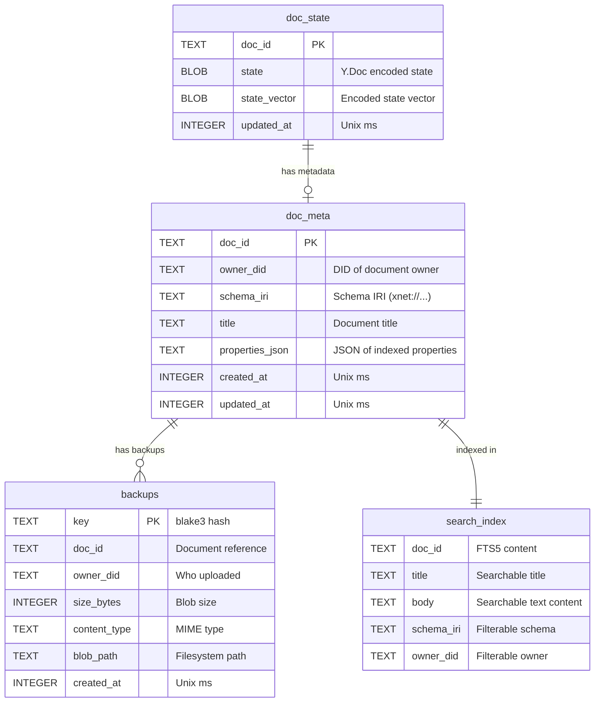

# 04: SQLite Storage

> Durable, single-file persistence for CRDT state, metadata, and backup blobs

**Dependencies:** `01-package-scaffold.md`, `03-sync-relay.md`
**Modifies:** `packages/hub/src/storage/`

## Overview

The SQLite storage adapter implements the `HubStorage` interface using `better-sqlite3` in WAL mode. It stores CRDT document state (binary blobs), document metadata (schema, title, owner), backup blobs (encrypted, content-addressed), and a full-text search index (FTS5). The same interface can be swapped for Postgres in Phase 2.



## Implementation

### 1. Storage Interface

```typescript
// packages/hub/src/storage/interface.ts

export interface BlobMeta {
  key: string
  docId: string
  ownerDid: string
  sizeBytes: number
  contentType: string
  createdAt: number
}

export interface DocMeta {
  docId: string
  ownerDid: string
  schemaIri: string
  title: string
  properties?: Record<string, unknown>
  createdAt: number
  updatedAt: number
}

export interface SearchOptions {
  schemaIri?: string
  ownerDid?: string
  limit?: number
  offset?: number
}

export interface SearchResult {
  docId: string
  title: string
  schemaIri: string
  snippet: string
  rank: number
}

export interface HubStorage {
  // CRDT state
  getDocState(docId: string): Promise<Uint8Array | null>
  setDocState(docId: string, state: Uint8Array): Promise<void>
  getStateVector(docId: string): Promise<Uint8Array | null>

  // Backup blob operations
  putBlob(key: string, data: Uint8Array, meta: BlobMeta): Promise<void>
  getBlob(key: string): Promise<Uint8Array | null>
  listBlobs(ownerDid: string): Promise<BlobMeta[]>
  deleteBlob(key: string): Promise<void>

  // Metadata + search
  setDocMeta(docId: string, meta: DocMeta): Promise<void>
  getDocMeta(docId: string): Promise<DocMeta | null>
  search(query: string, options?: SearchOptions): Promise<SearchResult[]>

  // Lifecycle
  close(): Promise<void>
}
```

### 2. SQLite Adapter

```typescript
// packages/hub/src/storage/sqlite.ts

import Database, { type Database as DatabaseType } from 'better-sqlite3'
import { mkdirSync, writeFileSync, readFileSync, unlinkSync, existsSync } from 'node:fs'
import { join } from 'node:path'
import type { HubStorage, BlobMeta, DocMeta, SearchOptions, SearchResult } from './interface'

const SCHEMA_SQL = `
  -- CRDT document state (binary blobs)
  CREATE TABLE IF NOT EXISTS doc_state (
    doc_id TEXT PRIMARY KEY,
    state BLOB NOT NULL,
    state_vector BLOB,
    updated_at INTEGER NOT NULL DEFAULT (unixepoch('now') * 1000)
  );

  -- Document metadata (for search + filtering)
  CREATE TABLE IF NOT EXISTS doc_meta (
    doc_id TEXT PRIMARY KEY,
    owner_did TEXT NOT NULL,
    schema_iri TEXT NOT NULL,
    title TEXT NOT NULL DEFAULT '',
    properties_json TEXT DEFAULT '{}',
    created_at INTEGER NOT NULL DEFAULT (unixepoch('now') * 1000),
    updated_at INTEGER NOT NULL DEFAULT (unixepoch('now') * 1000)
  );
  CREATE INDEX IF NOT EXISTS idx_doc_meta_owner ON doc_meta(owner_did);
  CREATE INDEX IF NOT EXISTS idx_doc_meta_schema ON doc_meta(schema_iri);

  -- Backup blobs (encrypted, content-addressed)
  CREATE TABLE IF NOT EXISTS backups (
    key TEXT PRIMARY KEY,
    doc_id TEXT NOT NULL,
    owner_did TEXT NOT NULL,
    size_bytes INTEGER NOT NULL,
    content_type TEXT NOT NULL DEFAULT 'application/octet-stream',
    blob_path TEXT NOT NULL,
    created_at INTEGER NOT NULL DEFAULT (unixepoch('now') * 1000)
  );
  CREATE INDEX IF NOT EXISTS idx_backups_owner ON backups(owner_did);
  CREATE INDEX IF NOT EXISTS idx_backups_doc ON backups(doc_id);

  -- Full-text search index (FTS5)
  CREATE VIRTUAL TABLE IF NOT EXISTS search_index USING fts5(
    doc_id UNINDEXED,
    title,
    body,
    schema_iri UNINDEXED,
    owner_did UNINDEXED,
    content='doc_meta',
    content_rowid='rowid'
  );

  -- Triggers to keep FTS in sync with doc_meta
  CREATE TRIGGER IF NOT EXISTS doc_meta_ai AFTER INSERT ON doc_meta BEGIN
    INSERT INTO search_index(rowid, doc_id, title, body, schema_iri, owner_did)
    VALUES (new.rowid, new.doc_id, new.title, '', new.schema_iri, new.owner_did);
  END;

  CREATE TRIGGER IF NOT EXISTS doc_meta_ad AFTER DELETE ON doc_meta BEGIN
    INSERT INTO search_index(search_index, rowid, doc_id, title, body, schema_iri, owner_did)
    VALUES ('delete', old.rowid, old.doc_id, old.title, '', old.schema_iri, old.owner_did);
  END;

  CREATE TRIGGER IF NOT EXISTS doc_meta_au AFTER UPDATE ON doc_meta BEGIN
    INSERT INTO search_index(search_index, rowid, doc_id, title, body, schema_iri, owner_did)
    VALUES ('delete', old.rowid, old.doc_id, old.title, '', old.schema_iri, old.owner_did);
    INSERT INTO search_index(rowid, doc_id, title, body, schema_iri, owner_did)
    VALUES (new.rowid, new.doc_id, new.title, '', new.schema_iri, new.owner_did);
  END;
`

export function createSQLiteStorage(dataDir: string): HubStorage {
  mkdirSync(dataDir, { recursive: true })
  mkdirSync(join(dataDir, 'blobs'), { recursive: true })

  const dbPath = join(dataDir, 'hub.db')
  const db = new Database(dbPath)

  // Enable WAL mode for concurrent reads + single writer performance
  db.pragma('journal_mode = WAL')
  db.pragma('synchronous = NORMAL')
  db.pragma('busy_timeout = 5000')

  // Run schema migrations
  db.exec(SCHEMA_SQL)

  // Prepared statements for hot paths
  const stmts = {
    getDocState: db.prepare('SELECT state FROM doc_state WHERE doc_id = ?'),
    getStateVector: db.prepare('SELECT state_vector FROM doc_state WHERE doc_id = ?'),
    upsertDocState: db.prepare(`
      INSERT INTO doc_state (doc_id, state, state_vector, updated_at)
      VALUES (?, ?, ?, ?)
      ON CONFLICT(doc_id) DO UPDATE SET
        state = excluded.state,
        state_vector = excluded.state_vector,
        updated_at = excluded.updated_at
    `),
    getDocMeta: db.prepare('SELECT * FROM doc_meta WHERE doc_id = ?'),
    upsertDocMeta: db.prepare(`
      INSERT INTO doc_meta (doc_id, owner_did, schema_iri, title, properties_json, created_at, updated_at)
      VALUES (?, ?, ?, ?, ?, ?, ?)
      ON CONFLICT(doc_id) DO UPDATE SET
        owner_did = excluded.owner_did,
        schema_iri = excluded.schema_iri,
        title = excluded.title,
        properties_json = excluded.properties_json,
        updated_at = excluded.updated_at
    `),
    insertBackup: db.prepare(`
      INSERT OR REPLACE INTO backups (key, doc_id, owner_did, size_bytes, content_type, blob_path, created_at)
      VALUES (?, ?, ?, ?, ?, ?, ?)
    `),
    getBackup: db.prepare('SELECT * FROM backups WHERE key = ?'),
    listBackups: db.prepare('SELECT * FROM backups WHERE owner_did = ? ORDER BY created_at DESC'),
    deleteBackup: db.prepare('DELETE FROM backups WHERE key = ? RETURNING blob_path'),
    search: db.prepare(`
      SELECT doc_id, title, schema_iri, snippet(search_index, 2, '<b>', '</b>', '...', 32) as snippet,
             rank
      FROM search_index
      WHERE search_index MATCH ?
      ORDER BY rank
      LIMIT ? OFFSET ?
    `),
    searchWithSchema: db.prepare(`
      SELECT doc_id, title, schema_iri, snippet(search_index, 2, '<b>', '</b>', '...', 32) as snippet,
             rank
      FROM search_index
      WHERE search_index MATCH ? AND schema_iri = ?
      ORDER BY rank
      LIMIT ? OFFSET ?
    `),
    updateSearchBody: db.prepare(`
      UPDATE search_index SET body = ? WHERE doc_id = ?
    `)
  }

  const storage: HubStorage = {
    async getDocState(docId: string): Promise<Uint8Array | null> {
      const row = stmts.getDocState.get(docId) as { state: Buffer } | undefined
      return row ? new Uint8Array(row.state) : null
    },

    async setDocState(docId: string, state: Uint8Array): Promise<void> {
      // Also compute state vector for efficient sync
      // We store both the full state and the vector
      stmts.upsertDocState.run(docId, Buffer.from(state), null, Date.now())
    },

    async getStateVector(docId: string): Promise<Uint8Array | null> {
      const row = stmts.getStateVector.get(docId) as { state_vector: Buffer | null } | undefined
      return row?.state_vector ? new Uint8Array(row.state_vector) : null
    },

    async putBlob(key: string, data: Uint8Array, meta: BlobMeta): Promise<void> {
      // Write blob to filesystem
      const blobPath = join(dataDir, 'blobs', key)
      writeFileSync(blobPath, data)

      // Record in database
      stmts.insertBackup.run(
        key,
        meta.docId,
        meta.ownerDid,
        meta.sizeBytes,
        meta.contentType,
        blobPath,
        meta.createdAt || Date.now()
      )
    },

    async getBlob(key: string): Promise<Uint8Array | null> {
      const row = stmts.getBackup.get(key) as { blob_path: string } | undefined
      if (!row) return null

      try {
        const data = readFileSync(row.blob_path)
        return new Uint8Array(data)
      } catch {
        return null
      }
    },

    async listBlobs(ownerDid: string): Promise<BlobMeta[]> {
      const rows = stmts.listBackups.all(ownerDid) as Array<{
        key: string
        doc_id: string
        owner_did: string
        size_bytes: number
        content_type: string
        created_at: number
      }>

      return rows.map((r) => ({
        key: r.key,
        docId: r.doc_id,
        ownerDid: r.owner_did,
        sizeBytes: r.size_bytes,
        contentType: r.content_type,
        createdAt: r.created_at
      }))
    },

    async deleteBlob(key: string): Promise<void> {
      const row = stmts.deleteBackup.get(key) as { blob_path: string } | undefined
      if (row?.blob_path && existsSync(row.blob_path)) {
        unlinkSync(row.blob_path)
      }
    },

    async setDocMeta(docId: string, meta: DocMeta): Promise<void> {
      stmts.upsertDocMeta.run(
        docId,
        meta.ownerDid,
        meta.schemaIri,
        meta.title,
        JSON.stringify(meta.properties ?? {}),
        meta.createdAt || Date.now(),
        meta.updatedAt || Date.now()
      )
    },

    async getDocMeta(docId: string): Promise<DocMeta | null> {
      const row = stmts.getDocMeta.get(docId) as
        | {
            doc_id: string
            owner_did: string
            schema_iri: string
            title: string
            properties_json: string
            created_at: number
            updated_at: number
          }
        | undefined

      if (!row) return null

      return {
        docId: row.doc_id,
        ownerDid: row.owner_did,
        schemaIri: row.schema_iri,
        title: row.title,
        properties: JSON.parse(row.properties_json),
        createdAt: row.created_at,
        updatedAt: row.updated_at
      }
    },

    async search(query: string, options?: SearchOptions): Promise<SearchResult[]> {
      const limit = options?.limit ?? 20
      const offset = options?.offset ?? 0

      let rows: Array<{
        doc_id: string
        title: string
        schema_iri: string
        snippet: string
        rank: number
      }>

      if (options?.schemaIri) {
        rows = stmts.searchWithSchema.all(query, options.schemaIri, limit, offset) as typeof rows
      } else {
        rows = stmts.search.all(query, limit, offset) as typeof rows
      }

      return rows.map((r) => ({
        docId: r.doc_id,
        title: r.title,
        schemaIri: r.schema_iri,
        snippet: r.snippet,
        rank: r.rank
      }))
    },

    async close(): Promise<void> {
      db.close()
    }
  }

  return storage
}
```

### 3. Memory Storage (for tests)

```typescript
// packages/hub/src/storage/memory.ts

import type { HubStorage, BlobMeta, DocMeta, SearchOptions, SearchResult } from './interface'

/**
 * In-memory storage adapter for tests and dev mode.
 * No persistence — data is lost on restart.
 */
export function createMemoryStorage(): HubStorage {
  const docStates = new Map<string, Uint8Array>()
  const docMetas = new Map<string, DocMeta>()
  const blobs = new Map<string, { data: Uint8Array; meta: BlobMeta }>()

  return {
    async getDocState(docId) {
      return docStates.get(docId) ?? null
    },

    async setDocState(docId, state) {
      docStates.set(docId, state)
    },

    async getStateVector(docId) {
      // Memory adapter doesn't cache state vectors separately
      return null
    },

    async putBlob(key, data, meta) {
      blobs.set(key, { data: new Uint8Array(data), meta })
    },

    async getBlob(key) {
      return blobs.get(key)?.data ?? null
    },

    async listBlobs(ownerDid) {
      const result: BlobMeta[] = []
      for (const { meta } of blobs.values()) {
        if (meta.ownerDid === ownerDid) result.push(meta)
      }
      return result.sort((a, b) => b.createdAt - a.createdAt)
    },

    async deleteBlob(key) {
      blobs.delete(key)
    },

    async setDocMeta(docId, meta) {
      docMetas.set(docId, meta)
    },

    async getDocMeta(docId) {
      return docMetas.get(docId) ?? null
    },

    async search(query, options) {
      const results: SearchResult[] = []
      const q = query.toLowerCase()

      for (const meta of docMetas.values()) {
        if (options?.schemaIri && meta.schemaIri !== options.schemaIri) continue
        if (options?.ownerDid && meta.ownerDid !== options.ownerDid) continue

        if (meta.title.toLowerCase().includes(q)) {
          results.push({
            docId: meta.docId,
            title: meta.title,
            schemaIri: meta.schemaIri,
            snippet: meta.title,
            rank: -1
          })
        }
      }

      const offset = options?.offset ?? 0
      const limit = options?.limit ?? 20
      return results.slice(offset, offset + limit)
    },

    async close() {
      docStates.clear()
      docMetas.clear()
      blobs.clear()
    }
  }
}
```

### 4. Storage Factory

```typescript
// packages/hub/src/storage/index.ts

export { createSQLiteStorage } from './sqlite'
export { createMemoryStorage } from './memory'
export type { HubStorage, BlobMeta, DocMeta, SearchOptions, SearchResult } from './interface'

import type { HubStorage } from './interface'
import { createSQLiteStorage } from './sqlite'
import { createMemoryStorage } from './memory'

export type StorageType = 'sqlite' | 'memory'

export function createStorage(type: StorageType, dataDir: string): HubStorage {
  switch (type) {
    case 'sqlite':
      return createSQLiteStorage(dataDir)
    case 'memory':
      return createMemoryStorage()
    default:
      throw new Error(`Unknown storage type: ${type}`)
  }
}
```

## Tests

```typescript
// packages/hub/test/storage.test.ts

import { describe, it, expect, beforeEach, afterEach } from 'vitest'
import { mkdtempSync, rmSync } from 'node:fs'
import { join } from 'node:path'
import { tmpdir } from 'node:os'
import { createSQLiteStorage } from '../src/storage/sqlite'
import { createMemoryStorage } from '../src/storage/memory'
import type { HubStorage, DocMeta, BlobMeta } from '../src/storage/interface'

const storageFactories = [
  ['SQLite', () => createSQLiteStorage(mkdtempSync(join(tmpdir(), 'hub-test-')))],
  ['Memory', () => createMemoryStorage()]
] as const

describe.each(storageFactories)('HubStorage (%s)', (_name, factory) => {
  let storage: HubStorage

  beforeEach(() => {
    storage = factory()
  })

  afterEach(async () => {
    await storage.close()
  })

  describe('doc state', () => {
    it('returns null for unknown doc', async () => {
      expect(await storage.getDocState('missing')).toBeNull()
    })

    it('stores and retrieves doc state', async () => {
      const state = new Uint8Array([1, 2, 3, 4, 5])
      await storage.setDocState('doc-1', state)

      const result = await storage.getDocState('doc-1')
      expect(result).toEqual(state)
    })

    it('overwrites existing state', async () => {
      await storage.setDocState('doc-1', new Uint8Array([1, 2, 3]))
      await storage.setDocState('doc-1', new Uint8Array([4, 5, 6]))

      const result = await storage.getDocState('doc-1')
      expect(result).toEqual(new Uint8Array([4, 5, 6]))
    })
  })

  describe('doc meta', () => {
    const meta: DocMeta = {
      docId: 'doc-1',
      ownerDid: 'did:key:z6Mk...',
      schemaIri: 'xnet://xnet.dev/Page',
      title: 'Test Page',
      properties: { status: 'draft' },
      createdAt: Date.now(),
      updatedAt: Date.now()
    }

    it('returns null for unknown doc', async () => {
      expect(await storage.getDocMeta('missing')).toBeNull()
    })

    it('stores and retrieves metadata', async () => {
      await storage.setDocMeta('doc-1', meta)
      const result = await storage.getDocMeta('doc-1')
      expect(result).toMatchObject({
        docId: 'doc-1',
        ownerDid: 'did:key:z6Mk...',
        schemaIri: 'xnet://xnet.dev/Page',
        title: 'Test Page'
      })
    })

    it('updates existing metadata', async () => {
      await storage.setDocMeta('doc-1', meta)
      await storage.setDocMeta('doc-1', { ...meta, title: 'Updated' })

      const result = await storage.getDocMeta('doc-1')
      expect(result?.title).toBe('Updated')
    })
  })

  describe('blobs', () => {
    const blobMeta: BlobMeta = {
      key: 'blake3-hash-abc',
      docId: 'doc-1',
      ownerDid: 'did:key:z6Mk...',
      sizeBytes: 5,
      contentType: 'application/octet-stream',
      createdAt: Date.now()
    }

    it('stores and retrieves blob', async () => {
      const data = new Uint8Array([10, 20, 30, 40, 50])
      await storage.putBlob('blake3-hash-abc', data, blobMeta)

      const result = await storage.getBlob('blake3-hash-abc')
      expect(result).toEqual(data)
    })

    it('returns null for unknown blob', async () => {
      expect(await storage.getBlob('missing')).toBeNull()
    })

    it('lists blobs by owner', async () => {
      await storage.putBlob('hash-1', new Uint8Array([1]), {
        ...blobMeta,
        key: 'hash-1',
        docId: 'doc-1'
      })
      await storage.putBlob('hash-2', new Uint8Array([2]), {
        ...blobMeta,
        key: 'hash-2',
        docId: 'doc-2'
      })
      await storage.putBlob('hash-3', new Uint8Array([3]), {
        ...blobMeta,
        key: 'hash-3',
        ownerDid: 'did:key:other',
        docId: 'doc-3'
      })

      const results = await storage.listBlobs('did:key:z6Mk...')
      expect(results).toHaveLength(2)
    })

    it('deletes blob', async () => {
      await storage.putBlob('hash-del', new Uint8Array([1, 2]), {
        ...blobMeta,
        key: 'hash-del'
      })
      await storage.deleteBlob('hash-del')

      expect(await storage.getBlob('hash-del')).toBeNull()
    })
  })

  describe('search', () => {
    beforeEach(async () => {
      await storage.setDocMeta('doc-1', {
        docId: 'doc-1',
        ownerDid: 'did:key:alice',
        schemaIri: 'xnet://xnet.dev/Page',
        title: 'Meeting Notes Q4',
        createdAt: Date.now(),
        updatedAt: Date.now()
      })
      await storage.setDocMeta('doc-2', {
        docId: 'doc-2',
        ownerDid: 'did:key:alice',
        schemaIri: 'xnet://xnet.dev/Task',
        title: 'Review Q4 Budget',
        createdAt: Date.now(),
        updatedAt: Date.now()
      })
      await storage.setDocMeta('doc-3', {
        docId: 'doc-3',
        ownerDid: 'did:key:bob',
        schemaIri: 'xnet://xnet.dev/Page',
        title: 'Personal Diary',
        createdAt: Date.now(),
        updatedAt: Date.now()
      })
    })

    it('finds documents by title keyword', async () => {
      const results = await storage.search('Q4')
      expect(results.length).toBeGreaterThanOrEqual(2)
    })

    it('filters by schema', async () => {
      const results = await storage.search('Q4', { schemaIri: 'xnet://xnet.dev/Task' })
      expect(results).toHaveLength(1)
      expect(results[0].docId).toBe('doc-2')
    })

    it('respects limit and offset', async () => {
      const results = await storage.search('Q4', { limit: 1, offset: 0 })
      expect(results).toHaveLength(1)
    })
  })
})
```

## Checklist

- [ ] Define `HubStorage` interface in `storage/interface.ts`
- [ ] Implement `createSQLiteStorage()` with WAL mode
- [ ] Create schema (doc_state, doc_meta, backups, search_index tables)
- [ ] Implement FTS5 triggers for auto-indexing
- [ ] Implement `createMemoryStorage()` for tests
- [ ] Create `createStorage()` factory function
- [ ] Write storage adapter tests (both SQLite + memory)
- [ ] Ensure blob files are stored content-addressed on filesystem
- [ ] Verify WAL mode with concurrent read/write access

---

[← Previous: Sync Relay](./03-sync-relay.md) | [Back to README](./README.md) | [Next: Backup API →](./05-backup-api.md)
