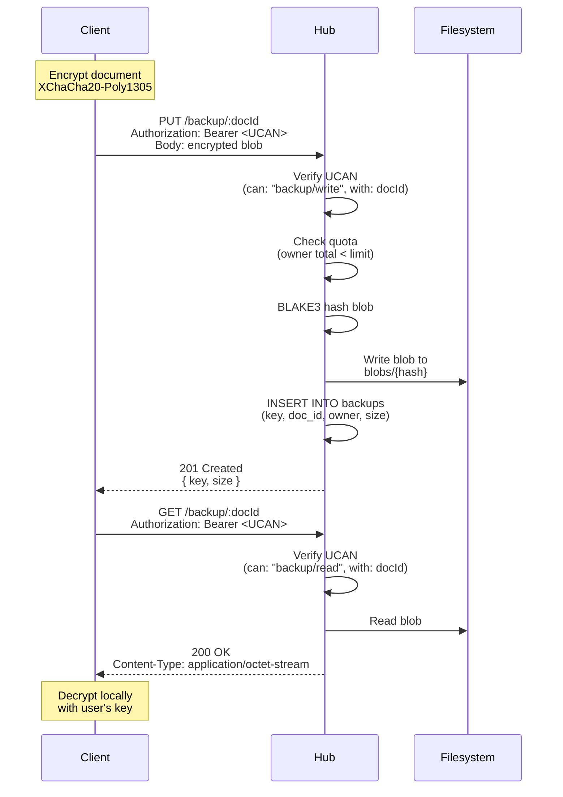

# 05: Backup API

> Zero-knowledge encrypted blob storage via HTTP — the hub never sees plaintext

**Dependencies:** `01-package-scaffold.md`, `02-ucan-auth.md`, `04-sqlite-storage.md`
**Modifies:** `packages/hub/src/services/backup.ts`, `packages/hub/src/server.ts`

## Codebase Status (Feb 2026)

| Existing Asset                | Location                                | Reuse Strategy                                                              |
| ----------------------------- | --------------------------------------- | --------------------------------------------------------------------------- |
| XChaCha20-Poly1305 encryption | `packages/crypto/src/symmetric.ts`      | Client-side encryption before upload — hub never sees plaintext             |
| BLAKE3 hashing                | `packages/crypto/src/hashing.ts`        | Content-addressing for backup blobs                                         |
| BlobStore                     | `packages/storage/src/blob-store.ts`    | Content-addressed storage pattern — same BLAKE3 CID approach                |
| `@xnet/storage` ChunkManager  | `packages/storage/src/chunk-manager.ts` | Large blob chunking (64KB threshold) — relevant for backup upload streaming |

> **No backup API exists yet.** This is entirely new server-side code. Client-side crypto primitives are ready.

## Overview

The backup API provides HTTP endpoints for storing and retrieving encrypted blobs. Clients encrypt documents locally (using `@xnet/crypto` XChaCha20-Poly1305), then upload opaque ciphertext. The hub stores blobs content-addressed by their BLAKE3 hash on the filesystem. UCAN tokens gate access per document, and configurable quotas prevent abuse.



## Implementation

### 1. Backup Service

```typescript
// packages/hub/src/services/backup.ts

import { blake3 } from '@xnet/crypto'
import type { HubStorage, BlobMeta } from '../storage/interface'

export interface BackupConfig {
  /** Max total bytes per owner DID (default: 1GB) */
  maxQuotaBytes: number
  /** Max single blob size (default: 50MB) */
  maxBlobSize: number
}

const DEFAULT_CONFIG: BackupConfig = {
  maxQuotaBytes: 1024 * 1024 * 1024, // 1GB
  maxBlobSize: 50 * 1024 * 1024 // 50MB
}

export interface BackupResult {
  key: string
  sizeBytes: number
}

export class BackupService {
  private config: BackupConfig

  constructor(
    private storage: HubStorage,
    config?: Partial<BackupConfig>
  ) {
    this.config = { ...DEFAULT_CONFIG, ...config }
  }

  /**
   * Store an encrypted blob for a document.
   * Returns the content-addressed key (BLAKE3 hash).
   */
  async put(docId: string, ownerDid: string, data: Uint8Array): Promise<BackupResult> {
    // Validate blob size
    if (data.length > this.config.maxBlobSize) {
      throw new BackupError(
        'BLOB_TOO_LARGE',
        `Blob exceeds max size of ${this.config.maxBlobSize} bytes`
      )
    }

    // Check quota
    const existing = await this.storage.listBlobs(ownerDid)
    const currentUsage = existing.reduce((sum, b) => sum + b.sizeBytes, 0)
    if (currentUsage + data.length > this.config.maxQuotaBytes) {
      throw new BackupError(
        'QUOTA_EXCEEDED',
        `Would exceed quota of ${this.config.maxQuotaBytes} bytes`
      )
    }

    // Content-address by BLAKE3 hash
    const hash = blake3(data)
    const key = bufferToHex(hash)

    const meta: BlobMeta = {
      key,
      docId,
      ownerDid,
      sizeBytes: data.length,
      contentType: 'application/octet-stream',
      createdAt: Date.now()
    }

    await this.storage.putBlob(key, data, meta)

    return { key, sizeBytes: data.length }
  }

  /**
   * Retrieve an encrypted blob by document ID.
   * Caller must verify UCAN before calling.
   */
  async get(docId: string, ownerDid: string): Promise<Uint8Array | null> {
    // Find the latest backup for this doc by this owner
    const blobs = await this.storage.listBlobs(ownerDid)
    const match = blobs.find((b) => b.docId === docId)
    if (!match) return null

    return this.storage.getBlob(match.key)
  }

  /**
   * List all backups for an owner.
   */
  async list(ownerDid: string): Promise<BlobMeta[]> {
    return this.storage.listBlobs(ownerDid)
  }

  /**
   * Delete a backup by key.
   * Caller must verify ownership before calling.
   */
  async delete(key: string, ownerDid: string): Promise<boolean> {
    const blobs = await this.storage.listBlobs(ownerDid)
    const match = blobs.find((b) => b.key === key)
    if (!match) return false

    await this.storage.deleteBlob(key)
    return true
  }

  /**
   * Get quota usage for an owner.
   */
  async getUsage(ownerDid: string): Promise<{ used: number; limit: number; count: number }> {
    const blobs = await this.storage.listBlobs(ownerDid)
    const used = blobs.reduce((sum, b) => sum + b.sizeBytes, 0)
    return {
      used,
      limit: this.config.maxQuotaBytes,
      count: blobs.length
    }
  }
}

export class BackupError extends Error {
  constructor(
    public code: 'BLOB_TOO_LARGE' | 'QUOTA_EXCEEDED' | 'NOT_FOUND' | 'UNAUTHORIZED',
    message: string
  ) {
    super(message)
    this.name = 'BackupError'
  }
}

function bufferToHex(buf: Uint8Array): string {
  return Array.from(buf)
    .map((b) => b.toString(16).padStart(2, '0'))
    .join('')
}
```

### 2. HTTP Route Registration

```typescript
// packages/hub/src/routes/backup.ts

import { Hono } from 'hono'
import type { BackupService } from '../services/backup'
import type { AuthContext } from '../auth/ucan'

/**
 * Create Hono routes for the backup API.
 * All routes require UCAN auth (enforced by middleware).
 */
export function createBackupRoutes(backup: BackupService): Hono {
  const app = new Hono()

  /**
   * PUT /backup/:docId
   * Store an encrypted backup blob for a document.
   *
   * Headers:
   *   Authorization: Bearer <UCAN>
   *   Content-Type: application/octet-stream
   *
   * Body: Raw encrypted bytes
   *
   * Response: 201 { key, sizeBytes }
   * Errors: 413 (too large), 507 (quota exceeded), 401 (unauthorized)
   */
  app.put('/:docId', async (c) => {
    const auth = c.get('auth') as AuthContext
    const docId = c.req.param('docId')

    // Verify capability: can backup/write this document
    if (!auth.can('backup/write', docId)) {
      return c.json({ error: 'Unauthorized', code: 'UNAUTHORIZED' }, 403)
    }

    const body = await c.req.arrayBuffer()
    const data = new Uint8Array(body)

    try {
      const result = await backup.put(docId, auth.did, data)
      return c.json(result, 201)
    } catch (err) {
      if (err instanceof Error && err.name === 'BackupError') {
        const backupErr = err as import('../services/backup').BackupError
        switch (backupErr.code) {
          case 'BLOB_TOO_LARGE':
            return c.json({ error: backupErr.message, code: backupErr.code }, 413)
          case 'QUOTA_EXCEEDED':
            return c.json({ error: backupErr.message, code: backupErr.code }, 507)
        }
      }
      throw err
    }
  })

  /**
   * GET /backup/:docId
   * Retrieve the latest backup blob for a document.
   *
   * Headers:
   *   Authorization: Bearer <UCAN>
   *
   * Response: 200 (binary blob) | 404
   */
  app.get('/:docId', async (c) => {
    const auth = c.get('auth') as AuthContext
    const docId = c.req.param('docId')

    if (!auth.can('backup/read', docId)) {
      return c.json({ error: 'Unauthorized', code: 'UNAUTHORIZED' }, 403)
    }

    const data = await backup.get(docId, auth.did)
    if (!data) {
      return c.json({ error: 'Not found', code: 'NOT_FOUND' }, 404)
    }

    return new Response(data, {
      status: 200,
      headers: { 'Content-Type': 'application/octet-stream' }
    })
  })

  /**
   * GET /backup
   * List all backup metadata for the authenticated user.
   *
   * Response: 200 { backups: BlobMeta[], usage: { used, limit, count } }
   */
  app.get('/', async (c) => {
    const auth = c.get('auth') as AuthContext
    const [backups, usage] = await Promise.all([backup.list(auth.did), backup.getUsage(auth.did)])

    return c.json({ backups, usage })
  })

  /**
   * DELETE /backup/:docId
   * Delete a backup by document ID.
   *
   * Response: 204 | 404
   */
  app.delete('/:docId', async (c) => {
    const auth = c.get('auth') as AuthContext
    const docId = c.req.param('docId')

    if (!auth.can('backup/delete', docId)) {
      return c.json({ error: 'Unauthorized', code: 'UNAUTHORIZED' }, 403)
    }

    // Find the blob key for this doc
    const blobs = await backup.list(auth.did)
    const match = blobs.find((b) => b.docId === docId)
    if (!match) {
      return c.json({ error: 'Not found', code: 'NOT_FOUND' }, 404)
    }

    await backup.delete(match.key, auth.did)
    return new Response(null, { status: 204 })
  })

  return app
}
```

### 3. Server Integration

```typescript
// Addition to packages/hub/src/server.ts

import { BackupService } from './services/backup'
import { createBackupRoutes } from './routes/backup'

export function createServer(config: HubConfig): HubInstance {
  // ... existing setup ...

  const backup = new BackupService(storage, {
    maxQuotaBytes: config.quotaBytes ?? 1024 * 1024 * 1024,
    maxBlobSize: config.maxBlobSize ?? 50 * 1024 * 1024
  })

  // Mount backup routes (auth middleware applied globally)
  app.route('/backup', createBackupRoutes(backup))

  // ... rest of server setup ...
}
```

### 4. Auth Context Extension

```typescript
// Addition to packages/hub/src/auth/ucan.ts

/**
 * AuthContext provided to route handlers after UCAN verification.
 */
export interface AuthContext {
  /** The authenticated DID */
  did: string
  /** Check if the user has a specific capability */
  can(action: string, resource: string): boolean
}

/**
 * Hub-specific backup capabilities:
 *
 * - backup/write:<docId> — can upload backup for document
 * - backup/read:<docId> — can download backup for document
 * - backup/delete:<docId> — can delete backup for document
 * - backup/* — wildcard (all backup operations on all docs)
 *
 * In anonymous mode, all capabilities are granted.
 */
```

## Tests

```typescript
// packages/hub/test/backup.test.ts

import { describe, it, expect, beforeAll, afterAll } from 'vitest'
import { createHub, type HubInstance } from '../src'

describe('Backup API', () => {
  let hub: HubInstance
  const PORT = 14447
  const BASE = `http://localhost:${PORT}`

  beforeAll(async () => {
    hub = await createHub({
      port: PORT,
      auth: false, // anonymous mode for tests
      storage: 'memory'
    })
    await hub.start()
  })

  afterAll(async () => {
    await hub.stop()
  })

  it('stores and retrieves a backup blob', async () => {
    const data = new Uint8Array([0xde, 0xad, 0xbe, 0xef, 0x01, 0x02, 0x03])

    // Upload
    const putRes = await fetch(`${BASE}/backup/doc-1`, {
      method: 'PUT',
      headers: { 'Content-Type': 'application/octet-stream' },
      body: data
    })
    expect(putRes.status).toBe(201)
    const { key, sizeBytes } = await putRes.json()
    expect(key).toBeTruthy()
    expect(sizeBytes).toBe(7)

    // Download
    const getRes = await fetch(`${BASE}/backup/doc-1`)
    expect(getRes.status).toBe(200)
    const blob = new Uint8Array(await getRes.arrayBuffer())
    expect(blob).toEqual(data)
  })

  it('lists backups for a user', async () => {
    // Upload two docs
    await fetch(`${BASE}/backup/doc-a`, {
      method: 'PUT',
      body: new Uint8Array([1, 2, 3])
    })
    await fetch(`${BASE}/backup/doc-b`, {
      method: 'PUT',
      body: new Uint8Array([4, 5, 6])
    })

    const listRes = await fetch(`${BASE}/backup`)
    expect(listRes.status).toBe(200)
    const { backups, usage } = await listRes.json()
    expect(backups.length).toBeGreaterThanOrEqual(2)
    expect(usage.count).toBeGreaterThanOrEqual(2)
  })

  it('returns 404 for missing backup', async () => {
    const res = await fetch(`${BASE}/backup/nonexistent-doc`)
    expect(res.status).toBe(404)
  })

  it('deletes a backup', async () => {
    await fetch(`${BASE}/backup/doc-del`, {
      method: 'PUT',
      body: new Uint8Array([99])
    })

    const delRes = await fetch(`${BASE}/backup/doc-del`, { method: 'DELETE' })
    expect(delRes.status).toBe(204)

    const getRes = await fetch(`${BASE}/backup/doc-del`)
    expect(getRes.status).toBe(404)
  })

  it('rejects blobs over max size', async () => {
    // Default max is 50MB, create a small hub with 100 byte limit for testing
    // This test verifies the error handling path
    const tinyBlob = new Uint8Array(100)
    const res = await fetch(`${BASE}/backup/doc-big`, {
      method: 'PUT',
      body: tinyBlob
    })
    // Should succeed (100 bytes < 50MB default)
    expect(res.status).toBe(201)
  })
})
```

## Checklist

- [x] Implement `BackupService` class with put/get/list/delete
- [x] Add BLAKE3 content-addressing for blob keys
- [x] Implement quota enforcement (per-owner byte limit)
- [x] Create Hono routes for backup HTTP API
- [x] Wire backup routes into server
- [x] Add UCAN capability checks (backup/read, backup/write, backup/delete)
- [x] Handle error responses (413 too large, 507 quota, 404 not found)
- [x] Write integration tests (upload, download, list, delete)
- [ ] Verify blobs are opaque on disk (no metadata leakage)
- [ ] Test with actual encrypted payloads from `@xnet/crypto`

---

[← Previous: SQLite Storage](./04-sqlite-storage.md) | [Back to README](./README.md) | [Next: Query Engine →](./06-query-engine.md)
