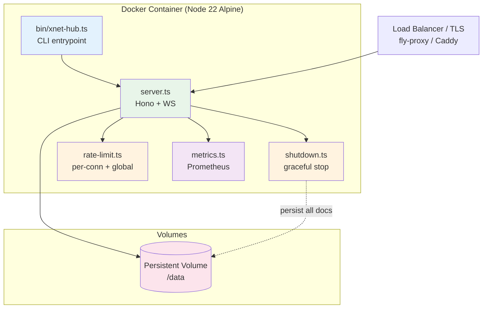

# 07: Docker + Deployment

> Production-ready container with health checks, graceful shutdown, and rate limiting

**Dependencies:** `01-package-scaffold.md`, `04-sqlite-storage.md`
**Modifies:** `packages/hub/Dockerfile`, `packages/hub/fly.toml`, `packages/hub/src/server.ts`

## Overview

The hub deploys as a single Docker container (Node 22 Alpine, <150MB). It supports Fly.io, any VPS with Docker, or bare-metal via `npx @xnet/hub`. Key production concerns: graceful shutdown (persist all Y.Docs before exit), rate limiting (per-connection + global), message size enforcement, Prometheus metrics, and health checks.



## Implementation

### 1. Dockerfile

```dockerfile
# packages/hub/Dockerfile

# --- Build Stage ---
FROM node:22-alpine AS builder

WORKDIR /build

# Copy workspace root for pnpm workspace resolution
COPY pnpm-lock.yaml pnpm-workspace.yaml package.json ./
COPY packages/hub/package.json packages/hub/
COPY packages/core/package.json packages/core/
COPY packages/crypto/package.json packages/crypto/
COPY packages/identity/package.json packages/identity/

# Install dependencies
RUN corepack enable && pnpm install --frozen-lockfile --filter @xnet/hub...

# Copy source
COPY packages/hub/ packages/hub/
COPY packages/core/ packages/core/
COPY packages/crypto/ packages/crypto/
COPY packages/identity/ packages/identity/
COPY tsconfig.json ./

# Build hub + dependencies
RUN pnpm --filter @xnet/hub... build

# --- Runtime Stage ---
FROM node:22-alpine AS runtime

WORKDIR /app

# Install production dependencies only
COPY --from=builder /build/pnpm-lock.yaml /build/pnpm-workspace.yaml /build/package.json ./
COPY --from=builder /build/packages/hub/package.json packages/hub/
COPY --from=builder /build/packages/core/package.json packages/core/
COPY --from=builder /build/packages/crypto/package.json packages/crypto/
COPY --from=builder /build/packages/identity/package.json packages/identity/

RUN corepack enable && pnpm install --frozen-lockfile --prod --filter @xnet/hub...

# Copy built artifacts
COPY --from=builder /build/packages/hub/dist packages/hub/dist/
COPY --from=builder /build/packages/core/dist packages/core/dist/
COPY --from=builder /build/packages/crypto/dist packages/crypto/dist/
COPY --from=builder /build/packages/identity/dist packages/identity/dist/

# Create data directory
RUN mkdir -p /data && chown node:node /data

USER node

ENV NODE_ENV=production
ENV HUB_PORT=4444
ENV HUB_DATA_DIR=/data

EXPOSE 4444

HEALTHCHECK --interval=30s --timeout=5s --start-period=10s --retries=3 \
  CMD wget -qO- http://localhost:4444/health || exit 1

ENTRYPOINT ["node", "packages/hub/dist/cli.js"]
CMD ["--port", "4444", "--data", "/data"]
```

### 2. Fly.io Configuration

```toml
# packages/hub/fly.toml

app = "xnet-hub"
primary_region = "sjc"

[build]
  dockerfile = "Dockerfile"

[env]
  NODE_ENV = "production"
  HUB_PORT = "4444"
  HUB_DATA_DIR = "/data"

[http_service]
  internal_port = 4444
  force_https = true
  auto_stop_machines = false  # Hub should always be running
  auto_start_machines = true
  min_machines_running = 1

  [http_service.concurrency]
    type = "connections"
    hard_limit = 1000
    soft_limit = 800

[[vm]]
  size = "shared-cpu-1x"
  memory = "512mb"

[mounts]
  source = "xnet_hub_data"
  destination = "/data"

[checks]
  [checks.health]
    port = 4444
    type = "http"
    interval = "15s"
    timeout = "5s"
    path = "/health"
    method = "GET"

[metrics]
  port = 4444
  path = "/metrics"
```

### 3. Graceful Shutdown

```typescript
// packages/hub/src/lifecycle/shutdown.ts

import type { DocPool } from '../pool/doc-pool'
import type { HubStorage } from '../storage/interface'

export interface ShutdownDeps {
  pool: DocPool
  storage: HubStorage
  wsServer: { close: () => void; clients: Set<{ close: (code: number, reason: string) => void }> }
  httpServer: { close: (cb?: () => void) => void }
}

/**
 * Register graceful shutdown handlers.
 *
 * On SIGTERM/SIGINT:
 * 1. Stop accepting new connections
 * 2. Send close frame to all WebSocket clients
 * 3. Persist all dirty Y.Docs from the pool
 * 4. Close storage (flush SQLite WAL)
 * 5. Exit cleanly
 */
export function registerShutdownHandlers(deps: ShutdownDeps, logger: typeof console): void {
  let shutdownInProgress = false

  const shutdown = async (signal: string) => {
    if (shutdownInProgress) return
    shutdownInProgress = true

    logger.info(`[shutdown] Received ${signal}, starting graceful shutdown...`)
    const start = Date.now()

    // 1. Stop accepting new HTTP connections
    deps.httpServer.close()
    logger.info('[shutdown] HTTP server closed to new connections')

    // 2. Close all WebSocket connections gracefully
    let wsCount = 0
    for (const client of deps.wsServer.clients) {
      client.close(1001, 'Server shutting down')
      wsCount++
    }
    logger.info(`[shutdown] Closed ${wsCount} WebSocket connections`)

    // 3. Persist all dirty documents
    const poolStats = deps.pool.getStats()
    logger.info(
      `[shutdown] Persisting ${poolStats.total} docs (${poolStats.hot} hot, ${poolStats.warm} warm)...`
    )
    await deps.pool.persistAll()
    logger.info('[shutdown] All docs persisted')

    // 4. Clean up pool and close storage
    deps.pool.destroy()
    await deps.storage.close()
    logger.info(`[shutdown] Storage closed. Shutdown took ${Date.now() - start}ms`)

    process.exit(0)
  }

  process.on('SIGTERM', () => shutdown('SIGTERM'))
  process.on('SIGINT', () => shutdown('SIGINT'))

  // Catch uncaught errors but still try to persist
  process.on('uncaughtException', async (err) => {
    logger.error('[shutdown] Uncaught exception:', err)
    await shutdown('uncaughtException')
  })

  process.on('unhandledRejection', (reason) => {
    logger.error('[shutdown] Unhandled rejection:', reason)
    // Don't exit on unhandled rejections — just log
  })
}
```

### 4. Rate Limiting

```typescript
// packages/hub/src/middleware/rate-limit.ts

export interface RateLimitConfig {
  /** Max messages per second per connection (default: 100) */
  perConnectionRate: number
  /** Max concurrent connections (default: 500) */
  maxConnections: number
  /** Max message size in bytes (default: 5MB) */
  maxMessageSize: number
  /** Window size in ms for rate calculation (default: 1000) */
  windowMs: number
}

const DEFAULT_CONFIG: RateLimitConfig = {
  perConnectionRate: 100,
  maxConnections: 500,
  maxMessageSize: 5 * 1024 * 1024,
  windowMs: 1000
}

interface ConnectionState {
  messageCount: number
  windowStart: number
  violations: number
}

/**
 * Per-connection rate limiter for WebSocket messages.
 */
export class RateLimiter {
  private connections = new Map<string, ConnectionState>()
  private config: RateLimitConfig
  private totalConnections = 0

  constructor(config?: Partial<RateLimitConfig>) {
    this.config = { ...DEFAULT_CONFIG, ...config }
  }

  /**
   * Check if a new connection should be accepted.
   */
  canAcceptConnection(): boolean {
    return this.totalConnections < this.config.maxConnections
  }

  /**
   * Register a new connection.
   */
  addConnection(connId: string): void {
    this.connections.set(connId, {
      messageCount: 0,
      windowStart: Date.now(),
      violations: 0
    })
    this.totalConnections++
  }

  /**
   * Remove a connection.
   */
  removeConnection(connId: string): void {
    this.connections.delete(connId)
    this.totalConnections = Math.max(0, this.totalConnections - 1)
  }

  /**
   * Check if a message should be allowed.
   * Returns { allowed: true } or { allowed: false, reason: string }.
   */
  checkMessage(connId: string, messageSize: number): { allowed: boolean; reason?: string } {
    // Check message size
    if (messageSize > this.config.maxMessageSize) {
      return {
        allowed: false,
        reason: `Message exceeds max size of ${this.config.maxMessageSize} bytes`
      }
    }

    const state = this.connections.get(connId)
    if (!state) return { allowed: true }

    const now = Date.now()

    // Reset window if expired
    if (now - state.windowStart >= this.config.windowMs) {
      state.messageCount = 0
      state.windowStart = now
    }

    state.messageCount++

    if (state.messageCount > this.config.perConnectionRate) {
      state.violations++

      // After 3 violations in a row, suggest disconnection
      if (state.violations >= 3) {
        return {
          allowed: false,
          reason: 'Rate limit exceeded repeatedly — connection will be closed'
        }
      }

      return {
        allowed: false,
        reason: `Rate limit: max ${this.config.perConnectionRate} messages per ${this.config.windowMs}ms`
      }
    }

    // Reset violations on good behavior
    state.violations = 0
    return { allowed: true }
  }

  /**
   * Get current stats for metrics.
   */
  getStats(): { totalConnections: number; maxConnections: number } {
    return {
      totalConnections: this.totalConnections,
      maxConnections: this.config.maxConnections
    }
  }
}
```

### 5. Prometheus Metrics

```typescript
// packages/hub/src/middleware/metrics.ts

/**
 * Lightweight Prometheus-compatible metrics.
 * No external dependencies — just string formatting.
 */
export class Metrics {
  private counters = new Map<string, number>()
  private gauges = new Map<string, number>()
  private histogramBuckets = new Map<string, number[]>()
  private histogramSums = new Map<string, number>()
  private histogramCounts = new Map<string, number>()

  increment(name: string, value = 1): void {
    this.counters.set(name, (this.counters.get(name) ?? 0) + value)
  }

  gauge(name: string, value: number): void {
    this.gauges.set(name, value)
  }

  observe(name: string, value: number): void {
    const sum = (this.histogramSums.get(name) ?? 0) + value
    const count = (this.histogramCounts.get(name) ?? 0) + 1
    this.histogramSums.set(name, sum)
    this.histogramCounts.set(name, count)
  }

  /**
   * Render metrics in Prometheus text format.
   */
  render(): string {
    const lines: string[] = []

    for (const [name, value] of this.counters) {
      lines.push(`# TYPE ${name} counter`)
      lines.push(`${name} ${value}`)
    }

    for (const [name, value] of this.gauges) {
      lines.push(`# TYPE ${name} gauge`)
      lines.push(`${name} ${value}`)
    }

    for (const [name] of this.histogramSums) {
      const sum = this.histogramSums.get(name)!
      const count = this.histogramCounts.get(name)!
      lines.push(`# TYPE ${name} summary`)
      lines.push(`${name}_sum ${sum}`)
      lines.push(`${name}_count ${count}`)
    }

    return lines.join('\n') + '\n'
  }
}

/**
 * Hub-specific metric names.
 */
export const HUB_METRICS = {
  // Connections
  WS_CONNECTIONS_TOTAL: 'hub_ws_connections_total',
  WS_CONNECTIONS_ACTIVE: 'hub_ws_connections_active',

  // Messages
  WS_MESSAGES_RECEIVED: 'hub_ws_messages_received_total',
  WS_MESSAGES_SENT: 'hub_ws_messages_sent_total',
  WS_MESSAGES_REJECTED: 'hub_ws_messages_rejected_total',

  // Sync
  SYNC_DOCS_HOT: 'hub_sync_docs_hot',
  SYNC_DOCS_WARM: 'hub_sync_docs_warm',
  SYNC_PERSISTS_TOTAL: 'hub_sync_persists_total',

  // Backup
  BACKUP_UPLOADS_TOTAL: 'hub_backup_uploads_total',
  BACKUP_BYTES_STORED: 'hub_backup_bytes_stored',

  // Query
  QUERY_REQUESTS_TOTAL: 'hub_query_requests_total',
  QUERY_DURATION_MS: 'hub_query_duration_ms',

  // Rate limiting
  RATE_LIMIT_REJECTIONS: 'hub_rate_limit_rejections_total'
} as const
```

### 6. Health Endpoint

```typescript
// Addition to packages/hub/src/server.ts (health route)

app.get('/health', (c) => {
  const poolStats = pool.getStats()
  const rlStats = rateLimiter.getStats()

  return c.json({
    status: 'ok',
    uptime: process.uptime(),
    timestamp: Date.now(),
    docs: {
      hot: poolStats.hot,
      warm: poolStats.warm,
      total: poolStats.total
    },
    connections: {
      active: rlStats.totalConnections,
      max: rlStats.maxConnections
    },
    memory: {
      rss: process.memoryUsage().rss,
      heapUsed: process.memoryUsage().heapUsed
    }
  })
})

app.get('/metrics', (c) => {
  // Update gauges before rendering
  const poolStats = pool.getStats()
  metrics.gauge(HUB_METRICS.SYNC_DOCS_HOT, poolStats.hot)
  metrics.gauge(HUB_METRICS.SYNC_DOCS_WARM, poolStats.warm)
  metrics.gauge(HUB_METRICS.WS_CONNECTIONS_ACTIVE, rateLimiter.getStats().totalConnections)

  return new Response(metrics.render(), {
    headers: { 'Content-Type': 'text/plain; charset=utf-8' }
  })
})
```

### 7. WebSocket Integration with Rate Limiting

```typescript
// Addition to packages/hub/src/server.ts (WebSocket handler)

import { RateLimiter } from './middleware/rate-limit'

const rateLimiter = new RateLimiter({
  perConnectionRate: config.rateLimit?.messagesPerSecond ?? 100,
  maxConnections: config.rateLimit?.maxConnections ?? 500,
  maxMessageSize: config.rateLimit?.maxMessageSize ?? 5 * 1024 * 1024
})

wss.on('connection', (ws, req) => {
  // Check global connection limit
  if (!rateLimiter.canAcceptConnection()) {
    ws.close(1013, 'Server at capacity')
    metrics.increment(HUB_METRICS.RATE_LIMIT_REJECTIONS)
    return
  }

  const connId = crypto.randomUUID()
  rateLimiter.addConnection(connId)
  metrics.increment(HUB_METRICS.WS_CONNECTIONS_TOTAL)

  ws.on('message', (raw) => {
    const size = typeof raw === 'string' ? raw.length : (raw as Buffer).length
    const check = rateLimiter.checkMessage(connId, size)

    if (!check.allowed) {
      metrics.increment(HUB_METRICS.RATE_LIMIT_REJECTIONS)

      // Close connection on repeated violations
      if (check.reason?.includes('will be closed')) {
        ws.close(1008, 'Rate limit exceeded')
        return
      }

      ws.send(JSON.stringify({ type: 'error', message: check.reason }))
      return
    }

    metrics.increment(HUB_METRICS.WS_MESSAGES_RECEIVED)
    // ... existing message handling ...
  })

  ws.on('close', () => {
    rateLimiter.removeConnection(connId)
  })
})
```

## Tests

```typescript
// packages/hub/test/deploy.test.ts

import { describe, it, expect, beforeAll, afterAll } from 'vitest'
import { WebSocket } from 'ws'
import { createHub, type HubInstance } from '../src'

describe('Production Readiness', () => {
  let hub: HubInstance
  const PORT = 14449

  beforeAll(async () => {
    hub = await createHub({
      port: PORT,
      auth: false,
      storage: 'memory',
      rateLimit: {
        perConnectionRate: 5, // Low limit for testing
        maxConnections: 3,
        maxMessageSize: 100
      }
    })
    await hub.start()
  })

  afterAll(async () => {
    await hub.stop()
  })

  describe('Health Check', () => {
    it('returns 200 with status info', async () => {
      const res = await fetch(`http://localhost:${PORT}/health`)
      expect(res.status).toBe(200)

      const body = await res.json()
      expect(body.status).toBe('ok')
      expect(body.uptime).toBeGreaterThan(0)
      expect(body.docs).toBeDefined()
      expect(body.connections).toBeDefined()
      expect(body.memory.rss).toBeGreaterThan(0)
    })
  })

  describe('Metrics', () => {
    it('returns Prometheus-format metrics', async () => {
      const res = await fetch(`http://localhost:${PORT}/metrics`)
      expect(res.status).toBe(200)
      expect(res.headers.get('content-type')).toContain('text/plain')

      const body = await res.text()
      expect(body).toContain('hub_ws_connections_active')
    })
  })

  describe('Rate Limiting', () => {
    it('rejects oversized messages', async () => {
      const ws = await new Promise<WebSocket>((resolve) => {
        const w = new WebSocket(`ws://localhost:${PORT}`)
        w.on('open', () => resolve(w))
      })

      // Send a message larger than 100 bytes limit
      const bigMsg = JSON.stringify({ type: 'publish', topic: 'x', data: 'a'.repeat(200) })
      ws.send(bigMsg)

      const error = await new Promise<any>((resolve) => {
        ws.on('message', (raw) => {
          const data = JSON.parse(raw.toString())
          if (data.type === 'error') resolve(data)
        })
      })

      expect(error.message).toContain('max size')
      ws.close()
    })

    it('rejects connections over max limit', async () => {
      // maxConnections = 3, open 3 connections
      const connections: WebSocket[] = []
      for (let i = 0; i < 3; i++) {
        const ws = await new Promise<WebSocket>((resolve) => {
          const w = new WebSocket(`ws://localhost:${PORT}`)
          w.on('open', () => resolve(w))
        })
        connections.push(ws)
      }

      // 4th connection should be rejected
      const ws4 = new WebSocket(`ws://localhost:${PORT}`)
      const closeCode = await new Promise<number>((resolve) => {
        ws4.on('close', (code) => resolve(code))
      })

      expect(closeCode).toBe(1013) // Try Again Later

      for (const ws of connections) ws.close()
    })
  })

  describe('Graceful Shutdown', () => {
    it('persists docs on stop', async () => {
      // This is tested implicitly — hub.stop() calls persistAll()
      // If it throws, the test fails
      await hub.stop()

      // Restart for remaining tests
      hub = await createHub({
        port: PORT,
        auth: false,
        storage: 'memory',
        rateLimit: { perConnectionRate: 5, maxConnections: 3, maxMessageSize: 100 }
      })
      await hub.start()
    })
  })
})
```

## Deployment Commands

```bash
# Build Docker image
docker build -t xnet/hub -f packages/hub/Dockerfile .

# Run locally with Docker
docker run -d \
  --name xnet-hub \
  -p 4444:4444 \
  -v xnet-hub-data:/data \
  --restart unless-stopped \
  xnet/hub

# Deploy to Fly.io
cd packages/hub
fly launch --no-deploy  # First time: creates app
fly volumes create xnet_hub_data --size 1  # 1GB persistent volume
fly deploy

# Check status
fly status
fly logs

# Scale (if needed)
fly scale memory 1024  # Upgrade to 1GB RAM
```

## Checklist

- [ ] Create multi-stage Dockerfile (builder + runtime)
- [ ] Target <150MB image size
- [ ] Write `fly.toml` with volume mount and health checks
- [ ] Implement graceful shutdown handler (SIGTERM/SIGINT)
- [ ] Implement per-connection rate limiter
- [ ] Implement global connection limit
- [ ] Enforce message size limits
- [ ] Create Prometheus-compatible metrics endpoint
- [ ] Create `/health` JSON endpoint
- [ ] Wire rate limiter into WebSocket handler
- [ ] Write production readiness tests
- [ ] Test Docker build locally
- [ ] Document deployment commands

---

[← Previous: Query Engine](./06-query-engine.md) | [Back to README](./README.md) | [Next: Client Integration →](./08-client-integration.md)
