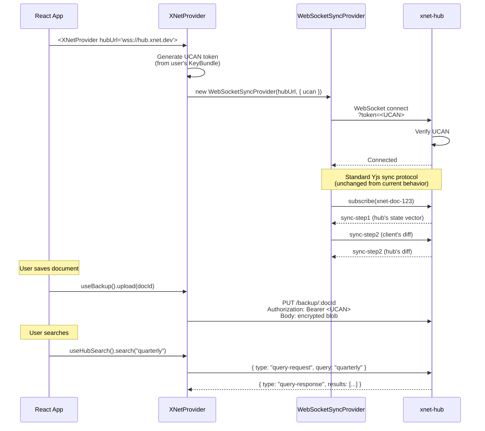
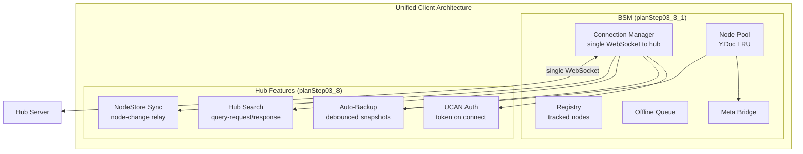
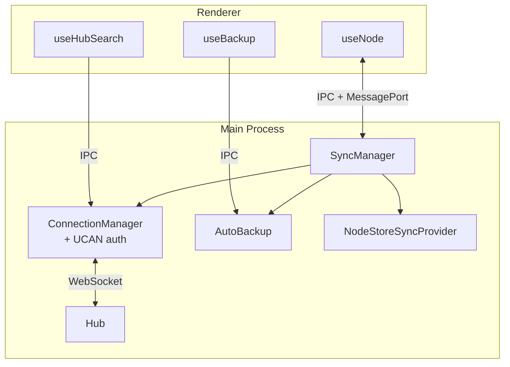

# 08: Client Integration

> Connect the existing React app to the hub — zero-config sync, backup, and search

**Dependencies:** `02-ucan-auth.md`, `03-sync-relay.md`, `05-backup-api.md`, `06-query-engine.md`
**Modifies:** `packages/react/src/`, `packages/sdk/src/`

## Codebase Status (Feb 2026)

| Existing Asset    | Location                                                  | Status                                                                                                                     |
| ----------------- | --------------------------------------------------------- | -------------------------------------------------------------------------------------------------------------------------- |
| XNetProvider      | `packages/react/src/context.ts` (322 LOC)                 | **Complete** — accepts `signalingServers` config, creates NodeStore + SyncManager. Needs `hubUrl` prop.                    |
| SyncManager       | `packages/react/src/sync/sync-manager.ts` (576 LOC)       | **Complete** — orchestrates NodePool, Registry, ConnectionManager, OfflineQueue, BlobSync. Already accepts `signalingUrl`. |
| ConnectionManager | `packages/react/src/sync/connection-manager.ts` (241 LOC) | **Complete** — single multiplexed WS. Needs UCAN token injection on connect URL.                                           |
| BSM (Electron)    | `apps/electron/src/main/bsm.ts` (1131 LOC)                | **Complete** — full sync in main process with signed envelopes, rate limiting, peer scoring, blob sync.                    |
| NodePool (client) | `packages/react/src/sync/node-pool.ts`                    | **Complete** — LRU pool with dirty/evict events. AutoBackup hooks here.                                                    |
| OfflineQueue      | `packages/react/src/sync/offline-queue.ts`                | **Complete** — queues updates when disconnected, replays on reconnect.                                                     |
| BlobSync          | `packages/react/src/sync/blob-sync.ts`                    | **Complete** — P2P blob sync protocol with tests.                                                                          |

### Key Integration Insight

> The existing `SyncManager` already provides the full client-side infrastructure that the hub plan's "Client Integration" phase needs. The work is:
>
> 1. Add `hubUrl` to `XNetProviderProps` (trivial)
> 2. Inject UCAN token into `ConnectionManager` WS URL (small change)
> 3. Add `AutoBackup` class that watches `NodePool` dirty/evict events (new)
> 4. Add `useHubSearch` / `useHubStatus` hooks (new)
>
> The BSM (Electron) already handles signed envelopes. The web `SyncManager` does NOT yet sign Yjs updates — this is a gap that should be closed before hub auth mode is enabled.

## Overview

Client integration connects the existing xNet apps (desktop, mobile, web) to a hub with minimal configuration. The key change: `XNetProvider` accepts an optional `hubUrl` prop, and the `WebSocketSyncProvider` automatically authenticates with a UCAN token. Backup and search are opt-in features that piggyback on the existing WebSocket connection.



## Implementation

### 1. XNetProvider Hub Configuration

```typescript
// packages/react/src/provider/XNetProvider.tsx (additions)

import type { ReactNode } from 'react'
import { createContext, useContext, useMemo, useEffect, useState } from 'react'
import type { HubConnection } from '../hub/hub-connection'
import { createHubConnection } from '../hub/hub-connection'

export interface XNetProviderProps {
  children: ReactNode
  /** Optional hub URL for always-on sync + backup */
  hubUrl?: string
  /** Hub connection options */
  hubOptions?: {
    /** Auto-generate UCAN for hub auth (default: true) */
    autoAuth?: boolean
    /** Enable auto-backup on document save (default: false) */
    autoBackup?: boolean
    /** Backup debounce delay in ms (default: 5000) */
    backupDebounceMs?: number
    /** Enable search indexing (default: false) */
    enableSearchIndex?: boolean
  }
}

// Add to existing context:
interface XNetContextValue {
  // ... existing fields ...
  hub: HubConnection | null
  hubStatus: 'disconnected' | 'connecting' | 'connected' | 'error'
}
```

### 2. Hub Connection Manager

```typescript
// packages/react/src/hub/hub-connection.ts

import type { KeyBundle } from '@xnet/identity'
import { createUCAN } from '@xnet/identity'

export type HubStatus = 'disconnected' | 'connecting' | 'connected' | 'error'

export interface HubConnectionConfig {
  hubUrl: string
  keyBundle: KeyBundle
  autoAuth: boolean
  onStatusChange: (status: HubStatus) => void
}

export interface HubConnection {
  readonly status: HubStatus
  readonly ws: WebSocket | null

  /** Connect to the hub */
  connect(): Promise<void>
  /** Disconnect from the hub */
  disconnect(): void
  /** Get the UCAN token for HTTP requests */
  getAuthToken(): Promise<string>
  /** Upload a backup */
  uploadBackup(docId: string, encryptedData: Uint8Array): Promise<{ key: string }>
  /** Download a backup */
  downloadBackup(docId: string): Promise<Uint8Array | null>
  /** Search documents on the hub */
  search(query: string, options?: SearchOptions): Promise<SearchResult[]>
  /** Index a document for search */
  indexDocument(docId: string, meta: IndexMeta, text?: string): void
}

interface SearchOptions {
  schemaIri?: string
  limit?: number
  offset?: number
}

interface SearchResult {
  docId: string
  title: string
  schemaIri: string
  snippet: string
}

interface IndexMeta {
  schemaIri: string
  title: string
}

export function createHubConnection(config: HubConnectionConfig): HubConnection {
  let ws: WebSocket | null = null
  let status: HubStatus = 'disconnected'
  let ucanToken: string | null = null
  let reconnectTimer: ReturnType<typeof setTimeout> | null = null
  const pendingQueries = new Map<
    string,
    {
      resolve: (results: SearchResult[]) => void
      reject: (err: Error) => void
    }
  >()

  const setStatus = (s: HubStatus) => {
    status = s
    config.onStatusChange(s)
  }

  async function generateUCAN(): Promise<string> {
    if (ucanToken) return ucanToken

    // Generate a UCAN for the hub with broad capabilities
    ucanToken = await createUCAN(config.keyBundle, {
      audience: config.hubUrl,
      capabilities: [
        { with: '*', can: 'sync/*' },
        { with: '*', can: 'backup/*' },
        { with: '*', can: 'query/*' },
        { with: '*', can: 'index/*' }
      ],
      lifetimeInSeconds: 60 * 60 * 24 // 24 hours
    })

    return ucanToken
  }

  async function connect(): Promise<void> {
    if (status === 'connected' || status === 'connecting') return

    setStatus('connecting')

    try {
      const token = config.autoAuth ? await generateUCAN() : ''
      const url = new URL(config.hubUrl)
      if (token) url.searchParams.set('token', token)

      ws = new WebSocket(url.toString())

      ws.onopen = () => {
        setStatus('connected')
        if (reconnectTimer) {
          clearTimeout(reconnectTimer)
          reconnectTimer = null
        }
      }

      ws.onclose = () => {
        setStatus('disconnected')
        ws = null
        scheduleReconnect()
      }

      ws.onerror = () => {
        setStatus('error')
      }

      ws.onmessage = (event) => {
        try {
          const msg = JSON.parse(event.data)
          handleMessage(msg)
        } catch {
          // Ignore parse errors
        }
      }
    } catch {
      setStatus('error')
      scheduleReconnect()
    }
  }

  function disconnect(): void {
    if (reconnectTimer) {
      clearTimeout(reconnectTimer)
      reconnectTimer = null
    }
    if (ws) {
      ws.close(1000, 'Client disconnect')
      ws = null
    }
    setStatus('disconnected')
  }

  function scheduleReconnect(): void {
    if (reconnectTimer) return
    reconnectTimer = setTimeout(() => {
      reconnectTimer = null
      connect().catch(() => {})
    }, 3000) // Reconnect after 3s
  }

  function handleMessage(msg: any): void {
    switch (msg.type) {
      case 'query-response': {
        const pending = pendingQueries.get(msg.id)
        if (pending) {
          pendingQueries.delete(msg.id)
          pending.resolve(msg.results)
        }
        break
      }
      case 'query-error': {
        const pending = pendingQueries.get(msg.id)
        if (pending) {
          pendingQueries.delete(msg.id)
          pending.reject(new Error(msg.error))
        }
        break
      }
    }
  }

  return {
    get status() {
      return status
    },
    get ws() {
      return ws
    },

    connect,
    disconnect,

    async getAuthToken(): Promise<string> {
      return generateUCAN()
    },

    async uploadBackup(docId: string, encryptedData: Uint8Array): Promise<{ key: string }> {
      const token = await generateUCAN()
      const httpUrl = config.hubUrl.replace('wss://', 'https://').replace('ws://', 'http://')

      const res = await fetch(`${httpUrl}/backup/${docId}`, {
        method: 'PUT',
        headers: {
          Authorization: `Bearer ${token}`,
          'Content-Type': 'application/octet-stream'
        },
        body: encryptedData
      })

      if (!res.ok) {
        throw new Error(`Backup upload failed: ${res.status} ${res.statusText}`)
      }

      return res.json()
    },

    async downloadBackup(docId: string): Promise<Uint8Array | null> {
      const token = await generateUCAN()
      const httpUrl = config.hubUrl.replace('wss://', 'https://').replace('ws://', 'http://')

      const res = await fetch(`${httpUrl}/backup/${docId}`, {
        headers: { Authorization: `Bearer ${token}` }
      })

      if (res.status === 404) return null
      if (!res.ok) throw new Error(`Backup download failed: ${res.status}`)

      return new Uint8Array(await res.arrayBuffer())
    },

    async search(query: string, options?: SearchOptions): Promise<SearchResult[]> {
      if (!ws || status !== 'connected') return []

      const id = crypto.randomUUID()

      return new Promise((resolve, reject) => {
        const timeout = setTimeout(() => {
          pendingQueries.delete(id)
          reject(new Error('Query timeout'))
        }, 5000)

        pendingQueries.set(id, {
          resolve: (results) => {
            clearTimeout(timeout)
            resolve(results)
          },
          reject: (err) => {
            clearTimeout(timeout)
            reject(err)
          }
        })

        ws!.send(
          JSON.stringify({
            type: 'query-request',
            id,
            query,
            filters: { schemaIri: options?.schemaIri },
            limit: options?.limit,
            offset: options?.offset
          })
        )
      })
    },

    indexDocument(docId: string, meta: IndexMeta, text?: string): void {
      if (!ws || status !== 'connected') return

      ws.send(
        JSON.stringify({
          type: 'index-update',
          docId,
          meta,
          text
        })
      )
    }
  }
}
```

### 3. WebSocketSyncProvider UCAN Extension

```typescript
// packages/react/src/sync/WebSocketSyncProvider.ts (additions)

export interface WebSocketSyncConfig {
  url: string
  /** UCAN token for authentication (appended as query param) */
  ucanToken?: string
  // ... existing config ...
}

// In the connect method:
private connect(): void {
  const url = new URL(this.config.url)
  if (this.config.ucanToken) {
    url.searchParams.set('token', this.config.ucanToken)
  }

  this.ws = new WebSocket(url.toString())
  // ... rest of existing connect logic ...
}
```

### 4. React Hooks

````typescript
// packages/react/src/hooks/useHubStatus.ts

import { useContext } from 'react'
import { XNetContext } from '../provider/XNetProvider'
import type { HubStatus } from '../hub/hub-connection'

/**
 * Get the current hub connection status.
 *
 * @example
 * ```tsx
 * function SyncIndicator() {
 *   const status = useHubStatus()
 *   return <div className={`indicator ${status}`} />
 * }
 * ```
 */
export function useHubStatus(): HubStatus {
  const ctx = useContext(XNetContext)
  return ctx?.hubStatus ?? 'disconnected'
}
````

````typescript
// packages/react/src/hooks/useBackup.ts

import { useContext, useCallback, useRef } from 'react'
import { XNetContext } from '../provider/XNetProvider'
import { encrypt } from '@xnet/crypto'

export interface UseBackupReturn {
  /** Upload an encrypted backup of a document */
  upload: (docId: string, plaintext: Uint8Array) => Promise<void>
  /** Download and decrypt a backup */
  download: (docId: string) => Promise<Uint8Array | null>
  /** Whether an upload is in progress */
  uploading: boolean
}

/**
 * Hook for encrypted document backup to the hub.
 *
 * @example
 * ```tsx
 * function SaveButton({ docId }) {
 *   const { upload, uploading } = useBackup()
 *   const doc = useDocument(docId)
 *
 *   const handleBackup = async () => {
 *     const state = Y.encodeStateAsUpdate(doc)
 *     await upload(docId, state)
 *   }
 *
 *   return <button onClick={handleBackup} disabled={uploading}>Backup</button>
 * }
 * ```
 */
export function useBackup(): UseBackupReturn {
  const ctx = useContext(XNetContext)
  const uploadingRef = useRef(false)

  const upload = useCallback(
    async (docId: string, plaintext: Uint8Array) => {
      if (!ctx?.hub) throw new Error('No hub connection')

      uploadingRef.current = true
      try {
        // Encrypt with user's key before upload
        const encrypted = await encrypt(plaintext, ctx.keyBundle.encryptionKey)
        await ctx.hub.uploadBackup(docId, encrypted)
      } finally {
        uploadingRef.current = false
      }
    },
    [ctx]
  )

  const download = useCallback(
    async (docId: string): Promise<Uint8Array | null> => {
      if (!ctx?.hub) return null

      const encrypted = await ctx.hub.downloadBackup(docId)
      if (!encrypted) return null

      // Decrypt with user's key
      const { decrypt } = await import('@xnet/crypto')
      return decrypt(encrypted, ctx.keyBundle.encryptionKey)
    },
    [ctx]
  )

  return {
    upload,
    download,
    uploading: uploadingRef.current
  }
}
````

````typescript
// packages/react/src/hooks/useHubSearch.ts

import { useContext, useState, useCallback } from 'react'
import { XNetContext } from '../provider/XNetProvider'

export interface HubSearchResult {
  docId: string
  title: string
  schemaIri: string
  snippet: string
}

export interface UseHubSearchReturn {
  /** Execute a search query */
  search: (query: string, options?: { schemaIri?: string; limit?: number }) => Promise<void>
  /** Current search results */
  results: HubSearchResult[]
  /** Whether a search is in progress */
  loading: boolean
  /** Last error (if any) */
  error: Error | null
}

/**
 * Hook for searching documents on the hub.
 *
 * @example
 * ```tsx
 * function SearchBox() {
 *   const { search, results, loading } = useHubSearch()
 *
 *   return (
 *     <div>
 *       <input onChange={(e) => search(e.target.value)} />
 *       {loading && <Spinner />}
 *       {results.map(r => <SearchResult key={r.docId} {...r} />)}
 *     </div>
 *   )
 * }
 * ```
 */
export function useHubSearch(): UseHubSearchReturn {
  const ctx = useContext(XNetContext)
  const [results, setResults] = useState<HubSearchResult[]>([])
  const [loading, setLoading] = useState(false)
  const [error, setError] = useState<Error | null>(null)

  const search = useCallback(
    async (query: string, options?: { schemaIri?: string; limit?: number }) => {
      if (!ctx?.hub || !query.trim()) {
        setResults([])
        return
      }

      setLoading(true)
      setError(null)

      try {
        const results = await ctx.hub.search(query, options)
        setResults(results)
      } catch (err) {
        setError(err instanceof Error ? err : new Error('Search failed'))
        setResults([])
      } finally {
        setLoading(false)
      }
    },
    [ctx]
  )

  return { search, results, loading, error }
}
````

### 5. Auto-Backup Integration

```typescript
// packages/react/src/hub/auto-backup.ts

import * as Y from 'yjs'
import type { HubConnection } from './hub-connection'

/**
 * Auto-backup manager that watches Y.Doc updates and
 * uploads encrypted snapshots to the hub on a debounced schedule.
 */
export class AutoBackup {
  private timers = new Map<string, ReturnType<typeof setTimeout>>()
  private debounceMs: number

  constructor(
    private hub: HubConnection,
    private encryptFn: (data: Uint8Array) => Promise<Uint8Array>,
    options?: { debounceMs?: number }
  ) {
    this.debounceMs = options?.debounceMs ?? 5000
  }

  /**
   * Watch a Y.Doc for updates and auto-backup.
   */
  watch(docId: string, doc: Y.Doc): () => void {
    const handler = () => {
      this.scheduleBackup(docId, doc)
    }

    doc.on('update', handler)

    return () => {
      doc.off('update', handler)
      const timer = this.timers.get(docId)
      if (timer) {
        clearTimeout(timer)
        this.timers.delete(docId)
      }
    }
  }

  private scheduleBackup(docId: string, doc: Y.Doc): void {
    // Clear existing timer
    const existing = this.timers.get(docId)
    if (existing) clearTimeout(existing)

    this.timers.set(
      docId,
      setTimeout(async () => {
        this.timers.delete(docId)

        if (this.hub.status !== 'connected') return

        try {
          const state = Y.encodeStateAsUpdate(doc)
          const encrypted = await this.encryptFn(state)
          await this.hub.uploadBackup(docId, encrypted)
        } catch (err) {
          console.warn(`[auto-backup] Failed for ${docId}:`, err)
        }
      }, this.debounceMs)
    )
  }

  /**
   * Flush all pending backups immediately (e.g., before page unload).
   */
  async flush(): Promise<void> {
    // Clear all timers — backup is best-effort
    for (const timer of this.timers.values()) {
      clearTimeout(timer)
    }
    this.timers.clear()
  }

  destroy(): void {
    this.flush()
  }
}
```

### 6. Sync Status UI Component

````typescript
// packages/react/src/components/HubStatusIndicator.tsx

import { useHubStatus } from '../hooks/useHubStatus'

const STATUS_CONFIG = {
  disconnected: { color: 'var(--muted)', label: 'Offline' },
  connecting: { color: 'var(--warning)', label: 'Connecting...' },
  connected: { color: 'var(--success)', label: 'Synced to hub' },
  error: { color: 'var(--destructive)', label: 'Connection error' }
} as const

/**
 * Small status indicator showing hub connection state.
 *
 * @example
 * ```tsx
 * <HubStatusIndicator />
 * // Renders: [●] Synced to hub
 * ```
 */
export function HubStatusIndicator() {
  const status = useHubStatus()
  const config = STATUS_CONFIG[status]

  return (
    <div
      style={{ display: 'flex', alignItems: 'center', gap: '6px', fontSize: '12px' }}
      title={config.label}
    >
      <span
        style={{
          width: '8px',
          height: '8px',
          borderRadius: '50%',
          backgroundColor: config.color,
          display: 'inline-block',
          animation: status === 'connecting' ? 'pulse 1.5s infinite' : undefined
        }}
      />
      <span style={{ color: 'var(--muted-foreground)' }}>{config.label}</span>
    </div>
  )
}
````

## Tests

```typescript
// packages/react/test/hub-connection.test.ts

import { describe, it, expect, beforeAll, afterAll, vi } from 'vitest'
import { createHubConnection } from '../src/hub/hub-connection'
import { createHub, type HubInstance } from '@xnet/hub'

describe('Hub Connection (Client)', () => {
  let hub: HubInstance
  const PORT = 14450
  const HUB_URL = `ws://localhost:${PORT}`

  beforeAll(async () => {
    hub = await createHub({ port: PORT, auth: false, storage: 'memory' })
    await hub.start()
  })

  afterAll(async () => {
    await hub.stop()
  })

  it('connects and reports status', async () => {
    const statuses: string[] = []
    const conn = createHubConnection({
      hubUrl: HUB_URL,
      keyBundle: {} as any, // Anonymous mode, no auth needed
      autoAuth: false,
      onStatusChange: (s) => statuses.push(s)
    })

    await conn.connect()
    // Wait for connection
    await new Promise((r) => setTimeout(r, 100))

    expect(conn.status).toBe('connected')
    expect(statuses).toContain('connecting')
    expect(statuses).toContain('connected')

    conn.disconnect()
    expect(conn.status).toBe('disconnected')
  })

  it('reconnects on disconnect', async () => {
    const conn = createHubConnection({
      hubUrl: HUB_URL,
      keyBundle: {} as any,
      autoAuth: false,
      onStatusChange: () => {}
    })

    await conn.connect()
    await new Promise((r) => setTimeout(r, 100))

    // Force disconnect by closing the underlying WS
    conn.ws?.close()
    await new Promise((r) => setTimeout(r, 100))

    expect(conn.status).toBe('disconnected')

    // Should auto-reconnect after 3s
    await new Promise((r) => setTimeout(r, 3500))
    expect(conn.status).toBe('connected')

    conn.disconnect()
  })

  it('searches via WebSocket', async () => {
    const conn = createHubConnection({
      hubUrl: HUB_URL,
      keyBundle: {} as any,
      autoAuth: false,
      onStatusChange: () => {}
    })

    await conn.connect()
    await new Promise((r) => setTimeout(r, 100))

    // Index a document
    conn.indexDocument(
      'test-doc',
      {
        schemaIri: 'xnet://xnet.dev/Page',
        title: 'Integration Test Page'
      },
      'This is the body text for searching.'
    )

    await new Promise((r) => setTimeout(r, 200))

    // Search for it
    const results = await conn.search('Integration')
    expect(results.length).toBeGreaterThanOrEqual(1)

    conn.disconnect()
  })
})
```

## Migration Guide

### Minimal Change (just add hub sync)

```diff
// apps/web/src/App.tsx

<XNetProvider
-  identity={identity}
+  config={{
+    identity,
+    hubUrl: 'wss://hub.xnet.dev'
+  }}
>
  <App />
</XNetProvider>
```

### Full Integration (sync + backup + search)

```diff
<XNetProvider
-  identity={identity}
+  config={{
+    identity,
+    hubUrl: 'wss://hub.xnet.dev',
+    hubOptions: {
+      autoBackup: true,
+      backupDebounceMs: 10000,
+      enableSearchIndex: true
+    }
+  }}
>
  <App />
+  <HubStatusIndicator />
</XNetProvider>
```

## Integration with Background Sync Manager (BSM)

> See also: [planStep03_3_1BgSync](../planStep03_3_1BgSync/README.md)

The BSM (`planStep03_3_1BgSync`) and Hub client integration define overlapping connection management. When both are implemented, they should be **unified** — not parallel systems.

### Architecture: BSM Subsumes HubConnection

The BSM's `ConnectionManager` (multiplexed WebSocket) becomes the **single connection** to the hub. The `HubConnection` defined above is absorbed into the BSM as hub-specific capabilities layered on the same socket:



### What Changes

| BSM Component        | Without Hub                            | With Hub                                        |
| -------------------- | -------------------------------------- | ----------------------------------------------- |
| `ConnectionManager`  | Connects to signaling server           | Connects to hub (which IS the signaling server) |
| Room subscribe       | `{ type: "subscribe", topics: [...] }` | Same protocol, hub also persists state          |
| `NodePool` acquire   | Loads from local storage               | Also triggers hub sync (state vector exchange)  |
| `OfflineQueue` drain | Publishes to signaling rooms           | Same, hub persists for offline peers            |
| Auth                 | None (open signaling)                  | UCAN token appended to WS URL                   |

### What Gets Added (Hub-Only Features)

These features attach to the BSM's `ConnectionManager` but only activate when `hubUrl` is configured:

| Feature       | Attachment Point                    | Trigger                                      |
| ------------- | ----------------------------------- | -------------------------------------------- |
| UCAN auth     | `ConnectionManager.connect()`       | Token appended as query param                |
| Auto-backup   | `NodePool` update handler           | Debounced `Y.encodeStateAsUpdate` → hub HTTP |
| Hub search    | `ConnectionManager.publish()`       | `query-request` message type                 |
| Node sync     | `ConnectionManager` message handler | `node-change` / `node-sync-request` messages |
| Index updates | `MetaBridge` observer               | `index-update` on meta map change            |

### Unified ConnectionManager Config

```typescript
// packages/react/src/sync/connection-manager.ts (extended)

export interface ConnectionManagerConfig {
  /** Signaling/hub WebSocket URL */
  url: string
  /** Reconnect delay in ms (default: 2000) */
  reconnectDelay?: number
  /** Max reconnect attempts (default: Infinity) */
  maxReconnects?: number

  // --- Hub-specific (optional) ---
  /** UCAN token for hub auth (appended as ?token=) */
  ucanToken?: string
  /** Generate UCAN on connect (alternative to static token) */
  getUCANToken?: () => Promise<string>
}
```

When `ucanToken` or `getUCANToken` is provided, the ConnectionManager appends it to the WebSocket URL. The rest of the hub features (backup, search, node sync) are separate services that share this connection.

### Implementation Order

Since BSM (03_3_1) is planned before Hub (03_8):

1. **Build BSM first** with `ConnectionManager` targeting the existing signaling server
2. **When Hub is built**, the hub replaces the signaling server (same protocol)
3. **Hub client integration** adds auth + features to the existing `ConnectionManager`
4. No refactor needed — the BSM is already hub-ready by design

### NodeStoreSyncProvider Integration

The `NodeStoreSyncProvider` (from `09-node-sync-relay.md`) attaches to the BSM's `ConnectionManager` rather than managing its own WebSocket:

```typescript
// Instead of:
nodeStoreSyncProvider.attach(ws) // raw WebSocket

// With BSM:
nodeStoreSyncProvider.attach(syncManager.connection) // BSM's ConnectionManager

// The BSM routes 'node-change' and 'node-sync-response' messages
// to the NodeStoreSyncProvider's handler via room subscription
```

### AutoBackup Integration

`AutoBackup` watches the BSM's `NodePool` instead of individual `useNode` instances:

```typescript
// AutoBackup observes pool-level events:
syncManager.pool.on('dirty', (nodeId, doc) => {
  autoBackup.schedule(nodeId, doc)
})

// On pool eviction (doc going cold), force-flush backup:
syncManager.pool.on('evict', (nodeId, doc) => {
  autoBackup.flush(nodeId, doc)
})
```

This ensures ALL tracked nodes get backed up — not just ones with active UI components.

### Desktop: Main Process Wiring

On desktop (Electron), the BSM runs in the main process (see `planStep03_3_1BgSync/08-desktop-main-process.md`). Hub features wire in there too:



The renderer's `useHubSearch` and `useBackup` hooks route through IPC to the main process, which forwards via the BSM's single WebSocket connection.

## Checklist

- [x] Add `hubUrl` prop to `XNetProvider`
- [x] Extend `ConnectionManager` config with UCAN token support
- [x] Layer hub auth onto existing BSM connection (not a separate WebSocket)
- [x] Implement `useHubStatus()` hook (reads BSM connection status)
- [x] Implement `useBackup()` hook (upload/download encrypted blobs via hub HTTP)
- [x] Implement `useHubSearch()` hook (query via BSM's ConnectionManager)
- [x] Create `AutoBackup` class attached to BSM NodePool events
- [x] Create `HubStatusIndicator` component
- [x] Wire `NodeStoreSyncProvider` into BSM's ConnectionManager
- [x] Add UCAN generation for hub capabilities
- [ ] Write client integration tests
- [x] Document migration guide (minimal vs full)
- [x] Verify zero breaking changes to existing apps without hubUrl

---

[← Previous: Docker Deploy](./07-docker-deploy.md) | [Next: Node Sync Relay →](./09-node-sync-relay.md)
